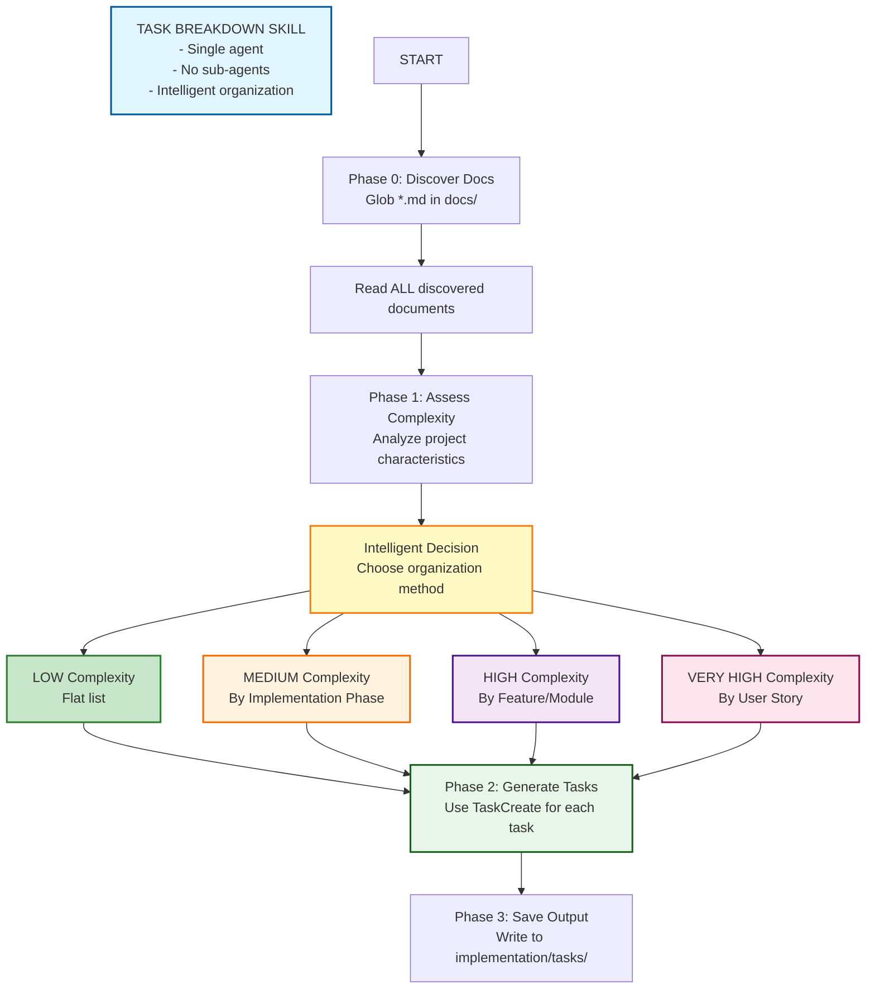
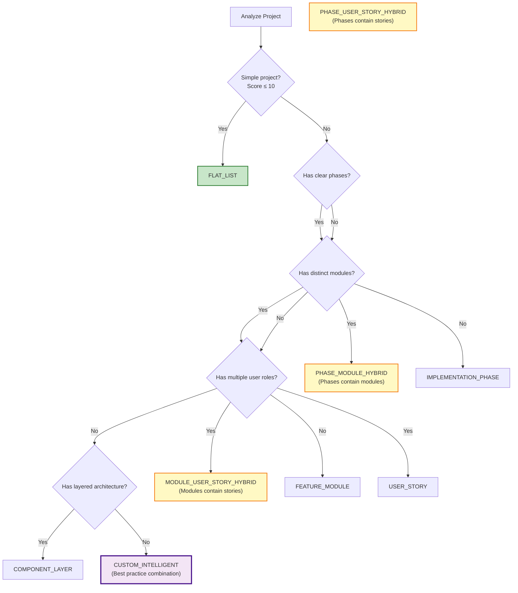

# Task Breakdown

An intelligent task breakdown generator that adapts to project complexity and organizes tasks appropriately.

## Overview

The Task Breakdown skill:
1. **Discovers Documents** - Reads ALL markdown files from `docs/` directory
2. **Assesses Complexity** - Analyzes project characteristics
3. **Intelligently Organizes** - Chooses best categorization method
4. **Generates Tasks** - Uses TaskCreate tool for each task
5. **Saves Output** - Writes organized task list to `implementation/tasks/`

## Architecture



## When to Use

Call this skill when:
- Starting a new development wave or project
- Planning implementation for a feature or module
- Decomposing requirements into actionable tasks
- Creating structured task lists from documentation
- You need TaskCreate-formatted tasks organized logically

## Source Materials

**CRITICAL: This skill uses the `docs/` directory as its source of truth.**

**ALL documents are discovered dynamically - NO hardcoded document names.**

**Document Discovery Process:**

```python
# Phase 0: Discover source materials
1. Use Glob to find ALL .md files in docs/
2. Read ALL discovered documents
3. Extract features, requirements, constraints, and entities
4. Use discovered content for complexity assessment and task breakdown
```

The skill will:
1. **Discover** ALL markdown files in `docs/`
2. **Read** ALL discovered documents
3. **Extract** features, entities, rules, and requirements
4. **Use** extracted information for task breakdown

## Input

You will receive:
- **Requirements** - Project description, feature list, or user request
- **Source Directory** - Always `docs/` (contains source materials)
- **Output Directory** - `implementation/tasks/` at project root (fixed location)

## Workflow

### Phase 0: Document Discovery

**Discover ALL source materials from `docs/`:**

```python
# 1. Use Glob to find ALL markdown files
files = Glob(pattern="**/*.md", path="docs/")

# 2. Read ALL discovered documents
for file in files:
    content = Read(file)

# 3. Extract key information
- Features list
- Business rules and constraints
- Entities and their relationships
- User roles and permissions
- Integration points
- Technical requirements
- Implementation phases (if mentioned)
- Module boundaries (if mentioned)
```

**Output of Phase 0:**
- Discovered document list (ALL .md files in docs/)
- Extracted features and requirements
- Identified user roles and entities
- Known integration points

---

### Phase 1: Complexity Assessment & Organization Decision

**Analyze project characteristics:**

| Factor | Measure | Impact |
|--------|---------|--------|
| Feature count | Number of distinct features | Higher = more complex |
| Integration points | External APIs, services | Higher = more complex |
| User roles | Different user types | Higher = more complex |
| Domain scope | Bounded contexts | More = more complex |
| Implementation phases | Explicit phases mentioned | Affects organization |
| Module boundaries | Clear module separation | Affects organization |

**Complexity Score Calculation:**

```python
complexity_score = (
    min(feature_count, 10) +           # Max 10 points
    min(integration_points * 2, 10) +  # Max 10 points
    min(user_roles * 2, 10) +          # Max 10 points
    min(domain_contexts * 2, 10)       # Max 10 points
)
# Max score: 40
```

**Organization Decision Logic:**

```python
# The skill intelligently determines the BEST organization method
# It can use ANY combination based on project characteristics

# Single organization methods:
if complexity_score <= 10:
    organization = "FLAT_LIST"

elif has_explicit_phases() and not has_complex_modules():
    organization = "IMPLEMENTATION_PHASE"

elif has_clear_modules() and not has_phases():
    organization = "FEATURE_MODULE"

elif has_multiple_user_roles():
    organization = "USER_STORY"

elif has_layered_architecture():
    organization = "COMPONENT_LAYER"

# HYBRID / COMBINATION methods (intelligent mixing):
elif has_phases() and has_modules():
    # Combine phases AND modules
    organization = "PHASE_MODULE_HYBRID"
    # Example: Phase 1 contains Module A tasks, Phase 2 contains Module B tasks

elif has_phases() and has_user_roles():
    # Combine phases AND user stories
    organization = "PHASE_USER_STORY_HYBRID"
    # Example: Phase 1: Auth stories, Phase 2: Core feature stories

elif has_modules() and has_user_roles():
    # Combine modules AND user stories within modules
    organization = "MODULE_USER_STORY_HYBRID"
    # Example: Auth Module → Login Story, Register Story

else:
    # Leverage expertise to choose best practice
    organization = intelligent_best_practice_decision()
```

**Organization Types (Flexible & Combinable):**

| Organization | When to Use | Structure |
|--------------|-------------|-----------|
| **FLAT_LIST** | Score ≤ 10, simple linear work | Task 1, Task 2, Task 3... |
| **IMPLEMENTATION_PHASE** | Clear sequential phases | Phase 1 → Phase 2 → Phase 3 |
| **FEATURE_MODULE** | Distinct feature modules | Module A → Module B → Module C |
| **USER_STORY** | Multiple user roles | US-001 → US-002 → US-003 |
| **COMPONENT_LAYER** | Layered architecture | Data → Service → Presentation |
| **PHASE_MODULE_HYBRID** | Phases + modules | Phase 1 (Module A, B) → Phase 2 (Module C) |
| **PHASE_USER_STORY_HYBRID** | Phases + user stories | Phase 1 (Auth stories) → Phase 2 (Data stories) |
| **MODULE_USER_STORY_HYBRID** | Modules + stories within | Module A (US-001, US-002) → Module B (US-003) |
| **CUSTOM_INTELLIGENT** | Best practice combination | Skill decides optimal structure |

---

### Phase 2: Task Generation

**Generate tasks using TaskCreate tool:**

```python
# For each identified task
TaskCreate(
    subject="Implement user authentication",
    description="Build login form with email/password validation. "
    "Integrate with existing auth service. Add error handling.",
    activeForm="Implementing user authentication"
)
```

**Task Organization Example:**

**FLAT_LIST:**
```markdown
## Tasks

### Task 1: Set up project structure
- **Status**: pending
- **Description**: Initialize project with folder structure
- **Active Form**: Setting up project structure

### Task 2: Implement core feature
...
```

**IMPLEMENTATION_PHASE:**
```markdown
## Phase 1: Setup & Foundation

### Task 1.1: Initialize project
### Task 1.2: Configure development environment

## Phase 2: Core Development

### Task 2.1: Implement data models
### Task 2.2: Build API endpoints
```

**FEATURE_MODULE:**
```markdown
## Authentication Module

### Task A-1: Build login form
### Task A-2: Implement JWT tokens

## Data Processing Module

### Task B-1: Parse input files
### Task B-2: Implement validation
```

---

### Phase 3: Output Generation

**Wave Name Determination:**

The skill intelligently determines the wave name based on:
1. **User's request** - What they're asking to build
2. **Development scope** - Feature set, module, or phase being developed
3. **Domain context** - Business area or bounded context

**Wave Name Examples:**

| User Request | Wave Name (Generated) | File |
|--------------|----------------------|------|
| "Add CSV file import" | `csv-import` | `csv-import-tasks.md` |
| "Build user authentication" | `authentication` | `authentication-tasks.md` |
| "Create dashboard UI" | `dashboard-ui` | `dashboard-ui-tasks.md` |
| "Fix memory leak in PSPP" | `pspp-memory-fix` | `pspp-memory-fix-tasks.md` |
| "Migrate database" | `database-migration` | `database-migration-tasks.md` |
| "Add payment integration" | `payment-integration` | `payment-integration-tasks.md` |

**Wave Name Guidelines:**
- **Descriptive**: Clearly indicates what the wave delivers
- **Concise**: 2-4 words, lowercase, hyphen-separated
- **Unique**: Avoid conflicts with existing wave names
- **Scope-specific**: Matches the development scope of this wave

**Save to `implementation/tasks/{wave-name}-tasks.md`:**

```markdown
---
# Task List: {Project Name}

**Generated**: {Timestamp}
**Organization**: {FLAT_LIST | IMPLEMENTATION_PHASE | FEATURE_MODULE | USER_STORY | COMPONENT_LAYER}
**Complexity Score**: {Score}/40
**Total Tasks**: {Count}

## Source Documents Analyzed
{List of all docs/ files read}

## Project Context
{Brief summary from extracted information}

## Task Breakdown
{Organized tasks based on chosen organization method}

---
*Generated by task-breakdown skill*
```

## Configuration

### Output Directory

**Fixed location:** `implementation/tasks/` at project root

```
project-root/
├── implementation/
│   └── tasks/
│       └── {wave-name}-tasks.md
```

### TaskCreate Parameters

| Parameter | Required | Format | Example |
|-----------|----------|--------|---------|
| subject | ✅ | Imperative verb phrase | "Create login form" |
| description | ✅ | Detailed explanation | "Build a form with..." |
| activeForm | ✅ | Present continuous | "Creating login form" |

## Complexity Criteria Reference

### FLAT_LIST (Score: 0-10)

**Characteristics:**
- 1-3 features
- 1-2 integration points
- Single user role
- Single domain context
- Linear workflow

**Example Projects:**
- Contact form
- Simple API wrapper
- Data processing script
- Single-purpose tool (like DataChat)

---

### IMPLEMENTATION_PHASE (Score: 11-20)

**Characteristics:**
- 3-6 features
- 2-4 integration points
- Clear sequential phases
- Documentation mentions phases

**Example Projects:**
- Feature addition with clear steps
- Migration project
- Performance optimization
- System upgrade

---

### FEATURE_MODULE (Score: 21-30)

**Characteristics:**
- 6+ features
- 4+ integration points
- Clear module boundaries
- Independent components

**Example Projects:**
- Multi-module application
- Microservices architecture
- Platform with distinct features
- System with clear separation

---

### USER_STORY (Score: 31-40)

**Characteristics:**
- Multiple user roles
- Complex workflows
- Role-based permissions
- Distinct user journeys

**Example Projects:**
- E-commerce platform
- CRM system
- Social network
- Multi-tenant SaaS

---

## Output Examples

### Example 1: FLAT_LIST (DataChat Survey Tool)

```markdown
# Task List: DataChat CSV Import Feature

**Generated**: 2026-01-31
**Organization**: FLAT_LIST
**Complexity Score**: 8/40
**Total Tasks**: 5

## Source Documents Analyzed
- docs/features-and-usage.md
- docs/system-architecture.md
- docs/data-flow.md
- docs/business-rules.md

## Project Context
Adding CSV file import capability to existing SPSS (.sav) file support. The system processes survey files through a 22-step workflow and outputs presentations and dashboards.

## Task Breakdown

### Task 1: Extend input parser for CSV format
- **Status**: pending
- **Description**: Modify the input parser module to detect and handle CSV files in addition to SPSS .sav files. CSV files should map to the same internal data structure.
- **Active Form**: Extending input parser for CSV format

### Task 2: Add CSV metadata extraction
- **Status**: pending
- **Description**: Implement logic to infer variable names and types from CSV headers. Since CSV doesn't have SPSS metadata, create reasonable defaults for variable labels and value labels.
- **Active Form**: Adding CSV metadata extraction

### Task 3: Update workflow validation for CSV
- **Status**: pending
- **Description**: Ensure validation logic handles CSV-specific edge cases (missing values, type mismatches, encoding issues). Add appropriate error messages.
- **Active Form**: Updating workflow validation for CSV

### Task 4: Test CSV import with sample files
- **Status**: pending
- **Description**: Create test CSV files with various structures. Run through the full workflow and verify outputs match expected behavior.
- **Active Form**: Testing CSV import with sample files

### Task 5: Update documentation for CSV support
- **Status**: pending
- **Description**: Add CSV file format to features-and-usage.md. Include examples and limitations compared to SPSS format.
- **Active Form**: Updating documentation for CSV support
```

---

### Example 2: IMPLEMENTATION_PHASE

```markdown
# Task List: Database Migration

**Generated**: 2026-01-31
**Organization**: IMPLEMENTATION_PHASE
**Complexity Score**: 15/40
**Total Tasks**: 8

## Task Breakdown

### Phase 1: Preparation

### Task 1.1: Analyze current database schema
- **Status**: pending
- **Description**: Document existing tables, relationships, and data volumes. Identify migration risks.
- **Active Form**: Analyzing current database schema

### Task 1.2: Design new schema
- **Status**: pending
- **Description**: Create optimized schema addressing performance bottlenecks. Define migration mapping.
- **Active Form**: Designing new schema

### Phase 2: Implementation

### Task 2.1: Create migration scripts
- **Status**: pending
- **Description**: Write SQL scripts for schema transformation. Include rollback procedures.
- **Active Form**: Creating migration scripts

### Task 2.2: Update application code
- **Status**: pending
- **Description**: Modify ORM models and queries to work with new schema.
- **Active Form**: Updating application code

### Phase 3: Testing & Deployment

### Task 3.1: Set up staging environment
- **Status**: pending
- **Description**: Create staging database and run migration tests.
- **Active Form**: Setting up staging environment

### Task 3.2: Execute production migration
- **Status**: pending
- **Description**: Plan and execute production migration with downtime window.
- **Active Form**: Executing production migration
```

---

### Example 3: FEATURE_MODULE

```markdown
# Task List: E-Commerce Platform

**Generated**: 2026-01-31
**Organization**: FEATURE_MODULE
**Complexity Score**: 28/40
**Total Tasks**: 15

## Task Breakdown

### Authentication Module

### Task A-1: Implement user registration
- **Status**: pending
- **Description**: Build registration form with email validation. Send confirmation email.
- **Active Form**: Implementing user registration

### Task A-2: Build login system
- **Status**: pending
- **Description**: Create login form with JWT token generation and session management.
- **Active Form**: Building login system

### Product Catalog Module

### Task B-1: Design product data model
- **Status**: pending
- **Description**: Define product schema with variants, categories, and inventory tracking.
- **Active Form**: Designing product data model

### Task B-2: Implement product search
- **Status**: pending
- **Description**: Build search functionality with filters and sorting.
- **Active Form**: Implementing product search

### Shopping Cart Module

### Task C-1: Create cart data structure
- **Status**: pending
- **Description**: Implement session-based cart with persistence.
- **Active Form**: Creating cart data structure

### Task C-2: Build checkout flow
- **Status**: pending
- **Description**: Design checkout process with address and payment integration.
- **Active Form**: Building checkout flow
```

---

### Example 4: PHASE_MODULE_HYBRID (Combination)

**When to use:** Project has clear phases AND distinct modules

```markdown
# Task List: CRM System Migration

**Generated**: 2026-01-31
**Organization**: PHASE_MODULE_HYBRID
**Complexity Score**: 25/40
**Total Tasks**: 12

## Task Breakdown

### Phase 1: Foundation (Infrastructure & Core)

#### Database Module
### Task 1.1-DB: Set up new database schema
- **Status**: pending
- **Description**: Create normalized schema for customer data, interactions, and sales.
- **Active Form**: Setting up new database schema

#### Authentication Module
### Task 1.2-AUTH: Migrate user accounts
- **Status**: pending
- **Description**: Transfer user accounts with password hashing and security verification.
- **Active Form**: Migrating user accounts

### Phase 2: Core Features (Business Logic)

#### Customer Management Module
### Task 2.1-CUST: Build customer profile system
- **Status**: pending
- **Description**: Implement CRUD operations for customer profiles with validation.
- **Active Form**: Building customer profile system

#### Sales Module
### Task 2.2-SALES: Implement sales pipeline
- **Status**: pending
- **Description**: Create sales workflow with lead tracking and conversion stages.
- **Active Form**: Implementing sales pipeline

### Phase 3: Integration & Polish

#### API Module
### Task 3.1-API: Build REST endpoints
- **Status**: pending
- **Description**: Expose core functionality through RESTful API with proper authentication.
- **Active Form**: Building REST endpoints

#### Reporting Module
### Task 3.2-RPT: Create dashboard
- **Status**: pending
- **Description**: Build analytics dashboard with charts and KPI tracking.
- **Active Form**: Creating dashboard
```

---

### Example 5: MODULE_USER_STORY_HYBRID (Combination)

**When to use:** Each module serves different user roles/journeys

```markdown
# Task List: Healthcare Portal

**Generated**: 2026-01-31
**Organization**: MODULE_USER_STORY_HYBRID
**Complexity Score**: 32/40
**Total Tasks**: 16

## Task Breakdown

### Patient Module

#### User Story: Book Appointment
### Task P-001-1: Build appointment scheduler
- **Status**: pending
- **Description**: Create calendar interface for patients to book available slots.
- **Active Form**: Building appointment scheduler

### Task P-001-2: Send confirmation notifications
- **Status**: pending
- **Description**: Implement email/SMS confirmation system for bookings.
- **Active Form**: Sending confirmation notifications

#### User Story: View Medical Records
### Task P-002-1: Display patient history
- **Status**: pending
- **Description**: Show medical records, test results, and prescriptions securely.
- **Active Form**: Displaying patient history

### Doctor Module

#### User Story: Manage Appointments
### Task D-001-1: Build doctor dashboard
- **Status**: pending
- **Description**: Create interface for doctors to view and manage their schedule.
- **Active Form**: Building doctor dashboard

### Task D-001-2: Implement telemedicine integration
- **Status**: pending
- **Description**: Add video call capability for remote consultations.
- **Active Form**: Implementing telemedicine integration

#### User Story: Prescribe Medication
### Task D-002-1: Create prescription system
- **Status**: pending
- **Description**: Build e-prescription system with pharmacy integration.
- **Active Form**: Creating prescription system

### Admin Module

#### User Story: Manage Users
### Task A-001-1: Build user management
- **Status**: pending
- **Description**: Create admin panel for managing patients, doctors, and staff accounts.
- **Active Form**: Building user management

### Task A-001-2: Implement role-based access
- **Status**: pending
- **Description**: Set up permissions for different user types (admin, doctor, patient).
- **Active Form**: Implementing role-based access
```

---

### Example 6: CUSTOM_INTELLIGENT (Best Practice)

**When to use:** Skill determines optimal custom structure based on project needs

```markdown
# Task List: Multi-Tenant SaaS Platform

**Generated**: 2026-01-31
**Organization**: CUSTOM_INTELLIGENT (Layer + Phase + Module)
**Complexity Score**: 38/40
**Total Tasks**: 24
**Rationale**: Combined layered architecture with phased rollout and module isolation

## Task Breakdown

### Phase 1: Infrastructure Layer

#### Tenant Management Module
### Task 1-Tenant: Implement multi-tenancy core
- **Status**: pending
- **Description**: Build tenant isolation, data segregation, and context management.
- **Active Form**: Implementing multi-tenancy core

### Task 2-Tenant: Create tenant provisioning
- **Status**: pending
- **Description**: Automate tenant onboarding with default configurations.
- **Active Form**: Creating tenant provisioning

### Phase 2: Data Layer

#### Data Storage Module
### Task 3-Data: Design multi-tenant database
- **Status**: pending
- **Description**: Schema design with tenant ID sharding and connection pooling.
- **Active Form**: Designing multi-tenant database

### Task 4-Data: Implement repository pattern
- **Status**: pending
- **Description**: Create data access layer with tenant-aware queries.
- **Active Form**: Implementing repository pattern

### Phase 3: Service Layer (Core Features)

#### Authentication Module
### Task 5-Auth: Build SSO integration
- **Status**: pending
- **Description**: Implement SAML/OAuth SSO with tenant-specific configurations.
- **Active Form**: Building SSO integration

#### Billing Module
### Task 6-Billing: Create usage metering
- **Status**: pending
- **Description**: Track tenant usage for billing and quota enforcement.
- **Active Form**: Creating usage metering

### Phase 4: Presentation Layer

#### API Module
### Task 7-API: Build tenant-aware REST API
- **Status**: pending
- **Description**: RESTful endpoints with tenant context injection and rate limiting.
- **Active Form**: Building tenant-aware REST API

#### Web Module
### Task 8-Web: Create tenant-branded UI
- **Status**: pending
- **Description**: Dynamic theming and white-labeling per tenant.
- **Active Form**: Creating tenant-branded UI
```

---

## Intelligent Organization Decision Framework

The skill uses the following decision tree to determine optimal organization:



---

## Best Practices

1. **Keep tasks atomic** - Each task should be independently completable
2. **Limit category size** - 3-8 tasks per category/phase/module
3. **Clear acceptance criteria** - Define what "done" means
4. **Logical dependencies** - Order tasks by dependency
5. **Reference source docs** - Link tasks to specific documentation

## File Structure

```
.claude/skills/task-breakdown/
├── SKILL.md                              # This file (main skill definition)
└── references/
    ├── task-template.md                  # Task list output template
    └── complexity-criteria.md            # Assessment guidelines & examples
```

## Related Skills

- **task-implementation**: Executes tasks with audit iteration
- **job-document-writer**: Generates job documents for delegation

---

*End of SKILL.md*
