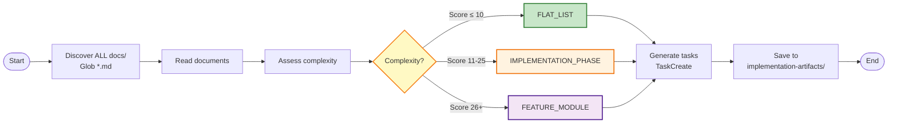

# Task Breakdown

Generate organized task lists from project documentation.

## Overview

1. **Discover Documents** - Read ALL markdown files from `docs/` directory
2. **Assess Complexity** - Analyze project characteristics (features, integrations, roles)
3. **Choose Organization** - Select flat, phase-based, or module-based structure
4. **Generate Tasks** - Create tasks using TaskCreate tool
5. **Save Output** - Write to `implementation-artifacts/{wave-name}-tasks.md`

## Architecture



## When to Use

Call this skill when:
- Starting a new development wave or project
- Planning implementation for a feature or module
- Decomposing requirements into actionable tasks
- Creating structured task lists from documentation
- You need TaskCreate-formatted tasks organized logically

## Input

- **Requirements** - Project description or user request
- **Source** - ALL `.md` files in `docs/` (discovered dynamically via Glob)
- **Output** - `implementation-artifacts/{wave-name}-tasks.md`

## Workflow

### Phase 1: Document Discovery & Complexity Assessment

```bash
# Discover ALL source materials
files = Glob("**/*.md", path="docs/")

# Read ALL documents and extract:
# - Features and requirements
# - Business rules and constraints
# - Entities and relationships
# - Integration points
```

**Complexity Score (0-40):**

| Factor | Max Points |
|--------|------------|
| Features (count) | 10 |
| Integration points × 2 | 10 |
| User roles × 2 | 10 |
| Domain contexts × 2 | 10 |

### Phase 2: Organization Decision

| Score | Organization | Use When |
|-------|--------------|----------|
| 0-10 | **FLAT_LIST** | Simple, linear work |
| 11-25 | **IMPLEMENTATION_PHASE** | Clear sequential phases |
| 26+ | **FEATURE_MODULE** | Distinct, independent modules |

### Phase 3: Task Generation

```python
# Create each task with TaskCreate
TaskCreate(
    subject="Implement user authentication",
    description="Build login form with email/password validation. Integrate with existing auth service.",
    activeForm="Implementing user authentication"
)
```

**Determine wave name** from user request (2-4 words, lowercase, hyphenated):
- "Add CSV file import" → `csv-import`
- "Build user authentication" → `authentication`
- "Fix memory leak in PSPP" → `pspp-memory-fix`

## Output Format

Save to `implementation-artifacts/{wave-name}-tasks.md`:

```markdown
# Task List: {Project Name}

**Organization**: FLAT_LIST | IMPLEMENTATION_PHASE | FEATURE_MODULE
**Complexity Score**: {Score}/40
**Total Tasks**: {Count}

## Source Documents
{List of all docs/ files read}

## Project Context
{Brief summary}

## Task Breakdown
{Organized tasks}
```

**TaskCreate Parameters:**
| Parameter | Format | Example |
|-----------|--------|---------|
| subject | Imperative verb phrase | "Create login form" |
| description | Detailed explanation | "Build form with..." |
| activeForm | Present continuous | "Creating login form" |

## Output Examples

### Example 1: FLAT_LIST

```markdown
# Task List: DataChat CSV Import Feature

**Organization**: FLAT_LIST
**Complexity Score**: 8/40
**Total Tasks**: 5

## Source Documents
- docs/features-and-usage.md
- docs/system-architecture.md
- docs/data-flow.md
- docs/business-rules.md

## Project Context
Adding CSV file import capability to existing SPSS (.sav) file support.

## Task Breakdown

### Task 1: Extend input parser for CSV format
- **Description**: Modify parser to detect and handle CSV files alongside SPSS .sav files.
- **Active Form**: Extending input parser for CSV format

### Task 2: Add CSV metadata extraction
- **Description**: Infer variable names and types from CSV headers with sensible defaults.
- **Active Form**: Adding CSV metadata extraction

### Task 3: Update workflow validation for CSV
- **Description**: Handle CSV edge cases (missing values, encoding issues) with error messages.
- **Active Form**: Updating workflow validation for CSV

### Task 4: Test CSV import with sample files
- **Description**: Create test CSV files and verify full workflow produces expected outputs.
- **Active Form**: Testing CSV import with sample files

### Task 5: Update documentation for CSV support
- **Description**: Document CSV format in features-and-usage.md with examples.
- **Active Form**: Updating documentation for CSV support
```

### Example 2: IMPLEMENTATION_PHASE

```markdown
# Task List: Database Migration

**Organization**: IMPLEMENTATION_PHASE
**Complexity Score**: 15/40
**Total Tasks**: 6

## Task Breakdown

### Phase 1: Preparation

### Task 1.1: Analyze current database schema
- **Description**: Document tables, relationships, data volumes, and migration risks.
- **Active Form**: Analyzing current database schema

### Task 1.2: Design new schema
- **Description**: Create optimized schema with migration mapping.
- **Active Form**: Designing new schema

### Phase 2: Implementation

### Task 2.1: Create migration scripts
- **Description**: Write SQL scripts with rollback procedures.
- **Active Form**: Creating migration scripts

### Task 2.2: Update application code
- **Description**: Modify ORM models and queries for new schema.
- **Active Form**: Updating application code

### Phase 3: Testing & Deployment

### Task 3.1: Run migration tests
- **Description**: Test in staging environment and validate data.
- **Active Form**: Running migration tests

### Task 3.2: Execute production migration
- **Description**: Plan and execute migration with downtime window.
- **Active Form**: Executing production migration
```

---

### Example 3: FEATURE_MODULE

```markdown
# Task List: E-Commerce Platform

**Organization**: FEATURE_MODULE
**Complexity Score**: 28/40
**Total Tasks**: 8

## Task Breakdown

### Authentication Module

### Task A-1: Implement user registration
- **Description**: Build registration form with email validation.
- **Active Form**: Implementing user registration

### Task A-2: Build login system
- **Description**: Create login form with JWT tokens and session management.
- **Active Form**: Building login system

### Product Catalog Module

### Task B-1: Design product data model
- **Description**: Define schema with variants, categories, and inventory.
- **Active Form**: Designing product data model

### Task B-2: Implement product search
- **Description**: Build search with filters and sorting.
- **Active Form**: Implementing product search

### Shopping Cart Module

### Task C-1: Create cart data structure
- **Description**: Implement session-based cart with persistence.
- **Active Form**: Creating cart data structure

### Task C-2: Build checkout flow
- **Description**: Design checkout with payment integration.
- **Active Form**: Building checkout flow

### Order Management Module

### Task D-1: Implement order processing
- **Description**: Handle order creation and status updates.
- **Active Form**: Implementing order processing

### Task D-2: Build order history
- **Description**: Display past orders with filters.
- **Active Form**: Building order history
```

## Best Practices

1. **Keep tasks atomic** - Each task should be independently completable
2. **Limit category size** - 3-8 tasks per category
3. **Clear descriptions** - Define what "done" means
4. **Logical ordering** - Respect dependencies

## Related Skills

- **task-implementation**: Executes tasks with audit iteration
- **task-document-writer**: Generates task documents for delegation

---

*End of SKILL.md*
