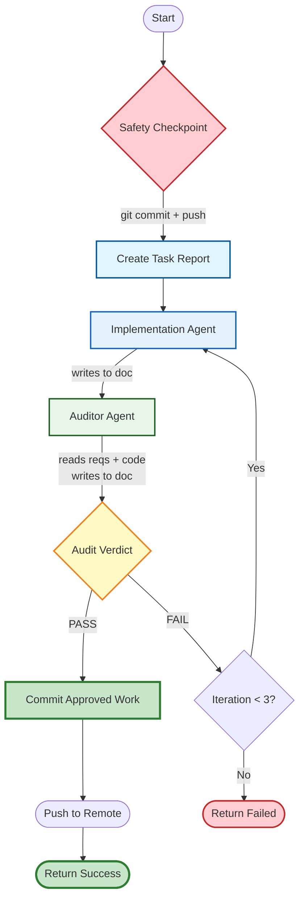

# Task Execution

Execute a task document using Implementation and Auditor agents with automatic iteration.

## Workflow Overview



## How It Works

1. **Safety Checkpoint** - Commit and push current state (git)
2. **Create Task Report** - Create task report in `tasks/{queue}/reports/`
3. **Implement** - Implementation Agent works and updates the document
4. **Audit** - Auditor Agent independently verifies and updates the document
5. **Iterate** - If audit fails, repeat steps 3-4 (max 3 times)
6. **Commit** - If audit passes, commit and push approved work

## Input

You will receive:
- **Task document** - File path or markdown content (format: `tasks/{queue}/pending/task-{id}.md`)
- **Max iterations** - Optional (default: 3)

**Queue Detection:** Extract `{queue}` from the task path:
- If task path contains `tasks/ad-hoc/` → use `ad-hoc`
- If task path contains `tasks/planned/` → use `planned`
- Report location: `tasks/{queue}/reports/{task-id}.md`

## Execution Steps

### Step 1: Safety Checkpoint

**Before reading the task, create a restore point:**

```bash
# Verify on main branch
git branch --show-current
# If not main, switch back: git checkout main

# Stage and commit current state
git add -A
git commit -m "safety-checkpoint: pre-task-implementation backup

This commit creates a restore point before task implementation begins.
If implementation fails, can revert to this checkpoint.

Co-Authored-By: Claude Opus 4.5 <noreply@anthropic.com>"

# Push to remote
git push
```

**Error handling:**
- If no changes to commit: Continue without checkpoint
- If push fails: Resolve merge conflicts before proceeding

### Step 2: Read Task & Create Task Report

**Read the task document** and extract task ID.

**Copy and rename the template** using CLI command:

```bash
# Copy template from skill directory and rename with task ID
cp .claude/skills/task-execution/references/task-report-template.md tasks/{queue}/reports/{task-id}.md
```

**Populate the template:**
- Extract `{queue}` from task path (`ad-hoc` or `planned`)
- Extract `{task-id}` from task filename
- Replace `{queue}` with actual queue name
- Replace `{task-id}` with actual task ID
- Replace `{task-doc-file}` with task document path

**The template provides the structure - each agent updates their designated section.**

### Step 3: Spawn Implementation Agent

**Use the Task tool to spawn a general-purpose agent:**

```
Task(
    subagent_type="general-purpose",
    description="Execute the following task",
    prompt="Read the task document and implement it thoroughly.

IMPORTANT: Update the Implementation section in the task report at:
tasks/{queue}/reports/{task-id}.md

In your Implementation section, document:
- What you investigated
- What files you modified
- What changes you made
- Any issues encountered
- Your honest assessment of completeness"
)
```

**Implementation Agent must:**
- **Do deep investigation first** - Find ALL affected files, understand patterns, identify edge cases
- Execute task completely
- **Update the task report** Implementation section

### Step 4: Spawn Auditor Agent

**Use the Task tool to spawn a general-purpose agent:**

```
Task(
    subagent_type="general-purpose",
    description="Audit implementation quality",
    prompt="You are the Auditor Agent. Your job is to INDEPENDENTLY verify the implementation.

CRITICAL: Do NOT rely on the Implementation Agent's claims.
Verify by examining the ACTUAL code, tests, and behavior against the ORIGINAL task document.

Read:
1. The task document (linked in task report header)
2. The actual code/files that were modified

DO NOT just read the Implementation section and trust it.

Check:
- Accuracy - Is the code correct and functional?
- Completeness - Were ALL requirements met? (check against original requirements)
- Quality - Is it well-structured and follows best practices?
- Edge cases - Are edge cases handled?

Update the Audit Report section in the task report at:
tasks/{queue}/reports/{task-id}.md

Your report MUST include:
- Verdict: PASS or FAIL (clear statement at the top)
- Rating: 1-10
- Summary: Brief overall assessment
- Issues found: List of problems (if any)
- Recommendations: How to fix issues (if any)

IMPORTANT: Write clearly so the Coordinator can read your verdict and decide next steps."
)
```

**Auditor Agent evaluates:**
- **Accuracy** - Correct, functional, no logical errors
- **Completeness** - All requirements met, edge cases handled
- **Quality** - Well-structured, follows best practices
- **Requirements adherence** - Followed original task document

**CRITICAL: Auditor Agent must independently verify against the ORIGINAL TASK DOCUMENT, not the Implementation section.**

**Auditor Agent writes to the task report (no JSON return needed).**

### Step 5: Check Verdict and Decide

**Read the task report** to check the Auditor's verdict.

**Look for the verdict in the Audit Report section:**
- If verdict is **PASS** → Proceed to Step 6 (Commit)
- If verdict is **FAIL** and iteration < 3 → Add new iteration block to task report, increment counter, go to Step 3
- If verdict is **FAIL** and iteration = 3 → Return with "max_iterations_reached" status

**Coordinator reads from the task report - no JSON passing needed.**

### Step 6: Commit Approved Work

**Only executes when audit passes:**

```bash
# Review changes
git status
git diff

# Stage and commit
git add -A
git commit -m "feat: {task summary} - completed

Task: {task file}
Iterations: {N}
Final verdict: PASS ({rating}/10)

Co-Authored-By: Claude Opus 4.5 <noreply@anthropic.com>"

# Push to remote
git push
```

**Update task report final status:**
```markdown
**Status**: Completed
**Final Verdict**: PASS ({rating}/10)
**Completed**: {timestamp}
```

## Task Report Template

The task report structure is defined in the template file:
```
.claude/skills/task-execution/references/task-report-template.md
```

**Template structure:**

```
# Task: {task-id}
├── Header (Status, Task Document link)
├── Iteration 1
│   ├── Implementation (Implementation Agent)
│   └── Audit Report (Auditor Agent with verdict)
├── Iteration 2 (added if needed)
├── Iteration 3 (added if needed)
└── Final Status
```

**Example workflow:**
1. Coordinator copies template → `tasks/{queue}/reports/{task-id}.md`
2. Implementation Agent writes in Iteration N → Implementation
3. Auditor Agent writes in Iteration N → Audit Report with PASS/FAIL verdict
4. If FAIL and iteration < 3, add new iteration block and repeat from step 2
5. If PASS or max iterations reached, update Final Status

## Output Format

**Return JSON result:**
```json
{
  "status": "completed or max_iterations_reached",
  "task_document": "[file path]",
  "working_document": "tasks/{queue}/reports/{task-id}.md",
  "iterations": [N],
  "final_verdict": "[read from Audit Report section]",
  "final_rating": "[read from Audit Report section]",
  "final_commit_hash": "[hash if completed]"
}
```

**Note:** Final verdict and rating are read from the task report's Audit Report section, not passed as JSON.

## Progress Updates

**Inform user at each phase:**
```
🔒 Creating safety checkpoint...
📋 Task: [summary]
📄 Created task report: tasks/{queue}/reports/{task-id}.md
🔄 Iteration 1/3
👷 Implementation complete
🔍 Auditing (independent verification)...
✅ Audit PASSED (8/10)
💾 Committing approved work...
```

## Key Principles

- **Always checkpoint first** - Create restore point before any work
- **Shared task report** - Single source of truth in `tasks/{queue}/reports/`
- **Independent auditor** - Auditor verifies against the ORIGINAL TASK DOCUMENT, not Implementation section
- **Let subagents work autonomously** - Don't micromanage
- **Respect the audit verdict** - PASS commits, FAIL iterates
- **Max 3 iterations** - Prevent infinite loops
- **Commit only on success** - Failed work should not be committed
