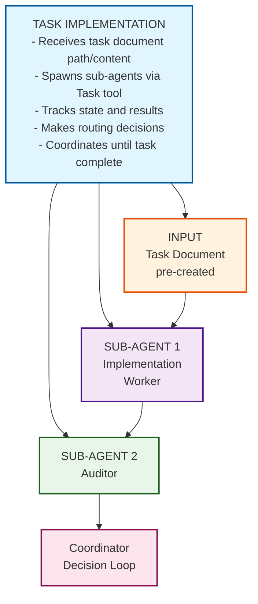
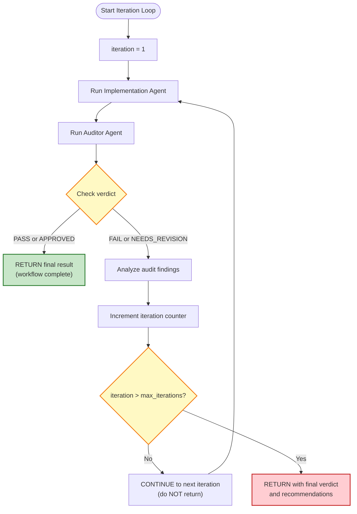
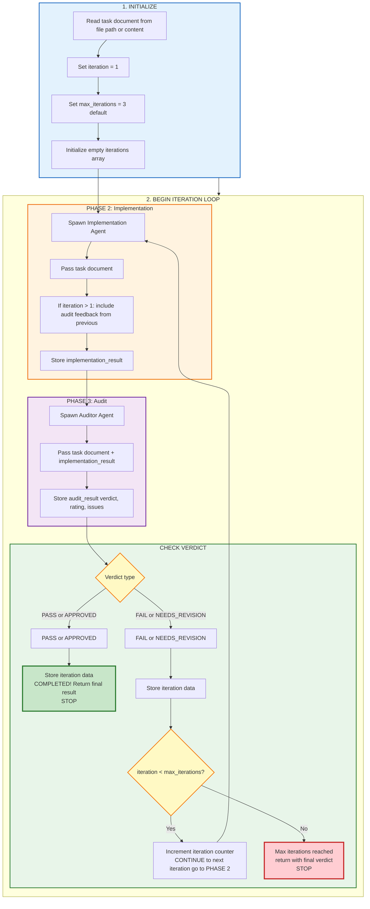

# Task Implementation

A two-agent workflow that **automatically iterates** until the work meets quality standards, using a **pre-existing task document**.

## Overview

The Coordinator acts as the central orchestrator that:
1. **Receives Task Document** - Accepts a pre-created task document file path or content
2. **Spawns Implementation Agent** - Executes the task with thorough investigation
3. **Spawns Auditor Agent** - Reviews and rates the implementation quality
4. **Automatically Iterates** - Re-runs Implementation and Audit phases based on feedback
5. **Returns only when** - Work is approved OR max iterations (3) is reached

## Architecture



## Workflow Context

This skill is designed to work with the **task document monitoring workflow**:

```mermaid
flowchart LR
    User["User<br/>(creates task)"]
    TaskGen["task-document<br/>generator"]
    Monitor["Monitor Daemon<br/>(watchdog)"]
    SDK["Claude Agent SDK<br/>invokes this skill"]
    Coord["task-implementation<br/>(this skill)"]
    Doc["Task document created<br/>(e.g., tasks/task-001.md)"]

    User --> TaskGen
    TaskGen --> Monitor
    Monitor -->|detects| Doc
    Doc --> SDK
    SDK --> Coord

    style User fill:#e3f2fd,stroke:#1565c0,stroke-width:2px
    style TaskGen fill:#fff3e0,stroke:#ef6c00,stroke-width:2px
    style Monitor fill:#f3e5f5,stroke:#6a1b9a,stroke-width:2px
    style Doc fill:#e8f5e9,stroke:#2e7d32,stroke-width:2px
    style SDK fill:#fce4ec,stroke:#c2185b,stroke-width:2px
    style Coord fill:#fff9c4,stroke:#f57f17,stroke-width:2px
```



## When to Use

Call this skill when:
- A task document has already been created (by `task-document-writer` skill)
- You need automatic iteration based on audit feedback
- You want implementation and audit coordinated with automatic retry
- You need a single entry point for execution and quality assurance

## Input

You will receive:
- **Task document** - Either:
  - **File path**: Path to the task document (e.g., `tasks/task-001.md`)
  - **Document content**: The full markdown content of the task document
- **Task context** - Optional additional context about the task
- **Max iterations** - Optional override (default: 3)

## Workflow

### Phase 1: Read Task Document

**First, read the task document to understand requirements:**

```python
# If given a file path
Read(file_path="tasks/task-001.md")

# If given document content directly
# (content is already provided)
```

**Extract from task document:**
- Task summary
- Context
- Scope (directories, files, dependencies)
- Requirements (specific, actionable)
- Deliverables
- Constraints
- Success criteria
- Worker investigation instructions

### Phase 2: Implementation

Use the **Task tool** with `subagent_type="general-purpose"` to spawn an Implementation Agent:

```python
Task(
    subagent_type="general-purpose",
    description="Execute the task",
    prompt="Execute the following task with thorough investigation...\n\n[Task document content]"
)
```

**Implementation Agent responsibilities:**
- Read the task document thoroughly
- Do own deep investigation (two-level investigation principle)
- Execute the task completely
- Provide results in structured format

**Implementation Output Format:**

```markdown
## Task Summary
[Brief description of what was done]

## Results
[Main results - code, analysis, writing, etc.]

## Steps Taken
[Step-by-step explanation of approach]

## Notes
[Additional context, assumptions, limitations]
```

### Phase 3: Audit

Use the **Task tool** with `subagent_type="general-purpose"` to spawn an Auditor Agent:

```python
Task(
    subagent_type="general-purpose",
    description="Audit implementation quality",
    prompt="Review the following implementation for quality...\n\n[Original task document + Implementation result]"
)
```

**Auditor Agent responsibilities:**
- Review the implementation results against the task requirements
- Verify all success criteria are met
- Identify issues, gaps, quality problems
- Provide quality rating (1-10)
- Return verdict and actionable feedback

**Auditor Output Format (JSON):**

```json
{
  "verdict": "PASS",
  "rating": 8,
  "summary": "Brief overall assessment",
  "strengths": ["Thing done well", "Another strength"],
  "issues_found": ["Issue 1", "Issue 2"],
  "recommendations": ["Fix 1", "Fix 2"],
  "findings": "Detailed findings and analysis"
}
```

**Verdict Options:**
- `PASS` - Work meets quality standards
- `FAIL` - Work has critical issues
- `NEEDS_REVISION` - Work has issues that should be addressed
- `APPROVED` - Work approved for use with minor notes

### Phase 4: Coordinator Decision Loop (Automatic Iteration)

**CRITICAL:** After receiving audit results, the Coordinator **MUST** automatically iterate based on the verdict. Do NOT return results immediately if the audit fails - continue the workflow until approval or max iterations.



**Feedback Format for Next Iteration:**

When spawning the Implementation Agent for iteration N (N > 1), include:

```markdown
## Previous Iteration Context
This is iteration {N} of the workflow. Previous implementation was reviewed by the Auditor.

## Audit Feedback from Iteration {N-1}
**Verdict:** {previous_verdict}
**Rating:** {previous_rating}/10

**Issues Found:**
- {issue_1}
- {issue_2}
- {issue_3}

**Recommendations:**
- {recommendation_1}
- {recommendation_2}

## Your Task
Fix ALL issues identified in the audit. Focus on:
1. Addressing critical issues marked as high priority
2. Fixing all requirements that were not met
3. Correcting errors or problems identified

Original task document:
[Full task document content]
```

## Output Format

The Coordinator returns a comprehensive result:

### Single Iteration (Passed on First Try)

```json
{
  "task_document_file": "tasks/task-001.md",
  "task_summary": "One-line summary of the task",
  "workflow_state": "completed",
  "iterations": [
    {
      "iteration": 1,
      "implementation_result": {
        "summary": "...",
        "content": "...",
        "steps": "...",
        "notes": "..."
      },
      "audit_result": {
        "verdict": "PASS",
        "rating": 9,
        "summary": "...",
        "strengths": [...],
        "issues_found": [],
        "recommendations": [],
        "findings": "..."
      }
    }
  ],
  "total_iterations": 1,
  "final_verdict": "PASS",
  "final_rating": 9,
  "final_result": "[Implementation content from iteration 1]",
  "timestamp": "2025-01-28T14:30:52"
}
```

### Multiple Iterations (Passed After Refinement)

```json
{
  "task_document_file": "tasks/task-002.md",
  "task_summary": "Add JWT authentication to API",
  "workflow_state": "completed",
  "iterations": [
    {
      "iteration": 1,
      "implementation_result": { ... },
      "audit_result": {
        "verdict": "NEEDS_REVISION",
        "rating": 6,
        "issues_found": [
          "Missing token refresh endpoint",
          "Error handling incomplete"
        ],
        "recommendations": [
          "Add /auth/refresh endpoint",
          "Complete error handling"
        ]
      }
    },
    {
      "iteration": 2,
      "implementation_result": { ... },
      "audit_result": {
        "verdict": "PASS",
        "rating": 9,
        "issues_found": [],
        "recommendations": []
      }
    }
  ],
  "total_iterations": 2,
  "final_verdict": "PASS",
  "final_rating": 9,
  "final_result": "[Implementation content from iteration 2]",
  "timestamp": "2025-01-28T14:45:30"
}
```

### Max Iterations Reached (Did Not Pass)

```json
{
  "task_document_file": "tasks/task-003.md",
  "task_summary": "Add JWT authentication to API",
  "workflow_state": "max_iterations_reached",
  "iterations": [
    {
      "iteration": 1,
      "audit_result": {
        "verdict": "FAIL",
        "rating": 4,
        "issues_found": ["Critical security issue"]
      }
    },
    {
      "iteration": 2,
      "audit_result": {
        "verdict": "NEEDS_REVISION",
        "rating": 5,
        "issues_found": ["Still missing key features"]
      }
    },
    {
      "iteration": 3,
      "audit_result": {
        "verdict": "NEEDS_REVISION",
        "rating": 6,
        "issues_found": ["Minor issues remain"]
      }
    }
  ],
  "total_iterations": 3,
  "final_verdict": "NEEDS_REVISION",
  "final_rating": 6,
  "message": "Maximum iterations reached. Work requires further refinement.",
  "final_recommendations": [
    "Review iteration 3 audit findings for remaining issues",
    "Task document may need revision if fundamental issues persist"
  ],
  "timestamp": "2025-01-28T15:00:00"
}
```

## Automatic Iteration Protocol

**THIS IS THE CORE WORKFLOW THAT THE COORDINATOR MUST IMPLEMENT:**

### Step-by-Step Execution



### Coordinator Implementation Pseudocode

```python
# Coordinator Workflow (for reference, not actual code)

def coordinate_workflow(task_document_path, max_iterations=3):
    # Initialize
    iteration = 1
    iterations = []

    # Read task document
    task_document = read_task_document(task_document_path)

    # Iteration Loop
    while iteration <= max_iterations:
        print(f"\n🔄 Iteration {iteration}/{max_iterations}")

        # Phase 2: Implementation
        if iteration == 1:
            impl_result = spawn_implementation_agent(task_document)
        else:
            # Include audit feedback from previous iteration
            prev_audit = iterations[-1]["audit_result"]
            impl_result = spawn_implementation_agent(
                task_document,
                audit_feedback=prev_audit,
                iteration=iteration
            )

        # Phase 3: Audit
        audit_result = spawn_auditor_agent(task_document, impl_result)

        # Store iteration data
        iteration_data = {
            "iteration": iteration,
            "implementation": impl_result,
            "audit": audit_result
        }
        iterations.append(iteration_data)

        # Check verdict
        verdict = audit_result["verdict"]
        if verdict in ["PASS", "APPROVED"]:
            print(f"✅ Iteration {iteration}: PASSED")
            return {
                "status": "completed",
                "task_document_file": task_document_path,
                "total_iterations": iteration,
                "final_verdict": verdict,
                "final_rating": audit_result["rating"],
                "iterations": iterations
            }

        # Need to iterate
        print(f"⚠️  Iteration {iteration}: {verdict}")
        if iteration < max_iterations:
            print(f"🔄 Continuing to iteration {iteration + 1}...")
            iteration += 1
        else:
            print(f"❌ Max iterations reached")
            return {
                "status": "max_iterations_reached",
                "task_document_file": task_document_path,
                "total_iterations": iteration,
                "final_verdict": verdict,
                "final_rating": audit_result["rating"],
                "iterations": iterations
            }
```

### Progress Updates to User

The Coordinator **MUST** provide clear progress updates during execution:

```markdown
🚀 Task Implementation Started
📋 Task document: tasks/task-001.md

📋 Iteration 1/3
   🔧 Reading task document...
   ✅ Task document loaded
   🔧 Implementing task...
   ✅ Implementation complete
   🔍 Auditing implementation...
   ⚠️  Verdict: NEEDS_REVISION (6/10)

📋 Iteration 2/3
   🔧 Implementing with audit feedback...
   ✅ Implementation revised
   🔍 Auditing implementation...
   ✅ Verdict: PASS (9/10)

🎉 Workflow Complete!
```

## Configuration

### Max Iterations

Default: 3 iterations

The Coordinator will iterate up to `max_iterations` times:
- Each iteration includes: Implementation → Audit
- If audit passes, stop early
- If audit fails, retry with feedback
- After max iterations, return with final verdict

### Output Directory

All audit reports are saved to:

```
results/task-implementation/
└── {task_id}/
    ├── audit-report-iteration-1.md
    ├── audit-report-iteration-2.md
    └── workflow-result.json
```

## Example Usage

### Called from Monitor Daemon

When the monitor daemon detects a new task file:

```python
# In monitor_daemon.py
async def execute_task(self, task_file: str):
    task_path = self.tasks_dir / task_file

    async with ClaudeSDKClient(options=options) as client:
        await client.query(f"/task-implementation {task_path}")

        async for message in client.receive_messages():
            # Process results...
```

### Example Execution Flow

**Task document:** `tasks/task-001.md`

```markdown
# Task: Add authentication to the API endpoints

## Context
Need to add JWT-based authentication to existing REST API.

## Scope
- Directories: src/api/, src/auth/
- Files: main.py, routes.py

## Requirements
1. Implement JWT token generation
2. Add authentication middleware
3. Protect /api/* endpoints

## Success Criteria
1. Unauthenticated requests return 401
2. Valid tokens allow access
3. Token refresh works correctly
```

**Coordinator workflow:**

1. **Read task document** from `tasks/task-001.md`

2. **Iteration 1**:
   - Spawn Implementation Agent
   - Agent reads task doc, implements JWT auth
   - Spawn Auditor Agent
   - Auditor returns: `NEEDS_REVISION`, rating: 6
   - Issues: missing token refresh endpoint

3. **Iteration 2**:
   - Spawn Implementation Agent with audit feedback
   - Agent fixes issues
   - Spawn Auditor Agent
   - Auditor returns: `PASS`, rating: 9

4. **Final Output**: Returns complete workflow result

## Key Principles

### 1. Task Document as Source of Truth

The task document is the single source of truth for:
- Requirements
- Success criteria
- Scope and constraints
- Worker investigation instructions

Both Implementation and Auditor agents reference the same task document.

### 2. State Management

Coordinator tracks:
- Current iteration number
- Task document content
- Implementation results from each iteration
- Audit results from each iteration
- Decision history

### 3. Automatic Iteration

- No manual intervention needed
- Continues until pass or max iterations
- Each iteration includes full audit feedback
- Efficient resource usage (stops early on pass)

### 4. Quality Threshold

Work must meet quality standards (PASS or APPROVED) to complete.
- Rating 8-10: Excellent quality
- Rating 6-7: Good quality with minor issues
- Rating 1-5: Poor quality, needs revision

## File Structure

```
.claude/skills/task-implementation/
├── SKILL.md                    # This file
└── references/
    ├── worker-instructions.md  # Implementation agent guidance
    └── audit-criteria.md       # Auditor evaluation criteria
```

## Task Document Format

This skill expects task documents in the following format (created by `task-document-writer` skill):

```markdown
# Task: [One-line summary]

**Created**: [YYYY-MM-DD HH:MM:SS]
**Status**: pending

---

## Task
[Clear one-line description of what needs to be done]

## Context
[Relevant background from the conversation]

## Scope
- Directories: [list relevant directories]
- Files: [list specific files if known]
- Dependencies: [what this task depends on or affects]

## Requirements
1. [Requirement 1]
2. [Requirement 2]
3. [Requirement 3]

## Deliverables
1. [Deliverable 1]
2. [Deliverable 2]

## Constraints
1. [Constraint 1]
2. [Constraint 2]

## Success Criteria
1. [Criterion 1]
2. [Criterion 2]

## Worker Investigation Instructions
[CRITICAL] Explicit instructions for the Implementation Agent:
- You MUST do your own deep investigation before implementing
- Find ALL files affected: [suggest grep/find commands]
- Understand current patterns before making changes
- Identify ALL edge cases and dependencies
```
