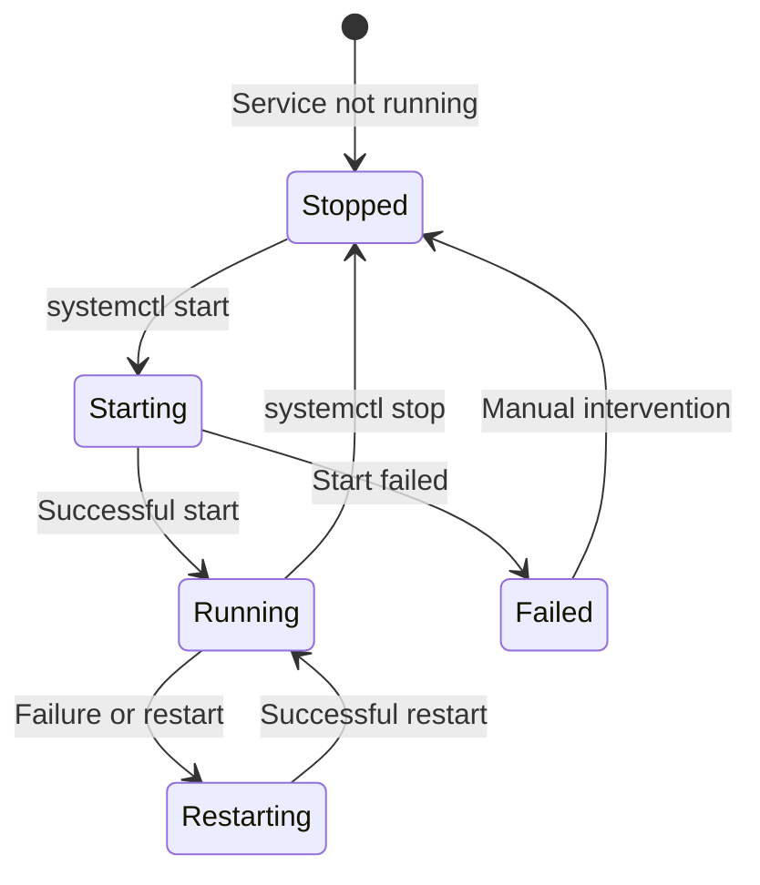

# Task Monitor Service Setup

Complete guide for configuring and managing the task-monitor systemd service.

---

## Overview

The task-monitor daemon runs as a systemd user service, providing continuous task processing with automatic startup at login.

---

## Service File Location

**User service directory:** `~/.config/systemd/user/`

**Service file name:** `task-monitor.service`

**Full path:** `/home/admin/.config/systemd/user/task-monitor.service`

---

## Service File Creation

### Step 1: Create the Service File

```bash
# Create directory if it doesn't exist
mkdir -p ~/.config/systemd/user/

# Create the service file
cat > ~/.config/systemd/user/task-monitor.service <<'EOF'
[Unit]
Description=Task Monitor Daemon
Documentation=https://github.com/datachat/task-monitor
After=network.target

[Service]
Type=simple
ExecStart=/home/admin/workspaces/task-monitor/.venv/bin/python -m task_monitor.daemon
Restart=always
RestartSec=10
Environment=PYTHONUNBUFFERED=1
Environment=PYTHONPATH=/home/admin/workspaces/task-monitor

# Logging
StandardOutput=journal
StandardError=journal
SyslogIdentifier=task-monitor

# Security
NoNewPrivileges=true

[Install]
WantedBy=default.target
EOF
```

### Step 2: Reload systemd

```bash
systemctl --user daemon-reload
```

---

## Service Management Commands

| Command | Purpose |
|---------|---------|
| `systemctl --user start task-monitor` | Start the service |
| `systemctl --user stop task-monitor` | Stop the service |
| `systemctl --user restart task-monitor` | Restart the service |
| `systemctl --user enable task-monitor` | Enable auto-start at login |
| `systemctl --user disable task-monitor` | Disable auto-start |
| `systemctl --user status task-monitor` | Check service status |
| `systemctl --user is-active task-monitor` | Check if running |

---

## Verification Steps

### 1. Check Service File Exists

```bash
ls -la ~/.config/systemd/user/task-monitor.service
```

**Expected output:**
```
-rw-r--r-- 1 admin admin 483 Feb  7 17:12 task-monitor.service
```

### 2. Check Service is Enabled

```bash
systemctl --user is-enabled task-monitor.service
```

**Expected output:** `enabled`

### 3. Check Service is Running

```bash
systemctl --user is-active task-monitor.service
```

**Expected output:** `active`

### 4. Check Full Status

```bash
systemctl --user status task-monitor.service
```

**Expected output:**
```
● task-monitor.service - Task Monitor Daemon
     Loaded: loaded (/home/admin/.config/systemd/user/task-monitor.service; enabled)
     Active: active (running) since ...
```

### 5. Check Logs

```bash
# Recent logs
journalctl --user -u task-monitor.service -n 20

# Follow logs live
journalctl --user -u task-monitor.service -f
```

---

## Service Configuration Parameters

| Parameter | Value | Purpose |
|-----------|-------|---------|
| `ExecStart` | `/home/admin/workspaces/task-monitor/.venv/bin/python -m task_monitor.daemon` | Python interpreter and daemon module |
| `PYTHONPATH` | `/home/admin/workspaces/task-monitor` | Path to task-monitor module |
| `Restart` | `always` | Always restart on failure |
| `RestartSec` | `10` | Seconds between restart attempts |
| `SyslogIdentifier` | `task-monitor` | Log identifier for journalctl |

---

## Troubleshooting

### Service Won't Start

**Check if module is installed:**
```bash
/home/admin/workspaces/task-monitor/.venv/bin/python -c "import task_monitor.daemon; print('OK')"
```

**Check if paths are correct:**
```bash
ls -la /home/admin/workspaces/task-monitor/.venv/bin/python
ls -la /home/admin/workspaces/task-monitor/task_monitor/daemon.py
```

**Check logs for errors:**
```bash
journalctl --user -u task-monitor.service -n 50
```

### Service Keeps Crashing

**Common causes:**
1. Wrong PYTHONPATH (should point to `/home/admin/workspaces/task-monitor`)
2. Module not installed in venv
3. Permission issues on task-monitor directory

**Solution:**
```bash
# Reinstall module
cd /home/admin/workspaces/task-monitor
.venv/bin/pip install -e . --break-system-packages

# Fix permissions
chmod -R 755 /home/admin/workspaces/task-monitor

# Restart service
systemctl --user restart task-monitor
```

### Service Not Found After Reboot

**Enable the service:**
```bash
systemctl --user enable task-monitor.service
```

**Verify enabled services:**
```bash
systemctl --user list-unit-files | grep task-monitor
```

---

## Service Lifecycle



---

## Related Documents

- **[CLI Setup](./cli-setup.md)** - Task Monitor CLI command installation
- **[../task-init/SKILL.md](../SKILL.md)** - Main task initialization skill
