# Task Planning

Generate organized task planning documents from project documentation, gap analysis reports, and implementation assessment.

**Key Features:**
- **Project Type Detection** - Brownfield (existing code) vs Greenfield (new project)
- **Gap Analysis Integration** - Uses gap analysis reports as input for brownfield projects
- **Existing Plan Handling** - Archive / Remove / Keep existing plans
- **Multiple Scopes** - TDD-Driven, Holistic Testing, Gap-Based Development

## Overview

1. **Detect Project Type** - Determine brownfield (existing code) or greenfield (new project)
2. **Check Gap Analysis** (brownfield only) - Use existing reports or run new analysis
3. **Handle Existing Plans** - User confirms: Archive / Remove / Keep
4. **Scope Discussion** - Interactive session to determine scope
5. **Discover Sources** - Read documentation, gap analysis, AND investigate implementation
6. **Intelligently Assess** - AI evaluates project nature, adapts to what exists
7. **Choose Organization** - Select structure (FLAT_LIST, IMPLEMENTATION_PHASE, FEATURE_MODULE)
8. **Generate Tasks** - Create tasks using TaskCreate tool
9. **Save Output** - Write to `task-monitor/planned/planning/{descriptive-name}.md`

## Architecture

```mermaid
flowchart LR
    Start([Start]) --> Type{Project<br/>Type?}

    Type -->|Brownfield| GapCheck{Gap<br/>Analysis?}
    Type -->|Greenfield| PlansCheck{Existing<br/>plans?}

    GapCheck -->|Yes| UseGap["📊 Use Gap<br/>Reports"]
    GapCheck -->|No| RunGap["🔍 Run Gap<br/>Analysis"]
    GapCheck -->|Skip| PlansCheck

    RunGap --> UseGap
    UseGap --> PlansCheck

    PlansCheck -->|No| Scope["📋 Scope Discussion"]
    PlansCheck -->|Yes| Confirm["🤔 Archive / Remove / Keep"]
    Confirm --> Scope

    Scope --> Sources["📚 Triple Source Discovery"]

    Sources --> Docs["📄 Documentation<br/>(docs/application-design/)"]
    Sources --> Gap["📊 Gap Reports<br/>(implementation/gap-analysis/)"]
    Sources --> Impl["💻 Implementation<br/>(Adaptive - if exists)"]

    Docs --> Assess[AI Intelligent Assessment]
    Gap --> Assess
    Impl --> Assess

    Assess --> Decide{Choose<br/>organization}

    Decide -->|Simple| Flat[FLAT_LIST]
    Decide -->|Sequential| Phase[IMPLEMENTATION_PHASE]
    Decide -->|Modules| Module[FEATURE_MODULE]

    Flat --> Generate[Generate tasks]
    Phase --> Generate
    Module --> Generate

    Generate --> Save[Save to task-monitor/planned/planning/]
    Save --> End([End])
```



## Input Sources

| Source | Location | Purpose | When Used |
|--------|----------|---------|----------|
| **Documentation** | `docs/application-design/` | Project requirements, architecture, features | **Always** |
| **Gap Analysis Reports** | `implementation/gap-analysis/` | Identified gaps, priorities, recommendations | **Brownfield** (if available) |
| **Implementation** | Codebase (`agent/`, tests, etc.) | Existing code, tests, coverage | **Adaptive** |

### AI Intelligence for Source Handling

```python
# AI determines what sources to use based on project type
project_type = detect_project_type()  # brownfield or greenfield

# For brownfield projects
if project_type == "brownfield":
    # Always check for gap analysis reports
    if gap_analysis_exists():
        read_gap_analysis_reports()
        extract_prioritized_gaps()
    else:
        offer_to_run_gap_analysis()

    # Then check implementation
    if implementation_exists():
        analyze_current_implementation()
        identify_gaps_and_limitations()
        generate_regression_tests_for_existing_code()

# For greenfield projects
else:  # greenfield
    # Skip gap analysis (no existing code)
    proceed_from_documentation_only()

    # Implementation may exist for initial setup
    if implementation_exists():
        analyze_implementation_adaptively()
```

### Gap Analysis Integration for Brownfield Projects

```python
# AI intelligently incorporates gap analysis findings
if gap_analysis_available():
    gap_report = read_latest_gap_analysis()

    # Extract prioritized findings
    high_priority_gaps = gap_report.get("high_priority_items", [])
    medium_priority_gaps = gap_report.get("medium_priority_items", [])

    # Use gap findings to inform task priorities
    generate_tasks_based_on_gaps(high_priority_gaps, medium_priority_gaps)

    # Include gap report references in task descriptions
    for task in tasks:
        task.gap_source = gap_report.file_name
        task.gap_reference = gap_report.finding_id
```

## Phase -2: Project Type Detection

**First step** - Determine if this is a brownfield (existing code) or greenfield (new project) initiative.

### Ask User: Project Type

```python
AskUserQuestion(
    questions=[
        {
            "question": "What type of project is this?",
            "header": "Project Type",
            "multiSelect": False,
            "options": [
                {
                    "label": "Brownfield (Existing Code)",
                    "description": "Working with existing codebase. Gap analysis recommended first."
                },
                {
                    "label": "Greenfield (New Project)",
                    "description": "Starting from scratch. No gap analysis needed."
                }
            ]
        }
    ]
)
```

### Project Type Characteristics

| Aspect | Brownfield | Greenfield |
|--------|-----------|------------|
| **Existing Code** | Yes | No |
| **First Step** | Gap Analysis | Requirements/Design |
| **Input Sources** | Docs + Gap Reports + Implementation | Docs + Implementation (adaptive) |
| **Task Focus** | Fill gaps, improve, refactor | Build from scratch |
| **Scope Options** | All + Gap-Based Development | All except Gap-Based |

---

## Phase -1: Gap Analysis Check (Brownfield Only)

**Only for brownfield projects** - Check for existing gap analysis reports or offer to run new analysis.

### Check for Existing Gap Analysis

```bash
# Check for gap analysis reports
ls -la implementation/gap-analysis/*.md 2>/dev/null | wc -l
```

### If Gap Analysis Exists

Ask user whether to use existing reports:

```python
AskUserQuestion(
    questions=[
        {
            "question": "Found existing gap analysis reports. Use them as input for task planning?",
            "header": "Gap Analysis Reports",
            "multiSelect": False,
            "options": [
                {
                    "label": "Yes - Use Existing Reports",
                    "description": "Read and use existing gap analysis as planning input"
                },
                {
                    "label": "No - Run New Analysis",
                    "description": "Run gap-analysis skill first, then proceed to planning"
                },
                {
                    "label": "Skip - Proceed Without",
                    "description": "Continue with task planning without gap analysis input"
                }
            ]
        }
    ]
)
```

### If No Gap Analysis Exists

Offer to run gap analysis:

```python
AskUserQuestion(
    questions=[
        {
            "question": "No gap analysis reports found. Run gap analysis before task planning?",
            "header": "Gap Analysis",
            "multiSelect": False,
            "options": [
                {
                    "label": "Yes - Run Gap Analysis",
                    "description": "Execute gap-analysis skill: FEATURE, BEST, or TEST analysis"
                },
                {
                    "label": "No - Skip",
                    "description": "Proceed directly to task planning"
                }
            ]
        }
    ]
)
```

### Handle Gap Analysis Selection

```bash
# If user selected "Run Gap Analysis":
# Execute gap-analysis skill based on user choice
# Feature gap: FEATURE: Analyze feature gaps
# Best practice: BEST: Analyze best practice gaps
# Test coverage: TEST: Analyze test coverage gaps
# Full analysis: FULL ANALYSIS: Complete gap analysis
```

---

## Phase 0: Handle Existing Plans (User Confirmation)

**Before any user interaction**, check if `task-monitor/planned/planning/` contains existing documents and ask the user how to handle them.

```bash
# Check for existing plans
ls -la task-monitor/planned/planning/*.md 2>/dev/null | wc -l
```

### User Confirmation

If existing plans are found (count > 0), ask the user:

```python
AskUserQuestion(
    questions=[
        {
            "question": "Existing task plans found. How would you like to handle them?",
            "header": "Existing Plans",
            "multiSelect": False,
            "options": [
                {
                    "label": "Archive",
                    "description": "Move existing plans to history/Archive-TaskPlanning-{timestamp}/"
                },
                {
                    "label": "Remove All",
                    "description": "Delete all existing task planning documents"
                },
                {
                    "label": "Keep as Is",
                    "description": "Leave existing plans in place and create new plan alongside"
                }
            ]
        }
    ]
)
```

### Handle User Selection

```bash
# If user selected "Archive":
mkdir -p history
ARCHIVE_NAME="history/Archive-TaskPlanning-$(date +%Y%m%d-%H%M%S)"
mkdir -p "$ARCHIVE_NAME"
mv task-monitor/planned/planning/*.md "$ARCHIVE_NAME/" 2>/dev/null

# If user selected "Remove All":
rm task-monitor/planned/planning/*.md 2>/dev/null

# If user selected "Keep as Is":
# Do nothing - new plan will be created alongside existing plans
```

## Phase 0: Scope Discussion (Interactive)

**CRITICAL: Always start with this phase** - Have an interactive discussion to understand the scope.

### 0.1 Select Scope

Ask the user to select their planning scope:

```python
AskUserQuestion(
    questions=[
        {
            "question": "What is the scope of your task planning?",
            "header": "Scope",
            "multiSelect": False,
            "options": [
                {
                    "label": "TDD-Driven Development",
                    "description": "Red → Green → Refactor cycle. Write tests FIRST, then implement. Works with or without existing code."
                },
                {
                    "label": "Holistic Testing",
                    "description": "Write → Run → Fix → Debug cycle. Full testing lifecycle. May use existing tests as baseline."
                },
                {
                    "label": "Gap-Based Development (Brownfield)",
                    "description": "Uses gap analysis report as primary input. Prioritizes tasks based on gap findings. For existing codebases."
                }
            ]
        }
    ]
)
```

### Scope Comparison

| Aspect | TDD-Driven Development | Holistic Testing | Gap-Based Development |
|--------|----------------------|------------------|----------------------|
| **Primary Goal** | Develop features through testing | Achieve comprehensive test coverage | Fill identified gaps |
| **Best For** | New features, test-first approach | Coverage improvements | Brownfield projects |
| **Input** | Documentation | Documentation | Gap Analysis Report |
| **Prioritization** | Test order | Coverage targets | Gap priorities (H/M/L) |
| **Existing Code** | Adds regression tests | Uses as baseline | Analyzes gaps |
| **Project Type** | Both | Both | Brownfield only |

### 0.2 Scope Reference Documents

**CRITICAL**: Before proceeding, read the appropriate reference document:

| Scope | Reference Document | Key Principle |
|-------|-------------------|---------------|
| **TDD-Driven Development** | `.claude/skills/task-planning/references/tdd-driven-development.md` | Red → Green → Refactor |
| **Holistic Testing** | `.claude/skills/task-planning/references/holistic-testing.md` | Write → Run → Fix → Debug |
| **Gap-Based Development** | Gap analysis reports + Best Practices | Priority-based task generation |

### 0.3 Gather Additional Context

After scope selection, gather context:

```python
AskUserQuestion(
    questions=[
        {
            "question": "What level of detail is needed for each task?",
            "header": "Detail Level",
            "multiSelect": False,
            "options": [
                {"label": "High-Level", "description": "Brief overviews, fewer tasks (3-5 per phase)"},
                {"label": "Medium", "description": "Standard detail (5-8 tasks per phase)"},
                {"label": "Detailed", "description": "Granular tasks with subtasks (8+ per phase)"}
            ]
        }
    ]
)
```

## Phase 2: Triple Source Discovery

```bash
# Source 1: Documentation (Always read)
files = Glob("**/*.md", path="docs/application-design/")

# Read ALL documents and understand:
# - Project scope and goals
# - Features and requirements
# - Architecture and components
# - Integration points
# - Technical stack

# Source 2: Gap Analysis Reports (Brownfield - if available)
if brownfield and gap_analysis_exists():
    reports = Glob("*.md", path="implementation/gap-analysis/")
    # Read gap analysis reports and understand:
    # - Feature gaps: Missing/incomplete features
    # - Best practice gaps: Deviations from standards
    # - Test coverage gaps: Missing test scenarios
    # - Prioritized findings (High/Medium/Low)

# Source 3: Implementation (Adaptive)
if implementation_exists():
    # Investigate current implementation
    - Analyze existing code structure
    - Identify implemented features
    - Discover gaps and limitations
    - Review existing tests (if any)
    - Generate coverage report
else:
    # Skip implementation analysis
    pass
```

### Implementation Discovery Logic

```python
# AI intelligently determines what to investigate
def investigate_implementation():
    # Check if implementation exists
    codebase = find_code_files("agent/", "tests/")

    if not codebase:
        return {"status": "no_implementation", "action": "skip"}

    # Analyze what exists
    return {
        "status": "has_implementation",
        "findings": {
            "implemented_features": audit_code(),
            "existing_tests": find_tests(),
            "coverage": generate_coverage_report(),
            "gaps": identify_gaps()
        }
    }
```

## Phase 2: Scope-Based Assessment

Based on the user's selected scope, read the corresponding reference document and tailor the assessment:

**For "TDD-Driven Development":**
- Read `.claude/skills/task-planning/references/tdd-driven-development.md`
- Apply Red → Green → Refactor cycle
- If implementation exists: Add regression tests for existing code
- If no implementation: Build from ground up using TDD
- Structure tasks around testable units

**For "Holistic Testing":**
- Read `.claude/skills/task-planning/references/holistic-testing.md`
- Apply Write → Run → Fix → Debug cycle
- If tests exist: Use as baseline, fix broken ones
- If no tests: Build complete test suite from scratch
- Target: 80%+ coverage, 100% pass rate

## Phase 3: Organization Decision

Choose the organization that best fits the project:

| Organization | Best For | Characteristics |
|--------------|----------|----------------|
| **FLAT_LIST** | Simple additions, single features | Linear work, clear dependencies, small scope |
| **IMPLEMENTATION_PHASE** | Phased projects, workflows | Clear temporal sequence (Phase 1 → Phase 2 → Phase 3) |
| **FEATURE_MODULE** | Complex applications, multi-component | Distinct functional areas developed in parallel |

**Note**: Organization is independent of Scope. Any scope can use any organization type.

## Phase 4: Task Generation

```python
# Create each task with TaskCreate
TaskCreate(
    subject="Implement user authentication",
    description="Build login form with email/password validation.",
    activeForm="Implementing user authentication"
)
```

## Output Format

Save to `task-monitor/planned/planning/{descriptive-name}.md`:

```markdown
# Task List: {Project Name}

**Project Type**: {Brownfield / Greenfield}
**Scope**: {TDD-Driven Development | Holistic Testing | Gap-Based Development}
**Organization**: {FLAT_LIST | IMPLEMENTATION_PHASE | FEATURE_MODULE}
**Total Tasks**: {Count}

## Project Type Detection
{Brownfield or Greenfield determination}
- Existing Code: {Yes / No}
- Gap Analysis: {Run / Skipped / Used Existing}

## Gap Analysis Input
{For brownfield projects with gap analysis}
- Analysis Date: {date}
- Feature Gaps: {summary}
- Best Practice Gaps: {summary}
- Test Coverage Gaps: {summary}
- Priority Focus: {High/Medium/Low items from gap analysis}
- Gap Report References: {list of gap analysis files used}

## Reference Document
**Instructions**: `.claude/skills/task-planning/references/{scope-reference}.md`

## Scope Selection
{User's selected scope and focus areas}

## Source Documents
{List of all docs/application-design/ files read}

## Implementation Assessment
{AI findings on existing implementation (if any)}
- Implementation Status: {Exists / None}
- Implemented Features: {list}
- Existing Tests: {count, coverage}
- Identified Gaps: {list}

## Project Context
{Brief summary combining documentation, gap analysis, and implementation findings}

## Task Breakdown
{Organized tasks following the reference document patterns}

## Task Summary
{Summary table}
```

## Quick Reference

### Project Type Decision Tree

```
Is there existing code to analyze?
├── YES → Brownfield → Check Gap Analysis
│   ├── Gap analysis exists? → Use as input
│   └── No gap analysis? → Offer to run gap-analysis skill
└── NO → Greenfield → Skip gap analysis, proceed with docs
```

### Scope Decision Tree

```
What is your primary goal?
├── Develop features through testing
│   └── TDD-Driven Development (Red → Green → Refactor)
├── Achieve comprehensive test coverage
│   └── Holistic Testing (Write → Run → Fix → Debug)
└── Fill identified gaps (Brownfield only)
    └── Gap-Based Development (Priority-driven)
```

### Input Source Decision Tree

```
Documentation
└── Always read from docs/application-design/

Gap Analysis Reports (Brownfield)
└── Read if available from implementation/gap-analysis/

Implementation
└── AI intelligently handles:
    ├── Exists → Analyze, audit, identify gaps
    └── Not exists → Skip, proceed from docs only
```

### Organization Decision Tree

```
Is the work simple/linear?
├── Yes → FLAT_LIST
└── No → Does it have clear phases/stages?
    ├── Yes → IMPLEMENTATION_PHASE
    └── No → FEATURE_MODULE (distinct modules)
```

## Best Practices

1. **Detect project type first** - Brownfield vs Greenfield determines workflow
2. **For brownfield: Check gap analysis** - Use existing reports or offer to run gap-analysis skill
3. **Always read the reference document** for the selected scope before generating tasks
4. **Investigate implementation adaptively** - Check if code exists, analyze if present, skip if absent
5. **Keep tasks atomic** - Each task should be independently completable
6. **Limit category size** - 3-8 tasks per category
7. **Clear descriptions** - Define what "done" means
8. **Logical ordering** - Respect dependencies
9. **Document findings** - Always report implementation assessment and gap analysis in output

## Reference Documents

| File | Purpose | Status |
|------|---------|--------|
| `.claude/skills/task-planning/references/tdd-driven-development.md` | Red → Green → Refactor cycle | ✅ Created |
| `.claude/skills/task-planning/references/holistic-testing.md` | Write → Run → Fix → Debug cycle (with adaptive mode) | ✅ Updated |
| `.claude/skills/task-planning/references/complexity-criteria.md` | Organization selection framework | ✅ Utility |
| `.claude/skills/task-planning/references/task-template.md` | Output format template | ✅ Utility |

## Archived Reference Documents

| File | Action | Location |
|------|--------|----------|
| `development-from-scratch.md` | Archived | `history/documents/Archive-TaskPlanningReference-20260205-042144/` |
| `development-incomplete-features.md` | Archived | `history/documents/Archive-TaskPlanningReference-20260205-042144/` |
| `incomplete-testing.md` | Archived | `history/documents/Archive-TaskPlanningReference-20260205-042144/` |

## Related Skills

- **gap-analysis**: Analyzes gaps between requirements/implementation/best practices (First step for brownfield projects)
- **task-documents**: Generates task specifications from planning documents
- **task-monitor**: Coordinates task execution using task-monitor CLI
- **task-execution**: Executes tasks with worker-auditor workflow (auto-iteration)

---

*End of SKILL.md*
