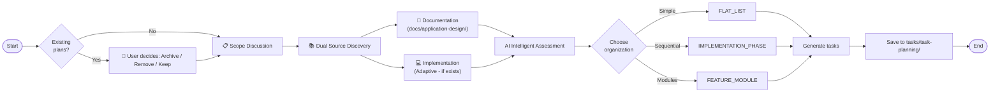

# Task Planning

Generate organized task planning documents from project documentation and implementation.

**Existing Plan Handling**: Before generating new plans, if existing documents are found in `tasks/task-planning/`, the user is prompted to choose: Archive, Remove All, or Keep as Is.

## Overview

1. **Handle Existing Plans** - User confirms: Archive / Remove / Keep
2. **Scope Discussion** - Interactive session to determine scope (2 options)
3. **Discover Sources** - Read documentation AND investigate implementation
4. **Intelligently Assess** - AI evaluates project nature, adapts to what exists
5. **Choose Organization** - Select structure (FLAT_LIST, IMPLEMENTATION_PHASE, FEATURE_MODULE)
6. **Generate Tasks** - Create tasks using TaskCreate tool
7. **Save Output** - Write to `tasks/task-planning/{descriptive-name}.md`

## Architecture



## Input Sources (Always Both)

| Source | Location | Purpose | Behavior |
|--------|----------|---------|----------|
| **Documentation** | `docs/application-design/` | Project requirements, architecture, features | **Always read** - primary source |
| **Implementation** | Codebase (`agent/`, tests, etc.) | Existing code, tests, coverage | **Adaptive** - investigate if exists, skip if not |

### AI Intelligence for Implementation Handling

```python
# AI determines implementation existence and relevance
if implementation_exists():
    analyze_current_implementation()
    identify_gaps_and_limitations()
    generate_regression_tests_for_existing_code()
else:
    skip_implementation_analysis()
    proceed_from_documentation_only()
```

## Phase -1: Handle Existing Plans (User Confirmation)

**Before any user interaction**, check if `tasks/task-planning/` contains existing documents and ask the user how to handle them.

```bash
# Check for existing plans
ls -la tasks/task-planning/*.md 2>/dev/null | wc -l
```

### User Confirmation

If existing plans are found (count > 0), ask the user:

```python
AskUserQuestion(
    questions=[
        {
            "question": "Existing task plans found. How would you like to handle them?",
            "header": "Existing Plans",
            "multiSelect": False,
            "options": [
                {
                    "label": "Archive",
                    "description": "Move existing plans to history/Archive-TaskPlanning-{timestamp}/"
                },
                {
                    "label": "Remove All",
                    "description": "Delete all existing task planning documents"
                },
                {
                    "label": "Keep as Is",
                    "description": "Leave existing plans in place and create new plan alongside"
                }
            ]
        }
    ]
)
```

### Handle User Selection

```bash
# If user selected "Archive":
mkdir -p history
ARCHIVE_NAME="history/Archive-TaskPlanning-$(date +%Y%m%d-%H%M%S)"
mkdir -p "$ARCHIVE_NAME"
mv tasks/task-planning/*.md "$ARCHIVE_NAME/" 2>/dev/null

# If user selected "Remove All":
rm tasks/task-planning/*.md 2>/dev/null

# If user selected "Keep as Is":
# Do nothing - new plan will be created alongside existing plans
```

## Phase 0: Scope Discussion (Interactive)

**CRITICAL: Always start with this phase** - Have an interactive discussion to understand the scope.

### 0.1 Select Scope

Ask the user to select their planning scope:

```python
AskUserQuestion(
    questions=[
        {
            "question": "What is the scope of your task planning?",
            "header": "Scope",
            "multiSelect": False,
            "options": [
                {
                    "label": "TDD-Driven Development",
                    "description": "Red → Green → Refactor cycle. Write tests FIRST, then implement. Works with or without existing code."
                },
                {
                    "label": "Holistic Testing",
                    "description": "Write → Run → Fix → Debug cycle. Full testing lifecycle. May use existing tests as baseline."
                }
            ]
        }
    ]
)
```

### Scope Comparison

| Aspect | TDD-Driven Development | Holistic Testing |
|--------|----------------------|------------------|
| **Primary Goal** | Develop features through testing | Achieve comprehensive test coverage |
| **Cycle** | Red → Green → Refactor | Write → Run → Fix → Debug |
| **Test Timing** | Tests written FIRST (before implementation) | Tests written alongside or after |
| **Existing Code** | Analyzes and adds regression tests | May use existing tests as baseline |
| **Target** | Working features with passing tests | 80%+ coverage, 100% pass rate |

### 0.2 Scope Reference Documents

**CRITICAL**: Before proceeding, read the appropriate reference document:

| Scope | Reference Document | Key Principle |
|-------|-------------------|---------------|
| **TDD-Driven Development** | `.claude/skills/task-planning/references/tdd-driven-development.md` | Red → Green → Refactor |
| **Holistic Testing** | `.claude/skills/task-planning/references/holistic-testing.md` | Write → Run → Fix → Debug |

### 0.3 Gather Additional Context

After scope selection, gather context:

```python
AskUserQuestion(
    questions=[
        {
            "question": "What level of detail is needed for each task?",
            "header": "Detail Level",
            "multiSelect": False,
            "options": [
                {"label": "High-Level", "description": "Brief overviews, fewer tasks (3-5 per phase)"},
                {"label": "Medium", "description": "Standard detail (5-8 tasks per phase)"},
                {"label": "Detailed", "description": "Granular tasks with subtasks (8+ per phase)"}
            ]
        }
    ]
)
```

## Phase 1: Dual Source Discovery

```bash
# Source 1: Documentation (Always read)
files = Glob("**/*.md", path="docs/application-design/")

# Read ALL documents and understand:
# - Project scope and goals
# - Features and requirements
# - Architecture and components
# - Integration points
# - Technical stack

# Source 2: Implementation (Adaptive)
if implementation_exists():
    # Investigate current implementation
    - Analyze existing code structure
    - Identify implemented features
    - Discover gaps and limitations
    - Review existing tests (if any)
    - Generate coverage report
else:
    # Skip implementation analysis
    pass
```

### Implementation Discovery Logic

```python
# AI intelligently determines what to investigate
def investigate_implementation():
    # Check if implementation exists
    codebase = find_code_files("agent/", "tests/")

    if not codebase:
        return {"status": "no_implementation", "action": "skip"}

    # Analyze what exists
    return {
        "status": "has_implementation",
        "findings": {
            "implemented_features": audit_code(),
            "existing_tests": find_tests(),
            "coverage": generate_coverage_report(),
            "gaps": identify_gaps()
        }
    }
```

## Phase 2: Scope-Based Assessment

Based on the user's selected scope, read the corresponding reference document and tailor the assessment:

**For "TDD-Driven Development":**
- Read `.claude/skills/task-planning/references/tdd-driven-development.md`
- Apply Red → Green → Refactor cycle
- If implementation exists: Add regression tests for existing code
- If no implementation: Build from ground up using TDD
- Structure tasks around testable units

**For "Holistic Testing":**
- Read `.claude/skills/task-planning/references/holistic-testing.md`
- Apply Write → Run → Fix → Debug cycle
- If tests exist: Use as baseline, fix broken ones
- If no tests: Build complete test suite from scratch
- Target: 80%+ coverage, 100% pass rate

## Phase 3: Organization Decision

Choose the organization that best fits the project:

| Organization | Best For | Characteristics |
|--------------|----------|----------------|
| **FLAT_LIST** | Simple additions, single features | Linear work, clear dependencies, small scope |
| **IMPLEMENTATION_PHASE** | Phased projects, workflows | Clear temporal sequence (Phase 1 → Phase 2 → Phase 3) |
| **FEATURE_MODULE** | Complex applications, multi-component | Distinct functional areas developed in parallel |

**Note**: Organization is independent of Scope. Any scope can use any organization type.

## Phase 4: Task Generation

```python
# Create each task with TaskCreate
TaskCreate(
    subject="Implement user authentication",
    description="Build login form with email/password validation.",
    activeForm="Implementing user authentication"
)
```

## Output Format

Save to `tasks/task-planning/{descriptive-name}.md`:

```markdown
# Task List: {Project Name}

**Scope**: {TDD-Driven Development | Holistic Testing}
**Organization**: {FLAT_LIST | IMPLEMENTATION_PHASE | FEATURE_MODULE}
**Total Tasks**: {Count}

## Reference Document
**Instructions**: `.claude/skills/task-planning/references/{scope-reference}.md`

## Scope Selection
{User's selected scope and focus areas}

## Source Documents
{List of all docs/application-design/ files read}

## Implementation Assessment
{AI findings on existing implementation (if any)}
- Implementation Status: {Exists / None}
- Implemented Features: {list}
- Existing Tests: {count, coverage}
- Identified Gaps: {list}

## Project Context
{Brief summary combining documentation and implementation findings}

## Task Breakdown
{Organized tasks following the reference document patterns}

## Task Summary
{Summary table}
```

## Quick Reference

### Scope Decision Tree (Simplified)

```
What is your primary goal?
├── Develop features through testing
│   └── TDD-Driven Development (Red → Green → Refactor)
└── Achieve comprehensive test coverage
    └── Holistic Testing (Write → Run → Fix → Debug)
```

### Input Source Decision Tree

```
Documentation
└── Always read from docs/application-design/

Implementation
└── AI intelligently handles:
    ├── Exists → Analyze, audit, identify gaps
    └── Not exists → Skip, proceed from docs only
```

### Organization Decision Tree

```
Is the work simple/linear?
├── Yes → FLAT_LIST
└── No → Does it have clear phases/stages?
    ├── Yes → IMPLEMENTATION_PHASE
    └── No → FEATURE_MODULE (distinct modules)
```

## Best Practices

1. **Always read the reference document** for the selected scope before generating tasks
2. **Investigate implementation adaptively** - Check if code exists, analyze if present, skip if absent
3. **Keep tasks atomic** - Each task should be independently completable
4. **Limit category size** - 3-8 tasks per category
5. **Clear descriptions** - Define what "done" means
6. **Logical ordering** - Respect dependencies
7. **Document findings** - Always report implementation assessment in output

## Reference Documents

| File | Purpose | Status |
|------|---------|--------|
| `.claude/skills/task-planning/references/tdd-driven-development.md` | Red → Green → Refactor cycle | ✅ Created |
| `.claude/skills/task-planning/references/holistic-testing.md` | Write → Run → Fix → Debug cycle (with adaptive mode) | ✅ Updated |
| `.claude/skills/task-planning/references/complexity-criteria.md` | Organization selection framework | ✅ Utility |
| `.claude/skills/task-planning/references/task-template.md` | Output format template | ✅ Utility |

## Archived Reference Documents

| File | Action | Location |
|------|--------|----------|
| `development-from-scratch.md` | Archived | `history/documents/Archive-TaskPlanningReference-20260205-042144/` |
| `development-incomplete-features.md` | Archived | `history/documents/Archive-TaskPlanningReference-20260205-042144/` |
| `incomplete-testing.md` | Archived | `history/documents/Archive-TaskPlanningReference-20260205-042144/` |

## Related Skills

- **task-documents**: Generates task specifications from planning documents
- **task-queue**: Coordinates task execution using task-queue CLI
- **task-worker**: Executes tasks with worker-auditor workflow (auto-iteration)

---

*End of SKILL.md*
