# Task Planning

Generate organized task planning documents from project documentation.

**Auto-Archive**: Before generating new plans, existing documents in `tasks/task-planning/` are automatically archived to `history/` to keep the workspace clean.

## Overview

1. **Auto-Archive** - Automatically archive existing plans in `tasks/task-planning/` to `history/`
2. **Scope Discussion** - Interactive session to determine task planning scope and approach
3. **Discover Documents** - Read ALL markdown files from `docs/` directory
4. **Intelligently Assess** - AI evaluates project nature, scope, and structure
5. **Choose Organization** - Select the most appropriate structure (flat, phase-based, or module-based)
6. **Generate Tasks** - Create tasks using TaskCreate tool
7. **Save Output** - Write to `tasks/task-planning/{descriptive-name}.md`

## Architecture

```mermaid
flowchart LR
    Start([Start]) --> Check{Existing<br/>plans?}
    Check -->|No| Scope["📋 Scope Discussion<br/>AskUserQuestion"]
    Check -->|Yes| Archive["📦 Auto-Archive<br/>to history/"]
    Archive --> Scope

    Scope --> Discover[Discover ALL docs/<br/>Glob *.md]
    Discover --> Read[Read documents]
    Read --> Assess[AI assesses project<br/>nature & scope]
    Assess --> Decide{Choose<br/>organization}

    Decide -->|Simple<br/>linear work| Flat[FLAT_LIST]
    Decide -->|Sequential<br/>phases clear| Phase[IMPLEMENTATION_PHASE]
    Decide -->|Distinct<br/>modules| Module[FEATURE_MODULE]

    Flat --> Generate[Generate tasks<br/>TaskCreate]
    Phase --> Generate
    Module --> Generate

    Generate --> Save[Save to<br/>tasks/task-planning/]
    Save --> End([End])

    style Check fill:#fff3e0,stroke:#ef6c00,stroke-width:2px
    style Archive fill:#ffcdd2,stroke:#c62828,stroke-width:2px
    style Scope fill:#e1f5fe,stroke:#0277bd,stroke-width:3px
    style Decide fill:#fff9c4,stroke:#f57f17,stroke-width:2px
    style Flat fill:#c8e6c9,stroke:#2e7d32,stroke-width:2px
    style Phase fill:#fff3e0,stroke:#ef6c00,stroke-width:2px
    style Module fill:#f3e5f5,stroke:#4a148c,stroke-width:2px
```



## Phase -1: Auto-Archive Existing Plans (Automatic)

**Before any user interaction**, check if `tasks/task-planning/` contains existing documents and archive them automatically.

### -1.1 Check for Existing Plans

```bash
# Check if task-planning directory has existing .md files
ls -la tasks/task-planning/*.md 2>/dev/null | wc -l
```

**If count is 0** → Skip to Phase 0 (directory is already clean)

**If count > 0** → Proceed to archive

### -1.2 Archive Existing Plans

**Generate timestamp:**
```bash
date +"%Y%m%d-%H%M%S"
# Output: 20260121-143052
```

**Create archive:**
```bash
# Ensure history directory exists
mkdir -p history

# Archive with descriptive name
ARCHIVE_NAME="history/Archive-TaskPlanning-$(date +%Y%m%d-%H%M%S)"
mkdir -p "$ARCHIVE_NAME"

# Move all existing task planning files to archive
mv tasks/task-planning/*.md "$ARCHIVE_NAME/" 2>/dev/null

# Verify archive
ls -la "$ARCHIVE_NAME/"
```

### -1.3 Notify User

After archiving, inform the user:

```
📁 Archived existing task planning documents to:
   {archive-name}

Previous plans have been preserved. The tasks/task-planning/ directory is now clean for new planning.
```

### -1.4 Create Archive Summary (Optional)

Create a summary in the archive:

**File:** `{archive-name}/README.md`

```markdown
# Task Planning Archive

**Archived:** {YYYY-MM-DD}

## Contents

Previous task planning documents:
- {list of .md files}
```

---

## Phase 0: Scope Discussion (Interactive)

**CRITICAL: Always start with this phase** - After auto-archive (if any), have an interactive discussion with the user to understand the scope and approach.

### 0.1 Purpose

The scope discussion ensures the task planning aligns with the user's actual needs. Different scenarios require different task structures and focuses.

### 0.2 Use AskUserQuestion

Ask the user to select their planning scope:

```python
AskUserQuestion(
    questions=[
        {
            "question": "What is the scope of your task planning?",
            "header": "Scope",
            "multiSelect": False,
            "options": [
                {
                    "label": "From Scratch",
                    "description": "Plan complete implementation from ground up. All features, components, and modules need tasks."
                },
                {
                    "label": "Incomplete Parts",
                    "description": "Plan tasks only for features/modules not yet implemented. Skip existing functionality."
                },
                {
                    "label": "TDD Development",
                    "description": "Test-Driven Development focused. Include test writing tasks before implementation tasks."
                },
                {
                    "label": "Holistic Testing",
                    "description": "Full testing lifecycle: write tests → run tests → fix failures → debug production code. Includes unit, integration, E2E, performance, and security testing with quality standards (coverage, pass rate)."
                },
                {
                    "label": "Refactoring",
                    "description": "Code improvement focus. Technical debt, optimization, code quality tasks."
                },
                {
                    "label": "Documentation",
                    "description": "Documentation focus. API docs, user guides, architecture documentation tasks."
                },
                {
                    "label": "Deployment & DevOps",
                    "description": "Infrastructure focus. CI/CD, Docker, monitoring, deployment pipeline tasks."
                }
            ]
        }
    ]
)
```

### 0.3 Scope Modes

| Scope | Description | Task Focus |
|-------|-------------|------------|
| **From Scratch** | Complete new implementation | All phases, all components, infrastructure |
| **Incomplete Parts** | Only what's missing | Gap analysis, specific features |
| **TDD Development** | Test-driven approach | Test → Implementation → Refactor |
| **Holistic Testing** | Full testing lifecycle | Write → Run → Fix → Debug (80% coverage, 100% pass rate) |
| **Refactoring** | Code quality improvements | Cleanup, optimization, debt reduction |
| **Documentation** | Knowledge capture | API docs, guides, diagrams |
| **Deployment & DevOps** | Infrastructure & operations | CI/CD, containers, monitoring |

### 0.4 Follow-up Questions Based on Scope

Based on the user's selection, ask relevant follow-up questions:

**For "Incomplete Parts":**
- Which specific features or modules need implementation?
- What is already implemented and should be excluded?

**For "TDD Development":**
- Should test tasks be created before each implementation task?
- What testing framework should be used?

**For "Holistic Testing":**
- What types of tests are needed? (unit, integration, E2E, performance, security)
- What are the quality standards? (coverage target %, minimum pass rate %)
- Are there specific compliance requirements?
- Should the task include fixing ALL test failures and debugging production code?

**For "Refactoring":**
- Which areas need refactoring?
- Are there specific code quality issues to address?

**For "Documentation":**
- Who is the target audience? (developers, end users, stakeholders)
- What types of documentation are needed?

**For "Deployment & DevOps":**
- What is the target deployment environment? (local, staging, production)
- Are there specific infrastructure requirements?

### 0.5 Additional Context Gathering

After scope selection, gather additional context:

```python
AskUserQuestion(
    questions=[
        {
            "question": "Should tasks be tracked with TaskCreate for execution monitoring?",
            "header": "Tracking",
            "multiSelect": False,
            "options": [
                {"label": "Yes", "description": "Create tasks using TaskCreate for tracking"},
                {"label": "No", "description": "Generate planning document only"}
            ]
        },
        {
            "question": "What level of detail is needed for each task?",
            "header": "Detail Level",
            "multiSelect": False,
            "options": [
                {"label": "High-Level", "description": "Brief overviews, fewer tasks (3-5 per phase)"},
                {"label": "Medium", "description": "Standard detail (5-8 tasks per phase)"},
                {"label": "Detailed", "description": "Granular tasks with subtasks (8+ per phase)"}
            ]
        }
    ]
)
```

### 0.6 Confirmation

Before proceeding, confirm understanding with the user:

```
**Confirm Planning Scope**:
- Scope: {selected scope}
- Focus Areas: {specific modules/features}
- Detail Level: {selected level}
- Output: {TaskCreate + markdown / markdown only}

Proceed with task planning?
```

## When to Use

Call this skill when:
- Starting a new development wave or project
- Planning implementation for a feature or module
- Decomposing requirements into actionable tasks
- Creating structured task lists from documentation
- You need TaskCreate-formatted tasks organized logically

## Input

- **Scope Selection** - User's planning scope (from interactive discussion)
- **Requirements** - Project description or user request
- **Source** - ALL `.md` files in `docs/` (discovered dynamically via Glob)
- **Output** - `tasks/task-planning/{descriptive-name}.md`

## Workflow

### Phase 1: Document Discovery

```bash
# Discover ALL source materials
files = Glob("**/*.md", path="docs/")

# Read ALL documents and understand:
# - Project scope and goals
# - Features and requirements
# - Architecture and components
# - Integration points
# - Technical stack
# - Implementation status (for "Incomplete Parts" scope)
```

### Phase 2: Scope-Based Assessment

Based on the user's selected scope, tailor the assessment:

**For "From Scratch":**
- Assess all phases, modules, and components
- Include infrastructure and setup tasks
- Plan comprehensive testing and documentation

**For "Incomplete Parts":**
- Analyze existing codebase to identify gaps
- Compare documentation against implementation
- Focus on missing features or components

**For "TDD Development":**
- Structure tasks in Test → Implement → Refactor order
- Include test setup and configuration tasks
- Plan test coverage metrics

**For "Holistic Testing":**
- Identify all testing levels needed (unit, integration, E2E, performance, security)
- Plan test infrastructure and fixtures
- Define quality standards: coverage targets (e.g., 80%), minimum pass rate (e.g., 100% before completion)
- Include full lifecycle tasks: write tests → run tests → fix failures → debug production code
- Tasks are responsible for ALL testing activities until quality standards are met

**For "Refactoring":**
- Identify technical debt areas
- Prioritize by impact and effort
- Plan refactoring with test coverage

**For "Documentation":**
- Map documentation gaps
- Plan documentation structure
- Include diagram and example generation

**For "Deployment & DevOps":**
- Assess infrastructure needs
- Plan CI/CD pipeline
- Include monitoring and observability

**General Assessment Questions:**

| Question | Considerations |
|----------|----------------|
| **What is the project's nature?** | New application vs. feature addition vs. refactor |
| **Are there distinct functional areas?** | Auth, data processing, UI, reporting, etc. |
| **Do components work independently?** | Can teams work in parallel? |
| **Is there a clear sequence of phases?** | Setup → Build → Test → Deploy |
| **How many distinct components?** | Few vs. many |
| **What is the implementation status?** | What exists, what's missing |

**No rigid scoring** - use intelligent judgment based on the actual project context and user's selected scope.

### Phase 3: Organization Decision

Choose the organization that best fits the project:

| Organization | Best For | Characteristics |
|--------------|----------|----------------|
| **FLAT_LIST** | Simple additions, single features | Linear work, clear dependencies, small scope |
| **IMPLEMENTATION_PHASE** | Phased projects, workflows | Clear temporal sequence (e.g., Phase 1 → Phase 2 → Phase 3) |
| **FEATURE_MODULE** | Complex applications, multi-component | Distinct functional areas that can be developed in parallel |

### Phase 4: Task Generation

```python
# Create each task with TaskCreate
TaskCreate(
    subject="Implement user authentication",
    description="Build login form with email/password validation. Integrate with existing auth service.",
    activeForm="Implementing user authentication"
)
```

**Determine descriptive name** from user request (clear, descriptive, kebab-case):
- "Add CSV file import" → `csv-import-feature`
- "Build user authentication" → `user-authentication-system`
- "Fix memory leak in PSPP" → `pspp-memory-leak-fix`

## Output Format

Save to `tasks/task-planning/{descriptive-name}.md`:

```markdown
# Task List: {Project Name}

**Scope**: {Selected Scope}
**Organization**: FLAT_LIST | IMPLEMENTATION_PHASE | FEATURE_MODULE
**Total Tasks**: {Count}

## Scope Selection
{User's selected scope and focus areas}

## Source Documents
{List of all docs/ files read}

## Project Context
{Brief summary of what the project does and why this organization was chosen}

## Task Breakdown
{Organized tasks}

## Task Summary by Module/Phase
{Summary table}
```

**TaskCreate Parameters:**
| Parameter | Format | Example |
|-----------|--------|---------|
| subject | Imperative verb phrase | "Create login form" |
| description | Detailed explanation | "Build form with..." |
| activeForm | Present continuous | "Creating login form" |

## Output Examples

### Example 1: FLAT_LIST

**Use when**: Adding a single feature, simple refactoring, or small focused changes

```markdown
# Task List: DataChat CSV Import Feature

**Scope**: From Scratch
**Organization**: FLAT_LIST
**Total Tasks**: 5

## Scope Selection
Complete implementation of CSV file import feature as a new addition to the DataChat platform.

## Source Documents
- docs/features-and-usage.md
- docs/system-architecture.md
- docs/data-flow.md
- docs/business-rules.md

## Project Context
Adding CSV file import capability to existing SPSS (.sav) file support. This is a focused feature addition that extends the existing parser and requires updates to validation, testing, and documentation.

## Task Breakdown

### Task 1: Extend input parser for CSV format
- **Description**: Modify parser to detect and handle CSV files alongside SPSS .sav files.
- **Active Form**: Extending input parser for CSV format

### Task 2: Add CSV metadata extraction
- **Description**: Infer variable names and types from CSV headers with sensible defaults.
- **Active Form**: Adding CSV metadata extraction

### Task 3: Update workflow validation for CSV
- **Description**: Handle CSV edge cases (missing values, encoding issues) with error messages.
- **Active Form**: Updating workflow validation for CSV

### Task 4: Test CSV import with sample files
- **Description**: Create test CSV files and verify full workflow produces expected outputs.
- **Active Form**: Testing CSV import with sample files

### Task 5: Update documentation for CSV support
- **Description**: Document CSV format in features-and-usage.md with examples.
- **Active Form**: Updating documentation for CSV support
```

### Example 2: IMPLEMENTATION_PHASE

**Use when**: Clear sequential workflow, multi-stage deployment, or projects with distinct temporal phases

```markdown
# Task List: Database Migration

**Scope**: From Scratch
**Organization**: IMPLEMENTATION_PHASE
**Total Tasks**: 6

## Scope Selection
Complete database schema migration requiring careful planning and execution.

## Source Documents
- docs/system-architecture.md
- docs/data-schema.md
- docs/deployment.md

## Project Context
Database schema migration requiring careful sequencing: analysis → design → implementation → testing → deployment. Each phase must complete before the next can begin.

## Task Breakdown

### Phase 1: Preparation

### Task 1.1: Analyze current database schema
- **Description**: Document tables, relationships, data volumes, and migration risks.
- **Active Form**: Analyzing current database schema

### Task 1.2: Design new schema
- **Description**: Create optimized schema with migration mapping.
- **Active Form**: Designing new schema

### Phase 2: Implementation

### Task 2.1: Create migration scripts
- **Description**: Write SQL scripts with rollback procedures.
- **Active Form**: Creating migration scripts

### Task 2.2: Update application code
- **Description**: Modify ORM models and queries for new schema.
- **Active Form**: Updating application code

### Phase 3: Testing & Deployment

### Task 3.1: Run migration tests
- **Description**: Test in staging environment and validate data.
- **Active Form**: Running migration tests

### Task 3.2: Execute production migration
- **Description**: Plan and execute migration with downtime window.
- **Active Form**: Executing production migration
```

---

### Example 3: FEATURE_MODULE

**Use when**: Complex applications with distinct functional areas that can be developed independently

```markdown
# Task List: E-Commerce Platform

**Scope**: From Scratch
**Organization**: FEATURE_MODULE
**Total Tasks**: 8

## Scope Selection
Complete implementation of a full e-commerce platform with distinct functional modules.

## Source Documents
- docs/features-and-usage.md
- docs/system-architecture.md
- docs/data-schema.md
- docs/api-specification.md

## Project Context
Full e-commerce platform with distinct functional modules (authentication, catalog, cart, orders) that can be developed independently by different teams or in parallel streams.

## Task Breakdown

### Authentication Module

### Task A-1: Implement user registration
- **Description**: Build registration form with email validation.
- **Active Form**: Implementing user registration

### Task A-2: Build login system
- **Description**: Create login form with JWT tokens and session management.
- **Active Form**: Building login system

### Product Catalog Module

### Task B-1: Design product data model
- **Description**: Define schema with variants, categories, and inventory.
- **Active Form**: Designing product data model

### Task B-2: Implement product search
- **Description**: Build search with filters and sorting.
- **Active Form**: Implementing product search

### Shopping Cart Module

### Task C-1: Create cart data structure
- **Description**: Implement session-based cart with persistence.
- **Active Form**: Creating cart data structure

### Task C-2: Build checkout flow
- **Description**: Design checkout with payment integration.
- **Active Form**: Building checkout flow

### Order Management Module

### Task D-1: Implement order processing
- **Description**: Handle order creation and status updates.
- **Active Form**: Implementing order processing

### Task D-2: Build order history
- **Description**: Display past orders with filters.
- **Active Form**: Building order history

## Task Summary by Module

| Module | Tasks | Focus Area |
|--------|-------|------------|
| **Authentication** | 2 | User identity and access |
| **Product Catalog** | 2 | Product data and search |
| **Shopping Cart** | 2 | Cart management and checkout |
| **Order Management** | 2 | Order processing and history |
```

---

## Scope-Specific Examples

### Example 4: TDD Development Scope

**Scope**: TDD Development (Test-Driven Development)

```markdown
# Task List: User Authentication TDD

**Scope**: TDD Development
**Organization**: IMPLEMENTATION_PHASE
**Total Tasks**: 9

## Scope Selection
Test-Driven Development approach for user authentication module. Test tasks created before implementation tasks.

## Task Breakdown

### Phase 1: Test Infrastructure

### Task 1.1: Set up testing framework
- **Description**: Install pytest, configure test structure, create fixtures.
- **Active Form**: Setting up testing framework

### Task 1.2: Write failing tests for login
- **Description**: Create test cases for login form, validation, authentication.
- **Active Form**: Writing failing tests for login

### Phase 2: Implementation (TDD Cycle)

### Task 2.1: Implement login form (tests pass)
- **Description**: Build login form to make tests pass. Refactor as needed.
- **Active Form**: Implementing login form

### Task 2.2: Write failing tests for registration
- **Description**: Create test cases for user registration flow.
- **Active Form**: Writing failing tests for registration

### Task 2.3: Implement registration (tests pass)
- **Description**: Build registration to make tests pass. Refactor.
- **Active Form**: Implementing registration

### Task 2.4: Write failing tests for password reset
- **Description**: Create test cases for password reset flow.
- **Active Form**: Writing failing tests for password reset

### Task 2.5: Implement password reset (tests pass)
- **Description**: Build password reset to make tests pass. Refactor.
- **Active Form**: Implementing password reset

### Phase 3: Integration & Coverage

### Task 3.1: Run full test suite and check coverage
- **Description**: Execute all tests, measure coverage, identify gaps.
- **Active Form**: Running test suite and checking coverage

### Task 3.2: Refactor based on test insights
- **Description**: Improve code quality while keeping tests green.
- **Active Form**: Refactoring based on test insights
```

### Example 5: Holistic Testing Scope

**Scope**: Holistic Testing (Full Testing Lifecycle)

**Quality Standards:**
- **Coverage Target**: 80% minimum (measured by coverage.py)
- **Pass Rate**: 100% of tests must pass before completion
- **Responsibility**: Tasks include writing tests, running tests, fixing failures, and debugging production code until standards are met

```markdown
# Task List: E-Commerce Platform Holistic Testing

**Scope**: Holistic Testing
**Organization**: FEATURE_MODULE
**Total Tasks**: 16

## Scope Selection
Full testing lifecycle for the e-commerce platform. Tasks are responsible for: (1) Writing tests, (2) Running tests, (3) Fixing test failures, (4) Debugging production code, until quality standards are met.

## Quality Standards
- **Coverage Target**: 80% minimum code coverage
- **Pass Rate**: 100% of tests must pass
- **Test Types**: Unit, Integration, E2E, Performance, Security

## Task Breakdown

### Unit Testing Module

### Task U-1: Create, run, and fix unit tests for product models
- **Description**: Write unit tests for all product model methods, validation, and business logic. Run tests and fix any failures. Debug production code until tests pass with 80%+ coverage.
- **Active Form**: Creating, running, and fixing unit tests for product models
- **Quality Standard**: 80%+ coverage, 100% pass rate

### Task U-2: Create, run, and fix unit tests for cart calculations
- **Description**: Write unit tests for cart subtotal, tax, shipping, and total calculations. Run tests and fix any failures. Debug production code until tests pass with 80%+ coverage.
- **Active Form**: Creating, running, and fixing unit tests for cart calculations
- **Quality Standard**: 80%+ coverage, 100% pass rate

### Task U-3: Create, run, and fix unit tests for order processing
- **Description**: Write unit tests for order creation, status transitions, and notifications. Run tests and fix any failures. Debug production code until tests pass with 80%+ coverage.
- **Active Form**: Creating, running, and fixing unit tests for order processing
- **Quality Standard**: 80%+ coverage, 100% pass rate

### Integration Testing Module

### Task I-1: Test, fix, and debug payment gateway integration
- **Description**: Write integration tests for payment API calls, error handling, and webhooks. Run tests, fix failures, and debug production code or payment integration until all tests pass.
- **Active Form**: Testing, fixing, and debugging payment gateway integration
- **Quality Standard**: 100% pass rate

### Task I-2: Test, fix, and debug inventory management integration
- **Description**: Write integration tests for stock updates, reservation, and release on order completion. Run tests, fix failures, and debug production code until all tests pass.
- **Active Form**: Testing, fixing, and debugging inventory management integration
- **Quality Standard**: 100% pass rate

### Task I-3: Test, fix, and debug email service integration
- **Description**: Write integration tests for order confirmation, shipping notifications, and password resets. Run tests, fix failures, and debug production code until all tests pass.
- **Active Form**: Testing, fixing, and debugging email service integration
- **Quality Standard**: 100% pass rate

### End-to-End Testing Module

### Task E-1: Create, run, and fix E2E test for checkout flow
- **Description**: Write E2E test for complete user journey from product to order confirmation. Run test, fix failures, and debug production code until test passes.
- **Active Form**: Creating, running, and fixing E2E test for checkout flow
- **Quality Standard**: 100% pass rate

### Task E-2: Create, run, and fix E2E test for user registration
- **Description**: Write E2E test for complete user signup and email verification flow. Run test, fix failures, and debug production code until test passes.
- **Active Form**: Creating, running, and fixing E2E test for user registration
- **Quality Standard**: 100% pass rate

### Performance Testing Module

### Task P-1: Set up performance testing infrastructure
- **Description**: Install Locust/k6, configure test scenarios, set up monitoring.
- **Active Form**: Setting up performance testing infrastructure

### Task P-2: Create, run, and fix load tests for product search
- **Description**: Write load tests simulating concurrent users searching products. Run tests, measure response times, fix failures, and debug production code until performance meets SLA.
- **Active Form**: Creating, running, and fixing load tests for product search
- **Quality Standard**: Response time < 500ms at 100 concurrent users

### Task P-3: Create, run, and fix stress tests for checkout process
- **Description**: Write stress tests pushing checkout to failure point. Run tests, identify bottlenecks, fix failures, and debug production code until system handles expected load.
- **Active Form**: Creating, running, and fixing stress tests for checkout process
- **Quality Standard**: System handles 50 concurrent checkouts without errors

### Security Testing Module

### Task S-1: Run, fix, and debug OWASP security scan results
- **Description**: Execute OWASP security scanner. Review all vulnerabilities, fix high/critical issues, debug production code until scan passes security baseline.
- **Active Form**: Running, fixing, and debugging OWASP security scan results
- **Quality Standard**: Zero high/critical vulnerabilities

### Test Infrastructure Module

### Task T-1: Set up test coverage reporting and thresholds
- **Description**: Configure coverage.py with 80% minimum threshold. Set up HTML reports and CI/CD integration.
- **Active Form**: Setting up test coverage reporting and thresholds
- **Quality Standard**: Coverage enforced at 80% minimum

### Task T-2: Create test fixtures and sample data
- **Description**: Create pytest fixtures for common test objects: sample products, users, orders, and mock API responses.
- **Active Form**: Creating test fixtures and sample data

## Task Summary by Module

| Module | Tasks | Focus Area | Quality Standard |
|--------|-------|------------|------------------|
| **Unit Testing** | 3 | Models, cart, orders | 80%+ coverage, 100% pass |
| **Integration Testing** | 3 | Payment, inventory, email | 100% pass rate |
| **E2E Testing** | 2 | Checkout, registration | 100% pass rate |
| **Performance Testing** | 3 | Infrastructure, load, stress | Response time < 500ms, 50 concurrent |
| **Security Testing** | 1 | OWASP scan & fixes | Zero high/critical vulns |
| **Test Infrastructure** | 2 | Coverage, fixtures | 80% minimum threshold |

## Quality Gates

Before marking any testing task as complete, verify:
- [ ] All tests written and documented
- [ ] All tests executed successfully
- [ ] Coverage threshold met (80%+)
- [ ] All test failures fixed
- [ ] Production code debugged where needed
- [ ] Test results documented
```

### Example 6: Incomplete Parts Scope

**Scope**: Incomplete Parts (Gap Analysis)

```markdown
# Task List: DataChat Missing Features

**Scope**: Incomplete Parts
**Organization**: IMPLEMENTATION_PHASE
**Total Tasks**: 8

## Scope Selection
Identifying and planning implementation for missing features in the DataChat survey analysis platform. Based on gap analysis between documentation and existing codebase.

## Source Documents
- docs/features-and-usage.md (reference)
- docs/system-architecture.md (reference)
- docs/data-flow.md (reference)
- agent/ directory (existing implementation)

## Project Context
Gap analysis revealed the following missing components:
- Phase 7 (PowerPoint generation) - Not implemented
- Phase 8 (HTML Dashboard) - Partially implemented
- LLM retry logic - Missing
- Checkpoint resumption - Incomplete

## Task Breakdown

### Phase 1: PowerPoint Generation (Missing)

### Task 1.1: Design PowerPoint template structure
- **Description**: Create template for slides with charts, tables, and statistics.
- **Active Form**: Designing PowerPoint template structure

### Task 1.2: Implement chart generation
- **Description**: Generate bar charts, pie charts from significant tables.
- **Active Form**: Implementing chart generation

### Task 1.3: Implement slide assembly
- **Description**: Combine charts, tables, stats into presentation slides.
- **Active Form**: Implementing slide assembly

### Phase 2: HTML Dashboard Completion (Partial)

### Task 2.1: Complete interactive filtering
- **Description**: Add filter controls for significance, effect size, sample size.
- **Active Form**: Completing interactive filtering

### Task 2.2: Implement export functionality
- **Description**: Add buttons to export tables as CSV, PDF.
- **Active Form**: Implementing export functionality

### Phase 3: Error Handling & Retry (Missing)

### Task 3.1: Implement LLM retry logic
- **Description**: Add exponential backoff for LLM API failures.
- **Active Form**: Implementing LLM retry logic

### Task 3.2: Implement checkpoint resumption
- **Description**: Enable workflow resume from SQLite checkpoints after interrupt.
- **Active Form**: Implementing checkpoint resumption
```

## Best Practices

1. **Intelligent assessment** - Don't use rigid scoring. Evaluate the project holistically and choose the organization that best fits.
2. **Keep tasks atomic** - Each task should be independently completable
3. **Limit category size** - 3-8 tasks per category
4. **Clear descriptions** - Define what "done" means
5. **Logical ordering** - Respect dependencies
6. **Be flexible** - The chosen organization should help clarity, not constrain development

## Related Skills

- **task-implementation**: Executes tasks with audit iteration
- **task-document-writer**: Generates task documents for delegation to the monitoring system

---

*End of SKILL.md*
