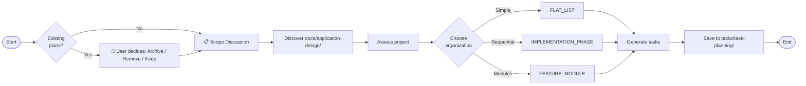

# Task Planning

Generate organized task planning documents from project documentation.

**Existing Plan Handling**: Before generating new plans, if existing documents are found in `tasks/task-planning/`, the user is prompted to choose: Archive, Remove All, or Keep as Is.

## Overview

1. **Handle Existing Plans** - User confirms: Archive / Remove / Keep
2. **Scope Discussion** - Interactive session to determine scope
3. **Discover Documents** - Read ALL markdown files from `docs/application-design/`
4. **Intelligently Assess** - AI evaluates project nature and scope
5. **Choose Organization** - Select structure (FLAT_LIST, IMPLEMENTATION_PHASE, FEATURE_MODULE)
6. **Generate Tasks** - Create tasks using TaskCreate tool
7. **Save Output** - Write to `tasks/task-planning/{descriptive-name}.md`

## Architecture



## Phase -1: Handle Existing Plans (User Confirmation)

**Before any user interaction**, check if `tasks/task-planning/` contains existing documents and ask the user how to handle them.

```bash
# Check for existing plans
ls -la tasks/task-planning/*.md 2>/dev/null | wc -l
```

### User Confirmation

If existing plans are found (count > 0), ask the user:

```python
AskUserQuestion(
    questions=[
        {
            "question": "Existing task plans found. How would you like to handle them?",
            "header": "Existing Plans",
            "multiSelect": False,
            "options": [
                {
                    "label": "Archive",
                    "description": "Move existing plans to history/Archive-TaskPlanning-{timestamp}/"
                },
                {
                    "label": "Remove All",
                    "description": "Delete all existing task planning documents"
                },
                {
                    "label": "Keep as Is",
                    "description": "Leave existing plans in place and create new plan alongside"
                }
            ]
        }
    ]
)
```

### Handle User Selection

```bash
# If user selected "Archive":
mkdir -p history
ARCHIVE_NAME="history/Archive-TaskPlanning-$(date +%Y%m%d-%H%M%S)"
mkdir -p "$ARCHIVE_NAME"
mv tasks/task-planning/*.md "$ARCHIVE_NAME/" 2>/dev/null

# If user selected "Remove All":
rm tasks/task-planning/*.md 2>/dev/null

# If user selected "Keep as Is":
# Do nothing - new plan will be created alongside existing plans
```

## Phase 0: Scope Discussion (Interactive)

**CRITICAL: Always start with this phase** - Have an interactive discussion to understand the scope.

### 0.1 Select Scope

Ask the user to select their planning scope:

```python
AskUserQuestion(
    questions=[
        {
            "question": "What is the scope of your task planning?",
            "header": "Scope",
            "multiSelect": False,
            "options": [
                {
                    "label": "From Scratch",
                    "description": "Build from ground up using TDD. Write tests FIRST, then implement. Red-Green-Refactor cycle."
                },
                {
                    "label": "Incomplete Features",
                    "description": "Complete missing features using TDD. Audit existing code, write regression tests, then add missing functionality."
                },
                {
                    "label": "Incomplete Testing",
                    "description": "Complete partial test suites. Audit existing tests, fix broken tests, fill coverage gaps to 80%."
                },
                {
                    "label": "Holistic Testing",
                    "description": "Full testing lifecycle from scratch: write → run → fix → debug. 80% coverage, 100% pass rate required."
                }
            ]
        }
    ]
)
```

### 0.2 Scope Reference Documents

**CRITICAL**: Before proceeding, read the appropriate reference document:

| Scope | Reference Document | Key Principle |
|-------|-------------------|---------------|
| **From Scratch** | `.claude/skills/task-planning/references/development-from-scratch.md` | Red → Green → Refactor |
| **Incomplete Features** | `.claude/skills/task-planning/references/development-incomplete-features.md` | Audit → Regression Tests → Gap Tests → Implement |
| **Incomplete Testing** | `.claude/skills/task-planning/references/incomplete-testing.md` | Audit Tests → Fix Baseline → Fill Gaps → Verify |
| **Holistic Testing** | `.claude/skills/task-planning/references/holistic-testing.md` | Write → Run → Fix → Debug |

### 0.3 Gather Additional Context

After scope selection, gather context:

```python
AskUserQuestion(
    questions=[
        {
            "question": "What level of detail is needed for each task?",
            "header": "Detail Level",
            "multiSelect": False,
            "options": [
                {"label": "High-Level", "description": "Brief overviews, fewer tasks (3-5 per phase)"},
                {"label": "Medium", "description": "Standard detail (5-8 tasks per phase)"},
                {"label": "Detailed", "description": "Granular tasks with subtasks (8+ per phase)"}
            ]
        }
    ]
)
```

## Phase 1: Document Discovery

```bash
# Discover ALL source materials
files = Glob("**/*.md", path="docs/application-design/")

# Read ALL documents and understand:
# - Project scope and goals
# - Features and requirements
# - Architecture and components
# - Integration points
# - Technical stack
# - Implementation status (for "Incomplete Features")
```

## Phase 2: Scope-Based Assessment

Based on the user's selected scope, read the corresponding reference document and tailor the assessment:

**For "From Scratch":**
- Read `.claude/skills/task-planning/references/development-from-scratch.md`
- Assess all phases, modules, and components
- Structure tasks using TDD cycle

**For "Incomplete Features":**
- Read `.claude/skills/task-planning/references/development-incomplete-features.md`
- Analyze existing codebase to identify gaps
- Include regression tests for existing code

**For "Incomplete Testing":**
- Read `.claude/skills/task-planning/references/incomplete-testing.md`
- Audit existing tests and generate coverage report
- Fix broken existing tests first
- Write missing tests to fill coverage gaps

**For "Holistic Testing":**
- Read `.claude/skills/task-planning/references/holistic-testing.md`
- Identify all testing levels needed
- Plan test infrastructure and fixtures

## Phase 3: Organization Decision

Choose the organization that best fits the project:

| Organization | Best For | Characteristics |
|--------------|----------|----------------|
| **FLAT_LIST** | Simple additions, single features | Linear work, clear dependencies, small scope |
| **IMPLEMENTATION_PHASE** | Phased projects, workflows | Clear temporal sequence (Phase 1 → Phase 2 → Phase 3) |
| **FEATURE_MODULE** | Complex applications, multi-component | Distinct functional areas developed in parallel |

**Note**: Organization is independent of Scope. Any scope can use any organization type.

## Phase 4: Task Generation

```python
# Create each task with TaskCreate
TaskCreate(
    subject="Implement user authentication",
    description="Build login form with email/password validation.",
    activeForm="Implementing user authentication"
)
```

## Output Format

Save to `tasks/task-planning/{descriptive-name}.md`:

```markdown
# Task List: {Project Name}

**Scope**: {From Scratch | Incomplete Features | Holistic Testing}
**Organization**: {FLAT_LIST | IMPLEMENTATION_PHASE | FEATURE_MODULE}
**Total Tasks**: {Count}

## Reference Document
**Instructions**: `.claude/skills/task-planning/references/{scope-reference}.md`

## Scope Selection
{User's selected scope and focus areas}

## Source Documents
{List of all docs/application-design/ files read}

## Project Context
{Brief summary}

## Task Breakdown
{Organized tasks following the reference document patterns}

## Task Summary
{Summary table}
```

## Quick Reference

### Scope Decision Tree

```
Is this for testing ONLY?
├── Yes → Do tests already exist?
│   ├── No → Holistic Testing (start from scratch)
│   └── Yes → Incomplete Testing (complete the suite)
└── No → Is this for NEW code or EXISTING code?
    ├── New code → From Scratch (TDD)
    └── Existing code → Incomplete Features (TDD)
```

### Organization Decision Tree

```
Is the work simple/linear?
├── Yes → FLAT_LIST
└── No → Does it have clear phases/stages?
    ├── Yes → IMPLEMENTATION_PHASE
    └── No → FEATURE_MODULE (distinct modules)
```

## Best Practices

1. **Always read the reference document** for the selected scope before generating tasks
2. **Keep tasks atomic** - Each task should be independently completable
3. **Limit category size** - 3-8 tasks per category
4. **Clear descriptions** - Define what "done" means
5. **Logical ordering** - Respect dependencies

## Related Skills

- **task-specification-generation**: Generates task specifications from planning documents
- **task-management**: Coordinates task execution using CLI commands
- **task-worker**: Executes tasks with worker-auditor workflow (auto-iteration)

---

*End of SKILL.md*
