# Survey Data Analysis & Visualization Workflow Design

## 1. Overview

### 1.1 Purpose
Design and implement an automated workflow for market research survey data analysis and visualization using LangGraph. The system processes PSPP survey data, applies AI-generated transformations, generates indicators, performs statistical analysis, and produces outputs in PowerPoint and HTML formats.

### 1.2 Scope
- **Input**: PSPP (.sav) survey data files
- **Processing**: AI-driven recoding, transformation, and indicator generation
- **Output**: PowerPoint presentations, HTML dashboards with visualizations
- **Target**: Market research industry professionals

### 1.3 Key Objectives
| Objective | Description |
|-----------|-------------|
| Automation | Minimize manual intervention in survey data processing |
| Intelligence | Leverage AI to generate meaningful recoding and grouping rules |
| Flexibility | Handle various survey structures and question types |
| Accuracy | Maintain statistical rigor with significance testing |
| Presentation | Deliver insights through multiple formats (PPT, HTML) |

---

## 2. Workflow Architecture

### 2.1 High-Level Pipeline

```mermaid
flowchart TD
    subgraph P1["**Phase 1: Extraction & Preparation**<br/>Ingest raw .sav data and prepare metadata"]
        direction TB
        S1["**Step 1**<br/>Extract .sav File<br/>(.sav file → raw data + metadata)"]
        S2["**Step 2**<br/>Transform Metadata<br/>(section-based → variable-centered)"]
        S3["**Step 3**<br/>Filter Metadata<br/>(remove variables not needing recoding)"]
        RAW["**Output**<br/>RAW DATA & FILTERED METADATA"]
        S1 --> S2
        S2 --> S3
        S3 -.-> RAW
    end

    subgraph P2["**Phase 2: New Variable Generation**<br/>AI generates, validates, and refines recoding rules"]
        direction TB
        S4["**Step 4**<br/>Generate Recoding Rules<br/>with Self-Verification 🔄<br/>(AI generates → validates → refines)"]
        S4b["**Step 4.6**<br/>Human Review: Rules 👤<br/>(semantic validation - optional)"]
        S5["**Step 5**<br/>Generate PSPP Syntax<br/>(convert rules to PSPP)"]
        S6["**Step 6**<br/>Execute PSPP<br/>(apply transformations)"]
        RECODED["**Output**<br/>RECODED DATA (NEW VARIABLES)"]
        S4 --> S4b
        S4b --> S5
        S5 --> S6
        S6 -.-> RECODED
    end

    subgraph P3["**Phase 3: Indicator Generation**<br/>Group variables into semantic indicators for analysis"]
        direction TB
        S7["**Step 7**<br/>Generate Indicators<br/>(AI groups variables)"]
        S7a["**Step 7.1**<br/>Human Review: Indicators 👤<br/>(analyst approves groupings)"]
        INDICATORS["**Output**<br/>INDICATORS (SEMANTIC GROUPS)"]
        S7 --> S7a
        S7a -.-> INDICATORS
    end

    subgraph P4["**Phase 4: Cross-Table Specification**<br/>Define and generate cross-tabulation tables"]
        direction TB
        S8["**Step 8**<br/>Generate Table Specs<br/>(define rows, columns, weighting)"]
        S8a["**Step 8.1**<br/>Human Review: Table Specs 👤<br/>(analyst approves structure)"]
        S9["**Step 9**<br/>Generate PSPP Syntax<br/>(convert specs to PSPP)"]
        S10["**Step 10**<br/>Execute PSPP<br/>(generate cross-tables)"]
        CROSSTAB["**Output**<br/>CROSS TABLES (.sav)"]
        S8 --> S8a
        S8a --> S9
        S9 --> S10
        S10 -.-> CROSSTAB
    end

    subgraph P4_5["**Phase 4.5: Statistical Analysis**<br/>Compute Chi-square statistics and effect sizes"]
        direction TB
        S10_5["**Step 10.5**<br/>Compute Chi-Square Stats<br/>(Python: scipy, pandas)"]
        STATS["**Output**<br/>TABLES WITH STATISTICS<br/>(χ², p-value, Cramer's V)"]
        S10_5 -.-> STATS
    end

    subgraph P5["**Phase 5: Significant Tables Selection**<br/>Filter tables by effect strength and sample size"]
        direction TB
        S11["**Step 11**<br/>Filter Significant Tables<br/>(Cramer's V ≥ 0.1, count ≥ 30)"]
        SIGNIFICANT["**Output**<br/>SIGNIFICANT TABLES ONLY"]
        S11 -.-> SIGNIFICANT
    end

    subgraph P6["**Phase 6: Presentation**<br/>Generate final deliverables for stakeholders"]
        direction TB
        S12["**Step 12**<br/>Generate PowerPoint<br/>(.pptx with charts)"]
        S13["**Step 13**<br/>Generate HTML Dashboard<br/>(interactive web view)"]
        OUTPUTS["**Output**<br/>FINAL OUTPUTS<br/>(.pptx + .html)"]
        S12 -.-> OUTPUTS
        S13 -.-> OUTPUTS
    end

    RAW ==> S4
    RECODED ==> S7
    INDICATORS ==> S8
    CROSSTAB ==> S10_5
    STATS ==> S11
    SIGNIFICANT ==> S12
    SIGNIFICANT ==> S13
```



### 2.2 Phase Descriptions

| Phase | Name | Purpose | Input | Output |
|-------|------|---------|-------|--------|
| **1** | Extraction & Preparation | Ingest raw .sav data and prepare metadata for AI processing | .sav file (PSPP/SPSS format) | Raw data, variable metadata |
| **2** | New Variable Generation | AI generates, validates, and iteratively refines recoding rules; creates new variables through PSPP | Filtered metadata, AI rules | Recoded dataset with new variables |
| **3** | Indicator Generation | Group variables into semantic indicators for analysis | Recoded variables | Indicator definitions |
| **4** | Cross-Table Generation | Define and generate cross-tabulation tables with weighting | Indicators, table specs | Cross-table contingency tables |
| **4.5** | Statistical Analysis | Compute Chi-square statistics and effect sizes for all tables | Cross-table tables, recoded data | Tables with Chi-square statistics |
| **5** | Significant Tables Selection | Filter tables by Cramer's V effect size and minimum sample count | Tables with statistics | Significant tables only |
| **6** | Presentation | Generate final deliverables for stakeholders | Significant tables | PowerPoint, HTML dashboard |

### 2.3 Data Evolution Through Phases

```mermaid
flowchart LR
    %% Define styles
    classDef inputFileStyle fill:#e1f5fe,stroke:#01579b,stroke-width:3px,color:#000
    classDef traditionalStyle fill:#e8f5e9,stroke:#2e7d32,stroke-width:2px,color:#000
    classDef aiStyle fill:#f3e5f5,stroke:#7b1fa2,stroke-width:3px,color:#000
    classDef dataFileStyle fill:#fff3e0,stroke:#ef6c00,stroke-width:2px,color:#000
    classDef outputStyle fill:#c8e6c9,stroke:#1b5e20,stroke-width:3px,color:#000

    %% Phase 1: Extraction & Preparation
    subgraph P1["Phase 1: Extraction & Preparation"]
        direction TB
        sav1(["📁 .sav File<br/>(Input)"]):::inputFileStyle
        rawData["raw_data<br/>(DataFrame)"]:::traditionalStyle
        origMeta["original_metadata"]:::traditionalStyle
        varMeta["variable_centered_metadata"]:::traditionalStyle
        filtMeta["filtered_metadata"]:::traditionalStyle
        filtOut["filtered_out_variables"]:::traditionalStyle
    end

    %% Phase 2: New Variable Generation
    subgraph P2["Phase 2: New Variable Generation"]
        direction TB
        recodingRules["recoding_rules<br/>(JSON)"]:::aiStyle
        validationResults["validation_results"]:::traditionalStyle
        psppRecodeSyntax["pspp_recoding_syntax<br/>(.sps)"]:::traditionalStyle
        sav2(["📁 recoded_data.sav"]):::dataFileStyle
    end

    %% Phase 3: Indicator Generation
    subgraph P3["Phase 3: Indicator Generation"]
        direction TB
        indicators["indicators<br/>(JSON)"]:::aiStyle
    end

    %% Phase 4: Cross-Table Generation
    subgraph P4["Phase 4: Cross-Table Generation"]
        direction TB
        tableSpecs["table_specifications<br/>(JSON)"]:::aiStyle
        weightVar["weighting_variable"]:::traditionalStyle
        psppTableSyntax["pspp_table_syntax<br/>(.sps)"]:::traditionalStyle
        sav3(["📁 cross_table.sav"]):::dataFileStyle
    end

    %% Phase 4.5 & 5: Statistical Analysis & Filtering
    subgraph P5["Phase 4.5-5: Statistical Analysis"]
        direction TB
        allTables["all_small_tables<br/>(with Chi-Square)"]:::traditionalStyle
        sigTables["significant_tables<br/>(filtered)"]:::traditionalStyle
    end

    %% Phase 6: Presentation
    subgraph P6["Phase 6: Presentation"]
        direction TB
        ppt(["📊 .pptx"]):::outputStyle
        html(["🌐 .html"]):::outputStyle
    end

    %% Data flow edges
    sav1 -->|Step 1| rawData
    sav1 -->|Step 1| origMeta
    origMeta -->|Step 2| varMeta
    varMeta -->|Step 3| filtMeta
    varMeta -->|Step 3| filtOut
    filtMeta -->|Step 4| recodingRules
    recodingRules -->|Step 4| validationResults
    recodingRules -->|Step 5| psppRecodeSyntax
    sav1 ==>|Step 6<br/>input| sav2
    psppRecodeSyntax -.->|Step 6<br/>syntax| sav2
    varMeta ==>|Step 7| indicators
    indicators -->|Step 8| tableSpecs
    varMeta -->|Step 8| weightVar
    tableSpecs -->|Step 9| psppTableSyntax
    sav2 ==>|Step 10<br/>input| sav3
    psppTableSyntax -.->|Step 10<br/>syntax| sav3
    sav2 ==>|Step 10.5| allTables
    indicators ==>|Step 10.5| allTables
    tableSpecs ==>|Step 10.5| allTables
    weightVar ==>|Step 10.5| allTables
    allTables -->|Step 11| sigTables
    sigTables -->|Step 12| ppt
    sigTables -->|Step 13| html
```



**Legend:**

| Style | Meaning | Examples |
|-------|---------|----------|
| 🔵 **Input File** | Original input data file | `.sav` file |
| 🟢 **Traditional Programming** | Deterministic processing (Python, PSPP, scipy) | `raw_data`, `variable_centered_metadata`, `pspp_recoding_syntax`, `all_small_tables`, `.pptx`, `.html` |
| 🟣 **AI Processing** | LLM/AI-generated artifacts with self-verification | `recoding_rules`, `indicators`, `table_specifications` |
| 🟠 **Data File (.sav)** | Survey data files generated by PSPP | `recoded_data.sav`, `cross_table.sav` |

**Key Observations:**

1. **AI-Driven Nodes** (3 nodes): Steps 4, 7, and 8 use AI agents to generate intelligent rules and groupings with built-in self-verification
2. **Traditional Programming** (13 nodes): All other steps use deterministic Python/PSPP processing
3. **Hybrid Approach**: The workflow combines AI for semantic understanding with traditional programming for statistical rigor
4. **Step 10.5 is data-intensive**: Consumes both data files (`recoded_data.sav`) and multiple metadata sources (`indicators`, `table_specifications`, `weighting_variable`)
5. **Dashed lines** (`.-.->`): Indicate syntax/control flow (not direct data dependency)

### 2.4 LangGraph State Management

The workflow maintains a single state object that evolves through each node. To reduce complexity, state fields are organized into functionally-specific sub-states.

```python
from typing import TypedDict, List, Dict, Any, Optional
from pandas import DataFrame

# ============================================================================
# FUNCTION-SPECIFIC SUB-STATES
# ============================================================================

class InputState(TypedDict):
    """Initial input configuration"""
    spss_file_path: str                      # Path to input .sav file
    config: Dict[str, Any]                   # Configuration parameters


class ExtractionState(TypedDict):
    """Data extraction and preparation - Step 1-3"""
    raw_data: DataFrame                      # Extracted survey data
    original_metadata: Dict[str, Any]        # Raw metadata from pyreadstat
    variable_centered_metadata: List[Dict]   # Metadata grouped by variable
    filtered_metadata: List[Dict]            # Metadata after filtering
    filtered_out_variables: List[Dict]       # Variables removed + reasons


class RecodingState(TypedDict):
    """New variable generation through AI-driven recoding - Step 4-6"""
    recoding_rules: Dict[str, Any]           # AI-generated recoding rules
    recoding_rules_json_path: str            # Saved recoding rules file
    self_correction_iterations: int           # Number of self-correction iterations used
    max_self_correction_iterations: int      # Maximum allowed (default: 3)
    validation_results: Dict[str, Any]       # Automated validation results
    recoding_rules_approved: bool            # Human approval status
    pspp_recoding_syntax: str                # Generated PSPP syntax
    pspp_recoding_syntax_path: str           # Saved syntax file
    recoded_data_path: str                   # Path to recoded dataset


class IndicatorState(TypedDict):
    """Indicator generation and semantic grouping - Step 7"""
    indicator_metadata: List[Dict]           # Metadata for indicator generation
    indicators: List[Dict[str, Any]]         # Generated indicators
    indicators_json_path: str                # Saved indicators file
    indicators_approved: bool                # Human approval status


class CrossTableState(TypedDict):
    """Cross-table specification and generation - Step 8-10"""
    table_specifications: Dict[str, Any]     # Table structure definitions
    table_specs_json_path: str               # Saved table specs
    weighting_variable: Optional[str]        # Weighting variable for cross-tables
    table_specs_approved: bool               # Human approval status
    pspp_table_syntax: str                   # Generated cross-table syntax
    pspp_table_syntax_path: str              # Saved syntax file
    cross_table_sav_path: str                # Exported cross-table file


class StatisticalAnalysisState(TypedDict):
    """Chi-square statistics and effect size computation - Step 10.5"""
    all_small_tables: List[Dict]             # All tables with chi-square stats


class FilteringState(TypedDict):
    """Significant tables selection by effect size - Step 11"""
    significant_tables: List[Dict]           # Tables filtered by Cramer's V + count
    significant_tables_json_path: str        # Saved filtered tables


class PresentationState(TypedDict):
    """Final output generation - Step 12-13"""
    powerpoint_path: str                     # Generated PowerPoint file
    html_dashboard_path: str                 # Generated HTML dashboard
    charts_generated: List[Dict]             # Chart metadata


class ApprovalState(TypedDict):
    """Human-in-the-loop approval tracking (crosses all steps)"""
    approval_comments: List[Dict]            # Human feedback and comments
    pending_approval_step: Optional[str]     # Current step awaiting review


class TrackingState(TypedDict):
    """Execution tracking (crosses all steps)"""
    execution_log: List[Dict]                # Step-by-step execution log
    errors: List[str]                        # Error messages
    warnings: List[str]                      # Warning messages


# ============================================================================
# COMBINED WORKFLOW STATE
# ============================================================================

class WorkflowState(
    InputState,
    ExtractionState,
    RecodingState,
    IndicatorState,
    CrossTableState,
    StatisticalAnalysisState,
    FilteringState,
    PresentationState,
    ApprovalState,
    TrackingState,
    total=False
):
    """
    Combined workflow state that inherits all functionally-specific sub-states.

    Using `total=False` allows fields to be optional, populated only when
    their respective step completes. This reduces state complexity and
    improves debugging by clearly indicating which function each field belongs to.

    Example usage in nodes:
        def extract_spss_node(state: WorkflowState) -> WorkflowState:
            state["raw_data"] = df  # ExtractionState field
            state["original_metadata"] = meta  # ExtractionState field
            return state
    """
    pass
```

**State Evolution by Step:**

| Step | Sub-State | Key Fields Added |
|------|-----------|------------------|
| 0 | `InputState` | `spss_file_path`, `config` |
| 1-3 | `ExtractionState` | `raw_data`, `variable_centered_metadata`, `filtered_metadata` |
| 4-6 | `RecodingState` | `recoding_rules`, `recoded_data_path`, `validation_results` |
| 7 | `IndicatorState` | `indicators`, `indicator_metadata` |
| 8-10 | `CrossTableState` | `table_specifications`, `pspp_table_syntax`, `cross_table_sav_path` |
| 10.5 | `StatisticalAnalysisState` | `all_small_tables` (with chi-square stats) |
| 11 | `FilteringState` | `significant_tables` (filtered) |
| 12-13 | `PresentationState` | `powerpoint_path`, `html_dashboard_path` |
| All | `ApprovalState` | `approval_comments`, `pending_approval_step` |
| All | `TrackingState` | `execution_log`, `errors`, `warnings` |

---

## 3. Detailed Step Specifications

### Step 1: Extract .sav File

**Node**: `extract_spss_node`

**Description**: Read .sav file (SPSS/PSPP format) and extract raw data with metadata

**Input**:
- `spss_file_path`: Path to .sav file

**Output**:
- `raw_data`: DataFrame with survey responses
- `original_metadata`: Dict containing:
  - `variable_labels`: Dict of {var_name: var_label}
  - `value_labels`: Dict of {var_name: {value: label}}
  - `variable_types`: Dict of {var_name: type}
  - `variable_measurements`: Dict of {var_name: measurement_level}

**Implementation**:
```python
import pyreadstat

def extract_spss_node(state: WorkflowState) -> WorkflowState:
    df, meta = pyreadstat.read_sav(
        state["spss_file_path"],
        apply_value_formats=True,
        metadataonly=False
    )

    state["raw_data"] = df
    state["original_metadata"] = {
        "variable_labels": meta.variable_labels,
        "value_labels": meta.value_labels,
        "variable_types": meta.variable_types,
        "variable_measurements": meta.variable_measurements
    }
    state["execution_log"].append({
        "step": "extract_spss",
        "status": "completed",
        "rows": len(df),
        "columns": len(df.columns)
    })

    return state
```

---

### Step 2: Transform Metadata

**Node**: `transform_metadata_node`

**Description**: Convert metadata from section-based to variable-centered format for AI consumption

**Input**:
- `original_metadata`: Section-based metadata

**Output**:
- `variable_centered_metadata`: List of variable entries:
  ```python
  [
      {
          "name": "age",
          "label": "Respondent Age",
          "type": "numeric",
          "measurement": "scale",
          "values": [
              {"value": 1, "label": "18-24"},
              {"value": 2, "label": "25-34"},
              ...
          ]
      },
      ...
  ]
  ```

**Rationale**: AI agents digest variable-centered format more efficiently than separate variable and value sections

---

### Step 3: Preliminary Filtering

**Node**: `preliminary_filter_node`

**Description**: Filter out variables that don't need recoding to reduce AI context

**Input**:
- `variable_centered_metadata`
- `config` containing:
  - `cardinality_threshold`: Max distinct values (default: 30)
  - `filter_binary`: Whether to filter binary variables (default: true)
  - `filter_other_text`: Whether to filter "other" text fields (default: true)

**Filtering Rules**:

| Rule | Condition | Reason |
|------|-----------|--------|
| Binary variables | Exactly 2 distinct values | No room for recoding |
| High cardinality | Distinct values > threshold | Typically IDs, open-ended |
| Other text fields | Name contains "other" AND type is character | Open-ended feedback |

**Output**:
- `filtered_metadata`: Variables passing filters
- `filtered_out_variables`: Excluded variables with reasons

---

### Step 4: Generate Recoding Rules with Self-Verification

**Node**: `generate_recoding_rules_node`

**Description**: AI agent generates recoding rules with built-in self-verification loop. The agent validates its own output using Python scripts and iteratively refines until all checks pass.

**Architecture**:
```
┌─────────────────────────────────────────────────────────────┐
│              Self-Verifying AI Agent                         │
├─────────────────────────────────────────────────────────────┤
│                                                              │
│  ┌─────────────┐    ┌─────────────┐    ┌─────────────┐     │
│  │  Generate   │───▶│  Validate   │───▶│  All Valid? │     │
│  │  (LLM)      │    │  (Python)   │    │  (check)    │     │
│  └─────────────┘    └─────────────┘    └──────┬──────┘     │
│                                                 │            │
│                                    ┌────────────▼─────────┐ │
│                                    │  Iteration Loop       │ │
│                                    │  (max 3 times)        │ │
│                                    └────────────┬─────────┘ │
│                                                 │            │
│                              ┌──────────────────▼───────┐  │
│                              │  Output Validated Rules  │  │
│                              └───────────────────────────┘  │
└─────────────────────────────────────────────────────────────┘
```

**Input**:
- `filtered_metadata`
- `config["recoding_instructions"]`: Custom instructions for AI
- `config["max_self_correction_iterations"]`: Max iterations (default: 3)

**Self-Verification Loop Algorithm**:
```python
def generate_recoding_rules_node(state: WorkflowState) -> WorkflowState:
    from scripts.survey_analysis import SelfVerifyingRecodingAgent, VariableMetadata

    # Convert metadata
    metadata = [VariableMetadata(**v) for v in state["filtered_metadata"]]

    # Initialize self-verifying agent
    agent = SelfVerifyingRecodingAgent(
        llm_client=state.get("llm_client"),
        max_iterations=state["config"].get("max_self_correction_iterations", 3)
    )

    # Self-verification loop (up to max_iterations)
    for iteration in range(1, max_iterations + 1):
        # 1. Generate rules (or refine if iteration > 1)
        rules = agent._generate_with_llm(
            prompt=agent._build_generation_prompt(
                metadata=metadata,
                iteration=iteration,
                previous_result=state.get("last_validation_result")
            ),
            metadata=metadata
        )

        # 2. Validate using Python
        validator = RuleValidator(metadata)
        validation_result = validator.validate_all_rules(rules)

        # 3. Check if all checks passed
        if validation_result.is_valid:
            state["recoding_rules"] = {"recoding_rules": [r.dict() for r in rules]}
            state["validation_results"] = validation_result.dict()
            state["self_correction_iterations"] = iteration
            state["execution_log"].append({
                "step": "generate_recoding_rules",
                "status": "completed",
                "iterations_used": iteration,
                "validation_passed": True
            })
            break  # Exit loop - rules are valid

        # 4. If failed, store for next iteration
        state["last_validation_result"] = {
            "rules": rules,
            "validation_result": validation_result
        }
        # Loop continues with feedback in prompt

    return state
```

**Validation Checks Performed** (Python-based):

| # | Check | Description |
|---|-------|-------------|
| 1 | Source variables exist | Referenced variables must exist in metadata |
| 2 | Target conflicts | Warn if target variables already exist |
| 3 | Range validity | For range rules: start ≤ end |
| 4 | No duplicate targets | Each target variable must be unique |
| 5 | Transformation completeness | All transformations must have source values |
| 6 | Target uniqueness | Target values must be unique within each rule |
| 7 | Source overlap | Source values must not overlap within a rule |

**AI Prompt with Feedback**:

On first iteration:
```python
prompt = f"""
You are a market research data expert. Given survey variable metadata,
generate intelligent recoding rules.

PRINCIPLES:
1. Group continuous variables into meaningful ranges
2. Recode detailed categorical variables into broader groups
3. Create derived variables when semantically meaningful
4. Apply Top 2 Box / Top 3 Box for satisfaction ratings

INPUT METADATA:
{filtered_metadata}

OUTPUT FORMAT (JSON):
{{
    "recoding_rules": [
        {{
            "source_variable": "age",
            "target_variable": "age_group",
            "rule_type": "range",
            "transformations": [
                {{"source": [18, 24], "target": 1, "label": "18-24"}},
                {{"source": [25, 34], "target": 2, "label": "25-34"}}
            ]
        }}
    ]
}}
"""
```

On subsequent iterations (after validation failure):
```python
prompt = f"""
## Previous Iteration Feedback (Iteration {iteration - 1})

Your previous attempt had the following validation errors:

**Errors:**
1. Source variable 'nonexistent_var' not found in metadata
2. Invalid range: [24, 18] - start > end
3. Duplicate target variables: ['duplicate_target']

**Warnings:**
(None)

## Instructions for This Iteration

Please generate new recoding rules that address ALL of the errors above:

1. Use only source variables that exist in the provided metadata
2. Ensure all ranges are valid (start value ≤ end value)
3. Ensure each target variable name is unique
4. Ensure all transformations are complete and non-overlapping

[Original prompt with metadata...]
"""
```

**Output**:
- `recoding_rules`: JSON structure with recoding definitions
- `recoding_rules_json_path`: Saved rules file
- `validation_results`: Validation results from final iteration
- `self_correction_iterations`: Number of iterations used

**Implementation Notes**:
- Max iterations default is 3 to prevent infinite loops
- Each iteration adds validation errors to the AI prompt
- The agent learns from its mistakes through structured feedback
- Human review (Step 4.6) becomes optional for semantic validation only
- All objective validation is handled automatically by this step

---

### Step 4.5: Validate Recoding Rules

**Node**: ~~`validate_recoding_rules_node`~~

**Status**: ✅ **DEPRECATED** - Now integrated into `generate_recoding_rules_node` (Step 4)

**Rationale**: The validation logic has been moved inside the AI agent as part of the self-verification loop. This allows the AI to:

1. **Automatically fix its own mistakes** - No manual intervention for objective errors
2. **Faster iteration** - Seconds per iteration instead of minutes/hours
3. **Reduce human workload** - Only semantic validation requires human review

**Legacy Validation Checks** (now performed in Step 4):

| # | Check | Description |
|---|-------|-------------|
| 1 | Source variables exist | Referenced variables must exist in metadata |
| 2 | Target conflicts | Warn if target variables already exist |
| 3 | Range validity | For range rules: start ≤ end |
| 4 | No duplicate targets | Each target variable must be unique |
| 5 | Transformation completeness | All transformations must have source values |
| 6 | Target uniqueness | Target values must be unique within each rule |
| 7 | Source overlap | Source values must not overlap within a rule |

**Implementation** (see Step 4):
The validation is now performed by `RuleValidator` class within the self-verification loop in Step 4.

---

### Step 4.6: Human Review - Recoding Rules (Optional)

**Node**: `human_review_recoding_rules_node`

**Description**: Human analyst reviews AI-generated recoding rules for **semantic validation**. This step is now **optional** since objective validation is handled automatically in Step 4.

**Purpose**: Review for business logic appropriateness, research alignment, and domain-specific considerations that cannot be programmatically validated.

**Input**:
- `recoding_rules`: AI-generated and validated recoding rules
- `validation_results`: Automated validation results from Step 4
- `filtered_metadata`: Original variable metadata
- `config`: Configuration parameters

**Human Review Interface**:
```python
from typing import Literal

def human_review_recoding_rules_node(state: WorkflowState) -> WorkflowState:
    """
    Pauses workflow for human review of recoding rules.
    Displays rules in a readable format and waits for approval.
    """
    # Generate human-readable report
    review_report = generate_recoding_review_report(
        state["recoding_rules"],
        state["validation_results"],
        state["filtered_metadata"]
    )

    # Save report for human review
    report_path = f"{state['config']['output_dir']}/recoding_rules_review.md"
    with open(report_path, "w") as f:
        f.write(review_report)

    # Mark workflow as waiting for approval
    state["pending_approval_step"] = "recoding_rules"
    state["execution_log"].append({
        "step": "human_review_recoding_rules",
        "status": "awaiting_approval",
        "report_path": report_path
    })

    # Use LangGraph's interrupt mechanism to pause execution
    # This halts the workflow and waits for human input
    approval_decision = interrupt({
        "type": "approval_required",
        "step": "recoding_rules_review",
        "report_path": report_path,
        "message": "Please review the recoding rules and provide approval decision",
        "options": ["approve", "reject", "modify"]
    })

    # Process the approval decision
    decision = approval_decision.get("decision")
    comments = approval_decision.get("comments", "")
    modified_rules = approval_decision.get("modified_rules", None)

    if decision == "approve":
        state["recoding_rules_approved"] = True
        state["approval_comments"].append({
            "step": "recoding_rules",
            "decision": "approved",
            "comments": comments,
            "timestamp": datetime.now().isoformat()
        })
    elif decision == "reject":
        state["recoding_rules_approved"] = False
        state["approval_comments"].append({
            "step": "recoding_rules",
            "decision": "rejected",
            "comments": comments,
            "timestamp": datetime.now().isoformat()
        })
        # Set state to return to Step 4 (rule generation)
        state["pending_approval_step"] = "recoding_rules_rejected"
    elif decision == "modify":
        # Apply modified rules directly
        if modified_rules:
            state["recoding_rules"] = modified_rules
            state["recoding_rules_approved"] = True
            state["approval_comments"].append({
                "step": "recoding_rules",
                "decision": "modified",
                "comments": comments,
                "timestamp": datetime.now().isoformat()
            })

    # Clear pending approval after processing
    if state["recoding_rules_approved"]:
        state["pending_approval_step"] = None

    return state
```

**LangGraph Interrupt Mechanism**:

The workflow uses LangGraph's `interrupt()` function to implement human-in-the-loop functionality:

1. **Pause**: When `interrupt()` is called, the workflow execution halts at that point
2. **State Preservation**: The entire workflow state is preserved, including all intermediate results
3. **Human Input**: The system waits for human input through one of:
   - **CLI Interface**: Command-line prompts for terminal users
   - **Web Interface**: REST API endpoints for web dashboards
   - **API Callback**: Programmatic approval via API calls
4. **Resume**: Once approval is received, the workflow resumes from the exact point where it paused
5. **Decision Processing**: The approval decision (approve/reject/modify) is processed and state is updated accordingly

**State Management for Approval/Rejection Flow**:

```python
# In the workflow graph definition, add conditional edges
from langgraph.graph import StateGraph, END

def check_recoding_rules_approval(state: WorkflowState) -> str:
    """Check if recoding rules were approved or need regeneration."""
    if state.get("recoding_rules_approved", False):
        return "approved"
    elif state.get("pending_approval_step") == "recoding_rules_rejected":
        return "regenerate"
    else:
        return "wait_for_approval"

# Workflow graph setup
workflow.add_conditional_edges(
    "human_review_recoding_rules",
    check_recoding_rules_approval,
    {
        "approved": "generate_pspp_recoding_syntax",  # Continue to next step
        "regenerate": "generate_recoding_rules",      # Loop back to regenerate
        "wait_for_approval": END                       # Stay paused
    }
)
```

**Review Report Format**:
```markdown
# Recoding Rules Review Report

## Validation Summary
- Total Rules: 12
- Errors: 0
- Warnings: 2

## Rules for Review

### Rule 1: Age Grouping
- **Source**: age (continuous, 18-99)
- **Target**: age_group
- **Type**: Range grouping
- **Transformations**:
  | Source Range | Target | Label |
  |--------------|--------|-------|
  | 18-24 | 1 | 18-24 |
  | 25-34 | 2 | 25-34 |
  | 35-44 | 3 | 35-44 |
  | 45-54 | 4 | 45-54 |
  | 55-99 | 5 | 55+ |

⚠️ **Warning**: Target variable 'age_group' already exists (will be overwritten)

### Rule 2: Satisfaction Top 2 Box
- **Source**: q5_rating (1-10 scale)
- **Target**: q5_rating_top2box
- **Type**: Derived (Top Box)
- **Transformations**:
  | Source Values | Target | Label |
  |---------------|--------|-------|
  | 9-10 | 1 | Top 2 Box |
  | 1-8 | 0 | Others |

---
## Approval Required
Please review the rules above and provide your decision:

**Options**:
- **APPROVE** - Apply these recoding rules as-is
- **REJECT** - Reject all rules and regenerate with feedback
- **MODIFY** - Edit specific rules in the attached JSON and resubmit

**Feedback/Comments**:
[Please provide your decision and any comments for rejection/modification]

If rejecting, please specify:
- Which rules are problematic
- Why they need revision
- Suggestions for improvement
```

**Rejection with Feedback Workflow**:

When a human reviewer rejects the recoding rules (Step 4.6):

1. **Rejection Decision**: Human selects "REJECT" and provides feedback
2. **State Update**: `recoding_rules_approved = False`, comments stored in `approval_comments`
3. **Loop Back**: Workflow returns to Step 4 (`generate_recoding_rules_node`)
4. **Feedback Integration**: The AI agent receives the previous rules + human feedback
5. **Regeneration with Self-Verification**: AI generates new rules addressing the feedback and automatically validates them
6. **Re-review**: Step 4.6 presents new rules for approval

**Note**: Steps 6 and 7 from the old workflow (separate validation step) are no longer needed since Step 4 now includes automatic self-verification.

```python
# Example feedback integration in Step 4
def generate_recoding_rules_node(state: WorkflowState) -> WorkflowState:
    # Check if this is a regeneration due to rejection
    previous_feedback = None
    for comment in reversed(state.get("approval_comments", [])):
        if comment.get("step") == "recoding_rules" and comment.get("decision") == "rejected":
            previous_feedback = comment
            break

    # Build prompt with feedback context
    if previous_feedback:
        feedback_context = f"""
PREVIOUS ATTEMPT REJECTED:
{json.dumps(state['recoding_rules'], indent=2)}

HUMAN FEEDBACK:
{previous_feedback['comments']}

Please generate new recoding rules that address the feedback above.
"""
    else:
        feedback_context = ""

    # Generate rules with feedback context
    prompt = base_recoding_prompt + feedback_context
    # ... rest of generation logic
```

**Implementation Notes**:
- Uses LangGraph's `interrupt()` mechanism to pause execution
- Human provides approval via CLI, web interface, or API
- If rejected: workflow returns to Step 4 with detailed feedback
- If modified: workflow applies edited rules and continues to Step 5
- Auto-approval can be enabled via `config["auto_approve_recoding"] = True`
- All approval decisions are logged with timestamps in `approval_comments`
- Feedback from rejections is automatically incorporated into subsequent AI generations

**Output**:
- `recoding_rules_approved`: `True` if approved, `False` if rejected
- `approval_comments`: List of human feedback and decisions with timestamps
- `pending_approval_step`: `None` (cleared after approval) or step to loop back to

---

### Step 5: Generate PSPP Recoding Syntax

**Node**: `generate_pspp_recoding_syntax_node`

**Description**: Parse recoding rules JSON and generate PSPP syntax

**Input**:
- `recoding_rules`
- `recoded_data_path`: Where to save recoded data

**PSPP Syntax Example**:
```spss
* Recoding rules generated by AI agent.
GET FILE='{input_path}'.
EXECUTE.

* Age grouping.
RECODE age (18 THRU 24=1) (25 THRU 34=2) (35 THRU 44=3) (45 THRU 54=4) (55 THRU 99=5) INTO age_group.
VARIABLE LABELS age_group 'Respondent Age Group'.
VALUE LABELS age_group 1 '18-24' 2 '25-34' 3 '35-44' 4 '45-54' 5 '55+'.
EXECUTE.

* Top 2 Box for satisfaction rating.
RECODE q5_rating (1 THRU 8=0) (9 THRU 10=1) INTO q5_rating_top2box.
VARIABLE LABELS q5_rating_top2box 'Satisfaction - Top 2 Box'.
VALUE LABELS q5_rating_top2box 0 'Others' 1 'Top 2 Box'.
EXECUTE.

SAVE OUTFILE='{recoded_data_path}'.
```

**Output**:
- `pspp_recoding_syntax`: Complete PSPP syntax string
- `pspp_recoding_syntax_path`: Saved syntax file

---

### Step 6: Execute PSPP Recoding

**Node**: `execute_pspp_recoding_node`

**Description**: Run PSPP to apply recoding rules

**Input**:
- `pspp_recoding_syntax_path`
- `spss_file_path` (input)
- `recoded_data_path` (output)

**Implementation**:
```python
import subprocess

def execute_pspp_recoding_node(state: WorkflowState) -> WorkflowState:
    cmd = [
        "pspp",
        state["pspp_recoding_syntax_path"],
        "-o", state["recoded_data_path"]
    ]

    result = subprocess.run(cmd, capture_output=True, text=True)

    if result.returncode != 0:
        state["errors"].append(f"PSPP execution failed: {result.stderr}")
    else:
        state["execution_log"].append({
            "step": "execute_pspp_recoding",
            "status": "completed"
        })

    return state
```

**Output**:
- `recoded_data_path`: Path to dataset with original + recoded variables

---

### Step 7: Generate Indicators

**Node**: `generate_indicators_node`

**Description**: AI agent groups variables into semantic indicators

**Input**:
- `variable_centered_metadata` (including recoded variables)
- `config["indicator_instructions"]`: Custom instructions

**Multi-Variable Indicator Handling**:

Indicators with multiple underlying variables are handled differently based on their `metric` type:

| Metric | Variable Type | Output Structure | Use Case |
|--------|---------------|------------------|----------|
| **average** | Rating scales (numeric) | Each variable = ONE ROW in crosstab | Matrix questions where each attribute is rated separately (e.g., satisfaction on 1-10 scale for 10 attributes) |
| **percentage** | Binary (0/1) | Combined as MULTIPLE RESPONSE SET | Multiple response questions where respondents select all that apply (e.g., "Which brands have you heard of?") |
| **distribution** | Categorical (multiple options) | Each variable = ONE SEPARATE TABLE | Categorical questions that need separate analysis (e.g., region preference for each brand) |

**Example Output Structures**:

*Scenario 1 (average)* - Matrix rating with one row per variable:
```
Product Satisfaction by Age Group
┌─────────────────────┬───────┬───────┬───────┐
│ Attribute           │ 18-24 │ 25-34 │ 35-44 │
├─────────────────────┼───────┼───────┼───────┤
│ Quality (q5a)       │  8.2  │  7.8  │  7.5  │
│ Service (q5b)       │  7.5  │  7.9  │  8.1  │
│ Value (q5c)        │  7.1  │  7.4  │  7.6  │
└─────────────────────┴───────┴───────┴───────┘
```

*Scenario 2 (percentage)* - Multiple response set:
```
Brands Aware by Gender
┌──────────┬───────┬───────┐
│ Brand    │ Male  │ Female│
├──────────┼───────┼───────┤
│ Brand A  │  45%  │  52%  │
│ Brand B  │  38%  │  41%  │
│ Brand C  │  22%  │  18%  │
└──────────┴───────┴───────┘
```

*Scenario 3 (distribution)* - Separate tables per variable:
```
Table 1: Region for Brand A Preference        Table 2: Region for Brand B Preference
┌─────────┬────┬────┬────┐                ┌─────────┬────┬────┬────┐
│ Region  │ N  │ S  │ E  │                │ Region  │ N  │ S  │ E  │
├─────────┼────┼────┼────┤                ├─────────┼────┼────┼────┤
│ Urban   │ 30 │ 25 │ 20 │                │ Urban   │ 15 │ 18 │ 22 │
│ Rural   │ 20 │ 15 │ 10 │                │ Rural   │ 25 │ 20 │ 18 │
└─────────┴────┴────┴────┘                └─────────┴────┴────┴────┘
```

**AI Prompt Template**:
```
You are a market research analyst. Group variables into semantic indicators.

PRINCIPLES:
1. Single variable = indicator if semantically meaningful (e.g., age, gender)
2. Multiple variables = one indicator if they measure a construct
3. Define appropriate metric for each indicator:
   - Distribution: For categorical variables with multiple options
   - Average: For rating scale variables (numeric, e.g., 1-10)
   - Percentage: For binary/Top Box variables (0/1, multiple response)

INPUT METADATA:
{indicator_metadata}

OUTPUT FORMAT (JSON):
{
    "indicators": [
        {
            "id": "IND_001",
            "name": "Age Group",
            "description": "Respondent age distribution",
            "metric": "distribution",
            "underlying_variables": ["age_group"],
            "question_type": "single_select"
        },
        {
            "id": "IND_002",
            "name": "Product Satisfaction",
            "description": "Overall satisfaction with product attributes (Scenario 1: average)",
            "metric": "average",
            "underlying_variables": [
                "q5a_rating", "q5b_rating", "q5c_rating",
                "q5d_rating", "q5e_rating", "q5f_rating",
                "q5g_rating", "q5h_rating", "q5i_rating", "q5j_rating"
            ],
            "question_type": "matrix_rating"
        },
        {
            "id": "IND_003",
            "name": "Brand Awareness",
            "description": "Which brands have you heard of? (Scenario 2: percentage)",
            "metric": "percentage",
            "underlying_variables": [
                "brand_a_aware", "brand_b_aware", "brand_c_aware"
            ],
            "question_type": "multiple_response"
        },
        {
            "id": "IND_004",
            "name": "Brand Preference by Region",
            "description": "Region preference for each brand (Scenario 3: distribution)",
            "metric": "distribution",
            "underlying_variables": [
                "brand_a_region", "brand_b_region", "brand_c_region"
            ],
            "question_type": "categorical"
        }
    ]
}
```

**Output**:
- `indicators`: List of indicator definitions
- `indicators_json_path`: Saved indicators file

---

### Step 7.1: Human Review - Indicators

**Node**: `human_review_indicators_node`

**Description**: Human analyst reviews and approves AI-generated indicator groupings

**Input**:
- `indicators`: AI-generated indicators
- `variable_centered_metadata`: Variable metadata
- `config`: Configuration parameters

**Human Review Interface**:
```python
def human_review_indicators_node(state: WorkflowState) -> WorkflowState:
    """
    Pauses workflow for human review of generated indicators.
    Displays indicators in a readable format and waits for approval.
    """
    # Generate human-readable report
    review_report = generate_indicator_review_report(
        state["indicators"],
        state["variable_centered_metadata"]
    )

    # Save report for human review
    report_path = f"{state['config']['output_dir']}/indicators_review.md"
    with open(report_path, "w") as f:
        f.write(review_report)

    # Mark workflow as waiting for approval
    state["pending_approval_step"] = "indicators"
    state["execution_log"].append({
        "step": "human_review_indicators",
        "status": "awaiting_approval",
        "report_path": report_path,
        "total_indicators": len(state["indicators"])
    })

    # Use LangGraph's interrupt mechanism to pause execution
    approval_decision = interrupt({
        "type": "approval_required",
        "step": "indicators_review",
        "report_path": report_path,
        "message": "Please review the indicator groupings and provide approval decision",
        "options": ["approve", "reject", "modify"],
        "total_indicators": len(state["indicators"])
    })

    # Process the approval decision
    decision = approval_decision.get("decision")
    comments = approval_decision.get("comments", "")
    modified_indicators = approval_decision.get("modified_indicators", None)

    if decision == "approve":
        state["indicators_approved"] = True
        state["approval_comments"].append({
            "step": "indicators",
            "decision": "approved",
            "comments": comments,
            "timestamp": datetime.now().isoformat()
        })
    elif decision == "reject":
        state["indicators_approved"] = False
        state["approval_comments"].append({
            "step": "indicators",
            "decision": "rejected",
            "comments": comments,
            "timestamp": datetime.now().isoformat()
        })
        # Set state to return to Step 7 (indicator generation)
        state["pending_approval_step"] = "indicators_rejected"
    elif decision == "modify":
        # Apply modified indicators directly
        if modified_indicators:
            state["indicators"] = modified_indicators
            state["indicators_approved"] = True
            state["approval_comments"].append({
                "step": "indicators",
                "decision": "modified",
                "comments": comments,
                "timestamp": datetime.now().isoformat()
            })

    # Clear pending approval after processing
    if state["indicators_approved"]:
        state["pending_approval_step"] = None

    return state
```

**LangGraph Interrupt Mechanism for Indicators**:

Similar to Step 4.6, this step uses LangGraph's interrupt functionality:

1. **Pause at Indicator Review**: Workflow halts after generating indicators
2. **Presentation**: Human-readable report shows all indicators with their variables
3. **Human Decision**: Analyst can approve, reject, or modify
4. **State-Aware Loopback**: If rejected, returns to Step 7 with context

**State Management for Indicator Approval**:

```python
def check_indicators_approval(state: WorkflowState) -> str:
    """Check if indicators were approved or need regeneration."""
    if state.get("indicators_approved", False):
        return "approved"
    elif state.get("pending_approval_step") == "indicators_rejected":
        return "regenerate"
    else:
        return "wait_for_approval"

# Workflow graph setup
workflow.add_conditional_edges(
    "human_review_indicators",
    check_indicators_approval,
    {
        "approved": "generate_table_specs",  # Continue to next step
        "regenerate": "generate_indicators",  # Loop back to regenerate
        "wait_for_approval": END              # Stay paused
    }
)
```

**Rejection with Feedback for Indicators**:

When indicator groupings are rejected:

1. **Capture Specific Issues**: Human identifies problematic indicators
2. **Contextual Feedback**: Comments explain why groupings are incorrect
3. **Smart Regeneration**: AI receives feedback about specific indicators
4. **Preserve Good Work**: Accepted indicators can be kept while regenerating others

```python
# Example feedback integration in Step 7
def generate_indicators_node(state: WorkflowState) -> WorkflowState:
    # Check for previous rejection feedback
    previous_feedback = None
    preserved_indicators = []

    for comment in reversed(state.get("approval_comments", [])):
        if comment.get("step") == "indicators" and comment.get("decision") == "rejected":
            previous_feedback = comment
            break

    # Build prompt with feedback context
    if previous_feedback:
        feedback_context = f"""
PREVIOUS INDICATORS REJECTED:
{json.dumps(state['indicators'], indent=2)}

HUMAN FEEDBACK:
{previous_feedback['comments']}

Please generate new indicator groupings that address the feedback above.
Focus on the specific issues mentioned while preserving valid groupings.
"""
    else:
        feedback_context = ""

    # Generate indicators with feedback context
    prompt = base_indicator_prompt + feedback_context
    # ... rest of generation logic
```

**Review Report Format**:
```markdown
# Indicators Review Report

## Summary
- Total Indicators: 8
- Single-variable indicators: 5
- Multi-variable indicators: 3

## Indicators for Review

### IND_001: Age Group
- **Description**: Respondent age distribution
- **Metric**: Distribution
- **Underlying Variables**: age_group
- **Question Type**: single_select

### IND_002: Gender
- **Description**: Respondent gender distribution
- **Metric**: Distribution
- **Underlying Variables**: gender
- **Question Type**: single_select

### IND_003: Product Satisfaction
- **Description**: Overall satisfaction with product attributes
- **Metric**: Average
- **Underlying Variables**:
  - q5a_rating - Product Quality
  - q5b_rating - Customer Service
  - q5c_rating - Value for Money
  - q5d_rating - Ease of Use
  - q5e_rating - Features
  - q5f_rating - Reliability
  - q5g_rating - Design
  - q5h_rating - Performance
  - q5i_rating - Durability
  - q5j_rating - Overall Satisfaction
- **Question Type**: matrix_rating

⚠️ **Review Note**: 10 attributes grouped into one indicator. Consider splitting if analysis requires individual attribute crosstabs.

---
## Approval Required
Please review the indicators above and provide your decision:

**Options**:
- **APPROVE** - Use these indicators as-is
- **REJECT** - Reject indicators and regenerate with feedback
- **MODIFY** - Edit specific indicators in the attached JSON and resubmit

**Feedback/Comments**:
[Please specify which indicators need changes and why]

For rejections, please indicate:
- Which indicator groupings are incorrect
- How variables should be grouped instead
- Any indicators that should be split or combined
```

**Implementation Notes**:
- Uses LangGraph's `interrupt()` mechanism to pause execution
- Human provides approval via CLI, web interface, or API
- If rejected: workflow returns to Step 7 with detailed feedback on groupings
- If modified: workflow applies edited indicators and continues to Step 8
- Auto-approval can be enabled via `config["auto_approve_indicators"] = True`
- All approval decisions are logged with timestamps in `approval_comments`
- Feedback is contextually integrated into subsequent AI generations

**Output**:
- `indicators_approved`: `True` if approved, `False` if rejected
- `approval_comments`: List of human feedback and decisions with timestamps
- `pending_approval_step`: `None` (cleared after approval) or step to loop back to

---

### Step 8: Generate Table Specifications

**Node**: `generate_table_specs_node`

**Description**: AI agent defines cross-table structure

**Input**:
- `indicators`
- `config["table_instructions"]`: Custom instructions

**AI Prompt Template**:
```
You are a market research analyst. Define cross-table specifications.

PRINCIPLES:
1. ALL semantic indicators go to rows
2. Only demographics and key filters go to columns
3. Define sorting: by frequency (categorical) or by value (ratings)
4. Include significance testing for column comparisons
5. Identify the weighting variable if present (typically named "weight", "weight_var", "sampl_weight", etc.)

INPUT INDICATORS:
{indicators}

INPUT METADATA (for identifying weighting variable):
{variable_centered_metadata}

OUTPUT FORMAT (JSON):
{
    "table_specifications": {
        "row_indicators": ["IND_001", "IND_002", ...],
        "column_indicators": ["IND_DEMO_001", "IND_DEMO_002", ...],
        "weighting_variable": "weight",  // or null if no weighting variable exists
        "sorting_rules": {
            "default": "frequency",
            "overrides": {
                "IND_002": "value"  // Sort ratings by value
            }
        },
        "significance_tests": {
            "enabled": true,
            "filter_by": "cramers_v_and_count",  // Filter by effect size and sample size
            "cramers_v_min": 0.1,
            "count_min": 30,
            "test_type": "chi_square"  // Computed in Step 10.5 using Python (scipy)
        }
    }
}
```

**Output**:
- `table_specifications`: Cross-table structure definitions
- `table_specs_json_path`: Saved table specs

---

### Step 8.1: Human Review - Table Specifications

**Node**: `human_review_table_specs_node`

**Description**: Human analyst reviews and approves AI-generated table specifications

**Input**:
- `table_specifications`: AI-generated table specifications
- `indicators`: Indicator definitions
- `config`: Configuration parameters

**Human Review Interface**:
```python
def human_review_table_specs_node(state: WorkflowState) -> WorkflowState:
    """
    Pauses workflow for human review of table specifications.
    Displays table structure in a readable format and waits for approval.
    """
    # Generate human-readable report
    review_report = generate_table_specs_review_report(
        state["table_specifications"],
        state["indicators"]
    )

    # Save report for human review
    report_path = f"{state['config']['output_dir']}/table_specs_review.md"
    with open(report_path, "w") as f:
        f.write(review_report)

    # Mark workflow as waiting for approval
    state["pending_approval_step"] = "table_specs"
    state["execution_log"].append({
        "step": "human_review_table_specs",
        "status": "awaiting_approval",
        "report_path": report_path
    })

    # Use LangGraph's interrupt mechanism to pause execution
    approval_decision = interrupt({
        "type": "approval_required",
        "step": "table_specs_review",
        "report_path": report_path,
        "message": "Please review the table specifications and provide approval decision",
        "options": ["approve", "reject", "modify"]
    })

    # Process the approval decision
    decision = approval_decision.get("decision")
    comments = approval_decision.get("comments", "")
    modified_specs = approval_decision.get("modified_specs", None)

    if decision == "approve":
        state["table_specs_approved"] = True
        state["approval_comments"].append({
            "step": "table_specs",
            "decision": "approved",
            "comments": comments,
            "timestamp": datetime.now().isoformat()
        })
    elif decision == "reject":
        state["table_specs_approved"] = False
        state["approval_comments"].append({
            "step": "table_specs",
            "decision": "rejected",
            "comments": comments,
            "timestamp": datetime.now().isoformat()
        })
        # Set state to return to Step 8 (table spec generation)
        state["pending_approval_step"] = "table_specs_rejected"
    elif decision == "modify":
        # Apply modified specifications directly
        if modified_specs:
            state["table_specifications"] = modified_specs
            state["table_specs_approved"] = True
            state["approval_comments"].append({
                "step": "table_specs",
                "decision": "modified",
                "comments": comments,
                "timestamp": datetime.now().isoformat()
            })

    # Clear pending approval after processing
    if state["table_specs_approved"]:
        state["pending_approval_step"] = None

    return state
```

**LangGraph Interrupt Mechanism for Table Specifications**:

This step follows the same interrupt pattern as previous review steps:

1. **Pause at Table Spec Review**: Workflow halts after generating table specifications
2. **Comprehensive Report**: Shows row/column indicators, weighting, and statistical settings
3. **Human Decision**: Analyst can approve, reject, or modify the specifications
4. **State-Aware Loopback**: If rejected, returns to Step 8 with detailed feedback

**State Management for Table Specifications Approval**:

```python
def check_table_specs_approval(state: WorkflowState) -> str:
    """Check if table specifications were approved or need regeneration."""
    if state.get("table_specs_approved", False):
        return "approved"
    elif state.get("pending_approval_step") == "table_specs_rejected":
        return "regenerate"
    else:
        return "wait_for_approval"

# Workflow graph setup
workflow.add_conditional_edges(
    "human_review_table_specs",
    check_table_specs_approval,
    {
        "approved": "generate_pspp_table_syntax",  # Continue to next step
        "regenerate": "generate_table_specs",       # Loop back to regenerate
        "wait_for_approval": END                     # Stay paused
    }
)
```

**Rejection with Feedback for Table Specifications**:

When table specifications are rejected:

1. **Identify Structural Issues**: Human indicates problems with row/column assignments
2. **Specify Changes**: Comments describe which indicators should move or be added
3. **Weighting Adjustments**: Feedback on weighting variable selection
4. **Filtering Criteria**: Adjustments to Cramer's V or count thresholds

```python
# Example feedback integration in Step 8
def generate_table_specs_node(state: WorkflowState) -> WorkflowState:
    # Check for previous rejection feedback
    previous_feedback = None
    for comment in reversed(state.get("approval_comments", [])):
        if comment.get("step") == "table_specs" and comment.get("decision") == "rejected":
            previous_feedback = comment
            break

    # Build prompt with feedback context
    if previous_feedback:
        feedback_context = f"""
PREVIOUS TABLE SPECIFICATIONS REJECTED:
{json.dumps(state['table_specifications'], indent=2)}

HUMAN FEEDBACK:
{previous_feedback['comments']}

Please generate new table specifications that address the feedback above.
Pay special attention to:
- Row vs column indicator assignments
- Weighting variable selection
- Statistical filtering criteria
"""
    else:
        feedback_context = ""

    # Generate table specifications with feedback context
    prompt = base_table_spec_prompt + feedback_context
    # ... rest of generation logic
```

**Review Report Format**:
```markdown
# Table Specifications Review Report

## Summary
- Row Indicators: 8 (all semantic indicators)
- Column Indicators: 3 (demographics only)
- Weighting Variable: weight (detected)
- Statistical Analysis: Enabled (Chi-square with Cramer's V)

## Row Indicators
| ID | Name | Metric | Variables |
|----|------|--------|-----------|
| IND_001 | Age Group | distribution | age_group |
| IND_002 | Gender | distribution | gender |
| IND_003 | Income Level | distribution | income_group |
| IND_004 | Region | distribution | region |
| IND_005 | Product Satisfaction | average | q5a-q5j (10 items) |
| IND_006 | Brand Awareness | percentage | brand_top3box |
| IND_007 | Purchase Intent | percentage | purchase_top3box |
| IND_008 | NPS Score | distribution | nps_group |

## Column Indicators (Breakdowns)
| ID | Name | Variables |
|----|------|-----------|
| IND_DEMO_001 | Age Group | age_group |
| IND_DEMO_002 | Gender | gender |
| IND_DEMO_003 | Income Level | income_group |

⚠️ **Review Note**: Region not included in columns. Add if regional breakdowns are needed.

## Weighting
- **Weight Variable**: weight
- **Applied to**: All cross-tables

## Statistical Analysis
- **Test**: Chi-square with Cramer's V effect size
- **Filtering**: Tables filtered by Cramer's V ≥ 0.1 and count ≥ 30
- **Applies to**: All column comparisons

---
## Approval Required
Please review the table specifications above and provide your decision:

**Options**:
- **APPROVE** - Generate tables with these specifications
- **REJECT** - Reject specifications and regenerate with feedback
- **MODIFY** - Edit specific settings in the attached JSON and resubmit

**Feedback/Comments**:
[Please specify any changes needed to the table structure]

For rejections, please indicate:
- Which indicators should move between rows/columns
- Missing indicators that should be added
- Changes to weighting variable selection
- Adjustments to statistical filtering thresholds
```

**Implementation Notes**:
- Uses LangGraph's `interrupt()` mechanism to pause execution
- Human provides approval via CLI, web interface, or API
- If rejected: workflow returns to Step 8 with detailed feedback on table structure
- If modified: workflow applies edited specifications and continues to Step 9
- Auto-approval can be enabled via `config["auto_approve_table_specs"] = True`
- All approval decisions are logged with timestamps in `approval_comments`
- Feedback is contextually integrated into subsequent AI generations

**Output**:
- `table_specs_approved`: `True` if approved, `False` if rejected
- `approval_comments`: List of human feedback and decisions with timestamps
- `pending_approval_step`: `None` (cleared after approval) or step to loop back to

---

### Step 9: Generate PSPP Table Syntax

**Node**: `generate_pspp_table_syntax_node`

**Description**: Generate PSPP syntax for cross-tabulation

**Input**:
- `table_specifications`
- `recoded_data_path`

**PSPP Syntax Example**:
```spss
* Cross-tabulation (Chi-square tests computed separately in Python).
GET FILE='{recoded_data_path}'.

* Apply weighting if specified.
{if weighting_variable}
WEIGHT BY {weighting_variable}.
{endif}

* Custom tables for crosstabs (generating observed counts only).
CTABLES
  /VLABELS VARIABLES=age_group income_group gender
  /TABLE age_group BY income_group
  /SLABELS POSITION=ROW
  /CATEGORIES VARIABLES=age_group ORDER=A KEY=VALUE EMPTY=INCLUDE
  /CATEGORIES VARIABLES=income_group ORDER=A KEY=VALUE EMPTY=INCLUDE
  /CRITERIA CILEVEL=95.

* Export to SAV.
SAVE OUTFILE='{cross_table_sav_path}'.
```

**Note**: Chi-square statistics are computed in Step 10.5 using Python (scipy.stats), not in PSPP. This provides better integration and more detailed statistical output (effect sizes, residuals).

**Output**:
- `pspp_table_syntax`: Complete cross-table syntax
- `pspp_table_syntax_path`: Saved syntax file

---

### Step 10: Execute PSPP Tables

**Node**: `execute_pspp_tables_node`

**Description**: Run PSPP to generate cross-tabulation tables with observed counts (Chi-square statistics are computed separately in Step 10.5)

**Input**:
- `pspp_table_syntax_path`
- `recoded_data_path` (input)
- `cross_table_sav_path` (output)

**Implementation**:
```python
import subprocess

def execute_pspp_tables_node(state: WorkflowState) -> WorkflowState:
    cmd = [
        "pspp",
        state["pspp_table_syntax_path"],
        "-o", state["cross_table_sav_path"]
    ]

    result = subprocess.run(cmd, capture_output=True, text=True)

    if result.returncode != 0:
        state["errors"].append(f"PSPP execution failed: {result.stderr}")
    else:
        state["execution_log"].append({
            "step": "execute_pspp_tables",
            "status": "completed"
        })

    return state
```

**Output**:
- `cross_table_sav_path`: Path to exported cross-table file (.sav) containing observed counts and weighted data
- Note: Chi-square statistics are NOT computed by PSPP; they are calculated in Step 10.5

---

### Step 10.5: Compute Chi-Square Statistics

**Node**: `compute_chi_square_statistics_node`

**Description**: Compute Chi-square test statistics for all cross-tables using Python statistical libraries. This step processes the observed contingency tables from PSPP and calculates statistical significance, effect sizes, and related metrics for each row-column combination.

**Input**:
- `recoded_data_path`: Path to recoded dataset with all variables
- `table_specifications`: Table structure definitions (row/column indicators)
- `config["significance_alpha"]`: Significance threshold (default: 0.05)
- `weighting_variable`: Name of weighting variable (if applicable)
- `indicators`: Indicator definitions for variable mapping

**Libraries**:
- `scipy.stats.chi2_contingency`: Chi-square test computation
- `pandas`: Data manipulation and contingency table construction
- `numpy`: Numerical operations
- `statsmodels` (optional): Additional statistics like Cramer's V

**Implementation**:
```python
import pandas as pd
import numpy as np
from scipy.stats import chi2_contingency
from typing import Dict, List, Any, Optional

def compute_chi_square_statistics_node(state: WorkflowState) -> WorkflowState:
    """
    Compute Chi-square statistics for all cross-table combinations.

    For each row indicator × column indicator pair:
    1. Extract or compute the contingency table
    2. Apply weighting if specified
    3. Compute Chi-square test statistics
    4. Calculate effect sizes and additional metrics
    5. Store results with metadata
    """
    from pyreadstat import read_sav

    # Load recoded data for contingency table construction
    df, _ = read_sav(state["recoded_data_path"])

    # Get configuration
    alpha = state["config"].get("significance_alpha", 0.05)
    weighting_var = state.get("weighting_variable")

    # Get table specifications
    table_specs = state["table_specifications"]
    row_indicators = table_specs.get("row_indicators", [])
    column_indicators = table_specs.get("column_indicators", [])

    # Get indicator metadata for variable names
    indicators_map = {ind["id"]: ind for ind in state["indicators"]}

    # Process each row × column combination
    all_tables = []
    table_id = 0

    for row_ind_id in row_indicators:
        for col_ind_id in column_indicators:
            table_id += 1

            # Get variable names for this indicator pair
            row_ind = indicators_map[row_ind_id]
            col_ind = indicators_map[col_ind_id]

            # Get underlying variables and metric type
            row_vars = row_ind.get("underlying_variables", [])
            col_vars = col_ind.get("underlying_variables", [])
            row_metric = row_ind.get("metric", "distribution")
            col_metric = col_ind.get("metric", "distribution")

            if not row_vars or not col_vars:
                continue

            # Handle multi-variable indicators based on metric type
            # See Step 7 for detailed explanation of three scenarios
            if row_metric == "average" and len(row_vars) > 1:
                # Scenario 1: Average metric - each variable becomes one row in the crosstab
                # For matrix rating questions, compute mean for each variable by column categories
                table_results = compute_average_metric_tables(
                    df=df, row_vars=row_vars, col_var=col_vars[0],
                    weight_var=weighting_var, alpha=alpha,
                    table_id_base=f"TBL_{table_id:03d}",
                    row_ind_name=row_ind["name"], col_ind_name=col_ind["name"]
                )
                all_tables.extend(table_results)
                # Adjust table_id counter: subtract 1 since next iteration will increment
                # Only adjust if results were returned to avoid negative adjustment
                if len(table_results) > 0:
                    table_id += len(table_results) - 1

            elif row_metric == "percentage" and len(row_vars) > 1:
                # Scenario 2: Percentage metric - combine as multiple response set
                # For binary (0/1) variables, create one table with variables as rows
                table_result = compute_percentage_metric_table(
                    df=df, row_vars=row_vars, col_var=col_vars[0],
                    weight_var=weighting_var, alpha=alpha,
                    table_id=f"TBL_{table_id:03d}",
                    row_ind_name=row_ind["name"], col_ind_name=col_ind["name"]
                )
                all_tables.append(table_result)

            elif row_metric == "distribution" and len(row_vars) > 1:
                # Scenario 3: Distribution metric - each variable gets its own table
                # For categorical variables, create separate tables per variable
                for i, row_var in enumerate(row_vars):
                    table_result = compute_single_chi_square(
                        df=df,
                        row_var=row_var,
                        col_var=col_vars[0],
                        weight_var=weighting_var,
                        alpha=alpha,
                        table_id=f"TBL_{table_id:03d}_{i+1}",
                        row_ind_name=f"{row_ind['name']} - {row_var}",
                        col_ind_name=col_ind["name"]
                    )
                    all_tables.append(table_result)

            else:
                # Single variable indicator - use standard chi-square computation
                table_result = compute_single_chi_square(
                    df=df,
                    row_var=row_vars[0],
                    col_var=col_vars[0],
                    weight_var=weighting_var,
                    alpha=alpha,
                    table_id=f"TBL_{table_id:03d}",
                    row_ind_name=row_ind["name"],
                    col_ind_name=col_ind["name"]
                )
                all_tables.append(table_result)

    # Update state
    state["all_small_tables"] = all_tables
    state["execution_log"].append({
        "step": "compute_chi_square_statistics",
        "status": "completed",
        "total_tables_computed": len(all_tables),
        "significant_tables": sum(1 for t in all_tables if t["chi_square_stats"]["is_significant"]),
        "alpha": alpha
    })

    return state


def compute_single_chi_square(
    df: pd.DataFrame,
    row_var: str,
    col_var: str,
    weight_var: Optional[str],
    alpha: float,
    table_id: str,
    row_ind_name: str,
    col_ind_name: str
) -> Dict[str, Any]:
    """
    Compute Chi-square statistics for a single contingency table.

    Handles weighted and unweighted data.
    """

    # Build contingency table
    if weight_var and weight_var in df.columns:
        # Weighted contingency table
        crosstab = pd.crosstab(
            df[row_var],
            df[col_var],
            df[weight_var],
            aggfunc='sum'
        )
        sample_size = df[weight_var].sum()
    else:
        # Unweighted contingency table
        crosstab = pd.crosstab(df[row_var], df[col_var])
        sample_size = len(df)

    # Ensure minimum expected frequencies
    # Filter rows/columns with too few observations if needed
    crosstab = filter_low_frequency_cells(crosstab, min_expected=5)

    # Skip if table is too small after filtering
    if crosstab.shape[0] < 2 or crosstab.shape[1] < 2:
        return create_empty_table_result(table_id, row_ind_name, col_ind_name, "Insufficient data after filtering")

    # Compute Chi-square test
    chi2, p_value, dof, expected = chi2_contingency(crosstab)

    # Compute effect size: Cramer's V
    n = crosstab.sum().sum()
    min_dim = min(crosstab.shape) - 1
    cramers_v = np.sqrt(chi2 / (n * min_dim)) if n > 0 and min_dim > 0 else 0

    # Interpret Cramer's V
    effect_interpretation = interpret_cramers_v(cramers_v, min_dim)

    # Compute standardized residuals (for post-hoc analysis)
    residuals = compute_standardized_residuals(crosstab, expected)

    # Get row and column labels
    row_labels = crosstab.index.tolist()
    col_labels = crosstab.columns.tolist()

    # Compute row and column percentages
    row_percentages = (crosstab.div(crosstab.sum(axis=1), axis=0) * 100).values.tolist()
    col_percentages = (crosstab.div(crosstab.sum(axis=0), axis=1) * 100).values.tolist()

    return {
        "table_id": table_id,
        "row_indicator": row_ind_name,
        "column_indicator": col_ind_name,
        "row_variable": row_var,
        "column_variable": col_var,

        # Table structure
        "table_structure": {
            "rows": row_labels,
            "columns": col_labels,
            "n_rows": len(row_labels),
            "n_columns": len(col_labels)
        },

        # Observed data
        "data": {
            "observed_counts": crosstab.values.tolist(),
            "expected_counts": expected.tolist(),
            "row_percentages": row_percentages,
            "column_percentages": col_percentages
        },

        # Chi-square statistics
        "chi_square_stats": {
            "chi_square": float(chi2),
            "degrees_of_freedom": int(dof),
            "p_value": float(p_value),
            "is_significant": p_value <= alpha,
            "alpha": alpha
        },

        # Effect size
        "effect_size": {
            "cramers_v": float(cramers_v),
            "interpretation": effect_interpretation
        },

        # Post-hoc analysis
        "residuals": {
            "standardized": residuals.tolist(),
            "significant_cells": identify_significant_cells(residuals, threshold=1.96)
        },

        # Metadata
        "metadata": {
            "sample_size": int(sample_size),
            "weighted": weight_var is not None,
            "weighting_variable": weight_var
        }
    }


def filter_low_frequency_cells(crosstab: pd.DataFrame, min_expected: int = 5) -> pd.DataFrame:
    """
    Filter rows or columns with low expected frequencies.

    For Chi-square test validity, at least 80% of cells should have
    expected frequency >= 5, and none should be < 1.
    """
    # Simple approach: remove rows/columns with very low totals
    row_totals = crosstab.sum(axis=1)
    col_totals = crosstab.sum(axis=0)

    # Keep rows with at least min_expected observations
    valid_rows = row_totals[row_totals >= min_expected].index
    # Keep columns with at least min_expected observations
    valid_cols = col_totals[col_totals >= min_expected].index

    return crosstab.loc[valid_rows, valid_cols]


def compute_standardized_residuals(observed: pd.DataFrame, expected: np.ndarray) -> np.ndarray:
    """
    Compute standardized residuals for each cell.

    Residuals > |1.96| indicate significant deviation from expected
    at alpha = 0.05.
    """
    return (observed.values - expected) / np.sqrt(expected)


def identify_significant_cells(residuals: np.ndarray, threshold: float = 1.96) -> List[Dict]:
    """
    Identify cells with significant standardized residuals.

    Returns list of cells where |residual| > threshold.
    """
    significant = []
    n_rows, n_cols = residuals.shape

    for i in range(n_rows):
        for j in range(n_cols):
            if abs(residuals[i, j]) > threshold:
                significant.append({
                    "row": i,
                    "column": j,
                    "residual": float(residuals[i, j]),
                    "direction": "higher" if residuals[i, j] > 0 else "lower"
                })

    return significant


def interpret_cramers_v(v: float, df: int) -> str:
    """
    Interpret Cramer's V effect size based on Cohen's guidelines.

    df (degrees of freedom min) determines the interpretation scale.
    """
    if df == 1:
        if v < 0.1: return "negligible"
        elif v < 0.3: return "small"
        elif v < 0.5: return "medium"
        else: return "large"
    else:
        if v < 0.07: return "negligible"
        elif v < 0.21: return "small"
        elif v < 0.35: return "medium"
        else: return "large"


def create_empty_table_result(
    table_id: str,
    row_ind_name: str,
    col_ind_name: str,
    reason: str
) -> Dict[str, Any]:
    """Create a placeholder result for tables that cannot be analyzed."""
    return {
        "table_id": table_id,
        "row_indicator": row_ind_name,
        "column_indicator": col_ind_name,
        "chi_square_stats": {
            "chi_square": None,
            "degrees_of_freedom": None,
            "p_value": None,
            "is_significant": False,
            "skip_reason": reason
        },
        "metadata": {
            "skipped": True,
            "skip_reason": reason
        }
    }


def compute_average_metric_tables(
    df: pd.DataFrame,
    row_vars: List[str],
    col_var: str,
    weight_var: Optional[str],
    alpha: float,
    table_id_base: str,
    row_ind_name: str,
    col_ind_name: str
) -> List[Dict[str, Any]]:
    """
    Scenario 1: Handle average metric indicators (e.g., matrix rating questions).

    Each underlying variable becomes one row with mean values computed for each column category.
    Returns a single table with multiple rows (one per variable).

    Example Output:
    Product Satisfaction by Age Group
    ┌─────────────────────┬───────┬───────┬───────┐
    │ Attribute           │ 18-24 │ 25-34 │ 35-44 │
    ├─────────────────────┼───────┼───────┼───────┤
    │ Quality (q5a)       │  8.2  │  7.8  │  7.5  │
    │ Service (q5b)       │  7.5  │  7.9  │  8.1  │
    │ Value (q5c)        │  7.1  │  7.4  │  7.6  │
    └─────────────────────┴───────┴───────┴───────┘
    """
    # Get unique categories from column variable
    col_categories = sorted(df[col_var].dropna().unique())

    # Build table: rows = variables, columns = categories, values = means
    mean_data = []
    row_labels = []

    for var in row_vars:
        if var not in df.columns:
            continue

        row_means = []
        for cat in col_categories:
            # Compute mean for each column category
            subset = df[df[col_var] == cat]

            # Apply weighting if specified
            if weight_var and weight_var in df.columns:
                weights = subset[weight_var]
                mean_val = np.average(subset[var].dropna(), weights=weights.loc[subset[var].dropna().index])
            else:
                mean_val = subset[var].mean()

            row_means.append(mean_val)

        mean_data.append(row_means)
        row_labels.append(var)

    # Create DataFrame for the means table
    means_df = pd.DataFrame(mean_data, index=row_labels, columns=col_categories)

    # Perform ANOVA or Kruskal-Wallis test to compare means across categories
    # For simplicity, we use one-way ANOVA for each variable
    from scipy.stats import f_oneway

    table_results = []
    for i, var in enumerate(row_vars):
        groups = [df[df[col_var] == cat][var].dropna() for cat in col_categories]

        # Remove empty groups
        groups = [g for g in groups if len(g) > 0]

        if len(groups) < 2:
            continue

        # Perform one-way ANOVA
        try:
            f_stat, p_value = f_oneway(*groups)
            is_significant = p_value <= alpha
        except:
            f_stat, p_value, is_significant = None, None, False

        table_results.append({
            "table_id": f"{table_id_base}_{i+1}",
            "row_indicator": f"{row_ind_name} - {row_labels[i]}",
            "column_indicator": col_ind_name,
            "row_variable": row_labels[i],
            "column_variable": col_var,

            "table_structure": {
                "rows": [row_labels[i]],
                "columns": col_categories,
                "n_rows": 1,
                "n_columns": len(col_categories)
            },

            "data": {
                "means": mean_data[i],
                "metric": "average"
            },

            "chi_square_stats": {
                "test_type": "one_way_anova",
                "f_statistic": float(f_stat) if f_stat is not None else None,
                "p_value": float(p_value) if p_value is not None else None,
                "is_significant": is_significant,
                "alpha": alpha
            },

            "metadata": {
                "sample_size": len(df),
                "weighted": weight_var is not None,
                "weighting_variable": weight_var,
                "metric_type": "average"
            }
        })

    return table_results


def compute_percentage_metric_table(
    df: pd.DataFrame,
    row_vars: List[str],
    col_var: str,
    weight_var: Optional[str],
    alpha: float,
    table_id: str,
    row_ind_name: str,
    col_ind_name: str
) -> Dict[str, Any]:
    """
    Scenario 2: Handle percentage metric indicators (multiple response questions).

    All binary (0/1) variables are combined into one multiple response table.
    Each variable becomes one row showing the percentage of "1" responses.

    Example Output:
    Brands Aware by Gender
    ┌──────────┬───────┬───────┐
    │ Brand    │ Male  │ Female│
    ├──────────┼───────┼───────┤
    │ Brand A  │  45%  │  52%  │
    │ Brand B  │  38%  │  41%  │
    │ Brand C  │  22%  │  18%  │
    └──────────┴───────┴───────┘
    """
    # Get unique categories from column variable
    col_categories = sorted(df[col_var].dropna().unique())

    # Build percentage table
    percentage_data = []
    row_labels = []

    for var in row_vars:
        if var not in df.columns:
            continue

        row_percentages = []
        for cat in col_categories:
            # Compute percentage of "1" responses for each column category
            subset = df[df[col_var] == cat]

            # Apply weighting if specified
            if weight_var and weight_var in df.columns:
                weighted_ones = subset[subset[var] == 1][weight_var].sum()
                weighted_total = subset[weight_var].sum()
                pct = (weighted_ones / weighted_total * 100) if weighted_total > 0 else 0
            else:
                pct = (subset[var] == 1).mean() * 100

            row_percentages.append(pct)

        percentage_data.append(row_percentages)
        row_labels.append(var)

    # Convert to DataFrame for chi-square computation
    # For multiple response, we compute chi-square on counts, then convert to percentages
    count_data = []
    for var in row_vars:
        row_counts = []
        for cat in col_categories:
            subset = df[df[col_var] == cat]

            if weight_var and weight_var in df.columns:
                count = subset[subset[var] == 1][weight_var].sum()
            else:
                count = (subset[var] == 1).sum()

            row_counts.append(count)

        count_data.append(row_counts)

    # Build contingency table for chi-square test
    counts_df = pd.DataFrame(count_data, index=row_labels, columns=col_categories)

    # Filter low frequency cells
    counts_df = filter_low_frequency_cells(counts_df, min_expected=5)

    if counts_df.shape[0] < 2 or counts_df.shape[1] < 2:
        return create_empty_table_result(table_id, row_ind_name, col_ind_name, "Insufficient data after filtering")

    # Compute Chi-square test on counts
    chi2, p_value, dof, expected = chi2_contingency(counts_df)

    # Compute effect size: Cramer's V
    n = counts_df.sum().sum()
    min_dim = min(counts_df.shape) - 1
    cramers_v = np.sqrt(chi2 / (n * min_dim)) if n > 0 and min_dim > 0 else 0

    return {
        "table_id": table_id,
        "row_indicator": row_ind_name,
        "column_indicator": col_ind_name,
        "row_variable": ", ".join(row_vars),
        "column_variable": col_var,

        "table_structure": {
            "rows": row_labels,
            "columns": col_categories,
            "n_rows": len(row_labels),
            "n_columns": len(col_categories)
        },

        "data": {
            "percentages": percentage_data,
            "counts": count_data,
            "metric": "percentage"
        },

        "chi_square_stats": {
            "chi_square": float(chi2),
            "degrees_of_freedom": int(dof),
            "p_value": float(p_value),
            "is_significant": p_value <= alpha,
            "alpha": alpha
        },

        "effect_size": {
            "cramers_v": float(cramers_v),
            "interpretation": interpret_cramers_v(cramers_v, min_dim)
        },

        "metadata": {
            "sample_size": int(n),
            "weighted": weight_var is not None,
            "weighting_variable": weight_var,
            "metric_type": "percentage",
            "multiple_response": True
        }
    }
```

**Output**:
- `all_small_tables`: List of all computed tables with Chi-square statistics
- Each table contains:
  - Table identification and structure
  - Observed and expected counts
  - Row/column percentages
  - Chi-square statistics (χ², df, p-value)
  - Effect size (Cramer's V)
  - Standardized residuals for post-hoc analysis
  - Metadata (sample size, weighting status)

**Output Data Structure**:
```python
[
    {
        "table_id": "TBL_001",
        "row_indicator": "Age Group",
        "column_indicator": "Income Level",
        "row_variable": "age_group",
        "column_variable": "income_group",

        "table_structure": {
            "rows": ["18-24", "25-34", "35-44", "45-54", "55+"],
            "columns": ["Low", "Medium", "High"],
            "n_rows": 5,
            "n_columns": 3
        },

        "data": {
            "observed_counts": [[15, 25, 10], [20, 30, 15], ...],
            "expected_counts": [[16.2, 24.5, 9.3], [19.8, 29.2, 15.0], ...],
            "row_percentages": [[28.3, 47.2, 18.9], [30.8, 46.2, 23.1], ...],
            "column_percentages": [[15.6, 26.3, 18.9], [20.8, 31.6, 28.3], ...]
        },

        "chi_square_stats": {
            "chi_square": 12.45,
            "degrees_of_freedom": 8,
            "p_value": 0.032,
            "is_significant": true,
            "alpha": 0.05
        },

        "effect_size": {
            "cramers_v": 0.158,
            "interpretation": "small"
        },

        "residuals": {
            "standardized": [[-0.31, 0.10, 0.23], [0.05, 0.14, -0.08], ...],
            "significant_cells": [
                {"row": 4, "column": 0, "residual": 2.15, "direction": "lower"},
                {"row": 0, "column": 2, "residual": -2.01, "direction": "lower"}
            ]
        },

        "metadata": {
            "sample_size": 250,
            "weighted": true,
            "weighting_variable": "weight"
        }
    },
    ...
]
```

**Statistical Notes**:

| Aspect | Description |
|--------|-------------|
| **Chi-square test** | Tests independence between row and column categorical variables |
| **Degrees of freedom** | (n_rows - 1) × (n_columns - 1) |
| **Expected frequency check** | Filters cells with expected count < 5 for validity |
| **Cramer's V** | Effect size measure; ranges 0-1, interprets strength of association |
| **Standardized residuals** | Identify which cells deviate significantly from expected |
| **Significance threshold** | |residual| > 1.96 indicates significant cell deviation (α = 0.05) |

**Advantages over PSPP Chi-square**:

| Feature | Python Implementation | PSPP Built-in |
|---------|----------------------|---------------|
| Data access | Direct access to all statistics | Requires parsing output |
| Extensibility | Easy to add custom metrics | Limited to PSPP options |
| Integration | Native Python workflow | External process |
| Error handling | Standard Python exceptions | PSPP error codes |
| Testing | Unit testable | Requires PSPP installation |
| Post-hoc analysis | Built-in residuals | Requires additional steps |

---

### Step 11: Filter Significant Tables

**Node**: `filter_significant_tables_node`

**Description**: Filter tables using practical business criteria: Cramer's V effect size and minimum sample size. This approach is more interpretable for stakeholders than p-value filtering.

**Input**:
- `all_small_tables`: List of all tables with Chi-square statistics from Step 10.5
- `config["cramers_v_min"]`: Minimum effect size threshold (default: 0.1)
- `config["count_min"]`: Minimum total count in crosstab (default: 30)

**Filtering Criteria**:

| Criteria | Metric | Default | Purpose |
|----------|--------|---------|---------|
| Effect strength | Cramer's V | ≥ 0.1 | Keep meaningful associations |
| Sample adequacy | Total count | ≥ 30 | Ensure reliable data |

**Cramer's V Interpretation**:
- 0.00-0.09: Negligible (exclude)
- 0.10-0.19: Small (include)
- 0.20-0.29: Medium (include)
- 0.30+: Large (include)

**Implementation**:
```python
def filter_significant_tables_node(state: WorkflowState) -> WorkflowState:
    cramers_v_min = state["config"].get("cramers_v_min", 0.1)
    count_min = state["config"].get("count_min", 30)

    all_tables = state.get("all_small_tables", [])

    # Filter by effect size, sample size, and exclude skipped tables
    significant = [
        table for table in all_tables
        if table.get("metadata", {}).get("skipped", False) != True  # Exclude skipped tables
        and table.get("effect_size", {}).get("cramers_v", 0) >= cramers_v_min
        and table.get("metadata", {}).get("sample_size", 0) >= count_min
    ]

    # Sort by Cramer's V (strongest effects first)
    significant.sort(key=lambda t: t.get("effect_size", {}).get("cramers_v", 0), reverse=True)

    # Count skipped tables for logging
    skipped_count = sum(1 for t in all_tables if t.get("metadata", {}).get("skipped", False) == True)

    state["significant_tables"] = significant

    # Save to JSON
    import json
    significant_path = f"{state['config']['output_dir']}/significant_tables.json"
    with open(significant_path, "w") as f:
        json.dump(significant, f, indent=2)

    state["significant_tables_json_path"] = significant_path

    state["execution_log"].append({
        "step": "filter_significant_tables",
        "status": "completed",
        "total_tables": len(all_tables),
        "skipped_tables": skipped_count,
        "significant_tables": len(significant),
        "filter_criteria": {
            "cramers_v_min": cramers_v_min,
            "count_min": count_min
        }
    })

    return state
```

**Output**:
- `significant_tables`: Tables meeting both criteria, sorted by Cramer's V
- `significant_tables_json_path`: Saved filtered tables

---

### Step 12: Generate PowerPoint

**Node**: `generate_powerpoint_node`

**Description**: Create PowerPoint presentation with tables and charts

**Input**:
- `significant_tables`
- `config["ppt_template"]`: PowerPoint template path
- `config["ppt_config"]`: Layout and styling preferences

**Libraries**:
- `python-pptx`: Presentation generation
- `matplotlib` / `seaborn`: Chart generation

**Content Structure**:
```
Slide 1: Title
Slide 2: Executive Summary
Slide 3-N: Significant findings (each table)
  - Table with statistics
  - Chart visualization (bar, column, line)
  - Key insight text
Slide N+1: Conclusion
```

**Output**:
- `powerpoint_path`: Generated .pptx file
- `charts_generated`: List of chart metadata

---

### Step 13: Generate HTML Dashboard

**Node**: `generate_html_dashboard_node`

**Description**: Create interactive HTML dashboard

**Input**:
- `significant_tables`
- `config["html_template"]`: HTML template path
- `config["chart_library"]`: Chart library (default: ECharts)

**Libraries**:
- `jinja2`: HTML templating
- `echarts` (via CDN): Interactive charts

**Dashboard Features**:
- Filterable table grid
- Interactive charts
- Export to CSV/PNG
- Responsive design

**Output**:
- `html_dashboard_path`: Generated .html file

---

## 4. Configuration

### 4.1 Default Configuration

```python
DEFAULT_CONFIG = {
    # Preliminary filtering
    "cardinality_threshold": 30,
    "filter_binary": True,
    "filter_other_text": True,

    # Recoding
    "recoding_instructions": "Use standard market research practices",

    # Indicators
    "indicator_instructions": "Group semantically related variables",

    # Tables
    "table_instructions": "Place demographics in columns; identify weighting variable",
    "weighting_variable": None,  # Auto-detected or manually specified

    # Statistical Analysis (Step 10.5)
    "min_expected_frequency": 5,          # Minimum expected cell count for Chi-square validity
    "enable_effect_size": False,          # Optional: compute Cramer's V for context
    "enable_residuals": False,            # Optional: compute standardized residuals

    # Table Filtering (Step 11)
    "cramers_v_min": 0.1,                 # Minimum effect size (small = 0.1, medium = 0.2)
    "count_min": 30,                      # Minimum total count in crosstab

    # Human Review / Approval
    "enable_human_review": True,  # Enable/disable human-in-the-loop
    "auto_approve_recoding": False,  # Skip human review for recoding rules
    "auto_approve_indicators": False,  # Skip human review for indicators
    "auto_approve_table_specs": False,  # Skip human review for table specs
    "review_output_format": "markdown",  # markdown, html, json

    # PowerPoint
    "ppt_template": "templates/default.pptx",
    "ppt_config": {
        "theme": "corporate",
        "font": "Arial",
        "include_charts": True,
        "chart_style": "modern"
    },

    # HTML Dashboard
    "html_template": "templates/dashboard.html",
    "chart_library": "echarts",  # echarts, plotly, chartjs

    # PSPP
    "pspp_path": "pspp",

    # Output
    "output_dir": "output",
    "create_timestamp_dir": True
}
```

---

## 5. Technology Stack

| Component | Technology | Purpose |
|-----------|-----------|---------|
| **Workflow** | LangGraph | Orchestration and state management |
| **LLM** | OpenAI GPT-4 / Claude | AI agent for rule generation |
| **Data Processing** | pyreadstat, pandas | .sav file handling (SPSS/PSPP format) and data manipulation |
| **Statistical Software** | PSPP | Open-source SPSS alternative (see `pspp_reference.txt`) |
| **Statistical Analysis** | scipy, numpy, statsmodels | Chi-square tests, effect sizes, residuals |
| **PowerPoint** | python-pptx | Presentation generation |
| **Charts** | matplotlib, seaborn, plotly | Visualization |
| **HTML Dashboard** | Jinja2, ECharts | Interactive web output |
| **Validation** | Pydantic, Python | Data validation, self-verification logic for recoding rules |

### 5.1 PSPP Reference

This workflow uses PSPP, the open-source alternative to SPSS. Complete PSPP syntax and command reference is available in `pspp_reference.txt` in the codebase. Key commands used:

- **GET FILE**: Load .sav data files
- **RECODE**: Transform and recode variables
- **WEIGHT BY**: Apply sampling weights to analyses
- **CTABLES**: Advanced custom tables for generating cross-tabulation observed counts
  - Note: Chi-square tests are NOT computed in PSPP; they are calculated in Step 10.5 using Python (scipy.stats)

---

## 6. Project Structure

```
survey-analysis-workflow/
├── src/
│   ├── nodes/
│   │   ├── __init__.py
│   │   ├── 01_extract_spss.py
│   │   ├── 02_transform_metadata.py
│   │   ├── 03_preliminary_filter.py
│   │   ├── 04_generate_recoding_rules.py  # Includes self-verification logic
│   │   ├── 04_6_human_review_recoding.py  # Optional semantic review
│   │   ├── 05_generate_pspp_recoding_syntax.py
│   │   ├── 06_execute_pspp_recoding.py
│   │   ├── 07_generate_indicators.py
│   │   ├── 07_1_human_review_indicators.py
│   │   ├── 08_generate_table_specs.py
│   │   ├── 08_1_human_review_table_specs.py
│   │   ├── 09_generate_pspp_table_syntax.py
│   │   ├── 10_execute_pspp_tables.py
│   │   ├── 10_5_compute_chi_square_statistics.py
│   │   ├── 11_filter_significant_tables.py
│   │   ├── 12_generate_powerpoint.py
│   │   └── 13_generate_html_dashboard.py
│   ├── graph/
│   │   ├── __init__.py
│   │   ├── state.py
│   │   └── workflow.py
│   ├── utils/
│   │   ├── __init__.py
│   │   ├── pspp_generator.py
│   │   ├── metadata_transformer.py
│   │   ├── ai_prompts.py
│   │   ├── validators.py  # Used by Step 4 self-verification
│   │   ├── statistical_analysis.py    # Chi-square, effect sizes, residuals
│   │   └── review_reporters.py
│   └── main.py
├── templates/
│   ├── ppt/
│   │   └── default.pptx
│   └── html/
│       └── dashboard.html
├── config/
│   ├── default_config.yaml
│   └── prompts/
│       ├── recoding_prompt.txt
│       ├── indicator_prompt.txt
│       └── table_spec_prompt.txt
├── tests/
│   ├── unit/
│   └── integration/
├── output/                    # Generated outputs (timestamped)
├── requirements.txt
├── pyproject.toml
└── README.md
```

---

## 7. Execution Example

### 7.1 Basic Usage

```python
from src.graph.workflow import create_workflow

# Initialize workflow
workflow = create_workflow()

# Initial state
initial_state = {
    "spss_file_path": "data/survey_2024.sav",
    "config": {
        "cardinality_threshold": 30,
        "cramers_v_min": 0.1,
        "count_min": 30
    },
    "execution_log": [],
    "errors": [],
    "warnings": []
}

# Execute workflow
result = workflow.invoke(initial_state)

# Check results
if result["errors"]:
    print("Errors occurred:", result["errors"])
else:
    print(f"PowerPoint generated: {result['powerpoint_path']}")
    print(f"HTML dashboard: {result['html_dashboard_path']}")
    print(f"Significant tables found: {len(result['significant_tables'])}")
```

### 7.2 With Checkpointing

```python
from langgraph.checkpoint import MemorySaver

# Create workflow with checkpointing
memory = MemorySaver()
workflow = create_workflow()
app = workflow.compile(checkpointer=memory)

# Run with thread ID for checkpoint tracking
config = {"configurable": {"thread_id": "survey_2024_001"}}
result = app.invoke(initial_state, config=config)
```

---

## 8. Error Handling & Recovery

### 8.1 Error Categories

| Error Type | Handling Strategy |
|------------|-------------------|
| PSPP execution failure | Retry with corrected syntax, log error |
| AI output validation | Retry with corrected prompt, use fallback |
| File I/O errors | Log and halt, require manual intervention |
| Data validation errors | Skip variable, log warning |
| Memory errors | Process in batches |

### 8.2 Logging

Each node logs:
- Start timestamp
- Input summary
- Processing status
- Output summary
- End timestamp
- Errors/warnings

---

## 9. Future Enhancements

| Priority | Feature | Description |
|----------|---------|-------------|
| P1 | Batch processing | Process multiple survey files |
| P1 | Custom prompt templates | User-defined AI prompts |
| P2 | Parallel indicator generation | Speed up large surveys |
| P3 | Additional chart types | Heatmaps, correlation matrices |
| P3 | Multi-language support | Non-English surveys |
| P4 | Dashboard customization | User-defined layouts |
| P4 | API endpoint | REST API for workflow execution |

## 10. Human-in-the-Loop Implementation

The workflow includes three human review checkpoints, each positioned at the end of a phase:

| Phase | Step | Review Point | Purpose |
|-------|------|--------------|---------|
| **2** | 4 | Self-Verification | **Automatic**: AI validates and refines until all objective checks pass |
| **2** | 4.6 | Recoding Rules (Optional) | **Semantic**: Validate business logic appropriateness and research alignment |
| **3** | 7.1 | Indicators | Ensure indicator groupings align with research objectives |
| **4** | 8.1 | Table Specifications | Verify crosstab structure answers the research questions |

**New Pattern for Phase 2**: **AI Generation → Self-Verification Loop (auto-refine) → Optional Semantic Review → Approval/Rejection**

**Key Change**: Step 4 now includes automatic self-verification that handles all objective validation (syntax, structure, logic errors). Human review in Step 4.6 is optional and focuses only on semantic validation that requires domain expertise.

### 10.1 Approval Flow

```
AI generates rules → Auto-validation → Human review → Approval/Rejection
                                                      │
                                      ┌───────────────┴───────────────┐
                                      │                               │
                               APPROVE                      REJECT/MODIFY
                                      │                               │
                                      ▼                               ▼
                                Continue to                 Return to AI step
                                next step                  with feedback
```

### 10.2 Configuration

Human review can be controlled via config:
- `enable_human_review`: Master switch for all human checkpoints
- `auto_approve_*`: Individual overrides for specific checkpoints
- `review_output_format`: Format of review reports (markdown/html/json)

---

## 11. Appendix

### 11.1 PSPP vs SPSS Compatibility

| Feature | PSPP | SPSS |
|---------|------|------|
| Basic statistics | ✓ | ✓ |
| Data recoding | ✓ | ✓ |
| Cross-tabulation | ✓ | ✓ |
| Significance tests | ✓ | ✓ |
| Custom Tables | Partial | Full |
| Advanced modeling | Limited | Full |
| Cost | Free | Paid |
| License | GPL | Proprietary |

### 11.2 Metadata Transformation Example

**Before (Section-based)**:
```json
{
    "variable_labels": {
        "q1": "What is your age?",
        "q2": "What is your gender?"
    },
    "value_labels": {
        "q2": {
            1: "Male",
            2: "Female"
        }
    }
}
```

**After (Variable-centered)**:
```json
[
    {
        "name": "q1",
        "label": "What is your age?",
        "type": "numeric",
        "values": []
    },
    {
        "name": "q2",
        "label": "What is your gender?",
        "type": "numeric",
        "values": [
            {"value": 1, "label": "Male"},
            {"value": 2, "label": "Female"}
        ]
    }
]
```
