# Survey Data Analysis & Visualization Workflow Design

---

# Table of Contents

1. [Overview](#1-overview)
2. [Workflow Architecture](#2-workflow-architecture)
   - 2.1 [High-Level Pipeline](#21-high-level-pipeline)
   - 2.2 [Phase Descriptions](#22-phase-descriptions)
   - 2.3 [Three-Node Pattern for AI-Driven Steps](#23-three-node-pattern-for-ai-driven-steps)
   - 2.4 [LangGraph State Management](#24-langgraph-state-management)
3. [Detailed Step Specifications](#3-detailed-step-specifications)
4. [Configuration](#4-configuration)
5. [Technology Stack](#5-technology-stack)
6. [Project Structure](#6-project-structure)
7. [Execution Example](#7-execution-example)
8. [Error Handling & Recovery](#8-error-handling--recovery)
9. [Future Enhancements](#9-future-enhancements)
10. [Human-in-the-Loop Implementation](#10-human-in-the-loop-implementation)
11. [Appendix](#11-appendix)

---

## 1. Overview

### 1.1 Purpose
Design and implement an automated workflow for market research survey data analysis and visualization using LangGraph. The system processes PSPP survey data, applies AI-generated transformations, generates indicators, performs statistical analysis, and produces outputs in PowerPoint and HTML formats.

### 1.2 Scope
- **Input**: PSPP (.sav) survey data files
- **Processing**: AI-driven recoding, transformation, and indicator generation
- **Output**: PowerPoint presentations, HTML dashboards with visualizations
- **Target**: Market research industry professionals

### 1.3 Key Objectives
| Objective | Description |
|-----------|-------------|
| Automation | Minimize manual intervention in survey data processing |
| Intelligence | Leverage AI to generate meaningful recoding and grouping rules |
| Flexibility | Handle various survey structures and question types |
| Accuracy | Maintain statistical rigor with significance testing |
| Presentation | Deliver insights through multiple formats (PPT, HTML) |

---

## 2. Workflow Architecture

### 2.1 High-Level Pipeline

```mermaid
flowchart TD
    subgraph P1["**Phase 1: Extraction & Preparation**<br/>Ingest raw .sav data and prepare metadata"]
        S1["**Step 1**<br/>Extract .sav File<br/>(.sav file → raw data + metadata)"]
        S2["**Step 2**<br/>Transform Metadata<br/>(section-based → variable-centered)"]
        S3["**Step 3**<br/>Filter Metadata<br/>(remove variables not needing recoding)"]
        RAW["**Output**<br/>RAW DATA & FILTERED METADATA"]
        S1 --> S2
        S2 --> S3
        S3 -.-> RAW
    end

    subgraph P2["**Phase 2: New Variable Generation**<br/>AI generates, validates, and refines recoding rules"]
        S4["**Step 4: Generate** 🤖<br/>(LLM creates rules)"]
        S4v["**Step 4v: Validate** ✓<br/>(Python checks rules)"]
        S4r["**Step 4r: Review** 👤<br/>(Human approves/refines)"]
        S5["**Step 5**<br/>Optional Human Review 👤<br/>(additional validation)"]
        S6["**Step 6**<br/>Generate PSPP Syntax<br/>(convert rules to PSPP)"]
        S7["**Step 7**<br/>Execute PSPP<br/>(apply transformations)"]
        NEW_DATA_SAV["**Output 1**<br/>NEW_DATA.SAV"]
        NEW_META["**Output 2**<br/>NEW_METADATA<br/>(via pyreadstat)"]

        S4 --> S4v
        S4v -->|Valid| S4r
        S4v -->|Invalid<br/>(under max retries)| S4
        S4r -->|Approve| S5
        S4r -->|Reject/Modify| S4
        S5 --> S6
        S6 --> S7
        S7 -.-> NEW_DATA_SAV
        NEW_DATA_SAV ==>|pyreadstat| NEW_META
    end

    subgraph P3["**Phase 3: Indicator Generation**<br/>Group variables into semantic indicators for analysis"]
        S8["**Step 8: Generate** 🤖<br/>(LLM groups variables)"]
        S8v["**Step 8v: Validate** ✓<br/>(Python checks structure)"]
        S8r["**Step 8r: Review** 👤<br/>(Human approves/refines)"]
        S8a["**Step 8.1**<br/>Optional Human Review 👤<br/>(additional validation)"]
        INDICATORS["**Output**<br/>INDICATORS (SEMANTIC GROUPS)"]

        S8 --> S8v
        S8v -->|Valid| S8r
        S8v -->|Invalid<br/>(under max retries)| S8
        S8r -->|Approve| S8a
        S8r -->|Reject/Modify| S8
        S8a -.-> INDICATORS
    end

    subgraph P4["**Phase 4: Cross-Table Generation**<br/>Define tables and generate PSPP syntax"]
        S9["**Step 9: Generate** 🤖<br/>(LLM defines tables)"]
        S9v["**Step 9v: Validate** ✓<br/>(Python checks references)"]
        S9r["**Step 9r: Review** 👤<br/>(Human approves/refines)"]
        S9a["**Step 9.1**<br/>Optional Human Review 👤<br/>(additional validation)"]
        S10["**Step 10**<br/>Generate PSPP Syntax<br/>(convert specs to PSPP)"]
        S11["**Step 11**<br/>Execute PSPP<br/>(generate CSV/JSON)"]
        CROSSTAB["**Output**<br/>CROSS TABLES (.csv + .json)"]

        S9 --> S9v
        S9v -->|Valid| S9r
        S9v -->|Invalid<br/>(under max retries)| S9
        S9r -->|Approve| S9a
        S9r -->|Reject/Modify| S9
        S9a --> S10
        S9a --> S11
        S10 -.->|PSPP| S11
        S11 -.-> CROSSTAB
    end

    subgraph P5["**Phase 5: Statistical Analysis**<br/>Generate Python script and compute statistics"]
        S12a["**Step 12a**<br/>Generate Python Script<br/>(for Chi-square analysis)"]
        S12b["**Step 12b**<br/>Execute Python Script<br/>(compute statistics)"]
        STATS_SUMMARY["**Output 1**<br/>ALL_SMALL_TABLES<br/>(with Chi-Square)"]
        STATS_RESULTS["**Output 2**<br/>STATISTICAL_ANALYSIS_SUMMARY<br/>(.json)"]
        S12a --> S12b
        S12b --> STATS_SUMMARY
        S12b -.-> STATS_RESULTS
    end

    subgraph P6["**Phase 6: Significant Tables Selection**<br/>Generate filter list, then apply to cross tables"]
        S13a["**Step 13a**<br/>Generate Filter List<br/>(from statistical summary)"]
        S13b["**Step 13b**<br/>Apply Filter to Tables<br/>(Cramer's V ≥ 0.1, count ≥ 30)"]
        FILTER_LIST["**Output 1**<br/>FILTER_LIST<br/>(.json)"]
        SIGNIFICANT["**Output 2**<br/>SIGNIFICANT_TABLES<br/>(filtered tables)"]
        S13a --> FILTER_LIST
        S13b --> SIGNIFICANT
    end

    subgraph P7["**Phase 7: Executive Summary Presentation**<br/>Generate PowerPoint with key findings"]
        S14["**Step 14**<br/>Generate PowerPoint<br/>(significant tables only)"]
        PPT["**Output**<br/>POWERPOINT<br/>(.pptx with charts)"]
        S14 -.-> PPT
    end

    subgraph P8["**Phase 8: Full Report Dashboard**<br/>Generate HTML with all tables"]
        S15["**Step 15**<br/>Generate HTML Dashboard<br/>(all cross tables)"]
        HTML["**Output**<br/>HTML DASHBOARD<br/>(.html interactive)"]
        S15 -.-> HTML
    end

    RAW ==> S4
    NEW_META ==> S8
    INDICATORS ==> S9
    CROSSTAB ==> S12a
    CROSSTAB ==> S12b
    CROSSTAB ==> S15          # HTML from all cross tables (Phase 8)
    STATS_RESULTS ==> S13a    # Statistical summary → Generate filter
    FILTER_LIST ==> S13b      # Filter list → Apply filter
    crossTableFiles ==> S13b  # Cross-table data → Apply filter
    SIGNIFICANT ==> S14       # PowerPoint from significant tables (Phase 7)
```

### 2.2 Phase Descriptions

| Phase | Name | Purpose | Pattern | Input | Output |
|-------|------|---------|---------|-------|--------|
| **1** | Extraction & Preparation | Ingest raw .sav data and prepare metadata for AI processing | Traditional pipeline | .sav file (PSPP/SPSS format) | Raw data, variable metadata |
| **2** | New Variable Generation | AI generates, validates, and iteratively refines recoding rules; creates new variables through PSPP | AI Generate → Auto Validate → Human Review (with iteration) | Filtered metadata, AI rules | new_data.sav (data + new_metadata extracted via pyreadstat) |
| **3** | Indicator Generation | Group variables into semantic indicators for analysis | AI Generate → Auto Validate → Human Review (with iteration) | new_metadata from Phase 2 | Indicator definitions |
| **4** | Cross-Table Generation | Define and generate cross-tabulation tables with weighting | AI Generate → Auto Validate → Human Review (with iteration) | new_metadata from Phase 2 | Cross-table CSV + JSON |
| **5** | Statistical Analysis | Generate Python script and execute to compute Chi-square statistics and effect sizes | Traditional pipeline | cross-table CSV + JSON | all_small_tables (.json), statistical_analysis_summary (.json), python_stats_script (.py) |
| **6** | Significant Tables Selection | Generate filter list from statistical summary, then apply filter to cross tables | Traditional pipeline (two-step) | statistical_analysis_summary (.json) for filter; cross_table data + filter_list for tables | filter_list (.json), significant_tables (.json) |
| **7** | Executive Summary Presentation | Generate PowerPoint with key findings and significant tables for stakeholders | Traditional pipeline | significant_tables (from Phase 6) | PowerPoint (.pptx) |
| **8** | Full Report Dashboard | Generate interactive HTML dashboard with all cross-tabulation tables for detailed analysis | Traditional pipeline | cross_table files (from Phase 4) | HTML Dashboard (.html) |

### 2.2.1 Three-Node Pattern for AI-Driven Steps

**Overview**: Steps 4, 8, and 9 use a **three-node pattern** (Generate → Validate → Review) that enables **automated validation** (Python code) and iterative refinement of AI-generated artifacts.

**When It's Used**: The three-node pattern is applied to any workflow step where:
- An LLM generates complex structured output (recoding rules, indicators, table specifications)
- Objective validation is possible through Python code
- Semantic quality matters enough to warrant human review
- Iterative improvement can reduce errors before human review

**Pattern Visualization**:

```mermaid
flowchart TD
    GENERATE["**Generate** 🤖<br/>(LLM creates artifact)"]
    VALIDATE["**Validate** ✓<br/>(Python checks objective criteria)"]
    REVIEW["**Review** 👤<br/>(Human validates semantic quality)"]

    GENERATE --> VALIDATE
    VALIDATE -->|Valid| REVIEW
    VALIDATE -->|Invalid + Under Max Retries| GENERATE
    REVIEW -->|Approve| END["**Next Step**"]
    REVIEW -->|Reject/Modify| GENERATE

    style GENERATE fill:#e3f2fd,stroke:#1976d2,stroke-width:3px
    style VALIDATE fill:#fff3e0,stroke:#f57c00,stroke-width:3px
    style REVIEW fill:#f3e5f5,stroke:#7b1fa2,stroke-width:3px
    style END fill:#c8e6c9,stroke:#388e3c,stroke-width:3px
```



**How It Works**:

1. **Generate Node (LLM)**: Creates the initial artifact using a language model. The prompt includes:
   - Initial generation (first attempt)
   - Validation retry prompt (if validation failed)
   - Human feedback prompt (if human requested changes)

2. **Validate Node (Python)**: Performs objective checks:
   - Syntax validation (JSON structure, required fields)
   - Reference validation (variable names exist, types match)
   - Constraint validation (value ranges, logical consistency)
   - Returns validation result with errors/warnings

3. **Review Node (Human)**: Semantic validation through:
   - LangGraph `interrupt()` pauses workflow
   - Human reviews generated artifact + validation report
   - Can approve, reject, or provide modification feedback
   - Feedback is fed back to Generate node for refinement

**Feedback Loops**:

- **Validation Feedback (Automatic)**: Objective errors trigger automatic retry up to `max_iterations` (typically 3). Example: "Variable 'age_group' not found in metadata"
- **Review Feedback (Human)**: Semantic concerns trigger iteration with human guidance. Example: "Group satisfaction differently - use top-2-box instead of top-3-box"

**Iteration Tracking**:
```python
{
    "artifact": {...},           # Generated artifact
    "validation": {...},          # Validation results
    "feedback": {...},            # Feedback from validation OR human
    "iteration": 2,               # Current iteration count
    "feedback_source": "validation" | "human"  # Where feedback came from
}
```

**Benefits**:

- **Automated Validation**: Python code validates AI-generated output before human review, catching objective errors (syntax, references, constraints) and reducing review burden
- **Quality Improvement**: Iteration on validation failures catches errors early
- **Reduced Human Load**: Only validated outputs reach human review (fewer trivial errors to manually catch)
- **Traceability**: Complete audit trail of iterations, feedback, and decisions
- **Clear Separation**: Objective validation (Python) vs semantic validation (Human)

**Clarification: Automated Validation vs AI Self-Verification**

The three-node pattern uses **Python code for validation**, NOT AI self-verification:

| Component | Technology | Purpose |
|-----------|------------|---------|
| **Generate** | AI/LLM | Creates artifacts (recoding rules, indicators, table specs) |
| **Validate** | Python code | Objective checks: syntax, references, constraints |
| **Review** | Human | Semantic checks: meaning, context, completeness |

**Why Python validation?**
- Reliable and deterministic (no AI hallucination)
- Fast and cost-effective
- Catches objective errors that humans might miss
- Reduces human review burden by filtering invalid outputs

**Why human review?**
- Semantic quality assessment (Python can't evaluate meaning)
- Domain expertise (business logic appropriateness)
- Context validation (research alignment)

**Related Concepts**:

- **Optional Human Review Steps (5, 8.1, 9.1)**: These are ADDITIONAL review steps outside the three-node pattern, used for extra validation or stakeholder approval
- **Max Iterations**: Prevents infinite loops (default: 3 iterations)
- **Fallback on Max**: After max retries, workflow continues with warnings (doesn't block pipeline)

### 2.3 Data Evolution Through Phases

```mermaid
flowchart TD
    %% Define styles
    classDef inputFileStyle fill:#e1f5fe,stroke:#01579b,stroke-width:3px,color:#000
    classDef traditionalStyle fill:#e8f5e9,stroke:#2e7d32,stroke-width:2px,color:#000
    classDef aiStyle fill:#f3e5f5,stroke:#7b1fa2,stroke-width:3px,color:#000
    classDef dataFileStyle fill:#fff3e0,stroke:#ef6c00,stroke-width:2px,color:#000
    classDef outputStyle fill:#c8e6c9,stroke:#1b5e20,stroke-width:3px,color:#000
    classDef aiGenerateStyle fill:#e3f2fd,stroke:#1976d2,stroke-width:3px,color:#000
    classDef validationStyle fill:#fff3e0,stroke:#f57c00,stroke-width:2px,color:#000
    classDef reviewStyle fill:#f3e5f5,stroke:#7b1fa2,stroke-width:2px,color:#000


    %% Phase 1: Extraction & Preparation
    subgraph P1["Phase 1: Extraction & Preparation"]
        sav1(["📁 .sav File<br/>(Input)"]):::inputFileStyle
        rawData["raw_data<br/>(DataFrame)"]:::traditionalStyle
        origMeta["original_metadata"]:::traditionalStyle
        varMeta["variable_centered_metadata"]:::traditionalStyle
        filtMeta["filtered_metadata"]:::traditionalStyle
        filtOut["filtered_out_variables"]:::traditionalStyle
    end

    %% Phase 2: New Variable Generation
    subgraph P2["Phase 2: New Variable Generation"]
        recodingGen["recoding_rules<br/>(Generate) 🤖"]:::aiGenerateStyle
        recodingVal["recoding_rules<br/>(Validate) ✓"]:::validationStyle
        recodingRev["recoding_rules<br/>(Review) 👤"]:::reviewStyle
        validationResults["validation_results"]:::traditionalStyle
        psppRecodeSyntax["pspp_recoding_syntax<br/>(.sps)"]:::traditionalStyle
        sav2(["📁 new_data.sav"]):::dataFileStyle
        newMeta["new_metadata<br/>(extracted via pyreadstat)"]:::traditionalStyle
    end

    %% Phase 3: Indicator Generation
    subgraph P3["Phase 3: Indicator Generation"]
        indGen["indicators<br/>(Generate) 🤖"]:::aiGenerateStyle
        indVal["indicators<br/>(Validate) ✓"]:::validationStyle
        indRev["indicators<br/>(Review) 👤"]:::reviewStyle
    end

    %% Phase 4: Cross-Table Generation
    subgraph P4["Phase 4: Cross-Table Generation"]
        tabGen["table_specifications<br/>(Generate) 🤖"]:::aiGenerateStyle
        tabVal["table_specifications<br/>(Validate) ✓"]:::validationStyle
        tabRev["table_specifications<br/>(Review) 👤"]:::reviewStyle
        psppTableSyntax["pspp_table_syntax<br/>(.sps)"]:::traditionalStyle
        crossTableFiles(["📁 cross_table<br/>(.csv + .json)"]):::dataFileStyle
    end

    %% Phase 5: Statistical Analysis
    subgraph P5["Phase 5: Statistical Analysis"]
        pythonStatsScript["python_stats_script<br/>(.py)"]:::traditionalStyle
        allTables["all_small_tables<br/>(with Chi-Square)"]:::traditionalStyle
        statsSummary["statistical_analysis_summary<br/>(.json)"]:::traditionalStyle
    end

    %% Phase 6: Significant Tables Selection
    subgraph P6["Phase 6: Significant Tables Selection"]
        filterList["filter_list<br/>(.json)"]:::traditionalStyle
        sigTables["significant_tables<br/>(filtered)"]:::traditionalStyle
    end

    %% Phase 7: Executive Summary Presentation
    subgraph P7["Phase 7: Executive Summary Presentation"]
        ppt(["📊 .pptx<br/>(significant tables)"]):::outputStyle
    end

    %% Phase 8: Full Report Dashboard
    subgraph P8["Phase 8: Full Report Dashboard"]
        html(["🌐 .html<br/>(all tables)"]):::outputStyle
    end

    %% Data flow edges
    sav1 -->|Step 1| rawData
    sav1 -->|Step 1| origMeta
    origMeta -->|Step 2| varMeta
    varMeta -->|Step 3| filtMeta
    varMeta -->|Step 3| filtOut
    filtMeta -->|Step 4 Generate| recodingGen
    recodingGen -->|Step 4 Validate| recodingVal
    recodingVal -->|Valid| recodingRev
    recodingVal -.->|Invalid| recodingGen
    recodingRev -.->|Reject| recodingGen
    recodingVal -->|Validated| validationResults
    recodingRev -->|Step 5| psppRecodeSyntax
    sav1 ==>|Step 7<br/>input| sav2
    psppRecodeSyntax -.->|Step 7<br/>syntax| sav2
    sav2 ==>|pyreadstat<br/>extract| newMeta
    newMeta ==>|Step 8 Generate| indGen
    indGen -->|Step 8 Validate| indVal
    indVal -->|Valid| indRev
    indVal -.->|Invalid| indGen
    indRev -.->|Reject| indGen
    indRev -->|Step 9 Generate| tabGen
    tabGen -->|Step 9 Validate| tabVal
    tabVal -->|Valid| tabRev
    tabVal -.->|Invalid| tabGen
    tabRev -.->|Reject| tabGen
    tabRev -->|Step 10| psppTableSyntax
    sav2 ==>|Step 11<br/>input| crossTableFiles
    psppTableSyntax -.->|Step 11<br/>syntax| crossTableFiles
    crossTableFiles ==>|Step 12a<br/>generate| pythonStatsScript
    pythonStatsScript ==>|Step 12b<br/>execute| allTables
    crossTableFiles ==>|Step 12b<br/>data| allTables
    allTables -->|Step 12b.1| statsSummary
    statsSummary ==>|Step 13a<br/>generate| filterList
    filterList ==>|Step 13b<br/>apply| sigTables
    crossTableFiles ==>|Step 13b<br/>data| sigTables
    sigTables -->|Step 14| ppt
    crossTableFiles ==>|Step 15| html
```



**Legend:**

| Style | Meaning | Examples |
|-------|---------|----------|
| 🔵 **Input File** | Original input data file | `.sav` file |
| 🟢 **Traditional Programming** | Deterministic processing (Python, PSPP, scipy) | `raw_data`, `new_metadata`, `pspp_recoding_syntax`, `all_small_tables`, `statistical_analysis_summary`, `filter_list`, `.pptx`, `.html` |
| 🔵 **AI Generation (LLM)** | LLM generates artifact (can iterate on feedback) | `recoding_rules (Generate)`, `indicators (Generate)`, `table_specifications (Generate)` |
| 🟠 **Validation (Python)** | Objective validation checks (syntax, references, constraints) | `recoding_rules (Validate)`, `indicators (Validate)`, `table_specifications (Validate)` |
| 🟣 **Review (Human)** | Semantic quality review through LangGraph interrupt | `recoding_rules (Review)`, `indicators (Review)`, `table_specifications (Review)` |
| ⚪ **Data File (.sav + .csv + .json)** | Survey data files generated by PSPP/Python | `new_data.sav`, `new_metadata` (extracted via pyreadstat), `cross_table.csv` + `.json` |
| 🟢 **Python Script** | Generated Python scripts for statistical analysis | `python_stats_script.py` |
| ⚡ **Feedback Loop** | Iteration edges (dotted lines) | Validation or Review feedback triggering regeneration |

**Line Styles:**

| Style | Meaning |
|-------|---------|
| `-->` Solid line | Forward flow to next step |
| `==>` Thick line | Major data flow between phases |
| `-.->` Dotted line | Feedback loop or secondary data flow |

**Key Observations:**

1. **AI-Driven Nodes with Automated Validation** (3 nodes): Steps 4, 8, and 9 use AI agents to generate intelligent rules and groupings with built-in automated Python validation
2. **Traditional Programming** (12 nodes): All other steps use deterministic Python/PSPP processing
3. **Hybrid Approach**: The workflow combines AI for semantic understanding with traditional programming for statistical rigor
4. **Step 12a generates Python script**: Creates `python_stats_script.py` from cross-table specifications; Step 12b executes it with `cross_table.csv` and `cross_table.json` to compute Chi-square statistics
5. **Dashed lines** (`.-.->`): Indicate syntax/control flow (not direct data dependency)
6. **Phase 2 produces two outputs**: `new_data.sav` (generated by PSPP) and `new_metadata` (extracted from .sav file via pyreadstat), eliminating Phase 1 dependencies for Phases 3-8
7. **Phase 6 creates an audit trail**: Step 13a generates filter criteria from statistical summary, then Step 13b applies it to data - this allows inspection of the filter list before applying it and makes debugging easier

### Phase 2 as Analysis-Ready Boundary

**Architectural Rationale:**

Phase 2 produces the "analysis-ready" dataset (`new_data.sav`) by combining original variables from Phase 1 with newly created variables from recoding. The `new_metadata` is extracted from `new_data.sav` using pyreadstat and contains:

- **All original variables**: Copied from input .sav file
- **All newly created variables**: Created by PSPP RECODE commands
- **Variable labels**: Complete labels for all variables
- **Value labels**: Complete value definitions for all variables
- **Variable types**: Numeric, string, etc. for all variables

**Extraction Process** (Step 7):
```python
# After PSPP execution, read the new .sav file and extract metadata
df, meta = pyreadstat.read_sav(new_data_path)
new_metadata = {
    "variable_labels": meta.variable_labels,
    "value_labels": meta.value_labels,
    "variable_types": meta.variable_types,
    "variable_measurements": meta.variable_measurements
}
```

**Benefits of This Design:**

1. **Clean Linear Dependencies**: Phases 3-8 depend only on Phase 2 outputs, creating a simple Phase 1 → Phase 2 → Phases 3-8 chain
2. **Independent Testing**: Phases 3-8 can be tested independently using only `new_data.sav`, without needing to run Phase 1
3. **Clear Separation of Concerns**:
   - Phase 1: Extraction and metadata transformation
   - Phase 2: Data preparation and enrichment (produces analysis-ready package)
   - Phases 3-8: Analysis and visualization
4. **Single Source of Truth**: `new_data.sav` contains both data AND `new_metadata` (extracted via pyreadstat)

**Implementation Note:**

After PSPP executes the recoding syntax in Step 7, the system reads the resulting `new_data.sav` file using pyreadstat and extracts complete variable metadata (including newly created variables). This extracted metadata becomes the `new_metadata` field in `RecodingState`.

```python
# Extraction process in Step 7
df, meta = pyreadstat.read_sav(new_data_path)
new_metadata = {
    "variable_labels": meta.variable_labels,
    "value_labels": meta.value_labels,
    "variable_types": meta.variable_types,
    "variable_measurements": meta.variable_measurements
}
```

### 2.4 LangGraph State Management

The workflow maintains a single state object that evolves through each node. To reduce complexity, state fields are organized into functionally-specific sub-states.

```python
from typing import TypedDict, List, Dict, Any, Optional
from pandas import DataFrame

# ============================================================================
# FUNCTION-SPECIFIC SUB-STATES
# ============================================================================

class InputState(TypedDict):
    """Initial input configuration"""
    spss_file_path: str                      # Path to input .sav file
    config: Dict[str, Any]                   # Configuration parameters


class ExtractionState(TypedDict):
    """Data extraction and preparation - Step 1-3"""
    raw_data: DataFrame                      # Extracted survey data
    original_metadata: Dict[str, Any]        # Raw metadata from pyreadstat
    variable_centered_metadata: List[Dict]   # Metadata grouped by variable
    filtered_metadata: List[Dict]            # Metadata after filtering
    filtered_out_variables: List[Dict]       # Variables removed + reasons


class RecodingState(TypedDict):
    """New variable generation through AI-driven recoding - Step 4-7"""
    recoding_rules: Dict[str, Any]           # AI-generated recoding rules
    recoding_rules_json_path: str            # Saved recoding rules file
    self_correction_iterations: int           # Number of self-correction iterations used
    max_self_correction_iterations: int      # Maximum allowed (default: 3)
    validation_results: Dict[str, Any]       # Automated validation results
    recoding_rules_approved: bool            # Human approval status
    pspp_recoding_syntax: str                # Generated PSPP syntax
    pspp_recoding_syntax_path: str           # Saved syntax file
    new_data_path: str                       # Path to new dataset (data + new_metadata)
    new_metadata: Dict[str, Any]             # Complete metadata extracted from new_data.sav

"""
The `new_metadata` field contains metadata extracted from `new_data.sav` using pyreadstat:
- All original variables (copied from input)
- All newly created variables (from PSPP RECODE commands)
- Variable labels for all variables
- Value labels for all variables
- Variable types and measurements

This artifact is produced after PSPP execution by reading `new_data.sav`
and extracting complete variable metadata via pyreadstat.
"""


class IndicatorState(TypedDict):
    """Indicator generation and semantic grouping - Step 8"""
    indicator_metadata: List[Dict]           # Metadata for indicator generation
    indicators: List[Dict[str, Any]]         # Generated indicators
    indicators_json_path: str                # Saved indicators file
    indicators_approved: bool                # Human approval status


class CrossTableState(TypedDict):
    """Cross-table specification and generation - Step 9-11"""
    table_specifications: Dict[str, Any]     # Table structure definitions
    table_specs_json_path: str               # Saved table specs
    weighting_variable: Optional[str]        # Weighting variable for cross-tables
    table_specs_approved: bool               # Human approval status
    pspp_table_syntax: str                   # Generated cross-table syntax
    pspp_table_syntax_path: str              # Saved syntax file
    cross_table_csv_path: str                # Exported cross-table CSV file
    cross_table_json_path: str               # Exported cross-table JSON file


class StatisticalAnalysisState(TypedDict):
    """Python script generation and Chi-square statistics computation - Step 12a-12b"""
    python_stats_script: str                 # Generated Python script for statistics
    python_stats_script_path: str            # Saved Python script file
    all_small_tables: List[Dict]             # All tables with chi-square stats
    statistical_summary_path: str             # Path to statistical_analysis_summary.json
    statistical_summary: Dict[str, Any]       # Summary of all statistical tests


class FilteringState(TypedDict):
    """Filter list generation and significant tables selection - Step 13a-13b"""
    # Step 13a: Generate filter list from statistical summary
    filter_list: List[Dict]                  # Pass/fail status for all tables
    filter_list_json_path: str               # Saved filter list

    # Step 13b: Apply filter to cross-table results
    significant_tables: List[Dict]           # Tables filtered by Cramer's V + count
    significant_tables_json_path: str        # Saved filtered tables


class PresentationState(TypedDict):
    """Final output generation - Step 14-15 (Phases 7-8)"""
    # Phase 7: PowerPoint (Step 14) - based on significant_tables
    powerpoint_path: str                     # Generated PowerPoint file
    # Phase 8: HTML Dashboard (Step 15) - based on cross_table files (all tables)
    html_dashboard_path: str                 # Generated HTML dashboard
    charts_generated: List[Dict]             # Chart metadata


class ApprovalState(TypedDict):
    """Human-in-the-loop approval tracking (crosses all steps)"""
    approval_comments: List[Dict]            # Human feedback and comments
    pending_approval_step: Optional[str]     # Current step awaiting review


class TrackingState(TypedDict):
    """Execution tracking (crosses all steps)"""
    execution_log: List[Dict]                # Step-by-step execution log
    errors: List[str]                        # Error messages
    warnings: List[str]                      # Warning messages


# ============================================================================
# COMBINED WORKFLOW STATE
# ============================================================================

class WorkflowState(
    InputState,
    ExtractionState,
    RecodingState,
    IndicatorState,
    CrossTableState,
    StatisticalAnalysisState,
    FilteringState,
    PresentationState,
    ApprovalState,
    TrackingState,
    total=False
):
    """
    Combined workflow state that inherits all functionally-specific sub-states.

    Using `total=False` allows fields to be optional, populated only when
    their respective step completes. This reduces state complexity and
    improves debugging by clearly indicating which function each field belongs to.

    Example usage in nodes:
        def extract_spss_node(state: WorkflowState) -> WorkflowState:
            state["raw_data"] = df  # ExtractionState field
            state["original_metadata"] = meta  # ExtractionState field
            return state
    """
    pass
```

**Relationship Between WorkflowState and Task-Specific States:**

The document defines two types of state classes:

1. **Main WorkflowState** (above): Inherits from functional sub-states (`InputState`, `ExtractionState`, `RecodingState`, etc.) with `total=False` to allow optional fields that are populated only when their respective step completes.

2. **Task-specific states** (`RecodingTaskState`, `IndicatorTaskState`, `TableSpecsTaskState`): Lightweight, focused states used internally within the three-node patterns of Steps 4, 8, and 9.

**How They Work Together:**

- **WorkflowState** is the **primary state object** passed between workflow steps (1-15)
- **Task-specific states** are **temporary views/extracts** used ONLY within the internal three-node pattern loops
- Example: Within Step 4's three-node pattern, code may reference `RecodingTaskState` for cleaner iteration tracking, but all data ultimately flows through `WorkflowState`

**Implementation Pattern:**

```python
# At workflow level (between steps)
def generate_pspp_syntax_node(state: WorkflowState) -> WorkflowState:
    # WorkflowState contains all fields from all sub-states
    rules = state["recoding_rules"]  # From RecodingState
    return state

# Within three-node pattern (internal implementation)
def generate_recoding(state: WorkflowState) -> WorkflowState:
    # Use WorkflowState directly, but conceptually organize as task-specific fields
    iteration = state.get("recoding_iteration", 1)
    feedback = state.get("recoding_feedback")

    # Update state
    state["recoding_iteration"] = iteration + 1
    return state
```

**State Evolution by Step:**

| Step | Sub-State | Key Fields Added |
|------|-----------|------------------|
| 0 | `InputState` | `spss_file_path`, `config` |
| 1-3 | `ExtractionState` | `raw_data`, `variable_centered_metadata`, `filtered_metadata` |
| 4-7 | `RecodingState` | `recoding_rules`, `new_data_path`, `new_metadata` |
| 8 | `IndicatorState` | `indicators`, `indicator_metadata` |
| 9-11 | `CrossTableState` | `table_specifications`, `pspp_table_syntax`, `cross_table_csv_path`, `cross_table_json_path` |
| 12a-12b | `StatisticalAnalysisState` | `python_stats_script`, `python_stats_script_path`, `all_small_tables`, `statistical_summary_path`, `statistical_summary` |
| 13 | `FilteringState` | `significant_tables`, `significant_tables_json_path`, `filter_list`, `filter_list_json_path` |
| 14 | `PresentationState` (Phase 7) | `powerpoint_path`, `charts_generated` |
| 15 | `PresentationState` (Phase 8) | `html_dashboard_path` |
| All | `ApprovalState` | `approval_comments`, `pending_approval_step` |
| All | `TrackingState` | `execution_log`, `errors`, `warnings` |

**Relationship Between WorkflowState and Task-Specific States**:

The document defines two types of state classes:

1. **WorkflowState**: The main state object used throughout the entire workflow. It inherits from all functionally-specific sub-states (InputState, ExtractionState, etc.) and contains all fields needed across all 15 steps.

2. **Task-Specific States** (RecodingTaskState, IndicatorTaskState, TableSpecsTaskState): These are lightweight state classes used **only within the three-node patterns** for Steps 4, 8, and 9. They contain a subset of fields needed specifically for that task's internal iteration loop.

**Why Two Types?**:
- **WorkflowState**: Used for the main workflow graph that spans all 15 steps. Contains all fields, uses `total=False` for optional fields.
- **Task-Specific States**: Used for sub-workflows within Steps 4, 8, and 9. These steps use a three-node pattern (generate → validate → review) that loops internally. Using a smaller state reduces complexity during these internal iterations.

**Implementation**:
- The main workflow uses `WorkflowState` throughout
- When Step 4, 8, or 9 executes their three-node pattern, they extract relevant fields from `WorkflowState` into their task-specific state
- After the three-node pattern completes, results are merged back into `WorkflowState`
- This keeps the main workflow clean while allowing focused state management for iterative AI tasks

**Example**:
```python
# Main workflow uses WorkflowState
def main_workflow_step(state: WorkflowState) -> WorkflowState:
    # Extract fields for task-specific sub-workflow
    task_state = RecodingTaskState(
        recoding_rules=state["recoding_rules"],
        recoding_iteration=state.get("recoding_iteration", 1),
        ...
    )

    # Run three-node pattern with task_state
    result = run_three_node_pattern(task_state)

    # Merge results back into WorkflowState
    state["recoding_rules"] = result["recoding_rules"]
    state["recoding_iteration"] = result["recoding_iteration"]
    return state
```

---

### Why Three-Node Pattern?

The three-node pattern (Generate → Validate → Review) is a key architectural feature that provides multiple benefits:

**Automated Validation (Python)**
- Python code validates AI-generated output before human review
- Catches objective errors: syntax issues, missing references, constraint violations
- Reduces human review burden by filtering out clearly invalid outputs
- Example: LLM references variable "age_groups" but metadata only has "age_group"

**Quality Improvement**
- Iteration reduces errors through feedback loops
- Validation failures trigger automatic retry with specific error messages
- Human feedback refines semantic quality
- Each iteration improves based on specific feedback type

**Reduced Human Load**
- Only validated outputs reach human review
- Fewer trivial errors to manually catch
- Humans focus on semantic quality, not syntax issues
- Estimated 60-80% reduction in manual error checking

**Traceability**
- Complete audit trail of iterations
- Clear record of:
  - Number of iterations per artifact
  - Feedback source (validation vs human)
  - Specific errors/warnings at each iteration
  - Final approval/rejection decisions
- Essential for debugging and compliance

**Clear Separation of Concerns**
- **Validation (Python)**: Objective, automated checks
  - JSON syntax validation
  - Variable reference validation
  - Type consistency checks
  - Constraint verification
- **Review (Human)**: Semantic quality assessment
  - Domain appropriateness
  - Analytical coherence
  - Stakeholder alignment
  - Contextual fit

**Practical Impact**

| Metric | Traditional (Generate → Review) | Three-Node Pattern |
|--------|--------------------------------|-------------------|
| Human review iterations | 2-4 (fixing syntax + semantics) | 1-2 (semantic refinement only) |
| Error rate reaching humans | 40-60% | 10-20% |
| Total time to approval | Higher (more iterations) | Lower (auto-fix validation errors) |
| Human cognitive load | High (check everything) | Lower (validated input) |

**Example: Recoding Rules Generation**

**Without Three-Node Pattern:**
1. LLM generates rules with syntax error: `"age": "18-25"` (should be numeric ranges)
2. Human reviewer catches error manually, requests fix
3. LLM regenerates, now has reference error: unknown variable "satisfaction_score"
4. Human catches another error, requests fix
5. LLM regenerates again, finally valid
**Result**: 2-3 human review cycles, high cognitive load

**With Three-Node Pattern:**
1. LLM generates rules
2. Python validates: catches syntax error automatically
3. LLM regenerates with specific error message
4. Python validates: catches reference error automatically
5. LLM regenerates with specific error message
6. Python validates: passes
7. Human reviews: checks semantic quality only
**Result**: 0-1 human review cycles, low cognitive load

The three-node pattern shifts the burden of objective validation from humans to automated checks, allowing humans to focus on what they do best: assessing semantic quality and domain appropriateness.

---

## 3. Detailed Step Specifications

### Step 1: Extract .sav File

**Node**: `extract_spss_node`

**Description**: Read .sav file (SPSS/PSPP format) and extract raw data with metadata

**Input**:
- `spss_file_path`: Path to .sav file

**Output**:
- `raw_data`: DataFrame with survey responses
- `original_metadata`: Dict containing:
  - `variable_labels`: Dict of {var_name: var_label}
  - `value_labels`: Dict of {var_name: {value: label}}
  - `variable_types`: Dict of {var_name: type}
  - `variable_measurements`: Dict of {var_name: measurement_level}

**Implementation**:
```python
import pyreadstat

def extract_spss_node(state: WorkflowState) -> WorkflowState:
    df, meta = pyreadstat.read_sav(
        state["spss_file_path"],
        apply_value_formats=True,
        metadataonly=False
    )

    state["raw_data"] = df
    state["original_metadata"] = {
        "variable_labels": meta.variable_labels,
        "value_labels": meta.value_labels,
        "variable_types": meta.variable_types,
        "variable_measurements": meta.variable_measurements
    }
    state["execution_log"].append({
        "step": "extract_spss",
        "status": "completed",
        "rows": len(df),
        "columns": len(df.columns)
    })

    return state
```

---

### Step 2: Transform Metadata

**Node**: `transform_metadata_node`

**Description**: Convert metadata from section-based to variable-centered format for AI consumption

**Input**:
- `original_metadata`: Section-based metadata

**Output**:
- `variable_centered_metadata`: List of variable entries:
  ```python
  [
      {
          "name": "age",
          "label": "Respondent Age",
          "type": "numeric",
          "measurement": "scale",
          "values": [
              {"value": 1, "label": "18-24"},
              {"value": 2, "label": "25-34"},
              ...
          ]
      },
      ...
  ]
  ```

**Rationale**: AI agents digest variable-centered format more efficiently than separate variable and value sections

---

### Step 3: Preliminary Filtering

**Node**: `preliminary_filter_node`

**Description**: Filter out variables that don't need recoding to reduce AI context

**Input**:
- `variable_centered_metadata`
- `config` containing:
  - `cardinality_threshold`: Max distinct values (default: 30)
  - `filter_binary`: Whether to filter binary variables (default: true)
  - `filter_other_text`: Whether to filter "other" text fields (default: true)

**Filtering Rules**:

| Rule | Condition | Reason |
|------|-----------|--------|
| Binary variables | Exactly 2 distinct values | No room for recoding |
| High cardinality | Distinct values > threshold | Typically IDs, open-ended |
| Other text fields | Name contains "other" AND type is character | Open-ended feedback |

**Output**:
- `filtered_metadata`: Variables passing filters
- `filtered_out_variables`: Excluded variables with reasons

---

### Step 4: Generate Recoding Rules (Three-Node Pattern)

**Nodes**: `generate_recoding`, `validate_recoding`, `review_recoding`

**Node Names vs File Names**: The three-node pattern uses short internal node names (`generate_recoding`, `validate_recoding`, `review_recoding`) for code clarity. In the project structure (Section 6), these are implemented in file `04_generate_recoding_rules.py`, which contains all three node functions. The separate file `05_human_review_recoding.py` contains an OPTIONAL human review step that can be enabled for additional validation beyond the automatic **Python validation loop**.

**Important Note**: This step uses a **three-node pattern internally** as an implementation detail. These are **not** separate workflow steps—rather, they are three nodes within Step 4 that work together in an **automated validation loop**. The Validate node uses Python code (not AI) to perform objective checks. The workflow step numbering remains 1-15 as shown in the Phase Overview.

**Description**: Three-node pattern using LangGraph's explicit pattern. The LLM generates rules, Python validates them, and human optionally reviews. Routing functions control flow between nodes.

**Architecture**:



```mermaid
flowchart TD
    GENERATE["**Generate Recoding Rules** 🤖<br/>(LLM creates rules)"]
    VALIDATE["**Validate Rules** ✓<br/>(Python checks syntax & references)"]
    REVIEW["**Review Rules** 👤<br/>(Human validates semantic quality)"]
    NEXT["**Step 5: Optional Review**<br/>(or Step 6 if skipped)"]

    GENERATE --> VALIDATE
    VALIDATE -->|Valid| REVIEW
    VALIDATE -->|Invalid + Under Max Retries| GENERATE
    REVIEW -->|Approve| NEXT
    REVIEW -->|Reject/Modify| GENERATE

    style GENERATE fill:#e3f2fd,stroke:#1976d2,stroke-width:3px
    style VALIDATE fill:#fff3e0,stroke:#f57c00,stroke-width:3px
    style REVIEW fill:#f3e5f5,stroke:#7b1fa2,stroke-width:3px
    style NEXT fill:#c8e6c9,stroke:#388e3c,stroke-width:2px
```

**ASCII Representation**:
```
┌─────────────────────────────────────────────────────────────┐
│                  LangGraph Workflow                          │
├─────────────────────────────────────────────────────────────┤
│                                                              │
│  ┌─────────────┐    ┌─────────────┐    ┌─────────────┐     │
│  │  1. Generate│───▶│  2. Validate │───▶│  3. Review   │     │
│  │    (LLM)    │    │   (Python)  │    │   (Human)   │     │
│  └──────┬──────┘    └──────┬──────┘    └──────┬──────┘     │
│         │                  │                  │            │
│         │                  │                  │            │
│         ▼                  ▼                  ▼            │
│   ┌─────────┐        ┌─────────┐        ┌─────────┐       │
│   │ Invalid │        │ Invalid │        │ Reject/ │       │
│   │         │◀───────│         │◀───────│ Modify  │       │
│   └─────────┘        └─────────┘        └─────────┘       │
│   (validation        (semantic         (human               │
│    errors)           feedback)         feedback)            │
└─────────────────────────────────────────────────────────────┘
```

**Integration with Main Workflow**: The three-node pattern operates entirely within Step 4. From the main workflow's perspective, this is a single step that produces validated recoding rules. The internal iteration is self-contained and invisible to the high-level workflow.

**State Fields**:
```python
class RecodingTaskState(TypedDict):
    # Task-specific state
    recoding_rules: dict | None
    recoding_validation: dict | None
    recoding_feedback: dict | None  # From validation OR human
    recoding_iteration: int
    recoding_feedback_source: Literal["validation", "human"] | None
```

**Node 1: Generate Recoding Rules**
```python
def generate_recoding(state: State) -> State:
    """
    LLM generates recoding rules.
    Builds prompt based on feedback source if retrying.
    """
    iteration = state.get("recoding_iteration", 1)
    feedback = state.get("recoding_feedback")
    feedback_source = state.get("recoding_feedback_source")

    # Build prompt based on iteration and feedback source
    if feedback_source == "validation":
        prompt = build_validation_retry_prompt(
            metadata=state["filtered_metadata"],
            validation_result=feedback,
            iteration=iteration
        )
    elif feedback_source == "human":
        prompt = build_human_feedback_prompt(
            metadata=state["filtered_metadata"],
            human_feedback=feedback,
            iteration=iteration
        )
    else:
        prompt = build_initial_prompt(state["filtered_metadata"])

    # Call LLM
    response = llm.invoke(prompt)
    rules = parse_recoding_rules(response)

    return {
        "recoding_rules": rules,
        "recoding_iteration": iteration + 1,
        "recoding_feedback": None,  # Clear after use
        "recoding_feedback_source": None
    }
```

**Node 2: Validate Recoding Rules**
```python
def validate_recoding(state: State) -> State:
    """
    Python validates recoding rules using objective checks.
    Returns validation result with errors/warnings.
    """
    validator = RecodingValidator(state["filtered_metadata"])
    result = validator.validate_all_rules(state["recoding_rules"])

    return {
        "recoding_validation": {
            "is_valid": result.is_valid,
            "errors": result.errors,
            "warnings": result.warnings,
            "checks_performed": result.checks_performed
        }
    }
```

**Node 3: Human Review Recoding Rules**
```python
from langgraph.types import interrupt

def review_recoding(state: State) -> State:
    """
    Human analyst reviews rules for semantic validation.
    Uses LangGraph interrupt to pause for human input.
    """
    # Generate human-readable report
    review_report = generate_recoding_review_report(
        state["recoding_rules"],
        state["recoding_validation"],
        state["filtered_metadata"]
    )

    # Save report
    report_path = f"{state['config']['output_dir']}/recoding_review.md"
    with open(report_path, "w") as f:
        f.write(review_report)

    # Pause workflow for human review
    decision = interrupt({
        "type": "approval_required",
        "task": "recoding_rules",
        "report_path": report_path,
        "message": "Review recoding rules and provide decision",
        "options": ["approve", "reject", "modify"]
    })

    # The workflow will resume here when human provides feedback via:
    # app.update_state(thread_id, {
    #     "recoding_feedback": {
    #         "action": "approve",  # or "reject" or "modify"
    #         "comments": "Optional feedback",
    #         "modified_rules": {...}  # if action == "modify"
    #     }
    # })
    #
    # Example resume command:
    #   app.update_state(
    #       config={"configurable": {"thread_id": "thread-123"}},
    #       values={"recoding_feedback": {"action": "approve", "comments": "Looks good"}}
    #   )

    return {
        "recoding_feedback": {
            "action": decision.get("decision"),
            "comments": decision.get("comments", ""),
            "modified_rules": decision.get("modified_rules")
        }
    }
```

**Edge 1: After Validation**
```python
def after_recoding_validation(state: State) -> Literal["review_recoding", "generate_recoding"]:
    """
    Route based on validation result.
    - Valid: Proceed to human review
    - Invalid + under max iterations: Retry generation
    - Invalid + max iterations reached: Proceed anyway (let human decide)
    """
    validation = state["recoding_validation"]
    iteration = state["recoding_iteration"]
    max_iterations = state["config"].get("max_self_correction_iterations", 3)

    if validation["is_valid"]:
        return "review_recoding"
    elif iteration >= max_iterations:
        # Max iterations reached, let human decide
        return "review_recoding"
    else:
        # Store feedback for retry in state, then return node name
        # State update will be handled by LangGraph's StateUpdater mechanism
        return "generate_recoding"
```

**Edge 2: After Human Review**
```python
def after_recoding_review(state: State) -> Literal[END, "generate_recoding"]:
    """
    Route based on human decision.
    - Approve: End workflow for this task
    - Reject/Modify: Retry generation with human feedback
    """
    feedback = state["recoding_feedback"]

    if feedback["action"] == "approve":
        return END
    else:
        # Store human feedback for retry in state, then return node name
        # State update will be handled by LangGraph's StateUpdater mechanism
        return "generate_recoding"
```

**Build Graph (Explicit Pattern)**
```python
from langgraph.graph import StateGraph, START, END

workflow = StateGraph(State)

# Add nodes explicitly
workflow.add_node("generate_recoding", generate_recoding)
workflow.add_node("validate_recoding", validate_recoding)
workflow.add_node("review_recoding", review_recoding)

# Add edges explicitly
workflow.add_edge("previous_step", "generate_recoding")
workflow.add_edge("generate_recoding", "validate_recoding")
workflow.add_conditional_edges(
    "validate_recoding",
    after_recoding_validation,
    {
        "review_recoding": "review_recoding",
        "generate_recoding": "generate_recoding"
    }
)
workflow.add_conditional_edges(
    "review_recoding",
    after_recoding_review,
    {
        END: END,
        "generate_recoding": "generate_recoding"
    }
)

app = workflow.compile()
```

**Validation Checks Performed** (Python-based):

| # | Check | Description |
|---|-------|-------------|
| 1 | Source variables exist | Referenced variables must exist in metadata |
| 2 | Target conflicts | Warn if target variables already exist |
| 3 | Range validity | For range rules: start ≤ end |
| 4 | No duplicate targets | Each target variable must be unique |
| 5 | Transformation completeness | All transformations must have source values |
| 6 | Target uniqueness | Target values must be unique within each rule |
| 7 | Source overlap | Source values must not overlap within a rule |

**Output**:
- `recoding_rules`: JSON structure with recoding definitions
- `recoding_validation`: Validation results with errors/warnings
- `recoding_iteration`: Number of iterations used

**Implementation Notes**:
- Uses LangGraph's explicit node pattern (no factory functions)
- Conditional edges control routing based on state
- Tracks feedback source to build appropriate retry prompts
- Human review via LangGraph's `interrupt()` mechanism

**AI Prompt with Feedback**:

On first iteration:
```python
prompt = f"""
You are a market research data expert. Given survey variable metadata,
generate intelligent recoding rules.

PRINCIPLES:
1. Group continuous variables into meaningful ranges
2. Recode detailed categorical variables into broader groups
3. Create derived variables when semantically meaningful
4. Apply Top 2 Box / Top 3 Box for satisfaction ratings

INPUT METADATA:
{filtered_metadata}

OUTPUT FORMAT (JSON):
{{
    "recoding_rules": [
        {{
            "source_variable": "age",
            "target_variable": "age_group",
            "rule_type": "range",
            "transformations": [
                {{"source": [18, 24], "target": 1, "label": "18-24"}},
                {{"source": [25, 34], "target": 2, "label": "25-34"}}
            ]
        }}
    ]
}}
"""
```

On subsequent iterations (after validation failure):
```python
prompt = f"""
## Previous Iteration Feedback (Iteration {iteration - 1})

Your previous attempt had the following validation errors:

**Errors:**
1. Source variable 'nonexistent_var' not found in metadata
2. Invalid range: [24, 18] - start > end
3. Duplicate target variables: ['duplicate_target']

**Warnings:**
(None)

## Instructions for This Iteration

Please generate new recoding rules that address ALL of the errors above:

1. Use only source variables that exist in the provided metadata
2. Ensure all ranges are valid (start value ≤ end value)
3. Ensure each target variable name is unique
4. Ensure all transformations are complete and non-overlapping

[Original prompt with metadata...]
"""
```

**Output**:
- `recoding_rules`: JSON structure with recoding definitions
- `recoding_rules_json_path`: Saved rules file
- `validation_results`: Validation results from final iteration
- `self_correction_iterations`: Number of iterations used

**Implementation Notes**:
- Max iterations default is 3 to prevent infinite loops
- Each iteration adds validation errors to the AI prompt
- The agent learns from its mistakes through structured feedback
- Human review (Step 5) becomes optional for semantic validation only
- All objective validation is handled automatically by this step

---

### Step 5: Human Review - Recoding Rules (Optional)

**Node**: `human_review_recoding_rules_node`

**Description**: Human analyst reviews AI-generated recoding rules for **semantic validation**. This step is now **optional** since objective validation is handled automatically in Step 4.

**Purpose**: Review for business logic appropriateness, research alignment, and domain-specific considerations that cannot be programmatically validated.

**Input**:
- `recoding_rules`: AI-generated and validated recoding rules
- `validation_results`: Automated validation results from Step 4
- `filtered_metadata`: Original variable metadata
- `config`: Configuration parameters

**Human Review Interface**:
```python
from typing import Literal
from langgraph.types import interrupt

def human_review_recoding_rules_node(state: WorkflowState) -> WorkflowState:
    """
    Pauses workflow for human review of recoding rules.
    Displays rules in a readable format and waits for approval.
    """
    # Generate human-readable report
    review_report = generate_recoding_review_report(
        state["recoding_rules"],
        state["validation_results"],
        state["filtered_metadata"]
    )

    # Save report for human review
    report_path = f"{state['config']['output_dir']}/recoding_rules_review.md"
    with open(report_path, "w") as f:
        f.write(review_report)

    # Mark workflow as waiting for approval
    state["pending_approval_step"] = "recoding_rules"
    state["execution_log"].append({
        "step": "human_review_recoding_rules",
        "status": "awaiting_approval",
        "report_path": report_path
    })

    # Use LangGraph's interrupt mechanism to pause execution
    # This halts the workflow and waits for human input
    approval_decision = interrupt({
        "type": "approval_required",
        "step": "recoding_rules_review",
        "report_path": report_path,
        "message": "Please review the recoding rules and provide approval decision",
        "options": ["approve", "reject", "modify"]
    })

    # Process the approval decision
    decision = approval_decision.get("decision")
    comments = approval_decision.get("comments", "")
    modified_rules = approval_decision.get("modified_rules", None)

    if decision == "approve":
        state["recoding_rules_approved"] = True
        state["approval_comments"].append({
            "step": "recoding_rules",
            "decision": "approved",
            "comments": comments,
            "timestamp": datetime.now().isoformat()
        })
    elif decision == "reject":
        state["recoding_rules_approved"] = False
        state["approval_comments"].append({
            "step": "recoding_rules",
            "decision": "rejected",
            "comments": comments,
            "timestamp": datetime.now().isoformat()
        })
        # Set state to return to Step 4 (rule generation)
        state["pending_approval_step"] = "recoding_rules_rejected"
    elif decision == "modify":
        # Apply modified rules directly
        if modified_rules:
            state["recoding_rules"] = modified_rules
            state["recoding_rules_approved"] = True
            state["approval_comments"].append({
                "step": "recoding_rules",
                "decision": "modified",
                "comments": comments,
                "timestamp": datetime.now().isoformat()
            })

    # Clear pending approval after processing
    if state["recoding_rules_approved"]:
        state["pending_approval_step"] = None

    return state
```

**LangGraph Interrupt Mechanism**:

The workflow uses LangGraph's `interrupt()` function to implement human-in-the-loop functionality:

1. **Pause**: When `interrupt()` is called, the workflow execution halts at that point
2. **State Preservation**: The entire workflow state is preserved, including all intermediate results
3. **Human Input**: The system waits for human input through one of:
   - **CLI Interface**: Command-line prompts for terminal users
   - **Web Interface**: REST API endpoints for web dashboards
   - **API Callback**: Programmatic approval via API calls
4. **Resume**: Once approval is received, the workflow resumes from the exact point where it paused
5. **Decision Processing**: The approval decision (approve/reject/modify) is processed and state is updated accordingly

**State Management for Approval/Rejection Flow**:

```python
# In the workflow graph definition, add conditional edges
from langgraph.graph import StateGraph, END

def check_recoding_rules_approval(state: WorkflowState) -> str:
    """Check if recoding rules were approved or need regeneration."""
    if state.get("recoding_rules_approved", False):
        return "approved"
    elif state.get("pending_approval_step") == "recoding_rules_rejected":
        return "regenerate"
    else:
        return "wait_for_approval"

# Workflow graph setup
workflow.add_conditional_edges(
    "human_review_recoding_rules",
    check_recoding_rules_approval,
    {
        "approved": "generate_pspp_recoding_syntax",  # Continue to next step
        "regenerate": "generate_recoding_rules",      # Loop back to regenerate
        "wait_for_approval": END                       # Stay paused
    }
)
```

**Review Report Format**:
```markdown
# Recoding Rules Review Report

## Validation Summary
- Total Rules: 12
- Errors: 0
- Warnings: 2

## Rules for Review

### Rule 1: Age Grouping
- **Source**: age (continuous, 18-99)
- **Target**: age_group
- **Type**: Range grouping
- **Transformations**:
  | Source Range | Target | Label |
  |--------------|--------|-------|
  | 18-24 | 1 | 18-24 |
  | 25-34 | 2 | 25-34 |
  | 35-44 | 3 | 35-44 |
  | 45-54 | 4 | 45-54 |
  | 55-99 | 5 | 55+ |

⚠️ **Warning**: Target variable 'age_group' already exists (will be overwritten)

### Rule 2: Satisfaction Top 2 Box
- **Source**: q5_rating (1-10 scale)
- **Target**: q5_rating_top2box
- **Type**: Derived (Top Box)
- **Transformations**:
  | Source Values | Target | Label |
  |---------------|--------|-------|
  | 9-10 | 1 | Top 2 Box |
  | 1-8 | 0 | Others |

---
## Approval Required
Please review the rules above and provide your decision:

**Options**:
- **APPROVE** - Apply these recoding rules as-is
- **REJECT** - Reject all rules and regenerate with feedback
- **MODIFY** - Edit specific rules in the attached JSON and resubmit

**Feedback/Comments**:
[Please provide your decision and any comments for rejection/modification]

If rejecting, please specify:
- Which rules are problematic
- Why they need revision
- Suggestions for improvement
```

**Rejection with Feedback Workflow**:

When a human reviewer rejects the recoding rules (Step 5):

1. **Rejection Decision**: Human selects "REJECT" and provides feedback
2. **State Update**: `recoding_rules_approved = False`, comments stored in `approval_comments`
3. **Loop Back**: Workflow returns to Step 4 (`generate_recoding_rules_node`)
4. **Feedback Integration**: The AI agent receives the previous rules + human feedback
5. **Regeneration with Automated Validation**: AI generates new rules addressing the feedback, and Python code automatically validates them
6. **Re-review**: Step 5 presents new rules for approval

**Note**: Steps 6 and 7 from the old workflow (separate validation step) are no longer needed since Step 4 now includes automated Python validation.

```python
# Example feedback integration in Step 4
def generate_recoding_rules_node(state: WorkflowState) -> WorkflowState:
    # Check if this is a regeneration due to rejection
    previous_feedback = None
    for comment in reversed(state.get("approval_comments", [])):
        if comment.get("step") == "recoding_rules" and comment.get("decision") == "rejected":
            previous_feedback = comment
            break

    # Build prompt with feedback context
    if previous_feedback:
        feedback_context = f"""
PREVIOUS ATTEMPT REJECTED:
{json.dumps(state['recoding_rules'], indent=2)}

HUMAN FEEDBACK:
{previous_feedback['comments']}

Please generate new recoding rules that address the feedback above.
"""
    else:
        feedback_context = ""

    # Generate rules with feedback context
    prompt = base_recoding_prompt + feedback_context
    # ... rest of generation logic
```

**Implementation Notes**:
- Uses LangGraph's `interrupt()` mechanism to pause execution
- Human provides approval via CLI, web interface, or API
- If rejected: workflow returns to Step 4 with detailed feedback
- If modified: workflow applies edited rules and continues to Step 6
- Auto-approval can be enabled via `config["auto_approve_recoding"] = True`
- All approval decisions are logged with timestamps in `approval_comments`
- Feedback from rejections is automatically incorporated into subsequent AI generations

**Output**:
- `recoding_rules_approved`: `True` if approved, `False` if rejected
- `approval_comments`: List of human feedback and decisions with timestamps
- `pending_approval_step`: `None` (cleared after approval) or step to loop back to

---

### Step 6: Generate PSPP Recoding Syntax

**Node**: `generate_pspp_recoding_syntax_node`

**Description**: Parse recoding rules JSON and generate PSPP syntax

**Input**:
- `recoding_rules`
- `new_data_path`: Where to save recoded data

**PSPP Syntax Example**:
```spss
* Recoding rules generated by AI agent.
GET FILE='{input_path}'.
EXECUTE.

* Age grouping.
RECODE age (18 THRU 24=1) (25 THRU 34=2) (35 THRU 44=3) (45 THRU 54=4) (55 THRU 99=5) INTO age_group.
VARIABLE LABELS age_group 'Respondent Age Group'.
VALUE LABELS age_group 1 '18-24' 2 '25-34' 3 '35-44' 4 '45-54' 5 '55+'.
EXECUTE.

* Top 2 Box for satisfaction rating.
RECODE q5_rating (1 THRU 8=0) (9 THRU 10=1) INTO q5_rating_top2box.
VARIABLE LABELS q5_rating_top2box 'Satisfaction - Top 2 Box'.
VALUE LABELS q5_rating_top2box 0 'Others' 1 'Top 2 Box'.
EXECUTE.

SAVE OUTFILE='{new_data_path}'.
```

**Output**:
- `pspp_recoding_syntax`: Complete PSPP syntax string
- `pspp_recoding_syntax_path`: Saved syntax file

---

### Step 7: Execute PSPP Recoding

**Node**: `execute_pspp_recoding_node`

**Description**: Run PSPP to apply recoding rules, then extract new_metadata from the output file

**Input**:
- `pspp_recoding_syntax_path`
- `spss_file_path` (input)
- `new_data_path` (output)

**Implementation**:
```python
import subprocess
import pyreadstat

def execute_pspp_recoding_node(state: WorkflowState) -> WorkflowState:
    # 1. Execute PSPP to create new_data.sav
    cmd = [
        "pspp",
        state["pspp_recoding_syntax_path"],
        "-o", state["new_data_path"]
    ]

    result = subprocess.run(cmd, capture_output=True, text=True)

    if result.returncode != 0:
        state["errors"].append(f"PSPP execution failed: {result.stderr}")
        return state

    state["execution_log"].append({
        "step": "execute_pspp_recoding",
        "status": "completed"
    })

    # 2. Extract new_metadata from new_data.sav using pyreadstat
    df, meta = pyreadstat.read_sav(state["new_data_path"])

    state["new_metadata"] = {
        "variable_labels": meta.variable_labels,
        "value_labels": meta.value_labels,
        "variable_types": meta.variable_types,
        "variable_measurements": meta.variable_measurements
    }

    state["execution_log"].append({
        "step": "extract_new_metadata",
        "status": "completed",
        "total_variables": len(meta.variable_labels)
    })

    return state
```

**Output**:
- `new_data_path`: Path to `new_data.sav` with original + new variables
- `new_metadata`: Complete metadata extracted from `new_data.sav`:
  * All original variables (copied from input)
  * All newly created variables (from RECODE commands)
  * Variable labels for all variables
  * Value labels for all variables
  * Variable types and measurements

**Metadata Extraction Process**:

After PSPP executes the recoding syntax and generates `new_data.sav`:
1. Read `new_data.sav` using pyreadstat
2. Extract complete variable metadata (original + new variables) from the file
3. Store in `state["new_metadata"]` for use by Phases 3-8

**Note**: No manual merging is required — `new_data.sav` contains ALL variables (original and new) with complete metadata, which pyreadstat extracts automatically.

---

### Step 8: Generate Indicators (Three-Node Pattern)

**Nodes**: `generate_indicators`, `validate_indicators`, `review_indicators`

**Node Names vs File Names**: The three-node pattern uses short internal node names (`generate_indicators`, `validate_indicators`, `review_indicators`) for code clarity. In the project structure (Section 6), these are implemented in file `08_generate_indicators.py`, which contains all three node functions. The separate file `08_1_human_review_indicators.py` contains an OPTIONAL human review step for final approval.

**Important Note**: This step uses a **three-node pattern internally** as an implementation detail. These are **not** separate workflow steps—rather, they are three nodes within Step 8 that work together in an **automated validation loop**. The Validate node uses Python code (not AI) to perform objective checks. The workflow step numbering remains 1-15 as shown in the Phase Overview.

**Description**: Three-node pattern using LangGraph's explicit pattern. LLM groups variables into semantic indicators, Python validates the structure, and human optionally reviews.

**Architecture**:



```mermaid
flowchart TD
    GENERATE["**Generate Indicators** 🤖<br/>(LLM groups variables)"]
    VALIDATE["**Validate Indicators** ✓<br/>(Python checks structure)"]
    REVIEW["**Review Indicators** 👤<br/>(Human validates semantic quality)"]
    NEXT["**Step 8.1: Optional Review**<br/>(or Step 9 if skipped)"]

    GENERATE --> VALIDATE
    VALIDATE -->|Valid| REVIEW
    VALIDATE -->|Invalid + Under Max Retries| GENERATE
    REVIEW -->|Approve| NEXT
    REVIEW -->|Reject/Modify| GENERATE

    style GENERATE fill:#e3f2fd,stroke:#1976d2,stroke-width:3px
    style VALIDATE fill:#fff3e0,stroke:#f57c00,stroke-width:3px
    style REVIEW fill:#f3e5f5,stroke:#7b1fa2,stroke-width:3px
    style NEXT fill:#c8e6c9,stroke:#388e3c,stroke-width:2px
```

**Integration with Main Workflow**: Same three-node flow as Step 4. The pattern operates entirely within Step 8, producing validated indicator definitions.

**State Fields**:
```python
class IndicatorTaskState(TypedDict):
    indicators: dict | None
    indicators_validation: dict | None
    indicators_feedback: dict | None
    indicators_iteration: int
    indicators_feedback_source: Literal["validation", "human"] | None
```

**Node 1: Generate Indicators**
```python
def generate_indicators(state: State) -> State:
    """LLM groups variables into semantic indicators."""
    iteration = state.get("indicators_iteration", 1)
    feedback = state.get("indicators_feedback")
    feedback_source = state.get("indicators_feedback_source")

    # Build prompt
    if feedback_source == "validation":
        prompt = build_validation_retry_prompt(
            metadata=state["new_metadata"],
            validation_result=feedback,
            iteration=iteration
        )
    elif feedback_source == "human":
        prompt = build_human_feedback_prompt(
            metadata=state["new_metadata"],
            human_feedback=feedback,
            iteration=iteration
        )
    else:
        prompt = build_indicators_prompt(state["new_metadata"])

    response = llm.invoke(prompt)
    indicators = parse_indicators(response)

    return {
        "indicators": indicators,
        "indicators_iteration": iteration + 1,
        "indicators_feedback": None,
        "indicators_feedback_source": None
    }
```

**Node 2: Validate Indicators**
```python
def validate_indicators(state: State) -> State:
    """Python validates indicator structure and references."""
    validator = IndicatorValidator(state["new_metadata"])
    result = validator.validate_all_indicators(state["indicators"])

    return {
        "indicators_validation": {
            "is_valid": result.is_valid,
            "errors": result.errors,
            "warnings": result.warnings
        }
    }
```

**Node 3: Review Indicators**
```python
from langgraph.types import interrupt

def review_indicators(state: State) -> State:
    """Human reviews indicator groupings."""
    decision = interrupt({
        "type": "approval_required",
        "task": "indicators",
        "indicators": state["indicators"],
        "validation": state["indicators_validation"]
    })

    return {"indicators_feedback": decision}
```

**Edge 1: After Validation**
```python
def after_indicators_validation(state: State) -> Literal["review_indicators", "generate_indicators"]:
    validation = state["indicators_validation"]
    iteration = state["indicators_iteration"]
    max_iterations = 3

    if validation["is_valid"] or iteration >= max_iterations:
        return "review_indicators"
    return "generate_indicators"
```

**Edge 2: After Review**
```python
def after_indicators_review(state: State) -> Literal[END, "generate_indicators"]:
    if state["indicators_feedback"]["action"] == "approve":
        return END
    return "generate_indicators"
```

**Multi-Variable Indicator Handling**:

| Metric | Variable Type | Output Structure | Use Case |
|--------|---------------|------------------|----------|
| **average** | Rating scales (numeric) | Each variable = ONE ROW in crosstab | Matrix questions |
| **percentage** | Binary (0/1) | MULTIPLE RESPONSE SET | Multiple response questions |
| **distribution** | Categorical | SEPARATE TABLE per variable | Categorical questions |

**Validation Checks**:

| # | Check | Description |
|---|-------|-------------|
| 1 | Variables exist | All underlying_variables must exist in metadata |
| 2 | Metric valid | Must be: average, percentage, or distribution |
| 3 | No duplicate IDs | Each indicator ID must be unique |
| 4 | Variables not empty | Each indicator must have at least one variable |
| 5 | Variable type matches | Metric must match variable type |

**Output**:
- `indicators`: List of indicator definitions
- `indicators_validation`: Validation results

---

### Step 8.1: Human Review - Indicators

**Node**: `human_review_indicators_node`

**Description**: Human analyst reviews and approves AI-generated indicator groupings

**Input**:
- `indicators`: AI-generated indicators
- `new_metadata`: Complete metadata from Phase 2
- `config`: Configuration parameters

**Human Review Interface**:
```python
from langgraph.types import interrupt

def human_review_indicators_node(state: WorkflowState) -> WorkflowState:
    """
    Pauses workflow for human review of generated indicators.
    Displays indicators in a readable format and waits for approval.
    """
    # Generate human-readable report
    review_report = generate_indicator_review_report(
        state["indicators"],
        state["new_metadata"]
    )

    # Save report for human review
    report_path = f"{state['config']['output_dir']}/indicators_review.md"
    with open(report_path, "w") as f:
        f.write(review_report)

    # Mark workflow as waiting for approval
    state["pending_approval_step"] = "indicators"
    state["execution_log"].append({
        "step": "human_review_indicators",
        "status": "awaiting_approval",
        "report_path": report_path,
        "total_indicators": len(state["indicators"])
    })

    # Use LangGraph's interrupt mechanism to pause execution
    approval_decision = interrupt({
        "type": "approval_required",
        "step": "indicators_review",
        "report_path": report_path,
        "message": "Please review the indicator groupings and provide approval decision",
        "options": ["approve", "reject", "modify"],
        "total_indicators": len(state["indicators"])
    })

    # Process the approval decision
    decision = approval_decision.get("decision")
    comments = approval_decision.get("comments", "")
    modified_indicators = approval_decision.get("modified_indicators", None)

    if decision == "approve":
        state["indicators_approved"] = True
        state["approval_comments"].append({
            "step": "indicators",
            "decision": "approved",
            "comments": comments,
            "timestamp": datetime.now().isoformat()
        })
    elif decision == "reject":
        state["indicators_approved"] = False
        state["approval_comments"].append({
            "step": "indicators",
            "decision": "rejected",
            "comments": comments,
            "timestamp": datetime.now().isoformat()
        })
        # Set state to return to Step 8 (indicator generation)
        state["pending_approval_step"] = "indicators_rejected"
    elif decision == "modify":
        # Apply modified indicators directly
        if modified_indicators:
            state["indicators"] = modified_indicators
            state["indicators_approved"] = True
            state["approval_comments"].append({
                "step": "indicators",
                "decision": "modified",
                "comments": comments,
                "timestamp": datetime.now().isoformat()
            })

    # Clear pending approval after processing
    if state["indicators_approved"]:
        state["pending_approval_step"] = None

    return state
```

**LangGraph Interrupt Mechanism for Indicators**:

Similar to Step 5, this step uses LangGraph's interrupt functionality:

1. **Pause at Indicator Review**: Workflow halts after generating indicators
2. **Presentation**: Human-readable report shows all indicators with their variables
3. **Human Decision**: Analyst can approve, reject, or modify
4. **State-Aware Loopback**: If rejected, returns to Step 8 with context

**State Management for Indicator Approval**:

```python
def check_indicators_approval(state: WorkflowState) -> str:
    """Check if indicators were approved or need regeneration."""
    if state.get("indicators_approved", False):
        return "approved"
    elif state.get("pending_approval_step") == "indicators_rejected":
        return "regenerate"
    else:
        return "wait_for_approval"

# Workflow graph setup
workflow.add_conditional_edges(
    "human_review_indicators",
    check_indicators_approval,
    {
        "approved": "generate_table_specs",  # Continue to next step
        "regenerate": "generate_indicators",  # Loop back to regenerate
        "wait_for_approval": END              # Stay paused
    }
)
```

**Rejection with Feedback for Indicators**:

When indicator groupings are rejected:

1. **Capture Specific Issues**: Human identifies problematic indicators
2. **Contextual Feedback**: Comments explain why groupings are incorrect
3. **Smart Regeneration**: AI receives feedback about specific indicators
4. **Preserve Good Work**: Accepted indicators can be kept while regenerating others

```python
# Example feedback integration in Step 8
def generate_indicators_node(state: WorkflowState) -> WorkflowState:
    # Check for previous rejection feedback
    previous_feedback = None
    preserved_indicators = []

    for comment in reversed(state.get("approval_comments", [])):
        if comment.get("step") == "indicators" and comment.get("decision") == "rejected":
            previous_feedback = comment
            break

    # Build prompt with feedback context
    if previous_feedback:
        feedback_context = f"""
PREVIOUS INDICATORS REJECTED:
{json.dumps(state['indicators'], indent=2)}

HUMAN FEEDBACK:
{previous_feedback['comments']}

Please generate new indicator groupings that address the feedback above.
Focus on the specific issues mentioned while preserving valid groupings.
"""
    else:
        feedback_context = ""

    # Generate indicators with feedback context
    prompt = base_indicator_prompt + feedback_context
    # ... rest of generation logic
```

**Review Report Format**:
```markdown
# Indicators Review Report

## Summary
- Total Indicators: 8
- Single-variable indicators: 5
- Multi-variable indicators: 3

## Indicators for Review

### IND_001: Age Group
- **Description**: Respondent age distribution
- **Metric**: Distribution
- **Underlying Variables**: age_group
- **Question Type**: single_select

### IND_002: Gender
- **Description**: Respondent gender distribution
- **Metric**: Distribution
- **Underlying Variables**: gender
- **Question Type**: single_select

### IND_003: Product Satisfaction
- **Description**: Overall satisfaction with product attributes
- **Metric**: Average
- **Underlying Variables**:
  - q5a_rating - Product Quality
  - q5b_rating - Customer Service
  - q5c_rating - Value for Money
  - q5d_rating - Ease of Use
  - q5e_rating - Features
  - q5f_rating - Reliability
  - q5g_rating - Design
  - q5h_rating - Performance
  - q5i_rating - Durability
  - q5j_rating - Overall Satisfaction
- **Question Type**: matrix_rating

⚠️ **Review Note**: 10 attributes grouped into one indicator. Consider splitting if analysis requires individual attribute crosstabs.

---
## Approval Required
Please review the indicators above and provide your decision:

**Options**:
- **APPROVE** - Use these indicators as-is
- **REJECT** - Reject indicators and regenerate with feedback
- **MODIFY** - Edit specific indicators in the attached JSON and resubmit

**Feedback/Comments**:
[Please specify which indicators need changes and why]

For rejections, please indicate:
- Which indicator groupings are incorrect
- How variables should be grouped instead
- Any indicators that should be split or combined
```

**Implementation Notes**:
- Uses LangGraph's `interrupt()` mechanism to pause execution
- Human provides approval via CLI, web interface, or API
- If rejected: workflow returns to Step 8 with detailed feedback on groupings
- If modified: workflow applies edited indicators and continues to Step 9
- Auto-approval can be enabled via `config["auto_approve_indicators"] = True`
- All approval decisions are logged with timestamps in `approval_comments`
- Feedback is contextually integrated into subsequent AI generations

**Output**:
- `indicators_approved`: `True` if approved, `False` if rejected
- `approval_comments`: List of human feedback and decisions with timestamps
- `pending_approval_step`: `None` (cleared after approval) or step to loop back to

---

### Step 9: Generate Table Specifications (Three-Node Pattern)

**Nodes**: `generate_table_specs`, `validate_table_specs`, `review_table_specs`

**Node Names vs File Names**: The three-node pattern uses short internal node names (`generate_table_specs`, `validate_table_specs`, `review_table_specs`) for code clarity. In the project structure (Section 6), these are implemented in file `09_generate_table_specs.py`, which contains all three node functions. The separate file `09_1_human_review_table_specs.py` contains an OPTIONAL human review step for final approval.

**Important Note**: This step uses a **three-node pattern internally** as an implementation detail. These are **not** separate workflow steps—rather, they are three nodes within Step 9 that work together in an **automated validation loop**. The Validate node uses Python code (not AI) to perform objective checks. The workflow step numbering remains 1-15 as shown in the Phase Overview.

**Description**: Three-node pattern using LangGraph's explicit pattern. LLM defines cross-table structure, Python validates references, and human optionally reviews.

**Architecture**:



```mermaid
flowchart TD
    GENERATE["**Generate Table Specs** 🤖<br/>(LLM defines tables)"]
    VALIDATE["**Validate Table Specs** ✓<br/>(Python checks references)"]
    REVIEW["**Review Table Specs** 👤<br/>(Human validates semantic quality)"]
    NEXT["**Step 9.1: Optional Review**<br/>(or Step 10 if skipped)"]

    GENERATE --> VALIDATE
    VALIDATE -->|Valid| REVIEW
    VALIDATE -->|Invalid + Under Max Retries| GENERATE
    REVIEW -->|Approve| NEXT
    REVIEW -->|Reject/Modify| GENERATE

    style GENERATE fill:#e3f2fd,stroke:#1976d2,stroke-width:3px
    style VALIDATE fill:#fff3e0,stroke:#f57c00,stroke-width:3px
    style REVIEW fill:#f3e5f5,stroke:#7b1fa2,stroke-width:3px
    style NEXT fill:#c8e6c9,stroke:#388e3c,stroke-width:2px
```

**Integration with Main Workflow**: Same three-node flow as Steps 4 and 8. The pattern operates entirely within Step 9, producing validated table specifications.

**State Fields**:
```python
class TableSpecsTaskState(TypedDict):
    table_specifications: dict | None
    table_specs_validation: dict | None
    table_specs_feedback: dict | None
    table_specs_iteration: int
    table_specs_feedback_source: Literal["validation", "human"] | None
```

**Node 1: Generate Table Specifications**
```python
def generate_table_specs(state: State) -> State:
    """LLM defines cross-table structure (rows, columns, weighting)."""
    iteration = state.get("table_specs_iteration", 1)
    feedback = state.get("table_specs_feedback")
    feedback_source = state.get("table_specs_feedback_source")

    # Build prompt
    if feedback_source == "validation":
        prompt = build_validation_retry_prompt(
            indicators=state["indicators"],
            metadata=state["new_metadata"],
            validation_result=feedback,
            iteration=iteration
        )
    elif feedback_source == "human":
        prompt = build_human_feedback_prompt(
            indicators=state["indicators"],
            metadata=state["new_metadata"],
            human_feedback=feedback,
            iteration=iteration
        )
    else:
        prompt = build_table_specs_prompt(
            state["indicators"],
            state["new_metadata"]
        )

    response = llm.invoke(prompt)
    specs = parse_table_specs(response)

    return {
        "table_specifications": specs,
        "table_specs_iteration": iteration + 1,
        "table_specs_feedback": None,
        "table_specs_feedback_source": None
    }
```

**Node 2: Validate Table Specifications**
```python
def validate_table_specs(state: State) -> State:
    """Python validates indicator references and structure."""
    validator = TableSpecsValidator(state["indicators"])
    result = validator.validate_table_specs(state["table_specifications"])

    return {
        "table_specs_validation": {
            "is_valid": result.is_valid,
            "errors": result.errors,
            "warnings": result.warnings
        }
    }
```

**Node 3: Review Table Specifications**
```python
from langgraph.types import interrupt

def review_table_specs(state: State) -> State:
    """Human reviews table structure (rows, columns, weighting)."""
    decision = interrupt({
        "type": "approval_required",
        "task": "table_specs",
        "table_specifications": state["table_specifications"],
        "indicators": state["indicators"],
        "validation": state["table_specs_validation"]
    })

    return {"table_specs_feedback": decision}
```

**Edge 1: After Validation**
```python
def after_table_specs_validation(state: State) -> Literal["review_table_specs", "generate_table_specs"]:
    validation = state["table_specs_validation"]
    iteration = state["table_specs_iteration"]
    max_iterations = 3

    if validation["is_valid"] or iteration >= max_iterations:
        return "review_table_specs"
    return "generate_table_specs"
```

**Edge 2: After Review**
```python
def after_table_specs_review(state: State) -> Literal[END, "generate_table_specs"]:
    if state["table_specs_feedback"]["action"] == "approve":
        return END
    return "generate_table_specs"
```

**AI Prompt Template**:
```
You are a market research analyst. Define cross-table specifications.

PRINCIPLES:
1. ALL semantic indicators go to rows
2. Only demographics and key filters go to columns
3. Define sorting: by frequency (categorical) or by value (ratings)
4. Include significance testing for column comparisons
5. Identify the weighting variable if present

OUTPUT FORMAT (JSON):
{
    "table_specifications": {
        "row_indicators": ["IND_001", "IND_002", ...],
        "column_indicators": ["IND_DEMO_001", "IND_DEMO_002", ...],
        "weighting_variable": "weight",
        "sorting_rules": {
            "default": "frequency",
            "overrides": {"IND_002": "value"}
        },
        "significance_tests": {
            "enabled": true,
            "filter_by": "cramers_v_and_count",
            "cramers_v_min": 0.1,
            "count_min": 30,
            "test_type": "chi_square"
        }
    }
}
```

**Validation Checks**:

| # | Check | Description |
|---|-------|-------------|
| 1 | Indicator IDs exist | All row_indicators and column_indicators must exist |
| 2 | No overlap | Same indicator cannot be in both rows and columns |
| 3 | Weighting variable exists | If specified, must exist in metadata |
| 4 | Sorting valid | Must be "frequency" or "value" |
| 5 | Cramer's V range | Must be between 0 and 1 |
| 6 | Count min positive | Must be greater than 0 |

**Output**:
- `table_specifications`: Cross-table structure definitions
- `table_specs_validation`: Validation results

---

### Step 9.1: Human Review - Table Specifications

**Node**: `human_review_table_specs_node`

**Description**: Human analyst reviews and approves AI-generated table specifications

**Input**:
- `table_specifications`: AI-generated table specifications
- `indicators`: Indicator definitions
- `config`: Configuration parameters

**Human Review Interface**:
```python
from langgraph.types import interrupt

def human_review_table_specs_node(state: WorkflowState) -> WorkflowState:
    """
    Pauses workflow for human review of table specifications.
    Displays table structure in a readable format and waits for approval.
    """
    # Generate human-readable report
    review_report = generate_table_specs_review_report(
        state["table_specifications"],
        state["indicators"]
    )

    # Save report for human review
    report_path = f"{state['config']['output_dir']}/table_specs_review.md"
    with open(report_path, "w") as f:
        f.write(review_report)

    # Mark workflow as waiting for approval
    state["pending_approval_step"] = "table_specs"
    state["execution_log"].append({
        "step": "human_review_table_specs",
        "status": "awaiting_approval",
        "report_path": report_path
    })

    # Use LangGraph's interrupt mechanism to pause execution
    approval_decision = interrupt({
        "type": "approval_required",
        "step": "table_specs_review",
        "report_path": report_path,
        "message": "Please review the table specifications and provide approval decision",
        "options": ["approve", "reject", "modify"]
    })

    # Process the approval decision
    decision = approval_decision.get("decision")
    comments = approval_decision.get("comments", "")
    modified_specs = approval_decision.get("modified_specs", None)

    if decision == "approve":
        state["table_specs_approved"] = True
        state["approval_comments"].append({
            "step": "table_specs",
            "decision": "approved",
            "comments": comments,
            "timestamp": datetime.now().isoformat()
        })
    elif decision == "reject":
        state["table_specs_approved"] = False
        state["approval_comments"].append({
            "step": "table_specs",
            "decision": "rejected",
            "comments": comments,
            "timestamp": datetime.now().isoformat()
        })
        # Set state to return to Step 9 (table spec generation)
        state["pending_approval_step"] = "table_specs_rejected"
    elif decision == "modify":
        # Apply modified specifications directly
        if modified_specs:
            state["table_specifications"] = modified_specs
            state["table_specs_approved"] = True
            state["approval_comments"].append({
                "step": "table_specs",
                "decision": "modified",
                "comments": comments,
                "timestamp": datetime.now().isoformat()
            })

    # Clear pending approval after processing
    if state["table_specs_approved"]:
        state["pending_approval_step"] = None

    return state
```

**LangGraph Interrupt Mechanism for Table Specifications**:

This step follows the same interrupt pattern as previous review steps:

1. **Pause at Table Spec Review**: Workflow halts after generating table specifications
2. **Comprehensive Report**: Shows row/column indicators, weighting, and statistical settings
3. **Human Decision**: Analyst can approve, reject, or modify the specifications
4. **State-Aware Loopback**: If rejected, returns to Step 9 with detailed feedback

**State Management for Table Specifications Approval**:

```python
def check_table_specs_approval(state: WorkflowState) -> str:
    """Check if table specifications were approved or need regeneration."""
    if state.get("table_specs_approved", False):
        return "approved"
    elif state.get("pending_approval_step") == "table_specs_rejected":
        return "regenerate"
    else:
        return "wait_for_approval"

# Workflow graph setup
workflow.add_conditional_edges(
    "human_review_table_specs",
    check_table_specs_approval,
    {
        "approved": "generate_pspp_table_syntax",  # Continue to next step
        "regenerate": "generate_table_specs",       # Loop back to regenerate
        "wait_for_approval": END                     # Stay paused
    }
)
```

**Rejection with Feedback for Table Specifications**:

When table specifications are rejected:

1. **Identify Structural Issues**: Human indicates problems with row/column assignments
2. **Specify Changes**: Comments describe which indicators should move or be added
3. **Weighting Adjustments**: Feedback on weighting variable selection
4. **Filtering Criteria**: Adjustments to Cramer's V or count thresholds

```python
# Example feedback integration in Step 9
def generate_table_specs_node(state: WorkflowState) -> WorkflowState:
    # Check for previous rejection feedback
    previous_feedback = None
    for comment in reversed(state.get("approval_comments", [])):
        if comment.get("step") == "table_specs" and comment.get("decision") == "rejected":
            previous_feedback = comment
            break

    # Build prompt with feedback context
    if previous_feedback:
        feedback_context = f"""
PREVIOUS TABLE SPECIFICATIONS REJECTED:
{json.dumps(state['table_specifications'], indent=2)}

HUMAN FEEDBACK:
{previous_feedback['comments']}

Please generate new table specifications that address the feedback above.
Pay special attention to:
- Row vs column indicator assignments
- Weighting variable selection
- Statistical filtering criteria
"""
    else:
        feedback_context = ""

    # Generate table specifications with feedback context
    prompt = base_table_spec_prompt + feedback_context
    # ... rest of generation logic
```

**Review Report Format**:
```markdown
# Table Specifications Review Report

## Summary
- Row Indicators: 8 (all semantic indicators)
- Column Indicators: 3 (demographics only)
- Weighting Variable: weight (detected)
- Statistical Analysis: Enabled (Chi-square with Cramer's V)

## Row Indicators
| ID | Name | Metric | Variables |
|----|------|--------|-----------|
| IND_001 | Age Group | distribution | age_group |
| IND_002 | Gender | distribution | gender |
| IND_003 | Income Level | distribution | income_group |
| IND_004 | Region | distribution | region |
| IND_005 | Product Satisfaction | average | q5a-q5j (10 items) |
| IND_006 | Brand Awareness | percentage | brand_top3box |
| IND_007 | Purchase Intent | percentage | purchase_top3box |
| IND_008 | NPS Score | distribution | nps_group |

## Column Indicators (Breakdowns)
| ID | Name | Variables |
|----|------|-----------|
| IND_DEMO_001 | Age Group | age_group |
| IND_DEMO_002 | Gender | gender |
| IND_DEMO_003 | Income Level | income_group |

⚠️ **Review Note**: Region not included in columns. Add if regional breakdowns are needed.

## Weighting
- **Weight Variable**: weight
- **Applied to**: All cross-tables

## Statistical Analysis
- **Test**: Chi-square with Cramer's V effect size
- **Filtering**: Tables filtered by Cramer's V ≥ 0.1 and count ≥ 30
- **Applies to**: All column comparisons

---
## Approval Required
Please review the table specifications above and provide your decision:

**Options**:
- **APPROVE** - Generate tables with these specifications
- **REJECT** - Reject specifications and regenerate with feedback
- **MODIFY** - Edit specific settings in the attached JSON and resubmit

**Feedback/Comments**:
[Please specify any changes needed to the table structure]

For rejections, please indicate:
- Which indicators should move between rows/columns
- Missing indicators that should be added
- Changes to weighting variable selection
- Adjustments to statistical filtering thresholds
```

**Implementation Notes**:
- Uses LangGraph's `interrupt()` mechanism to pause execution
- Human provides approval via CLI, web interface, or API
- If rejected: workflow returns to Step 9 with detailed feedback on table structure
- If modified: workflow applies edited specifications and continues to Step 10
- Auto-approval can be enabled via `config["auto_approve_table_specs"] = True`
- All approval decisions are logged with timestamps in `approval_comments`
- Feedback is contextually integrated into subsequent AI generations

**Output**:
- `table_specs_approved`: `True` if approved, `False` if rejected
- `approval_comments`: List of human feedback and decisions with timestamps
- `pending_approval_step`: `None` (cleared after approval) or step to loop back to

---

### Step 10: Generate PSPP Table Syntax

**Node**: `generate_pspp_table_syntax_node`

**Description**: Generate PSPP syntax for cross-tabulation (export to CSV format)

**Input**:
- `table_specifications`
- `new_data_path`

**PSPP Syntax Example**:
```spss
* Cross-tabulation (Chi-square tests computed separately in Python).
GET FILE='{new_data_path}'.

* Apply weighting if specified.
{if weighting_variable}
WEIGHT BY {weighting_variable}.
{endif}

* Custom tables for crosstabs (generating observed counts only).
CTABLES
  /VLABELS VARIABLES=age_group income_group gender
  /TABLE age_group BY income_group
  /SLABELS POSITION=ROW
  /CATEGORIES VARIABLES=age_group ORDER=A KEY=VALUE EMPTY=INCLUDE
  /CATEGORIES VARIABLES=income_group ORDER=A KEY=VALUE EMPTY=INCLUDE
  /CRITERIA CILEVEL=95.

* Export to CSV format for Python statistical analysis.
EXPORT OUTFILE='{cross_table_csv_path}'
  /TYPE=CSV
  /MAP REPLACE.
```

**Note**: Chi-square statistics are computed in Step 12 using Python (scipy.stats), not in PSPP. This provides better integration and more detailed statistical output (effect sizes, residuals).

**Output**:
- `pspp_table_syntax`: Complete cross-table syntax
- `pspp_table_syntax_path`: Saved syntax file

---

### Step 11: Execute PSPP Tables

**Node**: `execute_pspp_tables_node`

**Description**: Run PSPP to generate cross-tabulation tables (CSV format) and export table specifications (JSON)

**Input**:
- `pspp_table_syntax_path`
- `new_data_path` (input)
- `table_specifications`
- `cross_table_csv_path` (output)
- `cross_table_json_path` (output - metadata)

**Implementation**:
```python
import subprocess
import json

def execute_pspp_tables_node(state: WorkflowState) -> WorkflowState:
    # 1. Execute PSPP to generate CSV
    cmd = [
        "pspp",
        state["pspp_table_syntax_path"],
        "-o", state["cross_table_csv_path"]
    ]

    result = subprocess.run(cmd, capture_output=True, text=True)

    if result.returncode != 0:
        state["errors"].append(f"PSPP execution failed: {result.stderr}")
        return state

    state["execution_log"].append({
        "step": "execute_pspp_tables",
        "status": "completed"
    })

    # 2. Export table specifications to JSON for Python script reference
    with open(state["cross_table_json_path"], "w") as f:
        json.dump(state["table_specifications"], f, indent=2)

    state["execution_log"].append({
        "step": "export_table_specs",
        "status": "completed"
    })

    return state
```

**Output**:
- `cross_table_csv_path`: Path to exported cross-table CSV file containing observed counts
- `cross_table_json_path`: Path to exported table specifications JSON (metadata)
- Note: Chi-square statistics are NOT computed by PSPP; they are calculated in Step 12a-12b

---

### Step 12a: Generate Python Statistics Script

**Node**: `generate_python_stats_script_node`

**Description**: Generate Python script for Chi-square analysis of cross-tabulation tables. The script will be executed in Step 12b to compute statistical tests.

**Input**:
- `cross_table_csv_path`: Path to cross-table CSV file
- `cross_table_json_path`: Path to table specifications JSON
- `table_specifications`: Table structure definitions
- `config` containing:
  - `min_expected_frequency`: Minimum expected frequency for Chi-square (default: 5)
  - `cramers_v_min`: Minimum Cramer's V threshold (default: 0.1)
  - `significance_alpha`: Significance threshold (default: 0.05)

**Output**:
- `python_stats_script`: Generated Python script
- `python_stats_script_path`: Path to saved .py file

**Implementation**:
```python
def generate_statistics_script(table_specifications: dict, csv_path: str, json_path: str, config: dict) -> str:
    """Generate Python script for Chi-square statistical analysis."""
    min_expected = config.get("min_expected_frequency", 5)
    alpha = config.get("significance_alpha", 0.05)

    return f'''"""
Auto-generated Python script for statistical analysis of cross-tabulation tables.
Computes Chi-square statistics, Cramer's V effect size, and standardized residuals.
"""

import pandas as pd
import numpy as np
from scipy.stats import chi2_contingency
import json
import argparse

def compute_single_chi_square(
    df: pd.DataFrame,
    row_var: str,
    col_var: str,
    weight_var: str,
    alpha: float,
    table_id: str
) -> dict:
    """Compute Chi-square statistics for a single contingency table."""
    # Build contingency table (weighted or unweighted)
    if weight_var and weight_var in df.columns:
        crosstab = pd.crosstab(df[row_var], df[col_var], df[weight_var], aggfunc='sum')
        sample_size = df[weight_var].sum()
    else:
        crosstab = pd.crosstab(df[row_var], df[col_var])
        sample_size = len(df)

    # Filter low-frequency cells
    crosstab = filter_low_frequency_cells(crosstab, min_expected={min_expected})

    # Skip if table is too small
    if crosstab.shape[0] < 2 or crosstab.shape[1] < 2:
        return create_empty_table_result(table_id)

    # Compute Chi-square test
    chi2, p_value, dof, expected = chi2_contingency(crosstab)

    # Compute Cramer's V effect size
    n = crosstab.sum().sum()
    min_dim = min(crosstab.shape) - 1
    cramers_v = np.sqrt(chi2 / (n * min_dim)) if n > 0 and min_dim > 0 else 0

    return {{
        "table_id": table_id,
        "chi_square_stats": {{
            "chi_square": float(chi2),
            "p_value": float(p_value),
            "degrees_of_freedom": int(dof),
            "is_significant": p_value < alpha
        }},
        "effect_size": {{
            "cramers_v": float(cramers_v),
            "interpretation": interpret_cramers_v(cramers_v)
        }},
        "sample_size": int(sample_size)
    }}

def main():
    parser = argparse.ArgumentParser()
    parser.add_argument("--csv", required=True)
    parser.add_argument("--json", required=True)
    parser.add_argument("--alpha", type=float, default={alpha})
    parser.add_argument("--output", required=True)
    args = parser.parse_args()

    # Load data
    df = pd.read_csv(args.csv)
    with open(args.json, "r") as f:
        table_specs = json.load(f)

    # Compute statistics for each table
    results = []
    for spec in table_specs["tables"]:
        result = compute_single_chi_square(
            df, spec["row_var"], spec["col_var"],
            spec.get("weight_var"), args.alpha, spec["table_id"]
        )
        results.append(result)

    # Save results
    with open(args.output, "w") as f:
        json.dump(results, f, indent=2)

if __name__ == "__main__":
    main()
'''

def generate_python_stats_script_node(state: WorkflowState) -> WorkflowState:
    """Generate Python script for statistical analysis."""
    python_script = generate_statistics_script(
        table_specifications=state["table_specifications"],
        csv_path=state["cross_table_csv_path"],
        json_path=state["cross_table_json_path"],
        config=state["config"]
    )

    state["python_stats_script"] = python_script
    state["python_stats_script_path"] = f"{state['config']['output_dir']}/python_stats_script.py"

    with open(state["python_stats_script_path"], "w") as f:
        f.write(python_script)

    state["execution_log"].append({
        "step": "generate_python_stats_script",
        "status": "completed"
    })

    return state
```

---

### Step 12b: Execute Python Statistics Script

**Node**: `execute_python_stats_node`

**Description**: Execute the generated Python script to compute Chi-square statistics for all cross-tables. This step processes the observed contingency tables from the CSV file and calculates statistical significance, effect sizes, and related metrics for each row-column combination.

**Input**:
- `python_stats_script_path`: Path to generated Python script
- `cross_table_csv_path`: Path to cross-table CSV file with observed counts
- `cross_table_json_path`: Path to table specifications JSON (metadata)
- `config["significance_alpha"]`: Significance threshold (default: 0.05)

**Output**:
- `all_small_tables`: List of all computed tables with Chi-square statistics, effect sizes, and residuals
- `statistical_analysis_summary.json`: Summary containing total_tables, significant_tables count, tables_by_effect_size breakdown

**Libraries**:
- `scipy.stats.chi2_contingency`: Chi-square test computation (in generated script)
- `pandas`: Data manipulation and contingency table construction (in generated script)
- `numpy`: Numerical operations (in generated script)
- `subprocess`: Execute the generated Python script

**Implementation**:
```python
import subprocess
import json
import pandas as pd
from typing import Dict, List, Any, Optional

def execute_python_stats_node(state: WorkflowState) -> WorkflowState:
    """
    Execute the generated Python script to compute Chi-square statistics.

    The script was generated in Step 12a and contains:
    - Data loading from CSV and JSON
    - Chi-square test computation for each table
    - Effect size calculation (Cramer's V)
    - Standardized residuals computation
    - Results export to JSON
    """
    # Execute the generated Python script
    cmd = [
        "python",
        state["python_stats_script_path"],
        "--csv", state["cross_table_csv_path"],
        "--json", state["cross_table_json_path"],
        "--alpha", str(state["config"].get("significance_alpha", 0.05)),
        "--output", f"{state['config']['output_dir']}/all_small_tables.json"
    ]

    result = subprocess.run(cmd, capture_output=True, text=True)

    if result.returncode != 0:
        state["errors"].append(f"Statistical analysis failed: {result.stderr}")
        return state

    # Load the computed results
    with open(f"{state['config']['output_dir']}/all_small_tables.json", "r") as f:
        all_small_tables = json.load(f)

    # Generate statistical summary
    statistical_summary = {
        "total_tables": len(all_small_tables),
        "significant_tables": sum(1 for t in all_small_tables if t["chi_square_stats"]["is_significant"]),
        "tables_by_effect_size": {
            "negligible": sum(1 for t in all_small_tables if t.get("effect_size", {}).get("cramers_v", 0) < 0.1),
            "small": sum(1 for t in all_small_tables if 0.1 <= t.get("effect_size", {}).get("cramers_v", 0) < 0.2),
            "medium": sum(1 for t in all_small_tables if 0.2 <= t.get("effect_size", {}).get("cramers_v", 0) < 0.3),
            "large": sum(1 for t in all_small_tables if t.get("effect_size", {}).get("cramers_v", 0) >= 0.3)
        },
        "alpha": state["config"].get("significance_alpha", 0.05),
        "skipped_tables": sum(1 for t in all_small_tables if t.get("metadata", {}).get("skipped", False))
    }

    # Save statistical summary
    summary_path = f"{state['config']['output_dir']}/statistical_analysis_summary.json"
    with open(summary_path, "w") as f:
        json.dump(statistical_summary, f, indent=2)

    state["all_small_tables"] = all_small_tables
    state["statistical_summary_path"] = summary_path
    state["statistical_summary"] = statistical_summary

    state["execution_log"].append({
        "step": "execute_python_stats",
        "status": "completed",
        "total_tables_computed": len(all_small_tables),
        "significant_tables": statistical_summary["significant_tables"],
        "alpha": state["config"].get("significance_alpha", 0.05)
    })

    return state
```

---

### Generated Python Script Reference

The following shows the implementation that gets written to `python_stats_script.py` in Step 12a. This script is executed in Step 12b:

```python
# ... (existing helper functions: compute_single_chi_square, etc.)


def compute_single_chi_square(
    df: pd.DataFrame,
    row_var: str,
    col_var: str,
    weight_var: Optional[str],
    alpha: float,
    table_id: str,
    row_ind_name: str,
    col_ind_name: str
) -> Dict[str, Any]:
    """
    Compute Chi-square statistics for a single contingency table.

    Handles weighted and unweighted data.
    """

    # Build contingency table
    if weight_var and weight_var in df.columns:
        # Weighted contingency table
        crosstab = pd.crosstab(
            df[row_var],
            df[col_var],
            df[weight_var],
            aggfunc='sum'
        )
        sample_size = df[weight_var].sum()
    else:
        # Unweighted contingency table
        crosstab = pd.crosstab(df[row_var], df[col_var])
        sample_size = len(df)

    # Ensure minimum expected frequencies
    # Filter rows/columns with too few observations if needed
    crosstab = filter_low_frequency_cells(crosstab, min_expected=5)

    # Skip if table is too small after filtering
    if crosstab.shape[0] < 2 or crosstab.shape[1] < 2:
        return create_empty_table_result(table_id, row_ind_name, col_ind_name, "Insufficient data after filtering")

    # Compute Chi-square test
    chi2, p_value, dof, expected = chi2_contingency(crosstab)

    # Compute effect size: Cramer's V
    n = crosstab.sum().sum()
    min_dim = min(crosstab.shape) - 1
    cramers_v = np.sqrt(chi2 / (n * min_dim)) if n > 0 and min_dim > 0 else 0

    # Interpret Cramer's V
    effect_interpretation = interpret_cramers_v(cramers_v, min_dim)

    # Compute standardized residuals (for post-hoc analysis)
    residuals = compute_standardized_residuals(crosstab, expected)

    # Get row and column labels
    row_labels = crosstab.index.tolist()
    col_labels = crosstab.columns.tolist()

    # Compute row and column percentages
    row_percentages = (crosstab.div(crosstab.sum(axis=1), axis=0) * 100).values.tolist()
    col_percentages = (crosstab.div(crosstab.sum(axis=0), axis=1) * 100).values.tolist()

    return {
        "table_id": table_id,
        "row_indicator": row_ind_name,
        "column_indicator": col_ind_name,
        "row_variable": row_var,
        "column_variable": col_var,

        # Table structure
        "table_structure": {
            "rows": row_labels,
            "columns": col_labels,
            "n_rows": len(row_labels),
            "n_columns": len(col_labels)
        },

        # Observed data
        "data": {
            "observed_counts": crosstab.values.tolist(),
            "expected_counts": expected.tolist(),
            "row_percentages": row_percentages,
            "column_percentages": col_percentages
        },

        # Chi-square statistics
        "chi_square_stats": {
            "chi_square": float(chi2),
            "degrees_of_freedom": int(dof),
            "p_value": float(p_value),
            "is_significant": p_value <= alpha,
            "alpha": alpha
        },

        # Effect size
        "effect_size": {
            "cramers_v": float(cramers_v),
            "interpretation": effect_interpretation
        },

        # Post-hoc analysis
        "residuals": {
            "standardized": residuals.tolist(),
            "significant_cells": identify_significant_cells(residuals, threshold=1.96)
        },

        # Metadata
        "metadata": {
            "sample_size": int(sample_size),
            "weighted": weight_var is not None,
            "weighting_variable": weight_var
        }
    }


def filter_low_frequency_cells(crosstab: pd.DataFrame, min_expected: int = 5) -> pd.DataFrame:
    """
    Filter rows or columns with low expected frequencies.

    For Chi-square test validity, at least 80% of cells should have
    expected frequency >= 5, and none should be < 1.
    """
    # Simple approach: remove rows/columns with very low totals
    row_totals = crosstab.sum(axis=1)
    col_totals = crosstab.sum(axis=0)

    # Keep rows with at least min_expected observations
    valid_rows = row_totals[row_totals >= min_expected].index
    # Keep columns with at least min_expected observations
    valid_cols = col_totals[col_totals >= min_expected].index

    return crosstab.loc[valid_rows, valid_cols]


def compute_standardized_residuals(observed: pd.DataFrame, expected: np.ndarray) -> np.ndarray:
    """
    Compute standardized residuals for each cell.

    Residuals > |1.96| indicate significant deviation from expected
    at alpha = 0.05.
    """
    return (observed.values - expected) / np.sqrt(expected)


def identify_significant_cells(residuals: np.ndarray, threshold: float = 1.96) -> List[Dict]:
    """
    Identify cells with significant standardized residuals.

    Returns list of cells where |residual| > threshold.
    """
    significant = []
    n_rows, n_cols = residuals.shape

    for i in range(n_rows):
        for j in range(n_cols):
            if abs(residuals[i, j]) > threshold:
                significant.append({
                    "row": i,
                    "column": j,
                    "residual": float(residuals[i, j]),
                    "direction": "higher" if residuals[i, j] > 0 else "lower"
                })

    return significant


def interpret_cramers_v(v: float, df: int) -> str:
    """
    Interpret Cramer's V effect size based on Cohen's guidelines.

    df (degrees of freedom min) determines the interpretation scale.
    """
    if df == 1:
        if v < 0.1: return "negligible"
        elif v < 0.3: return "small"
        elif v < 0.5: return "medium"
        else: return "large"
    else:
        if v < 0.07: return "negligible"
        elif v < 0.21: return "small"
        elif v < 0.35: return "medium"
        else: return "large"


def create_empty_table_result(
    table_id: str,
    row_ind_name: str,
    col_ind_name: str,
    reason: str
) -> Dict[str, Any]:
    """Create a placeholder result for tables that cannot be analyzed."""
    return {
        "table_id": table_id,
        "row_indicator": row_ind_name,
        "column_indicator": col_ind_name,
        "chi_square_stats": {
            "chi_square": None,
            "degrees_of_freedom": None,
            "p_value": None,
            "is_significant": False,
            "skip_reason": reason
        },
        "metadata": {
            "skipped": True,
            "skip_reason": reason
        }
    }


def compute_average_metric_tables(
    df: pd.DataFrame,
    row_vars: List[str],
    col_var: str,
    weight_var: Optional[str],
    alpha: float,
    table_id_base: str,
    row_ind_name: str,
    col_ind_name: str
) -> List[Dict[str, Any]]:
    """
    Scenario 1: Handle average metric indicators (e.g., matrix rating questions).

    Each underlying variable becomes one row with mean values computed for each column category.
    Returns a single table with multiple rows (one per variable).

    Example Output:
    Product Satisfaction by Age Group
    ┌─────────────────────┬───────┬───────┬───────┐
    │ Attribute           │ 18-24 │ 25-34 │ 35-44 │
    ├─────────────────────┼───────┼───────┼───────┤
    │ Quality (q5a)       │  8.2  │  7.8  │  7.5  │
    │ Service (q5b)       │  7.5  │  7.9  │  8.1  │
    │ Value (q5c)        │  7.1  │  7.4  │  7.6  │
    └─────────────────────┴───────┴───────┴───────┘
    """
    # Get unique categories from column variable
    col_categories = sorted(df[col_var].dropna().unique())

    # Build table: rows = variables, columns = categories, values = means
    mean_data = []
    row_labels = []

    for var in row_vars:
        if var not in df.columns:
            continue

        row_means = []
        for cat in col_categories:
            # Compute mean for each column category
            subset = df[df[col_var] == cat]

            # Apply weighting if specified
            if weight_var and weight_var in df.columns:
                weights = subset[weight_var]
                mean_val = np.average(subset[var].dropna(), weights=weights.loc[subset[var].dropna().index])
            else:
                mean_val = subset[var].mean()

            row_means.append(mean_val)

        mean_data.append(row_means)
        row_labels.append(var)

    # Create DataFrame for the means table
    means_df = pd.DataFrame(mean_data, index=row_labels, columns=col_categories)

    # Perform ANOVA or Kruskal-Wallis test to compare means across categories
    # For simplicity, we use one-way ANOVA for each variable
    from scipy.stats import f_oneway

    table_results = []
    for i, var in enumerate(row_vars):
        groups = [df[df[col_var] == cat][var].dropna() for cat in col_categories]

        # Remove empty groups
        groups = [g for g in groups if len(g) > 0]

        if len(groups) < 2:
            continue

        # Perform one-way ANOVA
        try:
            f_stat, p_value = f_oneway(*groups)
            is_significant = p_value <= alpha
        except:
            f_stat, p_value, is_significant = None, None, False

        table_results.append({
            "table_id": f"{table_id_base}_{i+1}",
            "row_indicator": f"{row_ind_name} - {row_labels[i]}",
            "column_indicator": col_ind_name,
            "row_variable": row_labels[i],
            "column_variable": col_var,

            "table_structure": {
                "rows": [row_labels[i]],
                "columns": col_categories,
                "n_rows": 1,
                "n_columns": len(col_categories)
            },

            "data": {
                "means": mean_data[i],
                "metric": "average"
            },

            "chi_square_stats": {
                "test_type": "one_way_anova",
                "f_statistic": float(f_stat) if f_stat is not None else None,
                "p_value": float(p_value) if p_value is not None else None,
                "is_significant": is_significant,
                "alpha": alpha
            },

            "metadata": {
                "sample_size": len(df),
                "weighted": weight_var is not None,
                "weighting_variable": weight_var,
                "metric_type": "average"
            }
        })

    return table_results


def compute_percentage_metric_table(
    df: pd.DataFrame,
    row_vars: List[str],
    col_var: str,
    weight_var: Optional[str],
    alpha: float,
    table_id: str,
    row_ind_name: str,
    col_ind_name: str
) -> Dict[str, Any]:
    """
    Scenario 2: Handle percentage metric indicators (multiple response questions).

    All binary (0/1) variables are combined into one multiple response table.
    Each variable becomes one row showing the percentage of "1" responses.

    Example Output:
    Brands Aware by Gender
    ┌──────────┬───────┬───────┐
    │ Brand    │ Male  │ Female│
    ├──────────┼───────┼───────┤
    │ Brand A  │  45%  │  52%  │
    │ Brand B  │  38%  │  41%  │
    │ Brand C  │  22%  │  18%  │
    └──────────┴───────┴───────┘
    """
    # Get unique categories from column variable
    col_categories = sorted(df[col_var].dropna().unique())

    # Build percentage table
    percentage_data = []
    row_labels = []

    for var in row_vars:
        if var not in df.columns:
            continue

        row_percentages = []
        for cat in col_categories:
            # Compute percentage of "1" responses for each column category
            subset = df[df[col_var] == cat]

            # Apply weighting if specified
            if weight_var and weight_var in df.columns:
                weighted_ones = subset[subset[var] == 1][weight_var].sum()
                weighted_total = subset[weight_var].sum()
                pct = (weighted_ones / weighted_total * 100) if weighted_total > 0 else 0
            else:
                pct = (subset[var] == 1).mean() * 100

            row_percentages.append(pct)

        percentage_data.append(row_percentages)
        row_labels.append(var)

    # Convert to DataFrame for chi-square computation
    # For multiple response, we compute chi-square on counts, then convert to percentages
    count_data = []
    for var in row_vars:
        row_counts = []
        for cat in col_categories:
            subset = df[df[col_var] == cat]

            if weight_var and weight_var in df.columns:
                count = subset[subset[var] == 1][weight_var].sum()
            else:
                count = (subset[var] == 1).sum()

            row_counts.append(count)

        count_data.append(row_counts)

    # Build contingency table for chi-square test
    counts_df = pd.DataFrame(count_data, index=row_labels, columns=col_categories)

    # Filter low frequency cells
    counts_df = filter_low_frequency_cells(counts_df, min_expected=5)

    if counts_df.shape[0] < 2 or counts_df.shape[1] < 2:
        return create_empty_table_result(table_id, row_ind_name, col_ind_name, "Insufficient data after filtering")

    # Compute Chi-square test on counts
    chi2, p_value, dof, expected = chi2_contingency(counts_df)

    # Compute effect size: Cramer's V
    n = counts_df.sum().sum()
    min_dim = min(counts_df.shape) - 1
    cramers_v = np.sqrt(chi2 / (n * min_dim)) if n > 0 and min_dim > 0 else 0

    return {
        "table_id": table_id,
        "row_indicator": row_ind_name,
        "column_indicator": col_ind_name,
        "row_variable": ", ".join(row_vars),
        "column_variable": col_var,

        "table_structure": {
            "rows": row_labels,
            "columns": col_categories,
            "n_rows": len(row_labels),
            "n_columns": len(col_categories)
        },

        "data": {
            "percentages": percentage_data,
            "counts": count_data,
            "metric": "percentage"
        },

        "chi_square_stats": {
            "chi_square": float(chi2),
            "degrees_of_freedom": int(dof),
            "p_value": float(p_value),
            "is_significant": p_value <= alpha,
            "alpha": alpha
        },

        "effect_size": {
            "cramers_v": float(cramers_v),
            "interpretation": interpret_cramers_v(cramers_v, min_dim)
        },

        "metadata": {
            "sample_size": int(n),
            "weighted": weight_var is not None,
            "weighting_variable": weight_var,
            "metric_type": "percentage",
            "multiple_response": True
        }
    }
```

**Output**:
- `all_small_tables`: List of all computed tables with Chi-square statistics
- Each table contains:
  - Table identification and structure
  - Observed and expected counts
  - Row/column percentages
  - Chi-square statistics (χ², df, p-value)
  - Effect size (Cramer's V)
  - Standardized residuals for post-hoc analysis
  - Metadata (sample size, weighting status)

**Output Data Structure**:
```python
[
    {
        "table_id": "TBL_001",
        "row_indicator": "Age Group",
        "column_indicator": "Income Level",
        "row_variable": "age_group",
        "column_variable": "income_group",

        "table_structure": {
            "rows": ["18-24", "25-34", "35-44", "45-54", "55+"],
            "columns": ["Low", "Medium", "High"],
            "n_rows": 5,
            "n_columns": 3
        },

        "data": {
            "observed_counts": [[15, 25, 10], [20, 30, 15], ...],
            "expected_counts": [[16.2, 24.5, 9.3], [19.8, 29.2, 15.0], ...],
            "row_percentages": [[28.3, 47.2, 18.9], [30.8, 46.2, 23.1], ...],
            "column_percentages": [[15.6, 26.3, 18.9], [20.8, 31.6, 28.3], ...]
        },

        "chi_square_stats": {
            "chi_square": 12.45,
            "degrees_of_freedom": 8,
            "p_value": 0.032,
            "is_significant": true,
            "alpha": 0.05
        },

        "effect_size": {
            "cramers_v": 0.158,
            "interpretation": "small"
        },

        "residuals": {
            "standardized": [[-0.31, 0.10, 0.23], [0.05, 0.14, -0.08], ...],
            "significant_cells": [
                {"row": 4, "column": 0, "residual": 2.15, "direction": "lower"},
                {"row": 0, "column": 2, "residual": -2.01, "direction": "lower"}
            ]
        },

        "metadata": {
            "sample_size": 250,
            "weighted": true,
            "weighting_variable": "weight"
        }
    },
    ...
]
```

**Statistical Notes**:

| Aspect | Description |
|--------|-------------|
| **Chi-square test** | Tests independence between row and column categorical variables |
| **Degrees of freedom** | (n_rows - 1) × (n_columns - 1) |
| **Expected frequency check** | Filters cells with expected count < 5 for validity |
| **Cramer's V** | Effect size measure; ranges 0-1, interprets strength of association |
| **Standardized residuals** | Identify which cells deviate significantly from expected |
| **Significance threshold** | |residual| > 1.96 indicates significant cell deviation (α = 0.05) |

**Advantages over PSPP Chi-square**:

| Feature | Python Implementation | PSPP Built-in |
|---------|----------------------|---------------|
| Data access | Direct access to all statistics | Requires parsing output |
| Extensibility | Easy to add custom metrics | Limited to PSPP options |
| Integration | Native Python workflow | External process |
| Error handling | Standard Python exceptions | PSPP error codes |
| Testing | Unit testable | Requires PSPP installation |
| Post-hoc analysis | Built-in residuals | Requires additional steps |

---

### Step 13a: Generate Filter List

**Node**: `generate_filter_list_node`

**Description**: Generate filter list based on statistical analysis results. This step evaluates all tables against filtering criteria and produces a pass/fail status for each table, creating an audit trail before filtering.

**Input**:
- `statistical_summary_path`: Path to statistical_analysis_summary.json from Step 12
- `all_small_tables`: All tables with chi-square statistics from Step 12b
- `config["cramers_v_min"]`: Minimum effect size threshold (default: 0.1)
- `config["count_min"]`: Minimum total count in crosstab (default: 30)

**Output**:
- `filter_list`: List of all tables with pass/fail status and reasons
- `filter_list_json_path`: Path to saved filter_list.json

**Filtering Criteria**:

| Criteria | Metric | Default | Purpose |
|----------|--------|---------|---------|
| Effect strength | Cramer's V | ≥ 0.1 | Keep meaningful associations |
| Sample adequacy | Total count | ≥ 30 | Ensure reliable data |

**Cramer's V Interpretation**:
- 0.00-0.09: Negligible (exclude)
- 0.10-0.19: Small (include)
- 0.20-0.29: Medium (include)
- 0.30+: Large (include)

**Implementation**:
```python
def generate_filter_list_node(state: WorkflowState) -> WorkflowState:
    """Step 13a: Generate filter list from statistical summary"""
    cramers_v_min = state["config"].get("cramers_v_min", 0.1)
    count_min = state["config"].get("count_min", 30)

    all_tables = state.get("all_small_tables", [])

    # Build filter list with pass/fail status for each table
    filter_list = []
    for table in all_tables:
        skipped = table.get("metadata", {}).get("skipped", False)
        cramers_v = table.get("effect_size", {}).get("cramers_v", 0)
        sample_size = table.get("metadata", {}).get("sample_size", 0)

        # Determine pass/fail reasons
        reasons = []
        passed = True

        if skipped:
            passed = False
            reasons.append("skipped")
        if cramers_v < cramers_v_min:
            passed = False
            reasons.append(f"effect_size_too_low ({cramers_v:.3f} < {cramers_v_min})")
        if sample_size < count_min:
            passed = False
            reasons.append(f"sample_size_too_small ({sample_size} < {count_min})")

        filter_list.append({
            "table_id": table["table_id"],
            "row_indicator": table["row_indicator"],
            "column_indicator": table["column_indicator"],
            "passed": passed,
            "reasons": reasons if not passed else ["passed"],
            "cramers_v": cramers_v,
            "sample_size": sample_size
        })

    # Save filter list to JSON
    import json
    filter_list_path = f"{state['config']['output_dir']}/filter_list.json"
    with open(filter_list_path, "w") as f:
        json.dump(filter_list, f, indent=2)

    state["filter_list"] = filter_list
    state["filter_list_json_path"] = filter_list_path

    state["execution_log"].append({
        "step": "generate_filter_list",
        "status": "completed",
        "total_tables": len(all_tables),
        "filter_criteria": {
            "cramers_v_min": cramers_v_min,
            "count_min": count_min
        }
    })

    return state
```

**Output**:
- `filter_list`: Pass/fail status for all tables with reasons
- `filter_list_json_path`: Saved filter list

---

### Step 13b: Apply Filter to Tables

**Node**: `apply_filter_to_tables_node`

**Description**: Apply filter list to cross-table results to get significant tables. This step uses the filter list generated in Step 13a to filter the cross-table data.

**Input**:
- `filter_list_json_path`: Path to filter_list.json (from Step 13a)
- `cross_table_csv_path`: Path to cross_table.csv (from Phase 4)
- `cross_table_json_path`: Path to cross_table.json (from Phase 4)

**Output**:
- `significant_tables`: Tables passing both filter criteria (Cramer's V ≥ 0.1, count ≥ 30), sorted by effect size
- `significant_tables_json_path`: Path to saved significant_tables.json

**Implementation**:
```python
def apply_filter_to_tables_node(state: WorkflowState) -> WorkflowState:
    """Step 13b: Apply filter to cross-table results"""
    cramers_v_min = state["config"].get("cramers_v_min", 0.1)
    count_min = state["config"].get("count_min", 30)

    all_tables = state.get("all_small_tables", [])

    # Filter by effect size, sample size, and exclude skipped tables
    significant = [
        table for table in all_tables
        if table.get("metadata", {}).get("skipped", False) != True  # Exclude skipped tables
        and table.get("effect_size", {}).get("cramers_v", 0) >= cramers_v_min
        and table.get("metadata", {}).get("sample_size", 0) >= count_min
    ]

    # Sort by Cramer's V (strongest effects first)
    significant.sort(key=lambda t: t.get("effect_size", {}).get("cramers_v", 0), reverse=True)

    # Count skipped tables for logging
    skipped_count = sum(1 for t in all_tables if t.get("metadata", {}).get("skipped", False) == True)

    state["significant_tables"] = significant

    # Save significant tables to JSON
    import json
    significant_path = f"{state['config']['output_dir']}/significant_tables.json"
    with open(significant_path, "w") as f:
        json.dump(significant, f, indent=2)

    state["significant_tables_json_path"] = significant_path

    state["execution_log"].append({
        "step": "apply_filter_to_tables",
        "status": "completed",
        "total_tables": len(all_tables),
        "skipped_tables": skipped_count,
        "significant_tables": len(significant),
        "filter_criteria": {
            "cramers_v_min": cramers_v_min,
            "count_min": count_min
        }
    })

    return state
```

**Output**:
- `significant_tables`: Tables meeting both criteria, sorted by Cramer's V
- `significant_tables_json_path`: Saved filtered tables

---

### Step 14: Generate PowerPoint (Phase 7: Executive Summary Presentation)

**Node**: `generate_powerpoint_node`

**Phase**: 7 - Executive Summary Presentation

**Description**: Create PowerPoint presentation with significant tables only (executive summary)

**Input**:
- `significant_tables` (filtered output from Phase 6)
- `config["ppt_template"]`: PowerPoint template path
- `config["ppt_config"]`: Layout and styling preferences

**Libraries**:
- `python-pptx`: Presentation generation
- `matplotlib` / `seaborn`: Chart generation

**Content Structure**:
```
Slide 1: Title
Slide 2: Executive Summary
Slide 3-N: Significant findings (each table)
  - Table with statistics
  - Chart visualization (bar, column, line)
  - Key insight text
Slide N+1: Conclusion
```

**Output**:
- `powerpoint_path`: Generated .pptx file (significant tables only)
- `charts_generated`: List of chart metadata

---

### Step 15: Generate HTML Dashboard (Phase 8: Full Report Dashboard)

**Node**: `generate_html_dashboard_node`

**Phase**: 8 - Full Report Dashboard

**Description**: Create interactive HTML dashboard showing ALL cross-tabulation tables (not just significant ones)

**Input**:
- `cross_table_csv_path`: Path to cross_table.csv (from Phase 4)
- `cross_table_json_path`: Path to cross_table.json (from Phase 4)
- `config["html_template"]`: HTML template path
- `config["chart_library"]`: Chart library (default: ECharts)

**Note**: HTML Dashboard shows ALL cross-table tables from Phase 4, providing a comprehensive reference. Tables are tagged with significance status for easy filtering.

**Libraries**:
- `jinja2`: HTML templating
- `echarts` (via CDN): Interactive charts

**Dashboard Features**:
- **Comprehensive coverage**: Shows ALL cross-tabulation tables (not just significant ones)
- **Significance indicators**: Tables are tagged with significance status for easy filtering
- Filterable table grid (users can filter to show only significant tables)
- Interactive charts
- Export to CSV/PNG
- Responsive design

**Output**:
- `html_dashboard_path`: Generated .html file

---

## 4. Configuration

### 4.1 Default Configuration

```python
DEFAULT_CONFIG = {
    # Preliminary filtering
    "cardinality_threshold": 30,
    "filter_binary": True,
    "filter_other_text": True,

    # Recoding
    "recoding_instructions": "Use standard market research practices",

    # Indicators
    "indicator_instructions": "Group semantically related variables",

    # Tables
    "table_instructions": "Place demographics in columns; identify weighting variable",
    "weighting_variable": None,  # Auto-detected or manually specified

    # Statistical Analysis (Step 12)
    "min_expected_frequency": 5,          # Minimum expected cell count for Chi-square validity
    "enable_effect_size": False,          # Optional: compute Cramer's V for context
    "enable_residuals": False,            # Optional: compute standardized residuals

    # Table Filtering (Step 13)
    "cramers_v_min": 0.1,                 # Minimum effect size (small = 0.1, medium = 0.2)
    "count_min": 30,                      # Minimum total count in crosstab

    # Human Review / Approval
    "enable_human_review": True,  # Enable/disable human-in-the-loop
    "auto_approve_recoding": False,  # Skip human review for recoding rules
    "auto_approve_indicators": False,  # Skip human review for indicators
    "auto_approve_table_specs": False,  # Skip human review for table specs
    "review_output_format": "markdown",  # markdown, html, json

    # PowerPoint
    "ppt_template": "templates/default.pptx",
    "ppt_config": {
        "theme": "corporate",
        "font": "Arial",
        "include_charts": True,
        "chart_style": "modern"
    },

    # HTML Dashboard
    "html_template": "templates/dashboard.html",
    "chart_library": "echarts",  # echarts, plotly, chartjs

    # PSPP
    "pspp_path": "pspp",

    # Output
    "output_dir": "output",
    "create_timestamp_dir": True  # If True, creates timestamped subdirectories (e.g., output/20250130-143052/)
}
```

**Timestamp Directory Creation**:
When `create_timestamp_dir` is enabled (default), the workflow automatically creates a timestamped subdirectory within `output_dir` during Step 1 initialization. This ensures each workflow run produces isolated outputs with format `{output_dir}/{YYYYMMDD-HHMMSS}/`. For example: `output/20250130-143052/`. If disabled, all outputs are written directly to `output_dir`.
```

---

## 5. Technology Stack

| Component | Technology | Purpose |
|-----------|-----------|---------|
| **Workflow** | LangGraph | Orchestration and state management |
| **LLM** | OpenAI GPT-4 / Claude | AI agent for rule generation |
| **Data Processing** | pyreadstat, pandas | .sav file handling (SPSS/PSPP format) and data manipulation |
| **Statistical Software** | PSPP | Open-source SPSS alternative (see `pspp_reference.txt`) |
| **Statistical Analysis** | scipy, numpy, statsmodels | Chi-square tests, effect sizes, residuals |
| **PowerPoint** | python-pptx | Presentation generation |
| **Charts** | matplotlib, seaborn, plotly | Visualization |
| **HTML Dashboard** | Jinja2, ECharts | Interactive web output |
| **Validation** | Pydantic, Python | Data validation, automated validation logic for recoding rules (Python checks, not AI) |

### 5.1 PSPP Reference

This workflow uses PSPP, the open-source alternative to SPSS. Complete PSPP syntax and command reference is available in `pspp_reference.txt` in the codebase. Key commands used:

- **GET FILE**: Load .sav data files
- **RECODE**: Transform and recode variables
- **WEIGHT BY**: Apply sampling weights to analyses
- **CTABLES**: Advanced custom tables for generating cross-tabulation observed counts
  - Note: Chi-square tests are NOT computed in PSPP; they are calculated in Step 12 using Python (scipy.stats)

---

## 6. Project Structure

> **IMPORTANT**: Following the official [LangGraph application structure](https://docs.langchain.com/oss/python/langgraph/application-structure), `{PROJECT_ROOT}` serves as the top-level project directory (equivalent to `my-app` in LangGraph docs).
>
> **Example**: Set `PROJECT_ROOT=/home/admin/workspaces/survey-analysis` and create the project directly at that path — **NOT** inside the current `datachat/` codebase.
>
> Required LangGraph configuration file: `langgraph.json` (see Section 6.1).

```
{PROJECT_ROOT}/                     # ← Top-level project directory (the "my-app" equivalent)
├── agent/          # ← Python package containing all code (the "my_agent" equivalent)
│   ├── nodes/
│   │   ├── __init__.py
│   │   ├── 01_extract_spss.py
│   │   ├── 02_transform_metadata.py
│   │   ├── 03_preliminary_filter.py
│   │   ├── 04_generate_recoding_rules.py  # Includes automated validation logic (Python)
│   │   ├── 05_human_review_recoding.py  # Optional semantic review
│   │   ├── 06_generate_pspp_recoding_syntax.py
│   │   ├── 07_execute_pspp_recoding.py
│   │   ├── 08_generate_indicators.py
│   │   ├── 08_1_human_review_indicators.py
│   │   ├── 09_generate_table_specs.py
│   │   ├── 09_1_human_review_table_specs.py
│   │   ├── 10_generate_pspp_table_syntax.py
│   │   ├── 11_execute_pspp_tables.py
│   │   ├── 12_compute_chi_square_statistics.py
│   │   ├── 13_filter_significant_tables.py
│   │   ├── 14_generate_powerpoint.py
│   │   └── 15_generate_html_dashboard.py
│   ├── graph/
│   │   ├── __init__.py
│   │   ├── state.py
│   │   └── workflow.py
│   ├── utils/
│   │   ├── __init__.py
│   │   ├── pspp_generator.py
│   │   ├── metadata_transformer.py
│   │   ├── ai_prompts.py
│   │   ├── validators.py  # Used by Step 4 automated validation (Python checks)
│   │   ├── statistical_analysis.py    # Chi-square, effect sizes, residuals
│   │   └── review_reporters.py
│   └── main.py
├── templates/
│   ├── ppt/
│   │   └── default.pptx
│   └── html/
│       └── dashboard.html
├── config/
│   ├── default_config.yaml
│   └── prompts/
│       ├── recoding_prompt.txt
│       ├── indicator_prompt.txt
│       └── table_spec_prompt.txt
├── tests/
│   ├── unit/
│   └── integration/
├── output/                    # Generated outputs (timestamped)
├── requirements.txt
├── pyproject.toml
├── langgraph.json             # ← Required LangGraph configuration
└── README.md
```

### 6.1 LangGraph Configuration (`langgraph.json`)

The `langgraph.json` file is required for LangGraph deployment. It specifies dependencies, graphs, and environment variables.

```json
{
  "dependencies": [
    "pyreadstat",
    "python-pptx",
    "scipy",
    "pandas",
    "jinja2",
    "langchain-anthropic",
    "langchain-openai",
    "./agent"
  ],
  "graphs": {
    "analysis": "./agent/graph/workflow.py:create_workflow"
  },
  "env": "./.env"
}
```

**Key fields:**
- `dependencies`: Python packages required to run the workflow
- `graphs`: Mapping of graph names to their Python entry points
- `env`: Path to environment variables file

---

## 7. Execution Example

> **Working Directory**: All commands below should be executed from `{PROJECT_ROOT}` (the top-level project directory).

### 7.1 Basic Usage

```python
from agent.graph.workflow import create_workflow

# Initialize workflow
workflow = create_workflow()

# Initial state
initial_state = {
    "spss_file_path": "data/survey_2024.sav",
    "config": {
        "cardinality_threshold": 30,
        "cramers_v_min": 0.1,
        "count_min": 30
    },
    "execution_log": [],
    "errors": [],
    "warnings": []
}

# Execute workflow
result = workflow.invoke(initial_state)

# Check results
if result["errors"]:
    print("Errors occurred:", result["errors"])
else:
    print(f"PowerPoint generated: {result['powerpoint_path']}")
    print(f"HTML dashboard: {result['html_dashboard_path']}")
    print(f"Significant tables found: {len(result['significant_tables'])}")
```

### 7.2 With Checkpointing

```python
from langgraph.checkpoint import MemorySaver

# Create workflow with checkpointing
memory = MemorySaver()
workflow = create_workflow()
app = workflow.compile(checkpointer=memory)

# Run with thread ID for checkpoint tracking
config = {"configurable": {"thread_id": "survey_2024_001"}}
result = app.invoke(initial_state, config=config)
```

---

## 8. Error Handling & Recovery

### 8.1 Error Categories

| Error Type | Handling Strategy |
|------------|-------------------|
| PSPP execution failure | Retry with corrected syntax, log error |
| AI output validation | Retry with corrected prompt, use fallback |
| File I/O errors | Log and halt, require manual intervention |
| Data validation errors | Skip variable, log warning |
| Memory errors | Process in batches |

### 8.2 Logging

Each node logs:
- Start timestamp
- Input summary
- Processing status
- Output summary
- End timestamp
- Errors/warnings

---

## 9. Future Enhancements

| Priority | Feature | Description |
|----------|---------|-------------|
| P1 | Batch processing | Process multiple survey files |
| P1 | Custom prompt templates | User-defined AI prompts |
| P2 | Parallel indicator generation | Speed up large surveys |
| P3 | Additional chart types | Heatmaps, correlation matrices |
| P3 | Multi-language support | Non-English surveys |
| P4 | Dashboard customization | User-defined layouts |
| P4 | API endpoint | REST API for workflow execution |

## 10. Human-in-the-Loop Implementation

The workflow includes three human review checkpoints, each positioned at the end of a phase:

| Phase | Step | Review Point | Purpose |
|-------|------|--------------|---------|
| **2** | 4 | Automated Validation | **Automatic**: Python code validates AI output and refines until all objective checks pass |
| **2** | 5 | Recoding Rules (Optional) | **Semantic**: Validate business logic appropriateness and research alignment |
| **3** | 8.1 | Indicators | Ensure indicator groupings align with research objectives |
| **4** | 9.1 | Table Specifications | Verify crosstab structure answers the research questions |

**New Pattern for Phase 2**: **AI Generation → Automated Validation Loop (Python) → Optional Semantic Review → Approval/Rejection**

**Key Change**: Step 4 now includes **automated Python validation** that handles all objective validation (syntax, structure, logic errors). Human review in Step 5 is optional and focuses only on semantic validation that requires domain expertise.

### 10.1 Approval Flow

```
AI generates rules → Auto-validation → Human review → Approval/Rejection
                                                      │
                                      ┌───────────────┴───────────────┐
                                      │                               │
                               APPROVE                      REJECT/MODIFY
                                      │                               │
                                      ▼                               ▼
                                Continue to                 Return to AI step
                                next step                  with feedback
```

### 10.2 Configuration

Human review can be controlled via config:
- `enable_human_review`: Master switch for all human checkpoints
- `auto_approve_*`: Individual overrides for specific checkpoints
- `review_output_format`: Format of review reports (markdown/html/json)

---

## 11. Appendix

### 11.1 PSPP vs SPSS Compatibility

| Feature | PSPP | SPSS |
|---------|------|------|
| Basic statistics | ✓ | ✓ |
| Data recoding | ✓ | ✓ |
| Cross-tabulation | ✓ | ✓ |
| Significance tests | ✓ | ✓ |
| Custom Tables | Partial | Full |
| Advanced modeling | Limited | Full |
| Cost | Free | Paid |
| License | GPL | Proprietary |

### 11.2 Metadata Transformation Example

**Before (Section-based)**:
```json
{
    "variable_labels": {
        "q1": "What is your age?",
        "q2": "What is your gender?"
    },
    "value_labels": {
        "q2": {
            1: "Male",
            2: "Female"
        }
    }
}
```

**After (Variable-centered)**:
```json
[
    {
        "name": "q1",
        "label": "What is your age?",
        "type": "numeric",
        "values": []
    },
    {
        "name": "q2",
        "label": "What is your gender?",
        "type": "numeric",
        "values": [
            {"value": 1, "label": "Male"},
            {"value": 2, "label": "Female"}
        ]
    }
]
```
