# Survey Data Analysis & Visualization Workflow Design

## 1. Overview

### 1.1 Purpose
Design and implement an automated workflow for market research survey data analysis and visualization using LangGraph. The system processes SPSS survey data, applies AI-generated transformations, generates indicators, performs statistical analysis, and produces outputs in PowerPoint and HTML formats.

### 1.2 Scope
- **Input**: SPSS (.sav) survey data files
- **Processing**: AI-driven recoding, transformation, and indicator generation
- **Output**: PowerPoint presentations, HTML dashboards with visualizations
- **Target**: Market research industry professionals

### 1.3 Key Objectives
| Objective | Description |
|-----------|-------------|
| Automation | Minimize manual intervention in survey data processing |
| Intelligence | Leverage AI to generate meaningful recoding and grouping rules |
| Flexibility | Handle various survey structures and question types |
| Accuracy | Maintain statistical rigor with significance testing |
| Presentation | Deliver insights through multiple formats (PPT, HTML) |

---

## 2. Workflow Architecture

### 2.1 High-Level Pipeline

```mermaid
flowchart TD
    subgraph P1["**Phase 1: Extraction & Preparation**<br/>Ingest raw SPSS data and prepare metadata"]
        direction TB
        S1["**Step 1**<br/>Extract SPSS<br/>(.sav file → raw data + metadata)"]
        S2["**Step 2**<br/>Transform Metadata<br/>(section-based → variable-centered)"]
        S3["**Step 3**<br/>Filter Metadata<br/>(remove variables not needing recoding)"]
        RAW["**Output**<br/>RAW DATA & FILTERED METADATA"]
        S1 --> S2
        S2 --> S3
        S3 -.-> RAW
    end

    subgraph P2["**Phase 2: New Variable Generation**<br/>Generate AI-driven recoding rules and create new variables"]
        direction TB
        S4["**Step 4**<br/>Generate Recoding Rules<br/>(AI analyzes metadata)"]
        S4a["**Step 4.5**<br/>Validate Rules<br/>(automated checks)"]
        S4b["**Step 4.6**<br/>Human Review: Rules 👤<br/>(analyst approves/rejects)"]
        S5["**Step 5**<br/>Generate PSPP Syntax<br/>(convert rules to PSPP)"]
        S6["**Step 6**<br/>Execute PSPP<br/>(apply transformations)"]
        RECODED["**Output**<br/>RECODED DATA (NEW VARIABLES)"]
        S4 --> S4a
        S4a --> S4b
        S4b --> S5
        S5 --> S6
        S6 -.-> RECODED
    end

    subgraph P3["**Phase 3: Indicator Generation**<br/>Group variables into semantic indicators for analysis"]
        direction TB
        S7["**Step 7**<br/>Generate Indicators<br/>(AI groups variables)"]
        S7a["**Step 7.1**<br/>Human Review: Indicators 👤<br/>(analyst approves groupings)"]
        INDICATORS["**Output**<br/>INDICATORS (SEMANTIC GROUPS)"]
        S7 --> S7a
        S7a -.-> INDICATORS
    end

    subgraph P4["**Phase 4: Cross-Table Specification**<br/>Define and generate cross-tabulation tables"]
        direction TB
        S8["**Step 8**<br/>Generate Table Specs<br/>(define rows, columns, weighting)"]
        S8a["**Step 8.1**<br/>Human Review: Table Specs 👤<br/>(analyst approves structure)"]
        S9["**Step 9**<br/>Generate PSPP Syntax<br/>(convert specs to PSPP)"]
        S10["**Step 10**<br/>Execute PSPP<br/>(generate cross-tables)"]
        CROSSTAB["**Output**<br/>CROSS TABLES (.sav)"]
        S8 --> S8a
        S8a --> S9
        S9 --> S10
        S10 -.-> CROSSTAB
    end

    subgraph P4_5["**Phase 4.5: Statistical Analysis**<br/>Compute Chi-square statistics and effect sizes"]
        direction TB
        S10_5["**Step 10.5**<br/>Compute Chi-Square Stats<br/>(Python: scipy, pandas)"]
        STATS["**Output**<br/>TABLES WITH STATISTICS<br/>(χ², p-value, Cramer's V)"]
        S10_5 -.-> STATS
    end

    subgraph P5["**Phase 5: Significant Tables Selection**<br/>Filter tables by statistical significance"]
        direction TB
        S11["**Step 11**<br/>Filter Significant Tables<br/>(p-value ≤ α threshold)"]
        SIGNIFICANT["**Output**<br/>SIGNIFICANT TABLES ONLY"]
        S11 -.-> SIGNIFICANT
    end

    subgraph P6["**Phase 6: Presentation**<br/>Generate final deliverables for stakeholders"]
        direction TB
        S12["**Step 12**<br/>Generate PowerPoint<br/>(.pptx with charts)"]
        S13["**Step 13**<br/>Generate HTML Dashboard<br/>(interactive web view)"]
        OUTPUTS["**Output**<br/>FINAL OUTPUTS<br/>(.pptx + .html)"]
        S12 -.-> OUTPUTS
        S13 -.-> OUTPUTS
    end

    RAW ==> S4
    RECODED ==> S7
    INDICATORS ==> S8
    CROSSTAB ==> S10_5
    STATS ==> S11
    SIGNIFICANT ==> S12
    SIGNIFICANT ==> S13
```



### 2.2 Phase Descriptions

| Phase | Name | Purpose | Input | Output |
|-------|------|---------|-------|--------|
| **1** | Extraction & Preparation | Ingest raw SPSS data and prepare metadata for AI processing | SPSS (.sav) file | Raw data, variable metadata |
| **2** | New Variable Generation | Generate AI-driven recoding rules and create new variables through PSPP | Filtered metadata, AI rules | Recoded dataset with new variables |
| **3** | Indicator Generation | Group variables into semantic indicators for analysis | Recoded variables | Indicator definitions |
| **4** | Cross-Table Generation | Define and generate cross-tabulation tables with weighting | Indicators, table specs | Cross-table contingency tables |
| **4.5** | Statistical Analysis | Compute Chi-square statistics and effect sizes for all tables | Cross-table tables, recoded data | Tables with Chi-square statistics |
| **5** | Significant Tables Selection | Filter tables by statistical significance | Tables with statistics | Significant tables only |
| **6** | Presentation | Generate final deliverables for stakeholders | Significant tables | PowerPoint, HTML dashboard |

### 2.3 Data Evolution Through Phases

```
SPSS File
    │
    ▼
┌─────────────────────────────────────────────────────────────┐
│ Phase 1: Extraction & Preparation                           │
│ • Extract raw data and metadata from SPSS                   │
│ • Transform to variable-centered format                     │
│ • Filter variables that need recoding                       │
└─────────────────────────────────────────────────────────────┘
    │
    ▼ Raw Data + Filtered Metadata
┌─────────────────────────────────────────────────────────────┐
│ Phase 2: New Variable Generation                           │
│ • AI generates recoding rules                               │
│ • Validate and human review rules                          │
│ • Generate and execute PSPP syntax                         │
└─────────────────────────────────────────────────────────────┘
    │
    ▼ Recoded Data (with new variables)
┌─────────────────────────────────────────────────────────────┐
│ Phase 3: Indicator Generation                              │
│ • AI groups variables into semantic indicators              │
│ • Human review indicator groupings                        │
└─────────────────────────────────────────────────────────────┘
    │
    ▼ Indicator Definitions
┌─────────────────────────────────────────────────────────────┐
│ Phase 4: Cross-Table Generation                         │
│ • Define table structure (rows, columns, weighting)         │
│ • Human review table specifications                        │
│ • Generate and execute PSPP syntax                         │
└─────────────────────────────────────────────────────────────┘
    │
    ▼ Cross-Table Contingency Tables (.sav)
┌─────────────────────────────────────────────────────────────┐
│ Phase 4.5: Statistical Analysis                           │
│ • Compute Chi-square statistics (Python)                   │
│ • Calculate effect sizes (Cramer's V)                      │
│ • Generate standardized residuals                          │
└─────────────────────────────────────────────────────────────┘
    │
    ▼ Tables with Chi-Square Statistics
┌─────────────────────────────────────────────────────────────┐
│ Phase 5: Significant Tables Selection                      │
│ • Filter tables by statistical significance (p ≤ α)        │
└─────────────────────────────────────────────────────────────┘
    │
    ▼ Significant Tables
┌─────────────────────────────────────────────────────────────┐
│ Phase 6: Presentation                                      │
│ • Generate PowerPoint with charts                          │
│ • Generate interactive HTML dashboard                      │
└─────────────────────────────────────────────────────────────┘
    │
    ▼ Final Outputs (.pptx, .html)
```

### 2.4 LangGraph State Management

The workflow maintains a single state object that evolves through each node:

```python
from typing import TypedDict, List, Dict, Any, Optional
from pandas import DataFrame

class WorkflowState(TypedDict):
    # ===== INPUT =====
    spss_file_path: str                      # Path to input .sav file
    config: Dict[str, Any]                   # Configuration parameters

    # ===== EXTRACTION =====
    raw_data: DataFrame                      # Extracted survey data
    original_metadata: Dict[str, Any]        # Raw metadata from pyreadstat

    # ===== METADATA TRANSFORMATION =====
    variable_centered_metadata: List[Dict]   # Metadata grouped by variable

    # ===== PRELIMINARY FILTERING =====
    filtered_metadata: List[Dict]            # Metadata after filtering
    filtered_out_variables: List[Dict]       # Variables removed + reasons

    # ===== AI RECODING RULES =====
    recoding_rules: Dict[str, Any]           # AI-generated recoding rules
    recoding_rules_json_path: str            # Saved recoding rules file

    # ===== VALIDATION & APPROVAL =====
    validation_results: Dict[str, Any]       # Automated validation results
    recoding_rules_approved: bool            # Human approval status for recoding rules
    indicators_approved: bool                # Human approval status for indicators
    table_specs_approved: bool               # Human approval status for table specifications
    approval_comments: List[Dict]            # Human feedback and comments
    pending_approval_step: Optional[str]     # Current step awaiting human review

    # ===== PSPP RECODING =====
    pspp_recoding_syntax: str                # Generated PSPP syntax
    pspp_recoding_syntax_path: str           # Saved syntax file
    recoded_data_path: str                   # Path to recoded dataset

    # ===== INDICATOR GENERATION =====
    indicator_metadata: List[Dict]           # Metadata for indicator generation
    indicators: List[Dict[str, Any]]         # Generated indicators
    indicators_json_path: str                # Saved indicators file

    # ===== TABLE SPECIFICATIONS =====
    table_specifications: Dict[str, Any]     # Table structure definitions (includes weighting variables)
    table_specs_json_path: str               # Saved table specs
    weighting_variable: Optional[str]        # Name of the weighting variable for cross-tables

    # ===== PSPP TABLES =====
    pspp_table_syntax: str                   # Generated cross-table syntax
    pspp_table_syntax_path: str              # Saved syntax file
    cross_table_sav_path: str                # Exported cross-table file (observed counts only)
    # Note: Chi-square statistics are computed in Step 10.5 from recoded_data_path

    # ===== SIGNIFICANCE FILTERING =====
    all_small_tables: List[Dict]             # All individual tables
    significant_tables: List[Dict]           # Tables with significant differences
    significant_tables_json_path: str        # Saved filtered tables

    # ===== OUTPUTS =====
    powerpoint_path: str                     # Generated PowerPoint file
    html_dashboard_path: str                 # Generated HTML dashboard
    charts_generated: List[Dict]             # Chart metadata

    # ===== TRACKING =====
    execution_log: List[Dict]                # Step-by-step execution log
    errors: List[str]                        # Error messages
    warnings: List[str]                      # Warning messages
```

---

## 3. Detailed Step Specifications

### Step 1: Extract SPSS Data

**Node**: `extract_spss_node`

**Description**: Read SPSS (.sav) file and extract raw data with metadata

**Input**:
- `spss_file_path`: Path to .sav file

**Output**:
- `raw_data`: DataFrame with survey responses
- `original_metadata`: Dict containing:
  - `variable_labels`: Dict of {var_name: var_label}
  - `value_labels`: Dict of {var_name: {value: label}}
  - `variable_types`: Dict of {var_name: type}
  - `variable_measurements`: Dict of {var_name: measurement_level}

**Implementation**:
```python
import pyreadstat

def extract_spss_node(state: WorkflowState) -> WorkflowState:
    df, meta = pyreadstat.read_sav(
        state["spss_file_path"],
        apply_value_formats=True,
        metadataonly=False
    )

    state["raw_data"] = df
    state["original_metadata"] = {
        "variable_labels": meta.variable_labels,
        "value_labels": meta.value_labels,
        "variable_types": meta.variable_types,
        "variable_measurements": meta.variable_measurements
    }
    state["execution_log"].append({
        "step": "extract_spss",
        "status": "completed",
        "rows": len(df),
        "columns": len(df.columns)
    })

    return state
```

---

### Step 2: Transform Metadata

**Node**: `transform_metadata_node`

**Description**: Convert metadata from section-based to variable-centered format for AI consumption

**Input**:
- `original_metadata`: Section-based metadata

**Output**:
- `variable_centered_metadata`: List of variable entries:
  ```python
  [
      {
          "name": "age",
          "label": "Respondent Age",
          "type": "numeric",
          "measurement": "scale",
          "values": [
              {"value": 1, "label": "18-24"},
              {"value": 2, "label": "25-34"},
              ...
          ]
      },
      ...
  ]
  ```

**Rationale**: AI agents digest variable-centered format more efficiently than separate variable and value sections

---

### Step 3: Preliminary Filtering

**Node**: `preliminary_filter_node`

**Description**: Filter out variables that don't need recoding to reduce AI context

**Input**:
- `variable_centered_metadata`
- `config` containing:
  - `cardinality_threshold`: Max distinct values (default: 30)
  - `filter_binary`: Whether to filter binary variables (default: true)
  - `filter_other_text`: Whether to filter "other" text fields (default: true)

**Filtering Rules**:

| Rule | Condition | Reason |
|------|-----------|--------|
| Binary variables | Exactly 2 distinct values | No room for recoding |
| High cardinality | Distinct values > threshold | Typically IDs, open-ended |
| Other text fields | Name contains "other" AND type is character | Open-ended feedback |

**Output**:
- `filtered_metadata`: Variables passing filters
- `filtered_out_variables`: Excluded variables with reasons

---

### Step 4: Generate Recoding Rules

**Node**: `generate_recoding_rules_node`

**Description**: AI agent generates recoding and transformation rules

**Input**:
- `filtered_metadata`
- `config["recoding_instructions"]`: Custom instructions for AI

**AI Prompt Template**:
```
You are a market research data expert. Given survey variable metadata,
generate intelligent recoding rules.

PRINCIPLES:
1. Group continuous variables into meaningful ranges
2. Recode detailed categorical variables into broader groups
3. Create derived variables when semantically meaningful
4. Apply Top 2 Box / Top 3 Box for satisfaction ratings

INPUT METADATA:
{filtered_metadata}

OUTPUT FORMAT (JSON):
{
    "recoding_rules": [
        {
            "source_variable": "age",
            "target_variable": "age_group",
            "type": "grouping",
            "rule_type": "range",
            "transformations": [
                {"source": [18, 24], "target": 1, "label": "18-24"},
                {"source": [25, 34], "target": 2, "label": "25-34"},
                ...
            ]
        },
        {
            "source_variable": "q5_rating",
            "target_variable": "q5_rating_top2box",
            "type": "derived",
            "rule_type": "top_box",
            "transformations": [
                {"source": [9, 10], "target": 1, "label": "Top 2 Box"},
                {"source": [1, 2, 3, 4, 5, 6, 7, 8], "target": 0, "label": "Others"}
            ]
        }
    ]
}
```

**Output**:
- `recoding_rules`: JSON structure with recoding definitions
- `recoding_rules_json_path`: Saved rules file

---

### Step 4.5: Validate Recoding Rules

**Node**: `validate_recoding_rules_node`

**Description**: Validate AI-generated recoding rules for correctness and statistical soundness

**Input**:
- `recoding_rules`: AI-generated recoding rules
- `filtered_metadata`: Original variable metadata
- `config`: Configuration parameters

**Validation Checks**:
```python
def validate_recoding_rules_node(state: WorkflowState) -> WorkflowState:
    rules = state["recoding_rules"]["recoding_rules"]
    metadata = state["filtered_metadata"]
    validation_errors = []
    validation_warnings = []

    # Check 1: Source variables exist
    variable_names = {v["name"] for v in metadata}
    for rule in rules:
        source = rule.get("source_variable")
        if source not in variable_names:
            validation_errors.append(f"Source variable '{source}' not found in metadata")

    # Check 2: Target variables don't conflict with existing variables
    for rule in rules:
        target = rule.get("target_variable")
        if target in variable_names:
            validation_warnings.append(f"Target variable '{target}' already exists (will be overwritten)")

    # Check 3: Value ranges are valid
    for rule in rules:
        if rule.get("rule_type") == "range":
            for transform in rule.get("transformations", []):
                source_range = transform.get("source", [])
                if len(source_range) != 2 or source_range[0] > source_range[1]:
                    validation_errors.append(f"Invalid range in rule: {source_range}")

    # Check 4: No duplicate target variables
    targets = [r.get("target_variable") for r in rules]
    duplicates = [t for t in set(targets) if targets.count(t) > 1]
    if duplicates:
        validation_errors.append(f"Duplicate target variables: {duplicates}")

    state["execution_log"].append({
        "step": "validate_recoding_rules",
        "status": "completed",
        "errors": validation_errors,
        "warnings": validation_warnings
    })

    if validation_errors:
        state["errors"].extend(validation_errors)

    return state
```

**Output**:
- Updated `execution_log` with validation results
- `errors`: List of critical validation errors
- `warnings`: List of validation warnings

---

### Step 4.6: Human Review - Recoding Rules

**Node**: `human_review_recoding_rules_node`

**Description**: Human analyst reviews and approves AI-generated recoding rules before they are applied

**Input**:
- `recoding_rules`: AI-generated recoding rules
- `validation_results`: Automated validation results from Step 4.5
- `filtered_metadata`: Original variable metadata
- `config`: Configuration parameters

**Human Review Interface**:
```python
def human_review_recoding_rules_node(state: WorkflowState) -> WorkflowState:
    """
    Pauses workflow for human review of recoding rules.
    Displays rules in a readable format and waits for approval.
    """
    # Generate human-readable report
    review_report = generate_recoding_review_report(
        state["recoding_rules"],
        state["validation_results"],
        state["filtered_metadata"]
    )

    # Save report for human review
    report_path = f"{state['config']['output_dir']}/recoding_rules_review.md"
    with open(report_path, "w") as f:
        f.write(review_report)

    # Mark workflow as waiting for approval
    state["pending_approval_step"] = "recoding_rules"
    state["execution_log"].append({
        "step": "human_review_recoding_rules",
        "status": "awaiting_approval",
        "report_path": report_path
    })

    # Workflow will resume here after human approval
    # (handled by LangGraph's interrupt mechanism)

    return state
```

**Review Report Format**:
```markdown
# Recoding Rules Review Report

## Validation Summary
- Total Rules: 12
- Errors: 0
- Warnings: 2

## Rules for Review

### Rule 1: Age Grouping
- **Source**: age (continuous, 18-99)
- **Target**: age_group
- **Type**: Range grouping
- **Transformations**:
  | Source Range | Target | Label |
  |--------------|--------|-------|
  | 18-24 | 1 | 18-24 |
  | 25-34 | 2 | 25-34 |
  | 35-44 | 3 | 35-44 |
  | 45-54 | 4 | 45-54 |
  | 55-99 | 5 | 55+ |

⚠️ **Warning**: Target variable 'age_group' already exists (will be overwritten)

### Rule 2: Satisfaction Top 2 Box
- **Source**: q5_rating (1-10 scale)
- **Target**: q5_rating_top2box
- **Type**: Derived (Top Box)
- **Transformations**:
  | Source Values | Target | Label |
  |---------------|--------|-------|
  | 9-10 | 1 | Top 2 Box |
  | 1-8 | 0 | Others |

---
## Approval Required
Please review the rules above and provide your decision:
- [ ] APPROVE - Apply these recoding rules
- [ ] REJECT - Rules need revision
- [ ] MODIFY - Edit specific rules (see JSON attachment)

Comments: ___________________
```

**Implementation Notes**:
- Uses LangGraph's `interrupt()` mechanism to pause execution
- Human provides approval via CLI, web interface, or API
- If rejected: workflow returns to Step 4 with feedback
- If modified: workflow applies edited rules and continues
- Auto-approval can be enabled via `config["auto_approve_recoding"] = True`

**Output**:
- `recoding_rules_approved`: `True` if approved, `False` if rejected
- `approval_comments`: Human feedback and decisions
- `pending_approval_step`: `None` (cleared after approval)

---

### Step 5: Generate PSPP Recoding Syntax

**Node**: `generate_pspp_recoding_syntax_node`

**Description**: Parse recoding rules JSON and generate PSPP syntax

**Input**:
- `recoding_rules`
- `recoded_data_path`: Where to save recoded data

**PSPP Syntax Example**:
```spss
* Recoding rules generated by AI agent.
GET FILE='{input_path}'.
EXECUTE.

* Age grouping.
RECODE age (18 THRU 24=1) (25 THRU 34=2) (35 THRU 44=3) (45 THRU 54=4) (55 THRU 99=5) INTO age_group.
VARIABLE LABELS age_group 'Respondent Age Group'.
VALUE LABELS age_group 1 '18-24' 2 '25-34' 3 '35-44' 4 '45-54' 5 '55+'.
EXECUTE.

* Top 2 Box for satisfaction rating.
RECODE q5_rating (1 THRU 8=0) (9 THRU 10=1) INTO q5_rating_top2box.
VARIABLE LABELS q5_rating_top2box 'Satisfaction - Top 2 Box'.
VALUE LABELS q5_rating_top2box 0 'Others' 1 'Top 2 Box'.
EXECUTE.

SAVE OUTFILE='{recoded_data_path}'.
```

**Output**:
- `pspp_recoding_syntax`: Complete PSPP syntax string
- `pspp_recoding_syntax_path`: Saved syntax file

---

### Step 6: Execute PSPP Recoding

**Node**: `execute_pspp_recoding_node`

**Description**: Run PSPP to apply recoding rules

**Input**:
- `pspp_recoding_syntax_path`
- `spss_file_path` (input)
- `recoded_data_path` (output)

**Implementation**:
```python
import subprocess

def execute_pspp_recoding_node(state: WorkflowState) -> WorkflowState:
    cmd = [
        "pspp",
        state["pspp_recoding_syntax_path"],
        "-o", state["recoded_data_path"]
    ]

    result = subprocess.run(cmd, capture_output=True, text=True)

    if result.returncode != 0:
        state["errors"].append(f"PSPP execution failed: {result.stderr}")
    else:
        state["execution_log"].append({
            "step": "execute_pspp_recoding",
            "status": "completed"
        })

    return state
```

**Output**:
- `recoded_data_path`: Path to dataset with original + recoded variables

---

### Step 7: Generate Indicators

**Node**: `generate_indicators_node`

**Description**: AI agent groups variables into semantic indicators

**Input**:
- `variable_centered_metadata` (including recoded variables)
- `config["indicator_instructions"]`: Custom instructions

**AI Prompt Template**:
```
You are a market research analyst. Group variables into semantic indicators.

PRINCIPLES:
1. Single variable = indicator if semantically meaningful (e.g., age, gender)
2. Multiple variables = one indicator if they measure a construct (e.g., satisfaction ratings for 10 attributes)
3. Define appropriate metric for each indicator:
   - Distribution: For categorical variables
   - Average: For rating scales
   - Percentage: For binary/Top Box variables

INPUT METADATA:
{indicator_metadata}

OUTPUT FORMAT (JSON):
{
    "indicators": [
        {
            "id": "IND_001",
            "name": "Age Group",
            "description": "Respondent age distribution",
            "metric": "distribution",
            "underlying_variables": ["age_group"],
            "question_type": "single_select"
        },
        {
            "id": "IND_002",
            "name": "Product Satisfaction",
            "description": "Overall satisfaction with product attributes",
            "metric": "average",
            "underlying_variables": [
                "q5a_rating", "q5b_rating", "q5c_rating",
                "q5d_rating", "q5e_rating", "q5f_rating",
                "q5g_rating", "q5h_rating", "q5i_rating", "q5j_rating"
            ],
            "question_type": "matrix_rating"
        }
    ]
}
```

**Output**:
- `indicators`: List of indicator definitions
- `indicators_json_path`: Saved indicators file

---

### Step 7.1: Human Review - Indicators

**Node**: `human_review_indicators_node`

**Description**: Human analyst reviews and approves AI-generated indicator groupings

**Input**:
- `indicators`: AI-generated indicators
- `variable_centered_metadata`: Variable metadata
- `config`: Configuration parameters

**Human Review Interface**:
```python
def human_review_indicators_node(state: WorkflowState) -> WorkflowState:
    """
    Pauses workflow for human review of generated indicators.
    Displays indicators in a readable format and waits for approval.
    """
    # Generate human-readable report
    review_report = generate_indicator_review_report(
        state["indicators"],
        state["variable_centered_metadata"]
    )

    # Save report for human review
    report_path = f"{state['config']['output_dir']}/indicators_review.md"
    with open(report_path, "w") as f:
        f.write(review_report)

    # Mark workflow as waiting for approval
    state["pending_approval_step"] = "indicators"
    state["execution_log"].append({
        "step": "human_review_indicators",
        "status": "awaiting_approval",
        "report_path": report_path,
        "total_indicators": len(state["indicators"])
    })

    return state
```

**Review Report Format**:
```markdown
# Indicators Review Report

## Summary
- Total Indicators: 8
- Single-variable indicators: 5
- Multi-variable indicators: 3

## Indicators for Review

### IND_001: Age Group
- **Description**: Respondent age distribution
- **Metric**: Distribution
- **Underlying Variables**: age_group
- **Question Type**: single_select

### IND_002: Gender
- **Description**: Respondent gender distribution
- **Metric**: Distribution
- **Underlying Variables**: gender
- **Question Type**: single_select

### IND_003: Product Satisfaction
- **Description**: Overall satisfaction with product attributes
- **Metric**: Average
- **Underlying Variables**:
  - q5a_rating - Product Quality
  - q5b_rating - Customer Service
  - q5c_rating - Value for Money
  - q5d_rating - Ease of Use
  - q5e_rating - Features
  - q5f_rating - Reliability
  - q5g_rating - Design
  - q5h_rating - Performance
  - q5i_rating - Durability
  - q5j_rating - Overall Satisfaction
- **Question Type**: matrix_rating

⚠️ **Review Note**: 10 attributes grouped into one indicator. Consider splitting if analysis requires individual attribute crosstabs.

---
## Approval Required
Please review the indicators above and provide your decision:
- [ ] APPROVE - Use these indicators
- [ ] REJECT - Indicators need revision
- [ ] MODIFY - Edit specific indicators (see JSON attachment)

Comments: ___________________
```

**Output**:
- `indicators_approved`: `True` if approved, `False` if rejected
- `approval_comments`: Human feedback and decisions
- `pending_approval_step`: `None` (cleared after approval)

---

### Step 8: Generate Table Specifications

**Node**: `generate_table_specs_node`

**Description**: AI agent defines cross-table structure

**Input**:
- `indicators`
- `config["table_instructions"]`: Custom instructions

**AI Prompt Template**:
```
You are a market research analyst. Define cross-table specifications.

PRINCIPLES:
1. ALL semantic indicators go to rows
2. Only demographics and key filters go to columns
3. Define sorting: by frequency (categorical) or by value (ratings)
4. Include significance testing for column comparisons
5. Identify the weighting variable if present (typically named "weight", "weight_var", "sampl_weight", etc.)

INPUT INDICATORS:
{indicators}

INPUT METADATA (for identifying weighting variable):
{variable_centered_metadata}

OUTPUT FORMAT (JSON):
{
    "table_specifications": {
        "row_indicators": ["IND_001", "IND_002", ...],
        "column_indicators": ["IND_DEMO_001", "IND_DEMO_002", ...],
        "weighting_variable": "weight",  // or null if no weighting variable exists
        "sorting_rules": {
            "default": "frequency",
            "overrides": {
                "IND_002": "value"  // Sort ratings by value
            }
        },
        "significance_tests": {
            "enabled": true,
            "alpha": 0.05,
            "test_type": "chi_square"  // Note: Actual computation done in Step 10.5 using Python (scipy)
        }
    }
}
```

**Output**:
- `table_specifications`: Cross-table structure definitions
- `table_specs_json_path`: Saved table specs

---

### Step 8.1: Human Review - Table Specifications

**Node**: `human_review_table_specs_node`

**Description**: Human analyst reviews and approves AI-generated table specifications

**Input**:
- `table_specifications`: AI-generated table specifications
- `indicators`: Indicator definitions
- `config`: Configuration parameters

**Human Review Interface**:
```python
def human_review_table_specs_node(state: WorkflowState) -> WorkflowState:
    """
    Pauses workflow for human review of table specifications.
    Displays table structure in a readable format and waits for approval.
    """
    # Generate human-readable report
    review_report = generate_table_specs_review_report(
        state["table_specifications"],
        state["indicators"]
    )

    # Save report for human review
    report_path = f"{state['config']['output_dir']}/table_specs_review.md"
    with open(report_path, "w") as f:
        f.write(review_report)

    # Mark workflow as waiting for approval
    state["pending_approval_step"] = "table_specs"
    state["execution_log"].append({
        "step": "human_review_table_specs",
        "status": "awaiting_approval",
        "report_path": report_path
    })

    return state
```

**Review Report Format**:
```markdown
# Table Specifications Review Report

## Summary
- Row Indicators: 8 (all semantic indicators)
- Column Indicators: 3 (demographics only)
- Weighting Variable: weight (detected)
- Significance Testing: Enabled (α = 0.05)

## Row Indicators
| ID | Name | Metric | Variables |
|----|------|--------|-----------|
| IND_001 | Age Group | distribution | age_group |
| IND_002 | Gender | distribution | gender |
| IND_003 | Income Level | distribution | income_group |
| IND_004 | Region | distribution | region |
| IND_005 | Product Satisfaction | average | q5a-q5j (10 items) |
| IND_006 | Brand Awareness | percentage | brand_top3box |
| IND_007 | Purchase Intent | percentage | purchase_top3box |
| IND_008 | NPS Score | distribution | nps_group |

## Column Indicators (Breakdowns)
| ID | Name | Variables |
|----|------|-----------|
| IND_DEMO_001 | Age Group | age_group |
| IND_DEMO_002 | Gender | gender |
| IND_DEMO_003 | Income Level | income_group |

⚠️ **Review Note**: Region not included in columns. Add if regional breakdowns are needed.

## Weighting
- **Weight Variable**: weight
- **Applied to**: All cross-tables

## Significance Testing
- **Test**: Chi-square
- **Alpha**: 0.05
- **Applies to**: All column comparisons

---
## Approval Required
Please review the table specifications above and provide your decision:
- [ ] APPROVE - Generate tables with these specifications
- [ ] REJECT - Specifications need revision
- [ ] MODIFY - Edit specific settings (see JSON attachment)

Comments: ___________________
```

**Output**:
- `table_specs_approved`: `True` if approved, `False` if rejected
- `approval_comments`: Human feedback and decisions
- `pending_approval_step`: `None` (cleared after approval)

---

### Step 9: Generate PSPP Table Syntax

**Node**: `generate_pspp_table_syntax_node`

**Description**: Generate PSPP syntax for cross-tabulation

**Input**:
- `table_specifications`
- `recoded_data_path`

**PSPP Syntax Example**:
```spss
* Cross-tabulation (Chi-square tests computed separately in Python).
GET FILE='{recoded_data_path}'.

* Apply weighting if specified.
{if weighting_variable}
WEIGHT BY {weighting_variable}.
{endif}

* Custom tables for crosstabs (generating observed counts only).
CTABLES
  /VLABELS VARIABLES=age_group income_group gender
  /TABLE age_group BY income_group
  /SLABELS POSITION=ROW
  /CATEGORIES VARIABLES=age_group ORDER=A KEY=VALUE EMPTY=INCLUDE
  /CATEGORIES VARIABLES=income_group ORDER=A KEY=VALUE EMPTY=INCLUDE
  /CRITERIA CILEVEL=95.

* Export to SAV.
SAVE OUTFILE='{cross_table_sav_path}'.
```

**Note**: Chi-square statistics are computed in Step 10.5 using Python (scipy.stats), not in PSPP. This provides better integration and more detailed statistical output (effect sizes, residuals).

**Output**:
- `pspp_table_syntax`: Complete cross-table syntax
- `pspp_table_syntax_path`: Saved syntax file

---

### Step 10: Execute PSPP Tables

**Node**: `execute_pspp_tables_node`

**Description**: Run PSPP to generate cross-tabulation tables with observed counts (Chi-square statistics are computed separately in Step 10.5)

**Input**:
- `pspp_table_syntax_path`
- `recoded_data_path` (input)
- `cross_table_sav_path` (output)

**Implementation**:
```python
import subprocess

def execute_pspp_tables_node(state: WorkflowState) -> WorkflowState:
    cmd = [
        "pspp",
        state["pspp_table_syntax_path"],
        "-o", state["cross_table_sav_path"]
    ]

    result = subprocess.run(cmd, capture_output=True, text=True)

    if result.returncode != 0:
        state["errors"].append(f"PSPP execution failed: {result.stderr}")
    else:
        state["execution_log"].append({
            "step": "execute_pspp_tables",
            "status": "completed"
        })

    return state
```

**Output**:
- `cross_table_sav_path`: Path to exported cross-table file (.sav) containing observed counts and weighted data
- Note: Chi-square statistics are NOT computed by PSPP; they are calculated in Step 10.5

---

### Step 10.5: Compute Chi-Square Statistics

**Node**: `compute_chi_square_statistics_node`

**Description**: Compute Chi-square test statistics for all cross-tables using Python statistical libraries. This step processes the observed contingency tables from PSPP and calculates statistical significance, effect sizes, and related metrics for each row-column combination.

**Input**:
- `recoded_data_path`: Path to recoded dataset with all variables
- `table_specifications`: Table structure definitions (row/column indicators)
- `config["significance_alpha"]`: Significance threshold (default: 0.05)
- `weighting_variable`: Name of weighting variable (if applicable)
- `indicators`: Indicator definitions for variable mapping

**Libraries**:
- `scipy.stats.chi2_contingency`: Chi-square test computation
- `pandas`: Data manipulation and contingency table construction
- `numpy`: Numerical operations
- `statsmodels` (optional): Additional statistics like Cramer's V

**Implementation**:
```python
import pandas as pd
import numpy as np
from scipy.stats import chi2_contingency
from typing import Dict, List, Any, Optional

def compute_chi_square_statistics_node(state: WorkflowState) -> WorkflowState:
    """
    Compute Chi-square statistics for all cross-table combinations.

    For each row indicator × column indicator pair:
    1. Extract or compute the contingency table
    2. Apply weighting if specified
    3. Compute Chi-square test statistics
    4. Calculate effect sizes and additional metrics
    5. Store results with metadata
    """
    from pyreadstat import read_sav

    # Load recoded data for contingency table construction
    df, _ = read_sav(state["recoded_data_path"])

    # Get configuration
    alpha = state["config"].get("significance_alpha", 0.05)
    weighting_var = state.get("weighting_variable")

    # Get table specifications
    table_specs = state["table_specifications"]
    row_indicators = table_specs.get("row_indicators", [])
    column_indicators = table_specs.get("column_indicators", [])

    # Get indicator metadata for variable names
    indicators_map = {ind["id"]: ind for ind in state["indicators"]}

    # Process each row × column combination
    all_tables = []
    table_id = 0

    for row_ind_id in row_indicators:
        for col_ind_id in column_indicators:
            table_id += 1

            # Get variable names for this indicator pair
            row_ind = indicators_map[row_ind_id]
            col_ind = indicators_map[col_ind_id]

            # Handle multi-variable indicators (e.g., matrix questions)
            row_vars = row_ind.get("underlying_variables", [])
            col_vars = col_ind.get("underlying_variables", [])

            # For simplicity: use first variable from each indicator
            # (Can be extended to handle multi-variable aggregation)
            row_var = row_vars[0] if row_vars else None
            col_var = col_vars[0] if col_vars else None

            if not row_var or not col_var:
                continue

            # Compute contingency table with statistics
            table_result = compute_single_chi_square(
                df=df,
                row_var=row_var,
                col_var=col_var,
                weight_var=weighting_var,
                alpha=alpha,
                table_id=f"TBL_{table_id:03d}",
                row_ind_name=row_ind["name"],
                col_ind_name=col_ind["name"]
            )

            all_tables.append(table_result)

    # Update state
    state["all_small_tables"] = all_tables
    state["execution_log"].append({
        "step": "compute_chi_square_statistics",
        "status": "completed",
        "total_tables_computed": len(all_tables),
        "significant_tables": sum(1 for t in all_tables if t["chi_square_stats"]["is_significant"]),
        "alpha": alpha
    })

    return state


def compute_single_chi_square(
    df: pd.DataFrame,
    row_var: str,
    col_var: str,
    weight_var: Optional[str],
    alpha: float,
    table_id: str,
    row_ind_name: str,
    col_ind_name: str
) -> Dict[str, Any]:
    """
    Compute Chi-square statistics for a single contingency table.

    Handles weighted and unweighted data.
    """

    # Build contingency table
    if weight_var and weight_var in df.columns:
        # Weighted contingency table
        crosstab = pd.crosstab(
            df[row_var],
            df[col_var],
            df[weight_var],
            aggfunc='sum'
        )
        sample_size = df[weight_var].sum()
    else:
        # Unweighted contingency table
        crosstab = pd.crosstab(df[row_var], df[col_var])
        sample_size = len(df)

    # Ensure minimum expected frequencies
    # Filter rows/columns with too few observations if needed
    crosstab = filter_low_frequency_cells(crosstab, min_expected=5)

    # Skip if table is too small after filtering
    if crosstab.shape[0] < 2 or crosstab.shape[1] < 2:
        return create_empty_table_result(table_id, row_ind_name, col_ind_name, "Insufficient data after filtering")

    # Compute Chi-square test
    chi2, p_value, dof, expected = chi2_contingency(crosstab)

    # Compute effect size: Cramer's V
    n = crosstab.sum().sum()
    min_dim = min(crosstab.shape) - 1
    cramers_v = np.sqrt(chi2 / (n * min_dim)) if n > 0 and min_dim > 0 else 0

    # Interpret Cramer's V
    effect_interpretation = interpret_cramers_v(cramers_v, min_dim)

    # Compute standardized residuals (for post-hoc analysis)
    residuals = compute_standardized_residuals(crosstab, expected)

    # Get row and column labels
    row_labels = crosstab.index.tolist()
    col_labels = crosstab.columns.tolist()

    # Compute row and column percentages
    row_percentages = (crosstab.div(crosstab.sum(axis=1), axis=0) * 100).values.tolist()
    col_percentages = (crosstab.div(crosstab.sum(axis=0), axis=1) * 100).values.tolist()

    return {
        "table_id": table_id,
        "row_indicator": row_ind_name,
        "column_indicator": col_ind_name,
        "row_variable": row_var,
        "column_variable": col_var,

        # Table structure
        "table_structure": {
            "rows": row_labels,
            "columns": col_labels,
            "n_rows": len(row_labels),
            "n_columns": len(col_labels)
        },

        # Observed data
        "data": {
            "observed_counts": crosstab.values.tolist(),
            "expected_counts": expected.tolist(),
            "row_percentages": row_percentages,
            "column_percentages": col_percentages
        },

        # Chi-square statistics
        "chi_square_stats": {
            "chi_square": float(chi2),
            "degrees_of_freedom": int(dof),
            "p_value": float(p_value),
            "is_significant": p_value <= alpha,
            "alpha": alpha
        },

        # Effect size
        "effect_size": {
            "cramers_v": float(cramers_v),
            "interpretation": effect_interpretation
        },

        # Post-hoc analysis
        "residuals": {
            "standardized": residuals.tolist(),
            "significant_cells": identify_significant_cells(residuals, threshold=1.96)
        },

        # Metadata
        "metadata": {
            "sample_size": int(sample_size),
            "weighted": weight_var is not None,
            "weighting_variable": weight_var
        }
    }


def filter_low_frequency_cells(crosstab: pd.DataFrame, min_expected: int = 5) -> pd.DataFrame:
    """
    Filter rows or columns with low expected frequencies.

    For Chi-square test validity, at least 80% of cells should have
    expected frequency >= 5, and none should be < 1.
    """
    # Simple approach: remove rows/columns with very low totals
    row_totals = crosstab.sum(axis=1)
    col_totals = crosstab.sum(axis=0)

    # Keep rows with at least min_expected observations
    valid_rows = row_totals[row_totals >= min_expected].index
    # Keep columns with at least min_expected observations
    valid_cols = col_totals[col_totals >= min_expected].index

    return crosstab.loc[valid_rows, valid_cols]


def compute_standardized_residuals(observed: pd.DataFrame, expected: np.ndarray) -> np.ndarray:
    """
    Compute standardized residuals for each cell.

    Residuals > |1.96| indicate significant deviation from expected
    at alpha = 0.05.
    """
    return (observed.values - expected) / np.sqrt(expected)


def identify_significant_cells(residuals: np.ndarray, threshold: float = 1.96) -> List[Dict]:
    """
    Identify cells with significant standardized residuals.

    Returns list of cells where |residual| > threshold.
    """
    significant = []
    n_rows, n_cols = residuals.shape

    for i in range(n_rows):
        for j in range(n_cols):
            if abs(residuals[i, j]) > threshold:
                significant.append({
                    "row": i,
                    "column": j,
                    "residual": float(residuals[i, j]),
                    "direction": "higher" if residuals[i, j] > 0 else "lower"
                })

    return significant


def interpret_cramers_v(v: float, df: int) -> str:
    """
    Interpret Cramer's V effect size based on Cohen's guidelines.

    df (degrees of freedom min) determines the interpretation scale.
    """
    if df == 1:
        if v < 0.1: return "negligible"
        elif v < 0.3: return "small"
        elif v < 0.5: return "medium"
        else: return "large"
    else:
        if v < 0.07: return "negligible"
        elif v < 0.21: return "small"
        elif v < 0.35: return "medium"
        else: return "large"


def create_empty_table_result(
    table_id: str,
    row_ind_name: str,
    col_ind_name: str,
    reason: str
) -> Dict[str, Any]:
    """Create a placeholder result for tables that cannot be analyzed."""
    return {
        "table_id": table_id,
        "row_indicator": row_ind_name,
        "column_indicator": col_ind_name,
        "chi_square_stats": {
            "chi_square": None,
            "degrees_of_freedom": None,
            "p_value": None,
            "is_significant": False,
            "skip_reason": reason
        },
        "metadata": {
            "skipped": True,
            "skip_reason": reason
        }
    }
```

**Output**:
- `all_small_tables`: List of all computed tables with Chi-square statistics
- Each table contains:
  - Table identification and structure
  - Observed and expected counts
  - Row/column percentages
  - Chi-square statistics (χ², df, p-value)
  - Effect size (Cramer's V)
  - Standardized residuals for post-hoc analysis
  - Metadata (sample size, weighting status)

**Output Data Structure**:
```python
[
    {
        "table_id": "TBL_001",
        "row_indicator": "Age Group",
        "column_indicator": "Income Level",
        "row_variable": "age_group",
        "column_variable": "income_group",

        "table_structure": {
            "rows": ["18-24", "25-34", "35-44", "45-54", "55+"],
            "columns": ["Low", "Medium", "High"],
            "n_rows": 5,
            "n_columns": 3
        },

        "data": {
            "observed_counts": [[15, 25, 10], [20, 30, 15], ...],
            "expected_counts": [[16.2, 24.5, 9.3], [19.8, 29.2, 15.0], ...],
            "row_percentages": [[28.3, 47.2, 18.9], [30.8, 46.2, 23.1], ...],
            "column_percentages": [[15.6, 26.3, 18.9], [20.8, 31.6, 28.3], ...]
        },

        "chi_square_stats": {
            "chi_square": 12.45,
            "degrees_of_freedom": 8,
            "p_value": 0.032,
            "is_significant": true,
            "alpha": 0.05
        },

        "effect_size": {
            "cramers_v": 0.158,
            "interpretation": "small"
        },

        "residuals": {
            "standardized": [[-0.31, 0.10, 0.23], [0.05, 0.14, -0.08], ...],
            "significant_cells": [
                {"row": 4, "column": 0, "residual": 2.15, "direction": "lower"},
                {"row": 0, "column": 2, "residual": -2.01, "direction": "lower"}
            ]
        },

        "metadata": {
            "sample_size": 250,
            "weighted": true,
            "weighting_variable": "weight"
        }
    },
    ...
]
```

**Statistical Notes**:

| Aspect | Description |
|--------|-------------|
| **Chi-square test** | Tests independence between row and column categorical variables |
| **Degrees of freedom** | (n_rows - 1) × (n_columns - 1) |
| **Expected frequency check** | Filters cells with expected count < 5 for validity |
| **Cramer's V** | Effect size measure; ranges 0-1, interprets strength of association |
| **Standardized residuals** | Identify which cells deviate significantly from expected |
| **Significance threshold** | |residual| > 1.96 indicates significant cell deviation (α = 0.05) |

**Advantages over PSPP Chi-square**:

| Feature | Python Implementation | PSPP Built-in |
|---------|----------------------|---------------|
| Data access | Direct access to all statistics | Requires parsing output |
| Extensibility | Easy to add custom metrics | Limited to PSPP options |
| Integration | Native Python workflow | External process |
| Error handling | Standard Python exceptions | PSPP error codes |
| Testing | Unit testable | Requires PSPP installation |
| Post-hoc analysis | Built-in residuals | Requires additional steps |

---

### Step 11: Filter Significant Tables

**Node**: `filter_significant_tables_node`

**Description**: Filter tables to retain only those with statistically significant differences

**Input**:
- `all_small_tables`: List of all tables with Chi-square statistics from Step 10.5
- `config["significance_alpha"]`: Significance threshold (default: 0.05)

**Filtering Logic**:
```python
def filter_significant_tables_node(state: WorkflowState) -> WorkflowState:
    alpha = state["config"].get("significance_alpha", 0.05)

    # Get all tables from Step 10.5
    all_tables = state.get("all_small_tables", [])

    # Filter by significance (statistics already computed)
    significant = [
        table for table in all_tables
        if table.get("chi_square_stats", {}).get("is_significant", False)
    ]

    # Optionally: Apply additional filters
    # e.g., minimum effect size, minimum sample size
    min_cramers_v = state["config"].get("min_cramers_v", None)
    if min_cramers_v is not None:
        significant = [
            table for table in significant
            if table.get("effect_size", {}).get("cramers_v", 0) >= min_cramers_v
        ]

    state["significant_tables"] = significant

    # Save to JSON
    import json
    significant_path = f"{state['config']['output_dir']}/significant_tables.json"
    with open(significant_path, "w") as f:
        json.dump(significant, f, indent=2)

    state["significant_tables_json_path"] = significant_path

    state["execution_log"].append({
        "step": "filter_significant_tables",
        "status": "completed",
        "total_tables": len(all_tables),
        "significant_tables": len(significant),
        "alpha": alpha,
        "filter_criteria": {
            "p_value_le": alpha,
            "min_cramers_v": min_cramers_v
        }
    })

    return state
```

**Additional Filtering Options**:
```python
# Configuration options for filtering
{
    "significance_alpha": 0.05,        # p-value threshold
    "min_cramers_v": 0.1,              # Minimum effect size (optional)
    "min_sample_size": 30,             # Minimum sample size (optional)
    "require_at_least_one_sig_cell": True  # Require significant residuals (optional)
}
```

**Output**:
- `significant_tables`: Tables with p-value <= alpha (and additional filters if configured)
- `significant_tables_json_path`: Saved filtered tables

---

### Step 12: Generate PowerPoint

**Node**: `generate_powerpoint_node`

**Description**: Create PowerPoint presentation with tables and charts

**Input**:
- `significant_tables`
- `config["ppt_template"]`: PowerPoint template path
- `config["ppt_config"]`: Layout and styling preferences

**Libraries**:
- `python-pptx`: Presentation generation
- `matplotlib` / `seaborn`: Chart generation

**Content Structure**:
```
Slide 1: Title
Slide 2: Executive Summary
Slide 3-N: Significant findings (each table)
  - Table with statistics
  - Chart visualization (bar, column, line)
  - Key insight text
Slide N+1: Conclusion
```

**Output**:
- `powerpoint_path`: Generated .pptx file
- `charts_generated`: List of chart metadata

---

### Step 13: Generate HTML Dashboard

**Node**: `generate_html_dashboard_node`

**Description**: Create interactive HTML dashboard

**Input**:
- `significant_tables`
- `config["html_template"]`: HTML template path
- `config["chart_library"]`: Chart library (default: ECharts)

**Libraries**:
- `jinja2`: HTML templating
- `echarts` (via CDN): Interactive charts

**Dashboard Features**:
- Filterable table grid
- Interactive charts
- Export to CSV/PNG
- Responsive design

**Output**:
- `html_dashboard_path`: Generated .html file

---

## 4. Configuration

### 4.1 Default Configuration

```python
DEFAULT_CONFIG = {
    # Preliminary filtering
    "cardinality_threshold": 30,
    "filter_binary": True,
    "filter_other_text": True,

    # Recoding
    "recoding_instructions": "Use standard market research practices",

    # Indicators
    "indicator_instructions": "Group semantically related variables",

    # Tables
    "table_instructions": "Place demographics in columns; identify weighting variable",
    "weighting_variable": None,  # Auto-detected or manually specified

    # Statistical Analysis (Step 10.5)
    "significance_alpha": 0.05,           # Significance threshold for p-value
    "min_expected_frequency": 5,          # Minimum expected cell count for Chi-square validity
    "min_cramers_v": None,                # Optional: minimum effect size filter (0-1)
    "residuals_threshold": 1.96,          # Threshold for significant standardized residuals
    "enable_residuals_analysis": True,    # Compute standardized residuals for post-hoc
    "require_at_least_one_sig_cell": False,  # Require at least one significant residual

    # Human Review / Approval
    "enable_human_review": True,  # Enable/disable human-in-the-loop
    "auto_approve_recoding": False,  # Skip human review for recoding rules
    "auto_approve_indicators": False,  # Skip human review for indicators
    "auto_approve_table_specs": False,  # Skip human review for table specs
    "review_output_format": "markdown",  # markdown, html, json

    # PowerPoint
    "ppt_template": "templates/default.pptx",
    "ppt_config": {
        "theme": "corporate",
        "font": "Arial",
        "include_charts": True,
        "chart_style": "modern"
    },

    # HTML Dashboard
    "html_template": "templates/dashboard.html",
    "chart_library": "echarts",  # echarts, plotly, chartjs

    # PSPP
    "pspp_path": "pspp",

    # Output
    "output_dir": "output",
    "create_timestamp_dir": True
}
```

---

## 5. Technology Stack

| Component | Technology | Purpose |
|-----------|-----------|---------|
| **Workflow** | LangGraph | Orchestration and state management |
| **LLM** | OpenAI GPT-4 / Claude | AI agent for rule generation |
| **Data Processing** | pyreadstat, pandas | SPSS file handling and data manipulation |
| **Statistical Software** | PSPP | Open-source SPSS alternative (see `pspp_reference.txt`) |
| **Statistical Analysis** | scipy, numpy, statsmodels | Chi-square tests, effect sizes, residuals |
| **PowerPoint** | python-pptx | Presentation generation |
| **Charts** | matplotlib, seaborn, plotly | Visualization |
| **HTML Dashboard** | Jinja2, ECharts | Interactive web output |
| **Validation** | Pydantic | Data validation and structured outputs |

### 5.1 PSPP Reference

This workflow uses PSPP, the open-source alternative to SPSS. Complete PSPP syntax and command reference is available in `pspp_reference.txt` in the codebase. Key commands used:

- **GET FILE**: Load .sav data files
- **RECODE**: Transform and recode variables
- **WEIGHT BY**: Apply sampling weights to analyses
- **CTABLES**: Advanced custom tables for generating cross-tabulation observed counts
  - Note: Chi-square tests are NOT computed in PSPP; they are calculated in Step 10.5 using Python (scipy.stats)

---

## 6. Project Structure

```
survey-analysis-workflow/
├── src/
│   ├── nodes/
│   │   ├── __init__.py
│   │   ├── 01_extract_spss.py
│   │   ├── 02_transform_metadata.py
│   │   ├── 03_preliminary_filter.py
│   │   ├── 04_generate_recoding_rules.py
│   │   ├── 04_5_validate_recoding_rules.py
│   │   ├── 04_6_human_review_recoding.py
│   │   ├── 05_generate_pspp_recoding_syntax.py
│   │   ├── 06_execute_pspp_recoding.py
│   │   ├── 07_generate_indicators.py
│   │   ├── 07_1_human_review_indicators.py
│   │   ├── 08_generate_table_specs.py
│   │   ├── 08_1_human_review_table_specs.py
│   │   ├── 09_generate_pspp_table_syntax.py
│   │   ├── 10_execute_pspp_tables.py
│   │   ├── 10_5_compute_chi_square_statistics.py
│   │   ├── 11_filter_significant_tables.py
│   │   ├── 12_generate_powerpoint.py
│   │   └── 13_generate_html_dashboard.py
│   ├── graph/
│   │   ├── __init__.py
│   │   ├── state.py
│   │   └── workflow.py
│   ├── utils/
│   │   ├── __init__.py
│   │   ├── pspp_generator.py
│   │   ├── metadata_transformer.py
│   │   ├── ai_prompts.py
│   │   ├── validators.py
│   │   ├── statistical_analysis.py    # Chi-square, effect sizes, residuals
│   │   └── review_reporters.py
│   └── main.py
├── templates/
│   ├── ppt/
│   │   └── default.pptx
│   └── html/
│       └── dashboard.html
├── config/
│   ├── default_config.yaml
│   └── prompts/
│       ├── recoding_prompt.txt
│       ├── indicator_prompt.txt
│       └── table_spec_prompt.txt
├── tests/
│   ├── unit/
│   └── integration/
├── output/                    # Generated outputs (timestamped)
├── requirements.txt
├── pyproject.toml
└── README.md
```

---

## 7. Execution Example

### 7.1 Basic Usage

```python
from src.graph.workflow import create_workflow

# Initialize workflow
workflow = create_workflow()

# Initial state
initial_state = {
    "spss_file_path": "data/survey_2024.sav",
    "config": {
        "cardinality_threshold": 30,
        "significance_alpha": 0.05
    },
    "execution_log": [],
    "errors": [],
    "warnings": []
}

# Execute workflow
result = workflow.invoke(initial_state)

# Check results
if result["errors"]:
    print("Errors occurred:", result["errors"])
else:
    print(f"PowerPoint generated: {result['powerpoint_path']}")
    print(f"HTML dashboard: {result['html_dashboard_path']}")
    print(f"Significant tables found: {len(result['significant_tables'])}")
```

### 7.2 With Checkpointing

```python
from langgraph.checkpoint import MemorySaver

# Create workflow with checkpointing
memory = MemorySaver()
workflow = create_workflow()
app = workflow.compile(checkpointer=memory)

# Run with thread ID for checkpoint tracking
config = {"configurable": {"thread_id": "survey_2024_001"}}
result = app.invoke(initial_state, config=config)
```

---

## 8. Error Handling & Recovery

### 8.1 Error Categories

| Error Type | Handling Strategy |
|------------|-------------------|
| PSPP execution failure | Retry with corrected syntax, log error |
| AI output validation | Retry with corrected prompt, use fallback |
| File I/O errors | Log and halt, require manual intervention |
| Data validation errors | Skip variable, log warning |
| Memory errors | Process in batches |

### 8.2 Logging

Each node logs:
- Start timestamp
- Input summary
- Processing status
- Output summary
- End timestamp
- Errors/warnings

---

## 9. Future Enhancements

| Priority | Feature | Description |
|----------|---------|-------------|
| P1 | Batch processing | Process multiple survey files |
| P1 | Custom prompt templates | User-defined AI prompts |
| P2 | Parallel indicator generation | Speed up large surveys |
| P3 | Additional chart types | Heatmaps, correlation matrices |
| P3 | Multi-language support | Non-English surveys |
| P4 | Dashboard customization | User-defined layouts |
| P4 | API endpoint | REST API for workflow execution |

## 10. Human-in-the-Loop Implementation

The workflow includes three human review checkpoints, each positioned at the end of a phase:

| Phase | Step | Review Point | Purpose |
|-------|------|--------------|---------|
| **2** | 4.6 | Recoding Rules | Validate semantic correctness of AI-generated variable transformations |
| **3** | 7.1 | Indicators | Ensure indicator groupings align with research objectives |
| **4** | 8.1 | Table Specifications | Verify crosstab structure answers the research questions |

Each checkpoint follows the pattern: **AI Generation → Validation → Human Review → Approval/Rejection**

### 10.1 Approval Flow

```
AI generates rules → Auto-validation → Human review → Approval/Rejection
                                                      │
                                      ┌───────────────┴───────────────┐
                                      │                               │
                               APPROVE                      REJECT/MODIFY
                                      │                               │
                                      ▼                               ▼
                                Continue to                 Return to AI step
                                next step                  with feedback
```

### 10.2 Configuration

Human review can be controlled via config:
- `enable_human_review`: Master switch for all human checkpoints
- `auto_approve_*`: Individual overrides for specific checkpoints
- `review_output_format`: Format of review reports (markdown/html/json)

---

## 11. Appendix

### 11.1 PSPP vs SPSS Compatibility

| Feature | PSPP | SPSS |
|---------|------|------|
| Basic statistics | ✓ | ✓ |
| Data recoding | ✓ | ✓ |
| Cross-tabulation | ✓ | ✓ |
| Significance tests | ✓ | ✓ |
| Custom Tables | Partial | Full |
| Advanced modeling | Limited | Full |
| Cost | Free | Paid |
| License | GPL | Proprietary |

### 11.2 Metadata Transformation Example

**Before (Section-based)**:
```json
{
    "variable_labels": {
        "q1": "What is your age?",
        "q2": "What is your gender?"
    },
    "value_labels": {
        "q2": {
            1: "Male",
            2: "Female"
        }
    }
}
```

**After (Variable-centered)**:
```json
[
    {
        "name": "q1",
        "label": "What is your age?",
        "type": "numeric",
        "values": []
    },
    {
        "name": "q2",
        "label": "What is your gender?",
        "type": "numeric",
        "values": [
            {"value": 1, "label": "Male"},
            {"value": 2, "label": "Female"}
        ]
    }
]
```

---

**Document Version**: 1.3
**Last Updated**: 2026-01-28
**Status**: Design Draft
**Changes**:
- v1.3: Added Step 10.5 - Compute Chi-Square Statistics (Python-based statistical analysis)
- v1.3: Reorganized phases: added Phase 4.5 for Statistical Analysis
- v1.3: Removed PSPP Chi-square dependency; using scipy.stats.chi2_contingency instead
- v1.3: Added effect size calculation (Cramer's V) and standardized residuals
- v1.3: Updated configuration with statistical analysis options (min_expected_frequency, min_cramers_v, residuals_threshold)
- v1.3: Updated technology stack to include scipy, numpy for statistical computations
- v1.2: Reorganized workflow into 6 implementation phases (previously 4)
- v1.2: Phase 3 (Indicator Generation) now follows Phase 2 (New Variable Generation)
- v1.2: Added phase descriptions table and data evolution diagram
- v1.2: Updated human-in-the-loop section to reference phases
- v1.1: Added human-in-the-loop checkpoints (Steps 4.6, 7.1, 8.1)
- v1.1: Added weighting variable support
- v1.1: Added automated validation step (4.5)
- v1.1: Fixed GET FILE syntax for PSPP
