# Survey Data Analysis & Visualization Workflow Design

# Table of Contents

1. [Overview](#1-overview)
2. [Workflow Architecture](#2-workflow-architecture)
   - 2.1 [High-Level Pipeline](#21-high-level-pipeline)
   - 2.2 [Phase Descriptions](#22-phase-descriptions)
     - 2.2.1 [Three-Node Pattern for AI-Driven Steps](#221-three-node-pattern-for-ai-driven-steps)
   - 2.3 [Data Flow Diagram](#23-data-flow-diagram)
   - 2.4 [LangGraph State Management](#24-langgraph-state-management)
3. [Detailed Step Specifications](#3-detailed-step-specifications)
4. [Configuration](#4-configuration)
5. [Technology Stack](#5-technology-stack)
6. [Project Structure](#6-project-structure)
7. [Execution Example](#7-execution-example)
8. [Error Handling & Recovery](#8-error-handling--recovery)
9. [Future Enhancements](#9-future-enhancements)
10. [Human-in-the-Loop Implementation](#10-human-in-the-loop-implementation)
11. [Appendix](#11-appendix)

---

## 1. Overview

### 1.1 Purpose
Design and implement an automated workflow for market research survey data analysis and visualization using LangGraph. The system processes PSPP survey data, applies AI-generated transformations, generates indicators, performs statistical analysis, and produces outputs in PowerPoint and HTML formats.

### 1.2 Scope
- **Input**: PSPP (.sav) survey data files
- **Processing**: AI-driven recoding, transformation, and indicator generation
- **Output**: PowerPoint presentations, HTML dashboards with visualizations
- **Target**: Market research industry professionals

### 1.3 Key Objectives
| Objective | Description |
|-----------|-------------|
| Automation | Minimize manual intervention in survey data processing |
| Intelligence | Leverage AI to generate meaningful recoding and grouping rules |
| Flexibility | Handle various survey structures and question types |
| Accuracy | Maintain statistical rigor with significance testing |
| Presentation | Deliver insights through multiple formats (PPT, HTML) |

---

## 2. Workflow Architecture

### 2.1 High-Level Pipeline

```mermaid
flowchart TD
    subgraph P1["**Phase 1: Extraction & Preparation**<br/>Ingest raw .sav data and prepare metadata"]
        S1["**Step 1**<br/>Extract .sav File<br/>(.sav file → raw data + metadata)"]
        S2["**Step 2**<br/>Transform Metadata<br/>(section-based → variable-centered)"]
        S3["**Step 3**<br/>Filter Metadata<br/>(remove variables not needing recoding)"]
        RAW["**Output**<br/>RAW DATA & FILTERED METADATA"]
        S1 --> S2
        S2 --> S3
        S3 -.-> RAW
    end

    subgraph P2["**Phase 2: New Dataset Generation**<br/>AI generates, validates, and reviews recoding rules (3 separate steps)"]
        S4["**Step 4: Generate Recoding Rules** 🤖<br/>(LLM creates rules)"]
        S5["**Step 5: Validate Recoding Rules** ✓<br/>(Python checks rules)"]
        S6["**Step 6: Review Recoding Rules** 👤<br/>(Human approves/refines)"]
        S7["**Step 7**<br/>Generate PSPP Syntax<br/>(convert rules to PSPP)"]
        S8["**Step 8**<br/>Execute PSPP<br/>(apply transformations)"]
        NEW_DATA_SAV["**Output 1**<br/>NEW_DATA.SAV"]
        NEW_META["**Output 2**<br/>UPDATED_METADATA<br/>(all variables, via pyreadstat)"]

        S4 --> S5
        S5 -->|Valid| S6
        S5 -->|Invalid<br/>(under max retries)| S4
        S6 -->|Approve| S7
        S6 -->|Reject/Modify| S4
        S7 --> S8
        S8 -.-> NEW_DATA_SAV
        NEW_DATA_SAV ==>|pyreadstat| NEW_META
    end

    subgraph P3["**Phase 3: Indicator Generation**<br/>AI generates, validates, and reviews indicators (3 separate steps)"]
        S9["**Step 9: Generate Indicators** 🤖<br/>(LLM groups variables)"]
        S10["**Step 10: Validate Indicators** ✓<br/>(Python checks structure)"]
        S11["**Step 11: Review Indicators** 👤<br/>(Human approves/refines)"]
        INDICATORS["**Output**<br/>INDICATORS (SEMANTIC GROUPS)"]

        S9 --> S10
        S10 -->|Valid| S11
        S10 -->|Invalid<br/>(under max retries)| S9
        S11 -->|Approve| S12
        S11 -->|Reject/Modify| S9
    end

    subgraph P4["**Phase 4: Cross-Table Generation**<br/>AI generates, validates, and reviews table specs, then generates PSPP syntax"]
        S12["**Step 12: Generate Table Specs** 🤖<br/>(LLM defines tables)"]
        S13["**Step 13: Validate Table Specs** ✓<br/>(Python checks references)"]
        S14["**Step 14: Review Table Specs** 👤<br/>(Human approves/refines)"]
        S15["**Step 15**<br/>Generate PSPP Syntax<br/>(convert specs to PSPP)"]
        S16["**Step 16**<br/>Execute PSPP<br/>(generate CSV/JSON)"]
        CROSSTAB["**Output**<br/>CROSS TABLES (.csv + .json)"]

        S12 --> S13
        S13 -->|Valid| S14
        S13 -->|Invalid<br/>(under max retries)| S12
        S14 -->|Approve| S15
        S14 -->|Reject/Modify| S12
        S15 --> S16
        S16 -.-> CROSSTAB
    end

    subgraph P5["**Phase 5: Statistical Analysis**<br/>Generate Python script and compute statistics"]
        S17["**Step 17**<br/>Generate Python Script<br/>(for Chi-square analysis)"]
        S18["**Step 18**<br/>Execute Python Script<br/>(compute statistics)"]
        STATS_SUMMARY["**Output 1**<br/>ALL_SMALL_TABLES<br/>(with Chi-Square)"]
        STATS_RESULTS["**Output 2**<br/>STATISTICAL_ANALYSIS_SUMMARY<br/>(.json)"]
        S17 --> S18
        S18 --> STATS_SUMMARY
        S18 -.-> STATS_RESULTS
    end

    subgraph P6["**Phase 6: Significant Tables Selection**<br/>Generate filter list, then apply to cross tables"]
        S19["**Step 19**<br/>Generate Filter List<br/>(from statistical summary)"]
        S20["**Step 20**<br/>Apply Filter to Tables<br/>(Cramer's V ≥ 0.1, count ≥ 30)"]
        FILTER_LIST["**Output 1**<br/>FILTER_LIST<br/>(.json)"]
        SIGNIFICANT["**Output 2**<br/>SIGNIFICANT_TABLES<br/>(filtered tables)"]
        S19 --> FILTER_LIST
        S20 --> SIGNIFICANT
    end

    subgraph P7["**Phase 7: Executive Summary Presentation**<br/>Generate PowerPoint with key findings"]
        S21["**Step 21**<br/>Generate PowerPoint<br/>(significant tables only)"]
        PPT["**Output**<br/>POWERPOINT<br/>(.pptx with charts)"]
        S21 -.-> PPT
    end

    subgraph P8["**Phase 8: Full Report Dashboard**<br/>Generate HTML with all tables"]
        S22["**Step 22**<br/>Generate HTML Dashboard<br/>(all cross tables)"]
        HTML["**Output**<br/>HTML DASHBOARD<br/>(.html interactive)"]
        S22 -.-> HTML
    end

    RAW ==> S4
    NEW_META ==> S9
    INDICATORS ==> S12
    CROSSTAB ==> S17
    CROSSTAB ==> S18
    CROSSTAB ==> S22          # HTML from all cross tables (Phase 8)
    STATS_RESULTS ==> S19     # Statistical summary → Generate filter
    FILTER_LIST ==> S20       # Filter list → Apply filter
    CROSSTAB ==> S20          # Cross-table data → Apply filter
    SIGNIFICANT ==> S21       # PowerPoint from significant tables (Phase 7)
```

### 2.2 Phase Descriptions

| Phase | Name | Purpose | Pattern | Input | Output |
|-------|------|---------|---------|-------|--------|
| **1** | Extraction & Preparation | Ingest raw .sav data and prepare metadata for AI processing | Traditional pipeline | .sav file (PSPP/SPSS format) | Raw data, variable metadata |
| **2** | New Dataset Generation | AI generates (Step 4), Python validates (Step 5), Human reviews (Step 6) recoding rules; then creates new dataset with original + recoded variables through PSPP | Separate Steps: Generate (LLM) → Validate (Python) → Review (Human) → Generate PSPP Syntax → Execute | Filtered metadata, AI rules, original .sav file | new_data.sav (complete dataset) + updated_metadata (all variables via pyreadstat) |
| **3** | Indicator Generation | AI generates (Step 9), Python validates (Step 10), Human reviews (Step 11) semantic indicator groupings | Separate Steps: Generate (LLM) → Validate (Python) → Review (Human) | updated_metadata from Phase 2 | Indicator definitions |
| **4** | Cross-Table Generation | AI generates (Step 12), Python validates (Step 13), Human reviews (Step 14) table specifications, then generates PSPP syntax | Separate Steps: Generate (LLM) → Validate (Python) → Review (Human) → Generate PSPP Syntax → Execute | updated_metadata from Phase 2 | Cross-table CSV + JSON |
| **5** | Statistical Analysis | Generate Python script and execute to compute Chi-square statistics and effect sizes | Traditional pipeline | cross-table CSV + JSON | all_small_tables (.json), statistical_analysis_summary (.json), python_stats_script (.py) |
| **6** | Significant Tables Selection | Generate filter list from statistical summary, then apply filter to cross tables | Traditional pipeline (two-step) | statistical_analysis_summary (.json) for filter; cross_table data + filter_list for tables | filter_list (.json), significant_tables (.json) |
| **7** | Executive Summary Presentation | Generate PowerPoint with key findings and significant tables for stakeholders | Traditional pipeline | significant_tables (from Phase 6) | PowerPoint (.pptx) |
| **8** | Full Report Dashboard | Generate interactive HTML dashboard with all cross-tabulation tables for detailed analysis | Traditional pipeline | cross_table files (from Phase 4) | HTML Dashboard (.html) |

### 2.2.1 Three-Node Pattern for AI-Driven Steps

**Overview**: The three-node pattern (Generate → Validate → Review) is implemented as **separate workflow steps** for three AI-driven processes:
- **Steps 4-6**: Recoding Rules - Generate (LLM), Validate (Python), Review (Human)
- **Steps 9-11**: Indicators - Generate (LLM), Validate (Python), Review (Human)
- **Steps 12-14**: Table Specifications - Generate (LLM), Validate (Python), Review (Human)

Each three-node group enables **automated validation** (Python) and iterative refinement before human review.

**Pattern Visualization**:

```mermaid
flowchart TD
    GENERATE["**Generate** 🤖<br/>(LLM creates artifact)"]
    VALIDATE["**Validate** ✓<br/>(Python checks objective criteria)"]
    REVIEW["**Review** 👤<br/>(Human validates semantic quality)"]

    GENERATE --> VALIDATE
    VALIDATE -->|Valid| REVIEW
    VALIDATE -->|Invalid + Under Max Retries| GENERATE
    REVIEW -->|Approve| END["**Next Step**"]
    REVIEW -->|Reject/Modify| GENERATE

    style GENERATE fill:#e3f2fd,stroke:#1976d2,stroke-width:3px
    style VALIDATE fill:#fff3e0,stroke:#f57c00,stroke-width:3px
    style REVIEW fill:#f3e5f5,stroke:#7b1fa2,stroke-width:3px
    style END fill:#c8e6c9,stroke:#388e3c,stroke-width:3px
```



**How It Works**:

| Node | Technology | Responsibility |
|------|------------|----------------|
| **Generate** | LLM | Creates artifacts (recoding rules, indicators, table specs) with prompts for initial generation, validation retry, or human feedback |
| **Validate** | Python code | Objective checks: syntax (JSON structure, required fields), references (variable names exist, types match), constraints (value ranges, logical consistency) |
| **Review** | Human via `interrupt()` | Semantic validation: reviews artifact + validation report, approves/rejects/provides feedback |

**Feedback Loops**:

- **Validation Feedback (Automatic)**: Objective errors trigger automatic retry up to `max_iterations` (typically 3). Example: "Variable 'age_group' not found in metadata"
- **Review Feedback (Human)**: Semantic concerns trigger iteration with human guidance. Example: "Group satisfaction differently - use top-2-box instead of top-3-box"

**Iteration Tracking**:
```python
# Example for recoding rules:
{
    "recoding_rules": {...},              # Generated artifact
    "recoding_validation": {...},          # Validation results
    "recoding_feedback": {...},            # Feedback from validation OR human
    "recoding_iteration": 2,               # Current iteration count
    "recoding_feedback_source": "validation" | "human"  # Where feedback came from
}

# Same pattern applies to indicators and table_specs:
# - indicators: indicators, indicators_validation, indicators_feedback, indicators_iteration, indicators_feedback_source
# - table_specs: table_specifications, table_specs_validation, table_specs_feedback, table_specs_iteration, table_specs_feedback_source
```

**Benefits**:

- **Automated Validation**: Python code validates AI-generated output before human review, catching objective errors (syntax, references, constraints) and reducing review burden
- **Quality Improvement**: Iteration on validation failures catches errors early
- **Reduced Human Load**: Only validated outputs reach human review (fewer trivial errors to manually catch)
- **Traceability**: Complete audit trail of iterations, feedback, and decisions
- **Clear Separation**: Objective validation (Python) vs semantic validation (Human)

**Practical Impact**:

| Metric | Traditional (Generate → Review) | Three-Node Pattern |
|--------|--------------------------------|-------------------|
| Human review iterations | 2-4 (fixing syntax + semantics) | 1-2 (semantic refinement only) |
| Error rate reaching humans | 40-60% | 10-20% |
| Total time to approval | Higher (more iterations) | Lower (auto-fix validation errors) |
| Human cognitive load | High (check everything) | Lower (validated input) |

**Example: Recoding Rules Generation**

**Without Three-Node Pattern:**
1. LLM generates rules with syntax error: `"age": "18-25"` (should be numeric ranges)
2. Human reviewer catches error manually, requests fix
3. LLM regenerates, now has reference error: unknown variable "satisfaction_score"
4. Human catches another error, requests fix
5. LLM regenerates again, finally valid
**Result**: 2-3 human review cycles, high cognitive load

**With Three-Node Pattern:**
1. LLM generates rules
2. Python validates: catches syntax error automatically
3. LLM regenerates with specific error message
4. Python validates: catches reference error automatically
5. LLM regenerates with specific error message
6. Python validates: passes
7. Human reviews: checks semantic quality only
**Result**: 0-1 human review cycles, low cognitive load

**Related Concepts**:

- **Three-Node Steps**: Steps 4-6, 9-11, and 12-14 implement the Generate → Validate → Review pattern as separate workflow steps
- **Max Iterations**: Prevents infinite loops (default: 3 iterations)
- **Fallback on Max**: After max retries, workflow continues with warnings (doesn't block pipeline)

### 2.3 Data Flow Diagram

```mermaid
flowchart TD
    %% Define styles
    classDef inputFileStyle fill:#e1f5fe,stroke:#01579b,stroke-width:3px,color:#000
    classDef traditionalStyle fill:#e8f5e9,stroke:#2e7d32,stroke-width:2px,color:#000
    classDef aiStyle fill:#f3e5f5,stroke:#7b1fa2,stroke-width:3px,color:#000
    classDef dataFileStyle fill:#fff3e0,stroke:#ef6c00,stroke-width:2px,color:#000
    classDef outputStyle fill:#c8e6c9,stroke:#1b5e20,stroke-width:3px,color:#000
    classDef aiGenerateStyle fill:#e3f2fd,stroke:#1976d2,stroke-width:3px,color:#000
    classDef validationStyle fill:#fff3e0,stroke:#f57c00,stroke-width:2px,color:#000
    classDef reviewStyle fill:#f3e5f5,stroke:#7b1fa2,stroke-width:2px,color:#000
    classDef stageLabelStyle fill:#f5f5f5,stroke:#9e9e9e,stroke-width:2px,stroke-dasharray: 5 5,color:#424242

    %% STAGE 1: Data Preparation (Phases 1-2)
    subgraph STAGE1[" "]
        direction TB
        stage1_label["**STAGE 1: Data Preparation**<br/>Extract raw data and enrich with new variables"]:::stageLabelStyle

        %% Phase 1: Extraction & Preparation
        subgraph P1["Phase 1: Extraction & Preparation"]
            sav1(["📁 .sav File<br/>(Input)"]):::inputFileStyle
            rawData["raw_data<br/>(DataFrame)"]:::traditionalStyle
            origMeta["original_metadata"]:::traditionalStyle
            varMeta["variable_centered_metadata"]:::traditionalStyle
            filtMeta["filtered_metadata"]:::traditionalStyle
            filtOut["filtered_out_variables"]:::traditionalStyle
        end

        %% Phase 2: New Dataset Generation
        subgraph P2["Phase 2: New Dataset Generation"]
            recodingGen["recoding_rules<br/>(Generate) 🤖"]:::aiGenerateStyle
            recodingVal["recoding_rules<br/>(Validate) ✓"]:::validationStyle
            recodingRev["recoding_rules<br/>(Review) 👤"]:::reviewStyle
            recodingValidation["recoding_validation"]:::traditionalStyle
            psppRecodeSyntax["pspp_recoding_syntax<br/>(.sps)"]:::traditionalStyle
            sav2(["📁 new_data.sav"]):::dataFileStyle
            updatedMeta["updated_metadata<br/>(all variables)"]:::traditionalStyle
        end
    end

    %% STAGE 2: Analysis & Reporting (Phases 3-8)
    subgraph STAGE2[" "]
        direction TB
        stage2_label["**STAGE 2: Analysis & Reporting**<br/>Generate indicators, tables, statistics, and reports"]:::stageLabelStyle

        %% Phase 3: Indicator Generation
        subgraph P3["Phase 3: Indicator Generation"]
            indGen["indicators<br/>(Generate) 🤖"]:::aiGenerateStyle
            indVal["indicators<br/>(Validate) ✓"]:::validationStyle
            indRev["indicators<br/>(Review) 👤"]:::reviewStyle
        end

        %% Phase 4: Cross-Table Generation
        subgraph P4["Phase 4: Cross-Table Generation"]
            tabGen["table_specifications<br/>(Generate) 🤖"]:::aiGenerateStyle
            tabVal["table_specifications<br/>(Validate) ✓"]:::validationStyle
            tabRev["table_specifications<br/>(Review) 👤"]:::reviewStyle
            psppTableSyntax["pspp_table_syntax<br/>(.sps)"]:::traditionalStyle
            crossTableFiles(["📁 cross_table<br/>(.csv + .json)"]):::dataFileStyle
        end

        %% Phase 5: Statistical Analysis
        subgraph P5["Phase 5: Statistical Analysis"]
            pythonStatsScript["python_stats_script<br/>(.py)"]:::traditionalStyle
            allTables["all_small_tables<br/>(with Chi-Square)"]:::traditionalStyle
            statsSummary["statistical_analysis_summary<br/>(.json)"]:::traditionalStyle
        end

        %% Phase 6: Significant Tables Selection
        subgraph P6["Phase 6: Significant Tables Selection"]
            filterList["filter_list<br/>(.json)"]:::traditionalStyle
            sigTables["significant_tables<br/>(filtered)"]:::traditionalStyle
        end

        %% Phase 7: Executive Summary Presentation
        subgraph P7["Phase 7: Executive Summary Presentation"]
            ppt(["📊 .pptx<br/>(significant tables)"]):::outputStyle
        end

        %% Phase 8: Full Report Dashboard
        subgraph P8["Phase 8: Full Report Dashboard"]
            html(["🌐 .html<br/>(all tables)"]):::outputStyle
        end
    end

    %% Data flow edges - Stage 1 (Data Preparation)
    sav1 -->|Step 1| rawData
    sav1 -->|Step 1| origMeta
    origMeta -->|Step 2| varMeta
    varMeta -->|Step 3| filtMeta
    varMeta -->|Step 3| filtOut
    filtMeta -->|Step 4| recodingGen
    recodingGen -->|Step 5| recodingVal
    recodingVal -->|Valid| recodingRev
    recodingVal -.->|Invalid| recodingGen
    recodingRev -.->|Reject| recodingGen
    recodingVal -->|Validated| recodingValidation
    recodingRev -->|Step 7| psppRecodeSyntax
    sav1 ==>|Step 8<br/>input| sav2
    psppRecodeSyntax -.->|Step 8<br/>syntax| sav2
    sav2 ==>|pyreadstat<br/>extract| updatedMeta

    %% Data flow edges - Stage 2 (Analysis & Reporting)
    updatedMeta ==>|Phase 3<br/>Step 9| indGen
    indGen -->|Step 10| indVal
    indVal -->|Valid| indRev
    indVal -.->|Invalid| indGen
    indRev -.->|Reject| indGen
    indRev -->|Phase 4<br/>Step 12| tabGen
    tabGen -->|Step 13| tabVal
    tabVal -->|Valid| tabRev
    tabVal -.->|Invalid| tabGen
    tabRev -.->|Reject| tabGen
    tabRev -->|Step 15| psppTableSyntax
    sav2 ==>|Step 16<br/>input| crossTableFiles
    psppTableSyntax -.->|Step 16<br/>syntax| crossTableFiles
    crossTableFiles ==>|Step 17<br/>generate| pythonStatsScript
    pythonStatsScript ==>|Step 18<br/>execute| allTables
    crossTableFiles ==>|Step 18<br/>data| allTables
    allTables --> statsSummary
    statsSummary ==>|Step 19<br/>generate| filterList
    filterList ==>|Step 20<br/>apply| sigTables
    crossTableFiles ==>|Step 20<br/>data| sigTables
    sigTables -->|Phase 7<br/>Step 21| ppt
    crossTableFiles ==>|Phase 8<br/>Step 22| html
```



**Legend:**

| Style | Meaning | Examples |
|-------|---------|----------|
| 📦 **Stage Label** | High-level workflow stage grouping | Stage 1: Data Preparation, Stage 2: Analysis & Reporting |
| 🔵 **Input File** | Original input data file | `.sav` file |
| 🟢 **Traditional Programming** | Deterministic processing (Python, PSPP, scipy) | `raw_data`, `updated_metadata`, `pspp_recoding_syntax`, `all_small_tables`, `statistical_analysis_summary`, `filter_list`, `.pptx`, `.html` |
| 🔵 **AI Generation (LLM)** | LLM generates artifact (can iterate on feedback) | `recoding_rules (Generate)`, `indicators (Generate)`, `table_specifications (Generate)` |
| 🟠 **Validation (Python)** | Objective validation checks (syntax, references, constraints) | `recoding_rules (Validate)`, `indicators (Validate)`, `table_specifications (Validate)` |
| 🟣 **Review (Human)** | Semantic quality review through LangGraph interrupt | `recoding_rules (Review)`, `indicators (Review)`, `table_specifications (Review)` |
| ⚪ **Data File (.sav + .csv + .json)** | Survey data files generated by PSPP/Python | `new_data.sav`, `updated_metadata` (all variables), `cross_table.csv` + `.json` |
| 🟢 **Python Script** | Generated Python scripts for statistical analysis | `python_stats_script.py` |
| ⚡ **Feedback Loop** | Iteration edges (dotted lines) | Validation or Review feedback triggering regeneration |

**Line Styles:**

| Style | Meaning |
|-------|---------|
| `-->` Solid line | Forward flow to next step |
| `==>` Thick line | Major data flow between phases/stages |
| `-.->` Dotted line | Feedback loop or secondary data flow |

**Key Observations:**

1. **Two-Stage Architecture**: The workflow is organized into two distinct stages:
   - **Stage 1 (Data Preparation)**: Phases 1-2 transform raw .sav data into an analysis-ready dataset (`new_data.sav`) with complete metadata (`updated_metadata`)
   - **Stage 2 (Analysis & Reporting)**: Phases 3-8 consume the analysis-ready dataset to generate indicators, tables, statistics, and reports

2. **AI-Driven Steps with Separate Validation/Review Steps**: Steps 4-6 (Recoding Rules), 9-11 (Indicators), and 12-14 (Table Specifications) use the three-node pattern as separate workflow steps

3. **Traditional Programming** (13 steps): All other steps use deterministic Python/PSPP processing

4. **Hybrid Approach**: The workflow combines AI for semantic understanding with traditional programming for statistical rigor

5. **Step 17 generates Python script**: Creates `python_stats_script.py` from cross-table specifications; Step 18 executes it with `cross_table.csv` and `cross_table.json` to compute Chi-square statistics

6. **Dashed lines** (`.-.->`): Indicate syntax/control flow (not direct data dependency)

7. **Phase 2 produces the analysis-ready boundary**: `new_data.sav` (generated by PSPP) contains original variables plus newly created variables. `updated_metadata` is extracted from this file via pyreadstat and contains descriptions for ALL variables. These two outputs eliminate Phase 1 dependencies for all subsequent phases.

8. **Phase 6 creates an audit trail**: Step 19 generates filter criteria from statistical summary, then Step 20 applies it to data - this allows inspection of the filter list before applying it and makes debugging easier

9. **Clean Dependency Chain**: Stage 2 depends only on Stage 1 outputs (`new_data.sav` + `updated_metadata`), not on intermediate Phase 1 artifacts like `variable_centered_metadata`

### Stage 1 as Data Preparation Boundary

**Architectural Rationale:**

Stage 1 (Phases 1-2) transforms the raw .sav file into an "analysis-ready" dataset. Phase 2 produces `new_data.sav` by combining original variables from Phase 1 with newly created variables from recoding. The `updated_metadata` is extracted from `new_data.sav` using pyreadstat and contains:

- **All original variables**: Copied from input .sav file
- **All newly created variables**: Created by PSPP RECODE commands
- **Variable labels**: Complete labels for all variables
- **Value labels**: Complete value definitions for all variables
- **Variable types**: Numeric, string, etc. for all variables

**Extraction Process** (Step 8):
```python
# After PSPP execution, read the new .sav file and extract metadata
df, meta = pyreadstat.read_sav(new_data_path)
updated_metadata = {
    "variable_labels": meta.variable_labels,
    "value_labels": meta.value_labels,
    "variable_types": meta.variable_types,
    "variable_measurements": meta.variable_measurements
}
```

**Benefits of This Design:**

1. **Clean Linear Dependencies**: Stage 2 depends only on Stage 1 outputs, creating a simple Stage 1 → Stage 2 dependency chain
2. **Independent Testing**: Stage 2 phases can be tested independently using only `new_data.sav`, without needing to run Stage 1
3. **Clear Separation of Concerns**:
   - **Stage 1 (Data Preparation)**: Phase 1 extracts raw data, Phase 2 enriches it with new variables
   - **Stage 2 (Analysis & Reporting)**: Phases 3-8 analyze the complete dataset and generate outputs
4. **Single Source of Truth**: `new_data.sav` contains both data AND `updated_metadata` (extracted via pyreadstat)

**Implementation Note:**

After PSPP executes the recoding syntax in Step 8, the system reads the resulting `new_data.sav` file using pyreadstat and extracts complete variable metadata (including newly created variables). This extracted metadata becomes the `updated_metadata` (also referenced as `new_metadata` in the code) field in `RecodingState`.

```python
# Extraction process in Step 8
df, meta = pyreadstat.read_sav(new_data_path)
updated_metadata = {
    "variable_labels": meta.variable_labels,
    "value_labels": meta.value_labels,
    "variable_types": meta.variable_types,
    "variable_measurements": meta.variable_measurements
}
```

### 2.4 LangGraph State Management

The workflow maintains a single state object that evolves through each node. To reduce complexity, state fields are organized into functionally-specific sub-states.

```python
from typing import TypedDict, List, Dict, Any, Optional
from pandas import DataFrame

# ============================================================================
# FUNCTION-SPECIFIC SUB-STATES
# ============================================================================

class InputState(TypedDict):
    """Initial input configuration"""
    spss_file_path: str                      # Path to input .sav file
    config: Dict[str, Any]                   # Configuration parameters


class ExtractionState(TypedDict):
    """Data extraction and preparation - Step 1-3"""
    raw_data: DataFrame                      # Extracted survey data
    original_metadata: Dict[str, Any]        # Raw metadata from pyreadstat
    variable_centered_metadata: List[Dict]   # Metadata grouped by variable
    filtered_metadata: List[Dict]            # Metadata after filtering
    filtered_out_variables: List[Dict]       # Variables removed + reasons


class RecodingState(TypedDict):
    """New dataset generation through AI-driven recoding - Steps 4-8"""

    # Three-node pattern fields (Steps 4-6)
    recoding_rules: Dict[str, Any]            # AI-generated recoding rules
    recoding_rules_json_path: str             # Saved recoding rules file
    recoding_iteration: int                   # Current iteration count
    recoding_validation: Dict[str, Any]       # Automated validation results
    recoding_feedback: Optional[Dict]         # Feedback from validation or human
    recoding_feedback_source: Optional[str]   # "validation" or "human"
    recoding_approved: bool                   # Human approval status

    # PSPP execution fields (Steps 7-8)
    pspp_recoding_syntax: str                 # Generated PSPP syntax
    pspp_recoding_syntax_path: str            # Saved syntax file
    new_data_path: str                        # Path to new dataset (original + recoded variables)
    new_metadata: Dict[str, Any]              # Complete metadata extracted from new_data.sav (aka updated_metadata)

    # Shared configuration
    max_self_correction_iterations: int       # Maximum allowed (default: 3)

"""
The `new_metadata` field (also referenced as `updated_metadata` in this document) contains
metadata extracted from `new_data.sav` using pyreadstat after PSPP execution:
- All original variables (copied from input .sav file)
- All newly created variables (from PSPP RECODE commands)
- Variable labels for all variables
- Value labels for all variables
- Variable types and measurements

This artifact is produced in Step 8 after PSPP execution by reading `new_data.sav`
and extracting complete variable metadata via pyreadstat. It becomes the authoritative
metadata source for all subsequent phases (3-8).
"""


class IndicatorState(TypedDict):
    """Indicator generation and semantic grouping - Steps 9-11"""

    # Three-node pattern fields (Steps 9-11)
    indicators: List[Dict[str, Any]]         # Generated indicators
    indicators_json_path: str                # Saved indicators file
    indicators_iteration: int                # Current iteration count
    indicators_validation: Dict[str, Any]    # Validation results
    indicators_feedback: Optional[Dict]      # Feedback from validation or human
    indicators_feedback_source: Optional[str]# "validation" or "human"
    indicators_approved: bool                # Human approval status

    # Input metadata
    indicator_metadata: List[Dict]           # Metadata for indicator generation


class CrossTableState(TypedDict):
    """Cross-table specification and generation - Steps 12-16"""

    # Three-node pattern fields (Steps 12-14)
    table_specifications: Dict[str, Any]     # Table structure definitions
    table_specs_json_path: str               # Saved table specs
    table_specs_iteration: int               # Current iteration count
    table_specs_validation: Dict[str, Any]   # Validation results
    table_specs_feedback: Optional[Dict]     # Feedback from validation or human
    table_specs_feedback_source: Optional[str] # "validation" or "human"
    table_specs_approved: bool               # Human approval status

    # PSPP execution fields (Steps 15-16)
    pspp_table_syntax: str                   # Generated cross-table syntax
    pspp_table_syntax_path: str              # Saved syntax file
    cross_table_csv_path: str                # Exported cross-table CSV file
    cross_table_json_path: str               # Exported cross-table JSON file

    # Additional configuration
    weighting_variable: Optional[str]        # Weighting variable for cross-tables


class StatisticalAnalysisState(TypedDict):
    """Python script generation and Chi-square statistics computation - Steps 17-18"""
    python_stats_script: str                 # Generated Python script for statistics
    python_stats_script_path: str            # Saved Python script file
    all_small_tables: List[Dict]             # All tables with chi-square stats
    statistical_summary_path: str             # Path to statistical_analysis_summary.json
    statistical_summary: Dict[str, Any]       # Summary of all statistical tests


class FilteringState(TypedDict):
    """Filter list generation and significant tables selection - Steps 19-20"""
    # Step 19: Generate filter list from statistical summary
    filter_list: List[Dict]                  # Pass/fail status for all tables
    filter_list_json_path: str               # Saved filter list

    # Step 20: Apply filter to cross-table results
    significant_tables: List[Dict]           # Tables filtered by Cramer's V + count
    significant_tables_json_path: str        # Saved filtered tables


class PresentationState(TypedDict):
    """Final output generation - Steps 21-22 (Phases 7-8)"""
    # Phase 7: PowerPoint (Step 21) - based on significant_tables
    powerpoint_path: str                     # Generated PowerPoint file
    # Phase 8: HTML Dashboard (Step 22) - based on cross_table files (all tables)
    html_dashboard_path: str                 # Generated HTML dashboard
    charts_generated: List[Dict]             # Chart metadata


class ApprovalState(TypedDict):
    """Human-in-the-loop approval tracking (crosses all steps)"""
    approval_comments: List[Dict]            # Human feedback and comments
    pending_approval_step: Optional[str]     # Current step awaiting review


class TrackingState(TypedDict):
    """Execution tracking (crosses all steps)"""
    execution_log: List[Dict]                # Step-by-step execution log
    errors: List[str]                        # Error messages
    warnings: List[str]                      # Warning messages


# ============================================================================
# COMBINED WORKFLOW STATE
# ============================================================================

class WorkflowState(
    InputState,
    ExtractionState,
    RecodingState,
    IndicatorState,
    CrossTableState,
    StatisticalAnalysisState,
    FilteringState,
    PresentationState,
    ApprovalState,
    TrackingState,
    total=False
):
    """
    Combined workflow state that inherits all functionally-specific sub-states.

    Using `total=False` allows fields to be optional, populated only when
    their respective step completes. This reduces state complexity and
    improves debugging by clearly indicating which function each field belongs to.

    Example usage in nodes:
        def extract_spss_node(state: WorkflowState) -> WorkflowState:
            state["raw_data"] = df  # ExtractionState field
            state["original_metadata"] = meta  # ExtractionState field
            return state
    """
    pass
```

**Relationship Between WorkflowState and Task-Specific States:**

The document defines two types of state classes:

1. **Main WorkflowState** (above): Inherits from functional sub-states (`InputState`, `ExtractionState`, `RecodingState`, etc.) with `total=False` to allow optional fields that are populated only when their respective step completes.

2. **Task-specific states** (`RecodingTaskState`, `IndicatorTaskState`, `TableSpecsTaskState`): Lightweight, focused states used internally within the three-node patterns of Steps 4-6, 9-11, and 12-14.

**How They Work Together:**

- **WorkflowState** is the **primary state object** passed between workflow steps (1-22)
- **Task-specific states** are **temporary views/extracts** used ONLY within the internal three-node pattern loops
- Example: Within Steps 4-6's three-node pattern, code may reference `RecodingTaskState` for cleaner iteration tracking, but all data ultimately flows through `WorkflowState`

**Implementation Pattern:**

```python
# At workflow level (between steps)
def generate_pspp_syntax_node(state: WorkflowState) -> WorkflowState:
    # WorkflowState contains all fields from all sub-states
    rules = state["recoding_rules"]  # From RecodingState
    return state

# Within three-node pattern (internal implementation)
def generate_recoding(state: WorkflowState) -> WorkflowState:
    # Use WorkflowState directly, but conceptually organize as task-specific fields
    iteration = state.get("recoding_iteration", 1)
    feedback = state.get("recoding_feedback")

    # Update state
    state["recoding_iteration"] = iteration + 1
    return state
```

**State Evolution by Step:**

| Step | Sub-State | Key Fields Added |
|------|-----------|------------------|
| 0 | `InputState` | `spss_file_path`, `config` |
| 1-3 | `ExtractionState` | `raw_data`, `variable_centered_metadata`, `filtered_metadata` |
| 4-8 | `RecodingState` | `recoding_rules`, `pspp_recoding_syntax`, `new_data_path`, `new_metadata` (complete metadata with all variables) |
| 9-11 | `IndicatorState` | `indicators`, `indicator_metadata`, `indicators_json_path`, `indicators_approved` |
| 12-14 | `CrossTableState` | `table_specifications`, `table_specs_json_path`, `table_specs_approved` |
| 15-16 | `CrossTableState` | `pspp_table_syntax`, `pspp_table_syntax_path`, `cross_table_csv_path`, `cross_table_json_path` |
| 17-18 | `StatisticalAnalysisState` | `python_stats_script`, `python_stats_script_path`, `all_small_tables`, `statistical_summary_path`, `statistical_summary` |
| 19-20 | `FilteringState` | `filter_list`, `filter_list_json_path`, `significant_tables`, `significant_tables_json_path` |
| 21-22 | `PresentationState` | `powerpoint_path`, `html_dashboard_path`, `charts_generated` |
| All | `ApprovalState` | `approval_comments`, `pending_approval_step` |
| All | `TrackingState` | `execution_log`, `errors`, `warnings` |

**Note on Metadata Evolution:**

- **Steps 1-3**: Produce `variable_centered_metadata` (only variables needing recoding, filtered from original)
- **Step 8**: Produces `new_metadata` (also called `updated_metadata`) which contains ALL variables (original + recoded)
- **Steps 9-22**: Use `new_metadata` / `updated_metadata` as the authoritative metadata source

This creates a clean architectural boundary: **Stage 1** (Steps 1-8) produces the analysis-ready dataset, **Stage 2** (Steps 9-22) consumes it.

**Relationship Between WorkflowState and Task-Specific States**:

The document defines two types of state classes:

1. **WorkflowState**: The main state object used throughout the entire workflow. It inherits from all functionally-specific sub-states (InputState, ExtractionState, etc.) and contains all fields needed across all 22 steps.

2. **Task-Specific States** (RecodingTaskState, IndicatorTaskState, TableSpecsTaskState): These are lightweight state classes used **only within the three-node patterns** for recoding (Steps 4-6), indicators (Steps 9-11), and table specifications (Steps 12-14). They contain a subset of fields needed specifically for that task's internal iteration loop.

**Why Two Types?**:
- **WorkflowState**: Used for the main workflow graph that spans all 22 steps. Contains all fields, uses `total=False` for optional fields.
- **Task-Specific States**: Used for sub-workflows within the three-node patterns (Steps 4-6, 9-11, and 12-14). These steps use a generate → validate → review pattern that loops internally. Using a smaller state reduces complexity during these internal iterations.

**Implementation**:
- The main workflow uses `WorkflowState` throughout
- When the three-node patterns execute (Steps 4-6, 9-11, or 12-14), they extract relevant fields from `WorkflowState` into their task-specific state
- After the three-node pattern completes, results are merged back into `WorkflowState`
- This keeps the main workflow clean while allowing focused state management for iterative AI tasks

**Example**:
```python
# Main workflow uses WorkflowState
def main_workflow_step(state: WorkflowState) -> WorkflowState:
    # Extract fields for task-specific sub-workflow
    task_state = RecodingTaskState(
        recoding_rules=state["recoding_rules"],
        recoding_iteration=state.get("recoding_iteration", 1),
        ...
    )

    # Run three-node pattern with task_state
    result = run_three_node_pattern(task_state)

    # Merge results back into WorkflowState
    state["recoding_rules"] = result["recoding_rules"]
    state["recoding_iteration"] = result["recoding_iteration"]
    return state
```

---

## 3. Detailed Step Specifications

### Step 1: Extract .sav File

**Node**: `extract_spss_node`

**Description**: Read .sav file (SPSS/PSPP format) and extract raw data with metadata

**Input**:
- `spss_file_path`: Path to .sav file

**Output**:
- `raw_data`: DataFrame with survey responses
- `original_metadata`: Dict containing:
  - `variable_labels`: Dict of {var_name: var_label}
  - `value_labels`: Dict of {var_name: {value: label}}
  - `variable_types`: Dict of {var_name: type}
  - `variable_measurements`: Dict of {var_name: measurement_level}

**Implementation**:
```python
import pyreadstat

def extract_spss_node(state: WorkflowState) -> WorkflowState:
    df, meta = pyreadstat.read_sav(
        state["spss_file_path"],
        apply_value_formats=True,
        metadataonly=False
    )

    state["raw_data"] = df
    state["original_metadata"] = {
        "variable_labels": meta.variable_labels,
        "value_labels": meta.value_labels,
        "variable_types": meta.variable_types,
        "variable_measurements": meta.variable_measurements
    }
    state["execution_log"].append({
        "step": "extract_spss",
        "status": "completed",
        "rows": len(df),
        "columns": len(df.columns)
    })

    return state
```

---

### Step 2: Transform Metadata

**Node**: `transform_metadata_node`

**Description**: Convert metadata from section-based to variable-centered format for AI consumption

**Input**:
- `original_metadata`: Section-based metadata

**Output**:
- `variable_centered_metadata`: List of variable entries:
  ```python
  [
      {
          "name": "age",
          "label": "Respondent Age",
          "type": "numeric",
          "measurement": "scale",
          "values": [
              {"value": 1, "label": "18-24"},
              {"value": 2, "label": "25-34"},
              ...
          ]
      },
      ...
  ]
  ```

**Rationale**: AI agents digest variable-centered format more efficiently than separate variable and value sections

---

### Step 3: Preliminary Filtering

**Node**: `preliminary_filter_node`

**Description**: Filter out variables that don't need recoding to reduce AI context

**Input**:
- `variable_centered_metadata`
- `config` containing:
  - `cardinality_threshold`: Max distinct values (default: 30)
  - `filter_binary`: Whether to filter binary variables (default: true)
  - `filter_other_text`: Whether to filter "other" text fields (default: true)

**Filtering Rules**:

| Rule | Condition | Reason |
|------|-----------|--------|
| Binary variables | Exactly 2 distinct values | No room for recoding |
| High cardinality | Distinct values > threshold | Typically IDs, open-ended |
| Other text fields | Name contains "other" AND type is character | Open-ended feedback |

**Output**:
- `filtered_metadata`: Variables passing filters
- `filtered_out_variables`: Excluded variables with reasons

---

### Step 4: Generate Recoding Rules

**Node**: `generate_recoding_rules_node`

**Description**: LLM generates recoding rules for transforming and grouping survey variables. This is the first step of the three-node pattern for recoding rules.

**Input**:
- `filtered_metadata`: Variables that need recoding
- `recoding_feedback`: Feedback from previous iteration (if retrying)
- `recoding_iteration`: Current iteration number (default: 1)

**Output**:
- `recoding_rules`: AI-generated recoding rules (JSON structure)
- `recoding_iteration`: Incremented iteration count

**Implementation**:
```python
def generate_recoding_rules_node(state: WorkflowState) -> WorkflowState:
    """
    LLM generates recoding rules.
    Builds prompt based on feedback source if retrying.
    """
    iteration = state.get("recoding_iteration", 1)
    feedback = state.get("recoding_feedback")
    feedback_source = state.get("recoding_feedback_source")

    # Build prompt based on iteration and feedback source
    if feedback_source == "validation":
        prompt = build_validation_retry_prompt(
            metadata=state["filtered_metadata"],
            validation_result=feedback,
            iteration=iteration
        )
    elif feedback_source == "human":
        prompt = build_human_feedback_prompt(
            metadata=state["filtered_metadata"],
            human_feedback=feedback,
            iteration=iteration
        )
    else:
        prompt = build_initial_prompt(state["filtered_metadata"])

    # Call LLM
    response = llm.invoke(prompt)
    rules = parse_recoding_rules(response)

    state["recoding_rules"] = rules
    state["recoding_iteration"] = iteration + 1
    # Note: feedback clearing is handled by edge routing functions, not here

    return state
```

---

### Step 5: Validate Recoding Rules

**Node**: `validate_recoding_rules_node`

**Description**: Python code validates AI-generated recoding rules using objective checks (syntax, references, constraints). This is the second step of the three-node pattern.

**Input**:
- `recoding_rules`: AI-generated recoding rules from Step 4
- `filtered_metadata`: Variable metadata for reference validation

**Output**:
- `recoding_validation`: Validation results with errors/warnings
- Edge routing to Step 6 (Review) if valid, or back to Step 4 (Generate) if invalid and under max retries

**Implementation**:
```python
def validate_recoding_rules_node(state: WorkflowState) -> WorkflowState:
    """
    Python validates recoding rules using objective checks.
    Returns validation result with errors/warnings.
    """
    validator = RecodingValidator(state["filtered_metadata"])
    result = validator.validate_all_rules(state["recoding_rules"])

    state["recoding_validation"] = {
        "is_valid": result.is_valid,
        "errors": result.errors,
        "warnings": result.warnings,
        "checks_performed": result.checks_performed
    }

    return state
```

**Edge Routing** (after Step 5):
```python
def after_recoding_validation(state: WorkflowState) -> str:
    """
    Route based on validation result.
    - Valid: Proceed to human review (Step 6)
    - Invalid + under max iterations: Retry generation (Step 4)
    - Invalid + max iterations reached: Proceed to human review anyway (Step 6)
    """
    validation = state["recoding_validation"]
    iteration = state["recoding_iteration"]
    max_iterations = state["config"].get("max_self_correction_iterations", 3)

    if validation["is_valid"]:
        return "review_recoding_rules"  # Step 6
    elif iteration >= max_iterations:
        # Max iterations reached, let human decide
        return "review_recoding_rules"  # Step 6
    else:
        # Store feedback for retry in state, then return node name
        state["recoding_feedback"] = validation
        state["recoding_feedback_source"] = "validation"
        return "generate_recoding_rules"  # Step 4
```

**Validation Checks Performed** (Python-based):

| # | Check | Description |
|---|-------|-------------|
| 1 | Source variables exist | Referenced variables must exist in metadata |
| 2 | Target conflicts | Warn if target variables already exist |
| 3 | Range validity | For range rules: start ≤ end |
| 4 | No duplicate targets | Each target variable must be unique |
| 5 | Transformation completeness | All transformations must have source values |
| 6 | Target uniqueness | Target values must be unique within each rule |
| 7 | Source overlap | Source values must not overlap within a rule |

---

### Step 6: Review Recoding Rules

**Node**: `review_recoding_rules_node`

**Description**: Human analyst reviews recoding rules for semantic validation using LangGraph's interrupt mechanism. This is the third step of the three-node pattern.

**Input**:
- `recoding_rules`: AI-generated and validated recoding rules
- `recoding_validation`: Automated validation results from Step 5
- `filtered_metadata`: Original variable metadata

**Output**:
- `recoding_approved`: True if approved, False if rejected
- `approval_comments`: Human feedback and decisions with timestamps
- Edge routing to Step 7 if approved, or back to Step 4 if rejected

**Implementation**:
```python
from langgraph.types import interrupt

def review_recoding_rules_node(state: WorkflowState) -> WorkflowState:
    """
    Human analyst reviews rules for semantic validation.
    Uses LangGraph interrupt to pause for human input.
    """
    # Generate human-readable report
    review_report = generate_recoding_review_report(
        state["recoding_rules"],
        state["recoding_validation"],
        state["filtered_metadata"]
    )

    # Save report
    report_path = f"{state['config']['output_dir']}/recoding_review.md"
    with open(report_path, "w") as f:
        f.write(review_report)

    # Pause workflow for human review
    decision = interrupt({
        "type": "approval_required",
        "task": "recoding_rules",
        "report_path": report_path,
        "message": "Review recoding rules and provide decision",
        "options": ["approve", "reject", "modify"]
    })

    # Process the approval decision
    action = decision.get("decision")
    comments = decision.get("comments", "")
    modified_rules = decision.get("modified_rules")

    if action == "approve":
        state["recoding_approved"] = True
        state["approval_comments"].append({
            "step": "recoding_rules",
            "decision": "approved",
            "comments": comments,
            "timestamp": datetime.now().isoformat()
        })
    elif action == "reject":
        state["recoding_approved"] = False
        state["approval_comments"].append({
            "step": "recoding_rules",
            "decision": "rejected",
            "comments": comments,
            "timestamp": datetime.now().isoformat()
        })
        # Set state to return to Step 4 (rule generation)
        state["recoding_feedback"] = {
            "action": "reject",
            "comments": comments
        }
        state["recoding_feedback_source"] = "human"
    elif action == "modify":
        # Apply modified rules directly
        if modified_rules:
            state["recoding_rules"] = modified_rules
            state["recoding_approved"] = True
            state["approval_comments"].append({
                "step": "recoding_rules",
                "decision": "modified",
                "comments": comments,
                "timestamp": datetime.now().isoformat()
            })

    return state
```

**Edge Routing** (after Step 6):
```python
def after_recoding_review(state: WorkflowState) -> str:
    """
    Route based on human decision.
    - Approve: Continue to next step (Step 7)
    - Reject/Modify: Retry generation with human feedback (Step 4)
    """
    feedback = state.get("recoding_feedback", {})

    if state.get("recoding_approved", False):
        return "generate_pspp_recoding_syntax"  # Step 7
    else:
        return "generate_recoding_rules"  # Step 4
```

### AI Prompt Examples (for Reference)

The following prompts illustrate how the LLM is invoked during different iterations:

**On first iteration:**
```python
prompt = f"""
You are a market research data expert. Given survey variable metadata,
generate intelligent recoding rules.

PRINCIPLES:
1. Group continuous variables into meaningful ranges
2. Recode detailed categorical variables into broader groups
3. Create derived variables when semantically meaningful
4. Apply Top 2 Box / Top 3 Box for satisfaction ratings

INPUT METADATA:
{filtered_metadata}

OUTPUT FORMAT (JSON):
{{
    "recoding_rules": [
        {{
            "source_variable": "age",
            "target_variable": "age_group",
            "rule_type": "range",
            "transformations": [
                {{"source": [18, 24], "target": 1, "label": "18-24"}},
                {{"source": [25, 34], "target": 2, "label": "25-34"}}
            ]
        }}
    ]
}}
"""
```

**On subsequent iterations (after validation failure):**
```python
prompt = f"""
## Previous Iteration Feedback (Iteration {iteration - 1})

Your previous attempt had the following validation errors:

**Errors:**
1. Source variable 'nonexistent_var' not found in metadata
2. Invalid range: [24, 18] - start > end
3. Duplicate target variables: ['duplicate_target']

**Warnings:**
(None)

## Instructions for This Iteration

Please generate new recoding rules that address ALL of the errors above:

1. Use only source variables that exist in the provided metadata
2. Ensure all ranges are valid (start value ≤ end value)
3. Ensure each target variable name is unique
4. Ensure all transformations are complete and non-overlapping

[Original prompt with metadata...]
"""
```

---

### Step 7: Generate PSPP Recoding Syntax

**Node**: `generate_pspp_recoding_syntax_node`

**Description**: Parse recoding rules JSON and generate PSPP syntax

**Input**:
- `recoding_rules`
- `new_data_path`: Where to save recoded data

**PSPP Syntax Example**:
```spss
* Recoding rules generated by AI agent.
GET FILE='{input_path}'.
EXECUTE.

* Age grouping.
RECODE age (18 THRU 24=1) (25 THRU 34=2) (35 THRU 44=3) (45 THRU 54=4) (55 THRU 99=5) INTO age_group.
VARIABLE LABELS age_group 'Respondent Age Group'.
VALUE LABELS age_group 1 '18-24' 2 '25-34' 3 '35-44' 4 '45-54' 5 '55+'.
EXECUTE.

* Top 2 Box for satisfaction rating.
RECODE q5_rating (1 THRU 8=0) (9 THRU 10=1) INTO q5_rating_top2box.
VARIABLE LABELS q5_rating_top2box 'Satisfaction - Top 2 Box'.
VALUE LABELS q5_rating_top2box 0 'Others' 1 'Top 2 Box'.
EXECUTE.

SAVE OUTFILE='{new_data_path}'.
```

**Output**:
- `pspp_recoding_syntax`: Complete PSPP syntax string
- `pspp_recoding_syntax_path`: Saved syntax file

---

### Step 8: Execute PSPP Recoding

**Node**: `execute_pspp_recoding_node`

**Description**: Run PSPP to apply recoding rules

**Description**: Run PSPP to apply recoding rules, then extract new_metadata from the output file

**Input**:
- `pspp_recoding_syntax_path`
- `spss_file_path` (input)
- `new_data_path` (output)

**Implementation**:
```python
import subprocess
import pyreadstat

def execute_pspp_recoding_node(state: WorkflowState) -> WorkflowState:
    # 1. Execute PSPP to create new_data.sav
    cmd = [
        "pspp",
        state["pspp_recoding_syntax_path"],
        "-o", state["new_data_path"]
    ]

    result = subprocess.run(cmd, capture_output=True, text=True)

    if result.returncode != 0:
        state["errors"].append(f"PSPP execution failed: {result.stderr}")
        return state

    state["execution_log"].append({
        "step": "execute_pspp_recoding",
        "status": "completed"
    })

    # 2. Extract new_metadata from new_data.sav using pyreadstat
    df, meta = pyreadstat.read_sav(state["new_data_path"])

    state["new_metadata"] = {
        "variable_labels": meta.variable_labels,
        "value_labels": meta.value_labels,
        "variable_types": meta.variable_types,
        "variable_measurements": meta.variable_measurements
    }

    state["execution_log"].append({
        "step": "extract_new_metadata",
        "status": "completed",
        "total_variables": len(meta.variable_labels)
    })

    return state
```

**Output**:
- `new_data_path`: Path to `new_data.sav` with original + new variables
- `new_metadata`: Complete metadata extracted from `new_data.sav`:
  * All original variables (copied from input)
  * All newly created variables (from RECODE commands)
  * Variable labels for all variables
  * Value labels for all variables
  * Variable types and measurements

**Metadata Extraction Process**:

After PSPP executes the recoding syntax and generates `new_data.sav`:
1. Read `new_data.sav` using pyreadstat
2. Extract complete variable metadata (original + new variables) from the file
3. Store in `state["new_metadata"]` for use by Phases 3-8

**Note**: No manual merging is required — `new_data.sav` contains ALL variables (original and new) with complete metadata, which pyreadstat extracts automatically.

---

### Step 9: Generate Indicators (LLM)

**Node**: `generate_indicators_node`

**Description**: LLM groups variables into semantic indicators. This is the first step of the three-node pattern for indicators.

**Input**:
- `new_metadata`: Complete metadata from Phase 2
- `indicators_feedback` (optional): Feedback from previous validation or human review
- `indicators_iteration`: Current iteration count

**Output**:
- `indicators`: List of indicator definitions
- `indicators_iteration`: Updated iteration count

**Implementation**:
```python
def generate_indicators_node(state: WorkflowState) -> WorkflowState:
    """
    LLM generates indicators by grouping related variables.
    Builds prompt based on feedback source if retrying.
    """
    iteration = state.get("indicators_iteration", 1)
    feedback = state.get("indicators_feedback")
    feedback_source = state.get("indicators_feedback_source")

    # Build prompt based on iteration and feedback source
    if feedback_source == "validation":
        prompt = build_indicators_validation_retry_prompt(
            metadata=state["new_metadata"],
            validation_result=feedback,
            iteration=iteration
        )
    elif feedback_source == "human":
        prompt = build_indicators_human_feedback_prompt(
            metadata=state["new_metadata"],
            human_feedback=feedback,
            iteration=iteration
        )
    else:
        prompt = build_indicators_initial_prompt(state["new_metadata"])

    # Call LLM
    response = llm.invoke(prompt)
    indicators = parse_indicators(response)

    state["indicators"] = indicators
    state["indicators_iteration"] = iteration + 1

    return state
```

---

### Step 10: Validate Indicators (Python)

**Node**: `validate_indicators_node`

**Description**: Python code validates indicator structure and references. This is the second step of the three-node pattern.

**Input**:
- `indicators`: AI-generated indicators from Step 9
- `new_metadata`: Metadata for reference validation

**Output**:
- `indicators_validation`: Validation results with errors/warnings
- Edge routing to Step 11 (Review) if valid, or back to Step 9 (Generate) if invalid and under max retries

**Implementation**:
```python
def validate_indicators_node(state: WorkflowState) -> WorkflowState:
    """
    Python validates indicators using objective checks.
    Returns validation result with errors/warnings.
    """
    validator = IndicatorValidator(state["new_metadata"])
    result = validator.validate_all_indicators(state["indicators"])

    state["indicators_validation"] = {
        "is_valid": result.is_valid,
        "errors": result.errors,
        "warnings": result.warnings,
        "checks_performed": result.checks_performed
    }

    return state
```

**Edge Routing** (after Step 10):
```python
def after_indicators_validation(state: WorkflowState) -> str:
    """
    Route based on validation result.
    - Valid: Proceed to human review (Step 11)
    - Invalid + under max iterations: Retry generation (Step 9)
    - Invalid + max iterations reached: Proceed to human review anyway (Step 11)
    """
    validation = state["indicators_validation"]
    iteration = state["indicators_iteration"]
    max_iterations = state["config"].get("max_self_correction_iterations", 3)

    if validation["is_valid"]:
        return "review_indicators"  # Step 11
    elif iteration >= max_iterations:
        # Max iterations reached, let human decide
        return "review_indicators"  # Step 11
    else:
        # Store feedback for retry in state, then return node name
        state["indicators_feedback"] = validation
        state["indicators_feedback_source"] = "validation"
        return "generate_indicators"  # Step 9
```

**Validation Checks Performed** (Python-based):

| # | Check | Description |
|---|-------|-------------|
| 1 | Indicator structure | Each indicator must have required fields (name, description, variables) |
| 2 | Variable references | All referenced variables must exist in metadata |
| 3 | No duplicate indicators | Indicator names must be unique |
| 4 | Variable uniqueness | Variables should only appear in one indicator (warn if duplicates) |
| 5 | Minimum variables | Each indicator must have at least 2 variables |

---

### Step 11: Review Indicators (Human)

**Node**: `review_indicators_node`

**Description**: Human analyst validates semantic quality of indicator groupings. This is the third step of the three-node pattern.

**Input**:
- `indicators`: Validated indicators from Step 10
- `indicators_validation`: Validation results from Step 10

**Output**:
- `indicators_feedback`: Human decision (approve/reject/modify)
- `indicators_approved`: Boolean approval status
- Edge routing to Step 12 if approved, or back to Step 9 if rejected

**Implementation**:
```python
from langgraph.types import interrupt

def review_indicators_node(state: WorkflowState) -> WorkflowState:
    """
    Human analyst reviews indicators for semantic validation.
    Uses LangGraph interrupt to pause for human input.
    """
    # Generate human-readable report
    review_report = generate_indicator_review_report(
        state["indicators"],
        state["indicators_validation"],
        state["new_metadata"]
    )

    # Save report
    report_path = f"{state['config']['output_dir']}/indicators_review.md"
    with open(report_path, "w") as f:
        f.write(review_report)

    # Pause workflow for human review
    decision = interrupt({
        "type": "approval_required",
        "task": "indicators",
        "report_path": report_path,
        "message": "Review indicator groupings and provide decision",
        "options": ["approve", "reject", "modify"]
    })

    # Process the approval decision
    action = decision.get("decision")
    comments = decision.get("comments", "")
    modified_indicators = decision.get("modified_indicators")

    if action == "approve":
        state["indicators_approved"] = True
        state["approval_comments"].append({
            "step": "indicators",
            "decision": "approved",
            "comments": comments,
            "timestamp": datetime.now().isoformat()
        })
    elif action == "reject":
        state["indicators_approved"] = False
        state["approval_comments"].append({
            "step": "indicators",
            "decision": "rejected",
            "comments": comments,
            "timestamp": datetime.now().isoformat()
        })
        # Set state to return to Step 9 (indicator generation)
        state["indicators_feedback"] = {
            "action": "reject",
            "comments": comments
        }
        state["indicators_feedback_source"] = "human"
    elif action == "modify":
        # Apply modified indicators directly
        if modified_indicators:
            state["indicators"] = modified_indicators
            state["indicators_approved"] = True
            state["approval_comments"].append({
                "step": "indicators",
                "decision": "modified",
                "comments": comments,
                "timestamp": datetime.now().isoformat()
            })

    return state
```

**Edge Routing** (after Step 11):
```python
def after_indicators_review(state: WorkflowState) -> str:
    """
    Route based on human decision.
    - Approve: Continue to next step (Step 12)
    - Reject/Modify: Retry generation with human feedback (Step 9)
    """
    feedback = state.get("indicators_feedback", {})

    if state.get("indicators_approved", False):
        return "generate_table_specs"  # Step 12
    else:
        return "generate_indicators"  # Step 9
```

---

### Step 12: Generate Table Specifications (LLM)

**Node**: `generate_table_specs_node`

**Description**: LLM defines cross-table structure (rows, columns, weighting). This is the first step of the three-node pattern for table specifications.

**Input**:
- `indicators`: Indicator definitions from Step 11
- `new_metadata`: Complete metadata from Phase 2
- `table_specs_feedback` (optional): Feedback from previous iteration
- `table_specs_iteration`: Current iteration count

**Output**:
- `table_specifications`: Cross-table structure definitions
- `table_specs_iteration`: Updated iteration count

**Implementation**:
```python
def generate_table_specs_node(state: WorkflowState) -> WorkflowState:
    """
    LLM generates cross-table specifications.
    Builds prompt based on feedback source if retrying.
    """
    iteration = state.get("table_specs_iteration", 1)
    feedback = state.get("table_specs_feedback")
    feedback_source = state.get("table_specs_feedback_source")

    # Build prompt based on iteration and feedback source
    if feedback_source == "validation":
        prompt = build_table_specs_validation_retry_prompt(
            indicators=state["indicators"],
            metadata=state["new_metadata"],
            validation_result=feedback,
            iteration=iteration
        )
    elif feedback_source == "human":
        prompt = build_table_specs_human_feedback_prompt(
            indicators=state["indicators"],
            metadata=state["new_metadata"],
            human_feedback=feedback,
            iteration=iteration
        )
    else:
        prompt = build_table_specs_initial_prompt(
            state["indicators"],
            state["new_metadata"]
        )

    # Call LLM
    response = llm.invoke(prompt)
    table_specs = parse_table_specifications(response)

    state["table_specifications"] = table_specs
    state["table_specs_iteration"] = iteration + 1

    return state
```

---

### Step 13: Validate Table Specifications (Python)

**Node**: `validate_table_specs_node`

**Description**: Python code validates indicator references and structure. This is the second step of the three-node pattern.

**Input**:
- `table_specifications`: AI-generated table specs from Step 12
- `indicators`: Indicator definitions for reference validation

**Output**:
- `table_specs_validation`: Validation results with errors/warnings
- Edge routing to Step 14 (Review) if valid, or back to Step 12 (Generate) if invalid and under max retries

**Implementation**:
```python
def validate_table_specs_node(state: WorkflowState) -> WorkflowState:
    """
    Python validates table specifications using objective checks.
    Returns validation result with errors/warnings.
    """
    validator = TableSpecValidator(state["indicators"])
    result = validator.validate_all_table_specs(state["table_specifications"])

    state["table_specs_validation"] = {
        "is_valid": result.is_valid,
        "errors": result.errors,
        "warnings": result.warnings,
        "checks_performed": result.checks_performed
    }

    return state
```

**Edge Routing** (after Step 13):
```python
def after_table_specs_validation(state: WorkflowState) -> str:
    """
    Route based on validation result.
    - Valid: Proceed to human review (Step 14)
    - Invalid + under max iterations: Retry generation (Step 12)
    - Invalid + max iterations reached: Proceed to human review anyway (Step 14)
    """
    validation = state["table_specs_validation"]
    iteration = state["table_specs_iteration"]
    max_iterations = state["config"].get("max_self_correction_iterations", 3)

    if validation["is_valid"]:
        return "review_table_specs"  # Step 14
    elif iteration >= max_iterations:
        # Max iterations reached, let human decide
        return "review_table_specs"  # Step 14
    else:
        # Store feedback for retry in state, then return node name
        state["table_specs_feedback"] = validation
        state["table_specs_feedback_source"] = "validation"
        return "generate_table_specs"  # Step 12
```

**Validation Checks Performed** (Python-based):

| # | Check | Description |
|---|-------|-------------|
| 1 | Table structure | Each table must have required fields (rows, columns, name) |
| 2 | Indicator references | All referenced indicators must exist |
| 3 | No duplicate tables | Table names must be unique |
| 4 | Variable references | All row/column variables must exist in metadata |
| 5 | Weighting variable | If specified, must exist in metadata |
| 6 | Table completeness | Each table must have at least one row and one column |

---

### Step 14: Review Table Specifications (Human)

**Node**: `review_table_specs_node`

**Description**: Human analyst validates semantic quality of table structure. This is the third step of the three-node pattern.

**Input**:
- `table_specifications`: Validated table specs from Step 13
- `table_specs_validation`: Validation results from Step 13
- `indicators`: Indicator definitions

**Output**:
- `table_specs_feedback`: Human decision (approve/reject/modify)
- `table_specs_approved`: Boolean approval status
- Edge routing to Step 15 if approved, or back to Step 12 if rejected

**Implementation**:
```python
from langgraph.types import interrupt

def review_table_specs_node(state: WorkflowState) -> WorkflowState:
    """
    Human analyst reviews table specifications for semantic validation.
    Uses LangGraph interrupt to pause for human input.
    """
    # Generate human-readable report
    review_report = generate_table_specs_review_report(
        state["table_specifications"],
        state["table_specs_validation"],
        state["indicators"]
    )

    # Save report
    report_path = f"{state['config']['output_dir']}/table_specs_review.md"
    with open(report_path, "w") as f:
        f.write(review_report)

    # Pause workflow for human review
    decision = interrupt({
        "type": "approval_required",
        "task": "table_specs",
        "report_path": report_path,
        "message": "Review table specifications and provide decision",
        "options": ["approve", "reject", "modify"]
    })

    # Process the approval decision
    action = decision.get("decision")
    comments = decision.get("comments", "")
    modified_table_specs = decision.get("modified_table_specs")

    if action == "approve":
        state["table_specs_approved"] = True
        state["approval_comments"].append({
            "step": "table_specs",
            "decision": "approved",
            "comments": comments,
            "timestamp": datetime.now().isoformat()
        })
    elif action == "reject":
        state["table_specs_approved"] = False
        state["approval_comments"].append({
            "step": "table_specs",
            "decision": "rejected",
            "comments": comments,
            "timestamp": datetime.now().isoformat()
        })
        # Set state to return to Step 12 (table specs generation)
        state["table_specs_feedback"] = {
            "action": "reject",
            "comments": comments
        }
        state["table_specs_feedback_source"] = "human"
    elif action == "modify":
        # Apply modified table specs directly
        if modified_table_specs:
            state["table_specifications"] = modified_table_specs
            state["table_specs_approved"] = True
            state["approval_comments"].append({
                "step": "table_specs",
                "decision": "modified",
                "comments": comments,
                "timestamp": datetime.now().isoformat()
            })

    return state
```

**Edge Routing** (after Step 14):
```python
def after_table_specs_review(state: WorkflowState) -> str:
    """
    Route based on human decision.
    - Approve: Continue to next step (Step 15)
    - Reject/Modify: Retry generation with human feedback (Step 12)
    """
    if state.get("table_specs_approved", False):
        return "generate_pspp_table_syntax"  # Step 15
    else:
        return "generate_table_specs"  # Step 12
```

---

### Step 15: Generate PSPP Table Syntax

**Node**: `generate_pspp_table_syntax_node`

**Description**: Generate PSPP syntax for cross-tabulation (export to CSV format)

**Input**:
- `table_specifications`
- `new_data_path`

**PSPP Syntax Example**:
```spss
* Cross-tabulation (Chi-square tests computed separately in Python).
GET FILE='{new_data_path}'.

* Apply weighting if specified.
{if weighting_variable}
WEIGHT BY {weighting_variable}.
{endif}

* Custom tables for crosstabs (generating observed counts only).
CTABLES
  /VLABELS VARIABLES=age_group income_group gender
  /TABLE age_group BY income_group
  /SLABELS POSITION=ROW
  /CATEGORIES VARIABLES=age_group ORDER=A KEY=VALUE EMPTY=INCLUDE
  /CATEGORIES VARIABLES=income_group ORDER=A KEY=VALUE EMPTY=INCLUDE
  /CRITERIA CILEVEL=95.

* Export to CSV format for Python statistical analysis.
EXPORT OUTFILE='{cross_table_csv_path}'
  /TYPE=CSV
  /MAP REPLACE.
```

**Note**: Chi-square statistics are computed in Step 12 using Python (scipy.stats), not in PSPP. This provides better integration and more detailed statistical output (effect sizes, residuals).

**Output**:
- `pspp_table_syntax`: Complete cross-table syntax
- `pspp_table_syntax_path`: Saved syntax file

---

### Step 16: Execute PSPP Tables

**Node**: `execute_pspp_tables_node`

**Description**: Run PSPP to generate cross-tabulation tables (CSV format) and export table specifications (JSON)

**Input**:
- `pspp_table_syntax_path`
- `new_data_path` (input)
- `table_specifications`
- `cross_table_csv_path` (output)
- `cross_table_json_path` (output - metadata)

**Implementation**:
```python
import subprocess
import json

def execute_pspp_tables_node(state: WorkflowState) -> WorkflowState:
    # 1. Execute PSPP to generate CSV
    cmd = [
        "pspp",
        state["pspp_table_syntax_path"],
        "-o", state["cross_table_csv_path"]
    ]

    result = subprocess.run(cmd, capture_output=True, text=True)

    if result.returncode != 0:
        state["errors"].append(f"PSPP execution failed: {result.stderr}")
        return state

    state["execution_log"].append({
        "step": "execute_pspp_tables",
        "status": "completed"
    })

    # 2. Export table specifications to JSON for Python script reference
    with open(state["cross_table_json_path"], "w") as f:
        json.dump(state["table_specifications"], f, indent=2)

    state["execution_log"].append({
        "step": "export_table_specs",
        "status": "completed"
    })

    return state
```

**Output**:
- `cross_table_csv_path`: Path to exported cross-table CSV file containing observed counts
- `cross_table_json_path`: Path to exported table specifications JSON (metadata)
- Note: Chi-square statistics are NOT computed by PSPP; they are calculated in Steps 17-18

---

### Step 17: Generate Python Statistics Script

**Node**: `generate_python_stats_script_node`

**Description**: Generate Python script for Chi-square analysis of cross-tabulation tables. The script will be executed in Step 18 to compute statistical tests.

**Input**:
- `cross_table_csv_path`: Path to cross-table CSV file
- `cross_table_json_path`: Path to table specifications JSON
- `table_specifications`: Table structure definitions
- `config` containing:
  - `min_expected_frequency`: Minimum expected frequency for Chi-square (default: 5)
  - `cramers_v_min`: Minimum Cramer's V threshold (default: 0.1)
  - `significance_alpha`: Significance threshold (default: 0.05)

**Output**:
- `python_stats_script`: Generated Python script
- `python_stats_script_path`: Path to saved .py file

**Implementation**:
```python
def generate_statistics_script(table_specifications: dict, csv_path: str, json_path: str, config: dict) -> str:
    """Generate Python script for Chi-square statistical analysis."""
    min_expected = config.get("min_expected_frequency", 5)
    alpha = config.get("significance_alpha", 0.05)

    return f'''"""
Auto-generated Python script for statistical analysis of cross-tabulation tables.
Computes Chi-square statistics, Cramer's V effect size, and standardized residuals.
"""

import pandas as pd
import numpy as np
from scipy.stats import chi2_contingency
import json
import argparse

def compute_single_chi_square(
    df: pd.DataFrame,
    row_var: str,
    col_var: str,
    weight_var: str,
    alpha: float,
    table_id: str
) -> dict:
    """Compute Chi-square statistics for a single contingency table."""
    # Build contingency table (weighted or unweighted)
    if weight_var and weight_var in df.columns:
        crosstab = pd.crosstab(df[row_var], df[col_var], df[weight_var], aggfunc='sum')
        sample_size = df[weight_var].sum()
    else:
        crosstab = pd.crosstab(df[row_var], df[col_var])
        sample_size = len(df)

    # Filter low-frequency cells
    crosstab = filter_low_frequency_cells(crosstab, min_expected={min_expected})

    # Skip if table is too small
    if crosstab.shape[0] < 2 or crosstab.shape[1] < 2:
        return create_empty_table_result(table_id)

    # Compute Chi-square test
    chi2, p_value, dof, expected = chi2_contingency(crosstab)

    # Compute Cramer's V effect size
    n = crosstab.sum().sum()
    min_dim = min(crosstab.shape) - 1
    cramers_v = np.sqrt(chi2 / (n * min_dim)) if n > 0 and min_dim > 0 else 0

    return {{
        "table_id": table_id,
        "chi_square_stats": {{
            "chi_square": float(chi2),
            "p_value": float(p_value),
            "degrees_of_freedom": int(dof),
            "is_significant": p_value < alpha
        }},
        "effect_size": {{
            "cramers_v": float(cramers_v),
            "interpretation": interpret_cramers_v(cramers_v)
        }},
        "sample_size": int(sample_size)
    }}

def main():
    parser = argparse.ArgumentParser()
    parser.add_argument("--csv", required=True)
    parser.add_argument("--json", required=True)
    parser.add_argument("--alpha", type=float, default={alpha})
    parser.add_argument("--output", required=True)
    args = parser.parse_args()

    # Load data
    df = pd.read_csv(args.csv)
    with open(args.json, "r") as f:
        table_specs = json.load(f)

    # Compute statistics for each table
    results = []
    for spec in table_specs["tables"]:
        result = compute_single_chi_square(
            df, spec["row_var"], spec["col_var"],
            spec.get("weight_var"), args.alpha, spec["table_id"]
        )
        results.append(result)

    # Save results
    with open(args.output, "w") as f:
        json.dump(results, f, indent=2)

if __name__ == "__main__":
    main()
'''

def generate_python_stats_script_node(state: WorkflowState) -> WorkflowState:
    """Generate Python script for statistical analysis."""
    python_script = generate_statistics_script(
        table_specifications=state["table_specifications"],
        csv_path=state["cross_table_csv_path"],
        json_path=state["cross_table_json_path"],
        config=state["config"]
    )

    state["python_stats_script"] = python_script
    state["python_stats_script_path"] = f"{state['config']['output_dir']}/python_stats_script.py"

    with open(state["python_stats_script_path"], "w") as f:
        f.write(python_script)

    state["execution_log"].append({
        "step": "generate_python_stats_script",
        "status": "completed"
    })

    return state
```

---

### Step 18: Execute Python Statistics Script

**Node**: `execute_python_stats_script_node`

**Description**: Execute the generated Python script to compute Chi-square statistics. This step processes the observed contingency tables from the CSV file and calculates statistical significance, effect sizes, and related metrics for each row-column combination.

**Input**:
- `python_stats_script_path`: Path to generated Python script
- `cross_table_csv_path`: Path to cross-table CSV file with observed counts
- `cross_table_json_path`: Path to table specifications JSON (metadata)
- `config["significance_alpha"]`: Significance threshold (default: 0.05)

**Output**:
- `all_small_tables`: List of all computed tables with Chi-square statistics, effect sizes, and residuals
- `statistical_analysis_summary.json`: Summary containing total_tables, significant_tables count, tables_by_effect_size breakdown

**Libraries**:
- `scipy.stats.chi2_contingency`: Chi-square test computation (in generated script)
- `pandas`: Data manipulation and contingency table construction (in generated script)
- `numpy`: Numerical operations (in generated script)
- `subprocess`: Execute the generated Python script

**Implementation**:
```python
import subprocess
import json
import pandas as pd
from typing import Dict, List, Any, Optional

def execute_python_stats_node(state: WorkflowState) -> WorkflowState:
    """
    Execute the generated Python script to compute Chi-square statistics.

    The script was generated in Step 17 and contains:
    - Data loading from CSV and JSON
    - Chi-square test computation for each table
    - Effect size calculation (Cramer's V)
    - Standardized residuals computation
    - Results export to JSON
    """
    # Execute the generated Python script
    cmd = [
        "python",
        state["python_stats_script_path"],
        "--csv", state["cross_table_csv_path"],
        "--json", state["cross_table_json_path"],
        "--alpha", str(state["config"].get("significance_alpha", 0.05)),
        "--output", f"{state['config']['output_dir']}/all_small_tables.json"
    ]

    result = subprocess.run(cmd, capture_output=True, text=True)

    if result.returncode != 0:
        state["errors"].append(f"Statistical analysis failed: {result.stderr}")
        return state

    # Load the computed results
    with open(f"{state['config']['output_dir']}/all_small_tables.json", "r") as f:
        all_small_tables = json.load(f)

    # Generate statistical summary
    statistical_summary = {
        "total_tables": len(all_small_tables),
        "significant_tables": sum(1 for t in all_small_tables if t["chi_square_stats"]["is_significant"]),
        "tables_by_effect_size": {
            "negligible": sum(1 for t in all_small_tables if t.get("effect_size", {}).get("cramers_v", 0) < 0.1),
            "small": sum(1 for t in all_small_tables if 0.1 <= t.get("effect_size", {}).get("cramers_v", 0) < 0.2),
            "medium": sum(1 for t in all_small_tables if 0.2 <= t.get("effect_size", {}).get("cramers_v", 0) < 0.3),
            "large": sum(1 for t in all_small_tables if t.get("effect_size", {}).get("cramers_v", 0) >= 0.3)
        },
        "alpha": state["config"].get("significance_alpha", 0.05),
        "skipped_tables": sum(1 for t in all_small_tables if t.get("metadata", {}).get("skipped", False))
    }

    # Save statistical summary
    summary_path = f"{state['config']['output_dir']}/statistical_analysis_summary.json"
    with open(summary_path, "w") as f:
        json.dump(statistical_summary, f, indent=2)

    state["all_small_tables"] = all_small_tables
    state["statistical_summary_path"] = summary_path
    state["statistical_summary"] = statistical_summary

    state["execution_log"].append({
        "step": "execute_python_stats",
        "status": "completed",
        "total_tables_computed": len(all_small_tables),
        "significant_tables": statistical_summary["significant_tables"],
        "alpha": state["config"].get("significance_alpha", 0.05)
    })

    return state
```

---

### Generated Python Script Reference

The following shows the implementation that gets written to `python_stats_script.py` in Step 17. This script is executed in Step 18:

```python
# ... (existing helper functions: compute_single_chi_square, etc.)


def compute_single_chi_square(
    df: pd.DataFrame,
    row_var: str,
    col_var: str,
    weight_var: Optional[str],
    alpha: float,
    table_id: str,
    row_ind_name: str,
    col_ind_name: str
) -> Dict[str, Any]:
    """
    Compute Chi-square statistics for a single contingency table.

    Handles weighted and unweighted data.
    """

    # Build contingency table
    if weight_var and weight_var in df.columns:
        # Weighted contingency table
        crosstab = pd.crosstab(
            df[row_var],
            df[col_var],
            df[weight_var],
            aggfunc='sum'
        )
        sample_size = df[weight_var].sum()
    else:
        # Unweighted contingency table
        crosstab = pd.crosstab(df[row_var], df[col_var])
        sample_size = len(df)

    # Ensure minimum expected frequencies
    # Filter rows/columns with too few observations if needed
    crosstab = filter_low_frequency_cells(crosstab, min_expected=5)

    # Skip if table is too small after filtering
    if crosstab.shape[0] < 2 or crosstab.shape[1] < 2:
        return create_empty_table_result(table_id, row_ind_name, col_ind_name, "Insufficient data after filtering")

    # Compute Chi-square test
    chi2, p_value, dof, expected = chi2_contingency(crosstab)

    # Compute effect size: Cramer's V
    n = crosstab.sum().sum()
    min_dim = min(crosstab.shape) - 1
    cramers_v = np.sqrt(chi2 / (n * min_dim)) if n > 0 and min_dim > 0 else 0

    # Interpret Cramer's V
    effect_interpretation = interpret_cramers_v(cramers_v, min_dim)

    # Compute standardized residuals (for post-hoc analysis)
    residuals = compute_standardized_residuals(crosstab, expected)

    # Get row and column labels
    row_labels = crosstab.index.tolist()
    col_labels = crosstab.columns.tolist()

    # Compute row and column percentages
    row_percentages = (crosstab.div(crosstab.sum(axis=1), axis=0) * 100).values.tolist()
    col_percentages = (crosstab.div(crosstab.sum(axis=0), axis=1) * 100).values.tolist()

    return {
        "table_id": table_id,
        "row_indicator": row_ind_name,
        "column_indicator": col_ind_name,
        "row_variable": row_var,
        "column_variable": col_var,

        # Table structure
        "table_structure": {
            "rows": row_labels,
            "columns": col_labels,
            "n_rows": len(row_labels),
            "n_columns": len(col_labels)
        },

        # Observed data
        "data": {
            "observed_counts": crosstab.values.tolist(),
            "expected_counts": expected.tolist(),
            "row_percentages": row_percentages,
            "column_percentages": col_percentages
        },

        # Chi-square statistics
        "chi_square_stats": {
            "chi_square": float(chi2),
            "degrees_of_freedom": int(dof),
            "p_value": float(p_value),
            "is_significant": p_value <= alpha,
            "alpha": alpha
        },

        # Effect size
        "effect_size": {
            "cramers_v": float(cramers_v),
            "interpretation": effect_interpretation
        },

        # Post-hoc analysis
        "residuals": {
            "standardized": residuals.tolist(),
            "significant_cells": identify_significant_cells(residuals, threshold=1.96)
        },

        # Metadata
        "metadata": {
            "sample_size": int(sample_size),
            "weighted": weight_var is not None,
            "weighting_variable": weight_var
        }
    }


def filter_low_frequency_cells(crosstab: pd.DataFrame, min_expected: int = 5) -> pd.DataFrame:
    """
    Filter rows or columns with low expected frequencies.

    For Chi-square test validity, at least 80% of cells should have
    expected frequency >= 5, and none should be < 1.
    """
    # Simple approach: remove rows/columns with very low totals
    row_totals = crosstab.sum(axis=1)
    col_totals = crosstab.sum(axis=0)

    # Keep rows with at least min_expected observations
    valid_rows = row_totals[row_totals >= min_expected].index
    # Keep columns with at least min_expected observations
    valid_cols = col_totals[col_totals >= min_expected].index

    return crosstab.loc[valid_rows, valid_cols]


def compute_standardized_residuals(observed: pd.DataFrame, expected: np.ndarray) -> np.ndarray:
    """
    Compute standardized residuals for each cell.

    Residuals > |1.96| indicate significant deviation from expected
    at alpha = 0.05.
    """
    return (observed.values - expected) / np.sqrt(expected)


def identify_significant_cells(residuals: np.ndarray, threshold: float = 1.96) -> List[Dict]:
    """
    Identify cells with significant standardized residuals.

    Returns list of cells where |residual| > threshold.
    """
    significant = []
    n_rows, n_cols = residuals.shape

    for i in range(n_rows):
        for j in range(n_cols):
            if abs(residuals[i, j]) > threshold:
                significant.append({
                    "row": i,
                    "column": j,
                    "residual": float(residuals[i, j]),
                    "direction": "higher" if residuals[i, j] > 0 else "lower"
                })

    return significant


def interpret_cramers_v(v: float, df: int) -> str:
    """
    Interpret Cramer's V effect size based on Cohen's guidelines.

    df (degrees of freedom min) determines the interpretation scale.
    """
    if df == 1:
        if v < 0.1: return "negligible"
        elif v < 0.3: return "small"
        elif v < 0.5: return "medium"
        else: return "large"
    else:
        if v < 0.07: return "negligible"
        elif v < 0.21: return "small"
        elif v < 0.35: return "medium"
        else: return "large"


def create_empty_table_result(
    table_id: str,
    row_ind_name: str,
    col_ind_name: str,
    reason: str
) -> Dict[str, Any]:
    """Create a placeholder result for tables that cannot be analyzed."""
    return {
        "table_id": table_id,
        "row_indicator": row_ind_name,
        "column_indicator": col_ind_name,
        "chi_square_stats": {
            "chi_square": None,
            "degrees_of_freedom": None,
            "p_value": None,
            "is_significant": False,
            "skip_reason": reason
        },
        "metadata": {
            "skipped": True,
            "skip_reason": reason
        }
    }


def compute_average_metric_tables(
    df: pd.DataFrame,
    row_vars: List[str],
    col_var: str,
    weight_var: Optional[str],
    alpha: float,
    table_id_base: str,
    row_ind_name: str,
    col_ind_name: str
) -> List[Dict[str, Any]]:
    """
    Scenario 1: Handle average metric indicators (e.g., matrix rating questions).

    Each underlying variable becomes one row with mean values computed for each column category.
    Returns a single table with multiple rows (one per variable).

    Example Output:
    Product Satisfaction by Age Group
    ┌─────────────────────┬───────┬───────┬───────┐
    │ Attribute           │ 18-24 │ 25-34 │ 35-44 │
    ├─────────────────────┼───────┼───────┼───────┤
    │ Quality (q5a)       │  8.2  │  7.8  │  7.5  │
    │ Service (q5b)       │  7.5  │  7.9  │  8.1  │
    │ Value (q5c)        │  7.1  │  7.4  │  7.6  │
    └─────────────────────┴───────┴───────┴───────┘
    """
    # Get unique categories from column variable
    col_categories = sorted(df[col_var].dropna().unique())

    # Build table: rows = variables, columns = categories, values = means
    mean_data = []
    row_labels = []

    for var in row_vars:
        if var not in df.columns:
            continue

        row_means = []
        for cat in col_categories:
            # Compute mean for each column category
            subset = df[df[col_var] == cat]

            # Apply weighting if specified
            if weight_var and weight_var in df.columns:
                weights = subset[weight_var]
                mean_val = np.average(subset[var].dropna(), weights=weights.loc[subset[var].dropna().index])
            else:
                mean_val = subset[var].mean()

            row_means.append(mean_val)

        mean_data.append(row_means)
        row_labels.append(var)

    # Create DataFrame for the means table
    means_df = pd.DataFrame(mean_data, index=row_labels, columns=col_categories)

    # Perform ANOVA or Kruskal-Wallis test to compare means across categories
    # For simplicity, we use one-way ANOVA for each variable
    from scipy.stats import f_oneway

    table_results = []
    for i, var in enumerate(row_vars):
        groups = [df[df[col_var] == cat][var].dropna() for cat in col_categories]

        # Remove empty groups
        groups = [g for g in groups if len(g) > 0]

        if len(groups) < 2:
            continue

        # Perform one-way ANOVA
        try:
            f_stat, p_value = f_oneway(*groups)
            is_significant = p_value <= alpha
        except:
            f_stat, p_value, is_significant = None, None, False

        table_results.append({
            "table_id": f"{table_id_base}_{i+1}",
            "row_indicator": f"{row_ind_name} - {row_labels[i]}",
            "column_indicator": col_ind_name,
            "row_variable": row_labels[i],
            "column_variable": col_var,

            "table_structure": {
                "rows": [row_labels[i]],
                "columns": col_categories,
                "n_rows": 1,
                "n_columns": len(col_categories)
            },

            "data": {
                "means": mean_data[i],
                "metric": "average"
            },

            "chi_square_stats": {
                "test_type": "one_way_anova",
                "f_statistic": float(f_stat) if f_stat is not None else None,
                "p_value": float(p_value) if p_value is not None else None,
                "is_significant": is_significant,
                "alpha": alpha
            },

            "metadata": {
                "sample_size": len(df),
                "weighted": weight_var is not None,
                "weighting_variable": weight_var,
                "metric_type": "average"
            }
        })

    return table_results


def compute_percentage_metric_table(
    df: pd.DataFrame,
    row_vars: List[str],
    col_var: str,
    weight_var: Optional[str],
    alpha: float,
    table_id: str,
    row_ind_name: str,
    col_ind_name: str
) -> Dict[str, Any]:
    """
    Scenario 2: Handle percentage metric indicators (multiple response questions).

    All binary (0/1) variables are combined into one multiple response table.
    Each variable becomes one row showing the percentage of "1" responses.

    Example Output:
    Brands Aware by Gender
    ┌──────────┬───────┬───────┐
    │ Brand    │ Male  │ Female│
    ├──────────┼───────┼───────┤
    │ Brand A  │  45%  │  52%  │
    │ Brand B  │  38%  │  41%  │
    │ Brand C  │  22%  │  18%  │
    └──────────┴───────┴───────┘
    """
    # Get unique categories from column variable
    col_categories = sorted(df[col_var].dropna().unique())

    # Build percentage table
    percentage_data = []
    row_labels = []

    for var in row_vars:
        if var not in df.columns:
            continue

        row_percentages = []
        for cat in col_categories:
            # Compute percentage of "1" responses for each column category
            subset = df[df[col_var] == cat]

            # Apply weighting if specified
            if weight_var and weight_var in df.columns:
                weighted_ones = subset[subset[var] == 1][weight_var].sum()
                weighted_total = subset[weight_var].sum()
                pct = (weighted_ones / weighted_total * 100) if weighted_total > 0 else 0
            else:
                pct = (subset[var] == 1).mean() * 100

            row_percentages.append(pct)

        percentage_data.append(row_percentages)
        row_labels.append(var)

    # Convert to DataFrame for chi-square computation
    # For multiple response, we compute chi-square on counts, then convert to percentages
    count_data = []
    for var in row_vars:
        row_counts = []
        for cat in col_categories:
            subset = df[df[col_var] == cat]

            if weight_var and weight_var in df.columns:
                count = subset[subset[var] == 1][weight_var].sum()
            else:
                count = (subset[var] == 1).sum()

            row_counts.append(count)

        count_data.append(row_counts)

    # Build contingency table for chi-square test
    counts_df = pd.DataFrame(count_data, index=row_labels, columns=col_categories)

    # Filter low frequency cells
    counts_df = filter_low_frequency_cells(counts_df, min_expected=5)

    if counts_df.shape[0] < 2 or counts_df.shape[1] < 2:
        return create_empty_table_result(table_id, row_ind_name, col_ind_name, "Insufficient data after filtering")

    # Compute Chi-square test on counts
    chi2, p_value, dof, expected = chi2_contingency(counts_df)

    # Compute effect size: Cramer's V
    n = counts_df.sum().sum()
    min_dim = min(counts_df.shape) - 1
    cramers_v = np.sqrt(chi2 / (n * min_dim)) if n > 0 and min_dim > 0 else 0

    return {
        "table_id": table_id,
        "row_indicator": row_ind_name,
        "column_indicator": col_ind_name,
        "row_variable": ", ".join(row_vars),
        "column_variable": col_var,

        "table_structure": {
            "rows": row_labels,
            "columns": col_categories,
            "n_rows": len(row_labels),
            "n_columns": len(col_categories)
        },

        "data": {
            "percentages": percentage_data,
            "counts": count_data,
            "metric": "percentage"
        },

        "chi_square_stats": {
            "chi_square": float(chi2),
            "degrees_of_freedom": int(dof),
            "p_value": float(p_value),
            "is_significant": p_value <= alpha,
            "alpha": alpha
        },

        "effect_size": {
            "cramers_v": float(cramers_v),
            "interpretation": interpret_cramers_v(cramers_v, min_dim)
        },

        "metadata": {
            "sample_size": int(n),
            "weighted": weight_var is not None,
            "weighting_variable": weight_var,
            "metric_type": "percentage",
            "multiple_response": True
        }
    }
```

**Output**:
- `all_small_tables`: List of all computed tables with Chi-square statistics
- Each table contains:
  - Table identification and structure
  - Observed and expected counts
  - Row/column percentages
  - Chi-square statistics (χ², df, p-value)
  - Effect size (Cramer's V)
  - Standardized residuals for post-hoc analysis
  - Metadata (sample size, weighting status)

**Output Data Structure**:
```python
[
    {
        "table_id": "TBL_001",
        "row_indicator": "Age Group",
        "column_indicator": "Income Level",
        "row_variable": "age_group",
        "column_variable": "income_group",

        "table_structure": {
            "rows": ["18-24", "25-34", "35-44", "45-54", "55+"],
            "columns": ["Low", "Medium", "High"],
            "n_rows": 5,
            "n_columns": 3
        },

        "data": {
            "observed_counts": [[15, 25, 10], [20, 30, 15], ...],
            "expected_counts": [[16.2, 24.5, 9.3], [19.8, 29.2, 15.0], ...],
            "row_percentages": [[28.3, 47.2, 18.9], [30.8, 46.2, 23.1], ...],
            "column_percentages": [[15.6, 26.3, 18.9], [20.8, 31.6, 28.3], ...]
        },

        "chi_square_stats": {
            "chi_square": 12.45,
            "degrees_of_freedom": 8,
            "p_value": 0.032,
            "is_significant": true,
            "alpha": 0.05
        },

        "effect_size": {
            "cramers_v": 0.158,
            "interpretation": "small"
        },

        "residuals": {
            "standardized": [[-0.31, 0.10, 0.23], [0.05, 0.14, -0.08], ...],
            "significant_cells": [
                {"row": 4, "column": 0, "residual": 2.15, "direction": "lower"},
                {"row": 0, "column": 2, "residual": -2.01, "direction": "lower"}
            ]
        },

        "metadata": {
            "sample_size": 250,
            "weighted": true,
            "weighting_variable": "weight"
        }
    },
    ...
]
```

**Statistical Notes**:

| Aspect | Description |
|--------|-------------|
| **Chi-square test** | Tests independence between row and column categorical variables |
| **Degrees of freedom** | (n_rows - 1) × (n_columns - 1) |
| **Expected frequency check** | Filters cells with expected count < 5 for validity |
| **Cramer's V** | Effect size measure; ranges 0-1, interprets strength of association |
| **Standardized residuals** | Identify which cells deviate significantly from expected |
| **Significance threshold** | |residual| > 1.96 indicates significant cell deviation (α = 0.05) |

**Advantages over PSPP Chi-square**:

| Feature | Python Implementation | PSPP Built-in |
|---------|----------------------|---------------|
| Data access | Direct access to all statistics | Requires parsing output |
| Extensibility | Easy to add custom metrics | Limited to PSPP options |
| Integration | Native Python workflow | External process |
| Error handling | Standard Python exceptions | PSPP error codes |
| Testing | Unit testable | Requires PSPP installation |
| Post-hoc analysis | Built-in residuals | Requires additional steps |

---

### Step 19: Generate Filter List

**Node**: `generate_filter_list_node`

**Description**: Generate filter list based on statistical analysis results. This step evaluates all tables against filtering criteria and produces a pass/fail status for each table, creating an audit trail before filtering.

**Input**:
- `statistical_summary_path`: Path to statistical_analysis_summary.json from Step 12
- `all_small_tables`: All tables with chi-square statistics from Step 18
- `config["cramers_v_min"]`: Minimum effect size threshold (default: 0.1)
- `config["count_min"]`: Minimum total count in crosstab (default: 30)

**Output**:
- `filter_list`: List of all tables with pass/fail status and reasons
- `filter_list_json_path`: Path to saved filter_list.json

**Filtering Criteria**:

| Criteria | Metric | Default | Purpose |
|----------|--------|---------|---------|
| Effect strength | Cramer's V | ≥ 0.1 | Keep meaningful associations |
| Sample adequacy | Total count | ≥ 30 | Ensure reliable data |

**Cramer's V Interpretation**:
- 0.00-0.09: Negligible (exclude)
- 0.10-0.19: Small (include)
- 0.20-0.29: Medium (include)
- 0.30+: Large (include)

**Implementation**:
```python
def generate_filter_list_node(state: WorkflowState) -> WorkflowState:
    """Step 19: Generate filter list from statistical summary"""
    cramers_v_min = state["config"].get("cramers_v_min", 0.1)
    count_min = state["config"].get("count_min", 30)

    all_tables = state.get("all_small_tables", [])

    # Build filter list with pass/fail status for each table
    filter_list = []
    for table in all_tables:
        skipped = table.get("metadata", {}).get("skipped", False)
        cramers_v = table.get("effect_size", {}).get("cramers_v", 0)
        sample_size = table.get("metadata", {}).get("sample_size", 0)

        # Determine pass/fail reasons
        reasons = []
        passed = True

        if skipped:
            passed = False
            reasons.append("skipped")
        if cramers_v < cramers_v_min:
            passed = False
            reasons.append(f"effect_size_too_low ({cramers_v:.3f} < {cramers_v_min})")
        if sample_size < count_min:
            passed = False
            reasons.append(f"sample_size_too_small ({sample_size} < {count_min})")

        filter_list.append({
            "table_id": table["table_id"],
            "row_indicator": table["row_indicator"],
            "column_indicator": table["column_indicator"],
            "passed": passed,
            "reasons": reasons if not passed else ["passed"],
            "cramers_v": cramers_v,
            "sample_size": sample_size
        })

    # Save filter list to JSON
    import json
    filter_list_path = f"{state['config']['output_dir']}/filter_list.json"
    with open(filter_list_path, "w") as f:
        json.dump(filter_list, f, indent=2)

    state["filter_list"] = filter_list
    state["filter_list_json_path"] = filter_list_path

    state["execution_log"].append({
        "step": "generate_filter_list",
        "status": "completed",
        "total_tables": len(all_tables),
        "filter_criteria": {
            "cramers_v_min": cramers_v_min,
            "count_min": count_min
        }
    })

    return state
```

**Output**:
- `filter_list`: Pass/fail status for all tables with reasons
- `filter_list_json_path`: Saved filter list

---

### Step 20: Apply Filter to Tables

**Node**: `apply_filter_to_tables_node`

**Description**: Apply filter list to cross-table results. This step uses the filter list generated in Step 19.

**Input**:
- `filter_list_json_path`: Path to filter_list.json (from Step 19)
- `cross_table_csv_path`: Path to cross_table.csv (from Phase 4)
- `cross_table_json_path`: Path to cross_table.json (from Phase 4)

**Output**:
- `significant_tables`: Tables passing both filter criteria (Cramer's V ≥ 0.1, count ≥ 30), sorted by effect size
- `significant_tables_json_path`: Path to saved significant_tables.json

**Implementation**:
```python
def apply_filter_to_tables_node(state: WorkflowState) -> WorkflowState:
    """Step 20: Apply filter to cross-table results"""
    cramers_v_min = state["config"].get("cramers_v_min", 0.1)
    count_min = state["config"].get("count_min", 30)

    all_tables = state.get("all_small_tables", [])

    # Filter by effect size, sample size, and exclude skipped tables
    significant = [
        table for table in all_tables
        if table.get("metadata", {}).get("skipped", False) != True  # Exclude skipped tables
        and table.get("effect_size", {}).get("cramers_v", 0) >= cramers_v_min
        and table.get("metadata", {}).get("sample_size", 0) >= count_min
    ]

    # Sort by Cramer's V (strongest effects first)
    significant.sort(key=lambda t: t.get("effect_size", {}).get("cramers_v", 0), reverse=True)

    # Count skipped tables for logging
    skipped_count = sum(1 for t in all_tables if t.get("metadata", {}).get("skipped", False) == True)

    state["significant_tables"] = significant

    # Save significant tables to JSON
    import json
    significant_path = f"{state['config']['output_dir']}/significant_tables.json"
    with open(significant_path, "w") as f:
        json.dump(significant, f, indent=2)

    state["significant_tables_json_path"] = significant_path

    state["execution_log"].append({
        "step": "apply_filter_to_tables",
        "status": "completed",
        "total_tables": len(all_tables),
        "skipped_tables": skipped_count,
        "significant_tables": len(significant),
        "filter_criteria": {
            "cramers_v_min": cramers_v_min,
            "count_min": count_min
        }
    })

    return state
```

**Output**:
- `significant_tables`: Tables meeting both criteria, sorted by Cramer's V
- `significant_tables_json_path`: Saved filtered tables

---

### Step 21: Generate PowerPoint (Phase 7: Executive Summary Presentation)

**Node**: `generate_powerpoint_node`

**Phase**: 7 - Executive Summary Presentation

**Description**: Create PowerPoint presentation with significant tables only

**Input**:
- `significant_tables` (filtered output from Phase 6)
- `config["ppt_template"]`: PowerPoint template path
- `config["ppt_config"]`: Layout and styling preferences

**Libraries**:
- `python-pptx`: Presentation generation
- `matplotlib` / `seaborn`: Chart generation

**Content Structure**:
```
Slide 1: Title
Slide 2: Executive Summary
Slide 3-N: Significant findings (each table)
  - Table with statistics
  - Chart visualization (bar, column, line)
  - Key insight text
Slide N+1: Conclusion
```

**Output**:
- `powerpoint_path`: Generated .pptx file (significant tables only)
- `charts_generated`: List of chart metadata

---

### Step 22: Generate HTML Dashboard (Phase 8: Full Report Dashboard)

**Node**: `generate_html_dashboard_node`

**Phase**: 8 - Full Report Dashboard

**Description**: Create interactive HTML dashboard showing ALL cross-tabulation tables (not just significant ones)

**Input**:
- `cross_table_csv_path`: Path to cross_table.csv (from Phase 4)
- `cross_table_json_path`: Path to cross_table.json (from Phase 4)
- `config["html_template"]`: HTML template path
- `config["chart_library"]`: Chart library (default: ECharts)

**Note**: HTML Dashboard shows ALL cross-table tables from Phase 4, providing a comprehensive reference. Tables are tagged with significance status for easy filtering.

**Libraries**:
- `jinja2`: HTML templating
- `echarts` (via CDN): Interactive charts

**Dashboard Features**:
- **Comprehensive coverage**: Shows ALL cross-tabulation tables (not just significant ones)
- **Significance indicators**: Tables are tagged with significance status for easy filtering
- Filterable table grid (users can filter to show only significant tables)
- Interactive charts
- Export to CSV/PNG
- Responsive design

**Output**:
- `html_dashboard_path`: Generated .html file

---

## 4. Configuration

### 4.1 Default Configuration

```python
DEFAULT_CONFIG = {
    # Preliminary filtering
    "cardinality_threshold": 30,
    "filter_binary": True,
    "filter_other_text": True,

    # Recoding
    "recoding_instructions": "Use standard market research practices",

    # Indicators
    "indicator_instructions": "Group semantically related variables",

    # Tables
    "table_instructions": "Place demographics in columns; identify weighting variable",
    "weighting_variable": None,  # Auto-detected or manually specified

    # Statistical Analysis (Steps 17-18)
    "min_expected_frequency": 5,          # Minimum expected cell count for Chi-square validity
    "enable_effect_size": False,          # Optional: compute Cramer's V for context
    "enable_residuals": False,            # Optional: compute standardized residuals

    # Table Filtering (Steps 19-20)
    "cramers_v_min": 0.1,                 # Minimum effect size (small = 0.1, medium = 0.2)
    "count_min": 30,                      # Minimum total count in crosstab

    # Human Review / Approval
    "enable_human_review": True,  # Enable/disable human-in-the-loop
    "auto_approve_recoding": False,  # Skip human review for recoding rules
    "auto_approve_indicators": False,  # Skip human review for indicators
    "auto_approve_table_specs": False,  # Skip human review for table specs
    "review_output_format": "markdown",  # markdown, html, json

    # PowerPoint
    "ppt_template": "templates/default.pptx",
    "ppt_config": {
        "theme": "corporate",
        "font": "Arial",
        "include_charts": True,
        "chart_style": "modern"
    },

    # HTML Dashboard
    "html_template": "templates/dashboard.html",
    "chart_library": "echarts",  # echarts, plotly, chartjs

    # PSPP
    "pspp_path": "pspp",

    # Output
    "output_dir": "output",
    "create_timestamp_dir": True  # If True, creates timestamped subdirectories (e.g., output/20250130-143052/)
}
```

**Timestamp Directory Creation**:
When `create_timestamp_dir` is enabled (default), the workflow automatically creates a timestamped subdirectory within `output_dir` during Step 1 initialization. This ensures each workflow run produces isolated outputs with format `{output_dir}/{YYYYMMDD-HHMMSS}/`. For example: `output/20250130-143052/`. If disabled, all outputs are written directly to `output_dir`.

---

## 5. Technology Stack

| Component | Technology | Purpose |
|-----------|-----------|---------|
| **Workflow** | LangGraph | Orchestration and state management |
| **LLM** | OpenAI GPT-4 / Claude | AI agent for rule generation |
| **Data Processing** | pyreadstat, pandas | .sav file handling (SPSS/PSPP format) and data manipulation |
| **Statistical Software** | PSPP | Open-source SPSS alternative (see `pspp_reference.txt`) |
| **Statistical Analysis** | scipy, numpy, statsmodels | Chi-square tests, effect sizes, residuals |
| **PowerPoint** | python-pptx | Presentation generation |
| **Charts** | matplotlib, seaborn, plotly | Visualization |
| **HTML Dashboard** | Jinja2, ECharts | Interactive web output |
| **Validation** | Pydantic, Python | Data validation, automated validation logic for recoding rules (Python checks, not AI) |

### 5.1 PSPP Reference

This workflow uses PSPP, the open-source alternative to SPSS. Complete PSPP syntax and command reference is available in `pspp_reference.txt` in the codebase. Key commands used:

- **GET FILE**: Load .sav data files
- **RECODE**: Transform and recode variables
- **WEIGHT BY**: Apply sampling weights to analyses
- **CTABLES**: Advanced custom tables for generating cross-tabulation observed counts
  - Note: Chi-square tests are NOT computed in PSPP; they are calculated in Step 12 using Python (scipy.stats)

---

## 6. Project Structure

> **IMPORTANT**: Following the official [LangGraph application structure](https://docs.langchain.com/oss/python/langgraph/application-structure), `{PROJECT_ROOT}` serves as the top-level project directory (equivalent to `my-app` in LangGraph docs).
>
> **Example**: Set `PROJECT_ROOT=/home/admin/workspaces/survey-analysis` and create the project directly at that path — **NOT** inside the current `datachat/` codebase.
>
> Required LangGraph configuration file: `langgraph.json` (see Section 6.1).

```
{PROJECT_ROOT}/                     # ← Top-level project directory (the "my-app" equivalent)
├── agent/          # ← Python package containing all code (the "my_agent" equivalent)
│   ├── nodes/
│   │   ├── __init__.py
│   │   ├── 01_extract_spss.py
│   │   ├── 02_transform_metadata.py
│   │   ├── 03_preliminary_filter.py
│   │   ├── 04_generate_recoding_rules.py  # Generate (LLM)
│   │   ├── 05_validate_recoding_rules.py  # Validate (Python)
│   │   ├── 06_review_recoding_rules.py    # Review (Human)
│   │   ├── 07_generate_pspp_recoding_syntax.py
│   │   ├── 08_execute_pspp_recoding.py
│   │   ├── 09_generate_indicators.py      # Generate (LLM)
│   │   ├── 10_validate_indicators.py      # Validate (Python)
│   │   ├── 11_review_indicators.py        # Review (Human)
│   │   ├── 12_generate_table_specs.py     # Generate (LLM)
│   │   ├── 13_validate_table_specs.py     # Validate (Python)
│   │   ├── 14_review_table_specs.py       # Review (Human)
│   │   ├── 15_generate_pspp_table_syntax.py
│   │   ├── 16_execute_pspp_tables.py
│   │   ├── 17_generate_python_stats_script.py
│   │   ├── 18_execute_python_stats_script.py
│   │   ├── 19_generate_filter_list.py
│   │   ├── 20_apply_filter_to_tables.py
│   │   ├── 21_generate_powerpoint.py
│   │   └── 22_generate_html_dashboard.py
│   ├── graph/
│   │   ├── __init__.py
│   │   ├── state.py
│   │   └── workflow.py
│   ├── utils/
│   │   ├── __init__.py
│   │   ├── pspp_generator.py
│   │   ├── metadata_transformer.py
│   │   ├── ai_prompts.py
│   │   ├── validators.py  # Used by Steps 5, 10, 13 for automated validation (Python checks)
│   │   ├── statistical_analysis.py    # Chi-square, effect sizes, residuals
│   │   └── review_reporters.py
│   └── main.py
├── templates/
│   ├── ppt/
│   │   └── default.pptx
│   └── html/
│       └── dashboard.html
├── config/
│   ├── default_config.yaml
│   └── prompts/
│       ├── recoding_prompt.txt
│       ├── indicator_prompt.txt
│       └── table_spec_prompt.txt
├── tests/
│   ├── unit/
│   └── integration/
├── output/                    # Generated outputs (timestamped)
├── requirements.txt
├── pyproject.toml
├── langgraph.json             # ← Required LangGraph configuration
└── README.md
```

### 6.1 LangGraph Configuration (`langgraph.json`)

The `langgraph.json` file is required for LangGraph deployment. It specifies dependencies, graphs, and environment variables.

```json
{
  "dependencies": [
    "pyreadstat",
    "python-pptx",
    "scipy",
    "pandas",
    "jinja2",
    "langchain-anthropic",
    "langchain-openai",
    "./agent"
  ],
  "graphs": {
    "analysis": "./agent/graph/workflow.py:create_workflow"
  },
  "env": "./.env"
}
```

**Key fields:**
- `dependencies`: Python packages required to run the workflow
- `graphs`: Mapping of graph names to their Python entry points
- `env`: Path to environment variables file

---

## 7. Execution Example

> **Working Directory**: All commands below should be executed from `{PROJECT_ROOT}` (the top-level project directory).

### 7.1 Basic Usage

```python
from agent.graph.workflow import create_workflow

# Initialize workflow
workflow = create_workflow()

# Initial state
initial_state = {
    "spss_file_path": "data/survey_2024.sav",
    "config": {
        "cardinality_threshold": 30,
        "cramers_v_min": 0.1,
        "count_min": 30
    },
    "execution_log": [],
    "errors": [],
    "warnings": []
}

# Execute workflow
result = workflow.invoke(initial_state)

# Check results
if result["errors"]:
    print("Errors occurred:", result["errors"])
else:
    print(f"PowerPoint generated: {result['powerpoint_path']}")
    print(f"HTML dashboard: {result['html_dashboard_path']}")
    print(f"Significant tables found: {len(result['significant_tables'])}")
```

### 7.2 With Checkpointing

```python
from langgraph.checkpoint import MemorySaver

# Create workflow with checkpointing
memory = MemorySaver()
workflow = create_workflow()
app = workflow.compile(checkpointer=memory)

# Run with thread ID for checkpoint tracking
config = {"configurable": {"thread_id": "survey_2024_001"}}
result = app.invoke(initial_state, config=config)
```

---

## 8. Error Handling & Recovery

### 8.1 Error Categories

| Error Type | Handling Strategy |
|------------|-------------------|
| PSPP execution failure | Retry with corrected syntax, log error |
| AI output validation | Retry with corrected prompt, use fallback |
| File I/O errors | Log and halt, require manual intervention |
| Data validation errors | Skip variable, log warning |
| Memory errors | Process in batches |

### 8.2 Logging

Each node logs:
- Start timestamp
- Input summary
- Processing status
- Output summary
- End timestamp
- Errors/warnings

---

## 9. Future Enhancements

| Priority | Feature | Description |
|----------|---------|-------------|
| P1 | Batch processing | Process multiple survey files |
| P1 | Custom prompt templates | User-defined AI prompts |
| P2 | Parallel indicator generation | Speed up large surveys |
| P3 | Additional chart types | Heatmaps, correlation matrices |
| P3 | Multi-language support | Non-English surveys |
| P4 | Dashboard customization | User-defined layouts |
| P4 | API endpoint | REST API for workflow execution |

## 10. Human-in-the-Loop Implementation

The workflow includes three human review checkpoints, each positioned at the end of a phase:

| Phase | Step | Review Point | Purpose |
|-------|------|--------------|---------|
| **2** | 4 | Automated Validation | **Automatic**: Python code validates AI output and refines until all objective checks pass |
| **2** | 5 | Recoding Rules (Optional) | **Semantic**: Validate business logic appropriateness and research alignment |
| **3** | 8.1 | Indicators | Ensure indicator groupings align with research objectives |
| **4** | 9.1 | Table Specifications | Verify crosstab structure answers the research questions |

**New Pattern for Phase 2**: **AI Generation → Automated Validation Loop (Python) → Optional Semantic Review → Approval/Rejection**

**Key Change**: Steps 4-6 now use a three-node pattern: Step 4 includes LLM generation with retry capability, Step 5 provides automated Python validation, and Step 6 handles optional human semantic review via LangGraph interrupt.

### 10.1 Approval Flow

```
AI generates rules → Auto-validation → Human review → Approval/Rejection
                                                      │
                                      ┌───────────────┴───────────────┐
                                      │                               │
                               APPROVE                      REJECT/MODIFY
                                      │                               │
                                      ▼                               ▼
                                Continue to                 Return to AI step
                                next step                  with feedback
```

### 10.2 Configuration

Human review can be controlled via config:
- `enable_human_review`: Master switch for all human checkpoints
- `auto_approve_*`: Individual overrides for specific checkpoints
- `review_output_format`: Format of review reports (markdown/html/json)

---

## 11. Appendix

### 11.1 PSPP vs SPSS Compatibility

| Feature | PSPP | SPSS |
|---------|------|------|
| Basic statistics | ✓ | ✓ |
| Data recoding | ✓ | ✓ |
| Cross-tabulation | ✓ | ✓ |
| Significance tests | ✓ | ✓ |
| Custom Tables | Partial | Full |
| Advanced modeling | Limited | Full |
| Cost | Free | Paid |
| License | GPL | Proprietary |

### 11.2 Metadata Transformation Example

**Before (Section-based)**:
```json
{
    "variable_labels": {
        "q1": "What is your age?",
        "q2": "What is your gender?"
    },
    "value_labels": {
        "q2": {
            1: "Male",
            2: "Female"
        }
    }
}
```

**After (Variable-centered)**:
```json
[
    {
        "name": "q1",
        "label": "What is your age?",
        "type": "numeric",
        "values": []
    },
    {
        "name": "q2",
        "label": "What is your gender?",
        "type": "numeric",
        "values": [
            {"value": 1, "label": "Male"},
            {"value": 2, "label": "Female"}
        ]
    }
]
```
