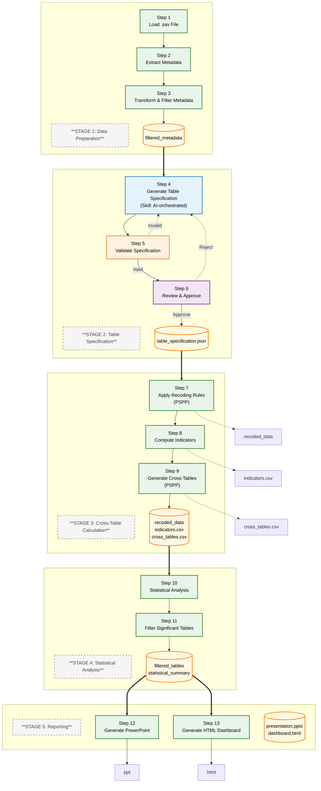

# Data Flow

This document describes the simplified workflow design for the Survey Analysis & Visualization system using a **Python library + Claude Code Skills** architecture.

---

## Table of Contents

1. [Overview](#1-overview)
2. [Architecture](#2-architecture)
3. [Data Flow](#3-data-flow)
4. [Table Specification](#4-table-specification)
5. [Workflow Steps](#5-workflow-steps)
6. [Key Terminology](#6-key-terminology)

---

## 1. Overview

### 1.1 Purpose

Design and implement an automated workflow for market research survey data analysis and visualization using a **Python library** orchestrated by **Claude Code Skills**. The system processes PSPP survey data, applies AI-orchestrated transformations, generates indicators, performs statistical analysis, and produces outputs in PowerPoint and HTML formats.

### 1.2 Scope

| Aspect | Description |
|--------|-------------|
| **Input** | PSPP (.sav) survey data files |
| **Processing** | AI-orchestrated recoding, transformation, and indicator generation |
| **Output** | PowerPoint presentations, HTML dashboards with visualizations |
| **Target** | Market research industry professionals |

### 1.3 Key Objectives

| Objective | Description |
|-----------|-------------|
| **Simplicity** | Single consolidated artifact for all AI-generated specifications |
| **Modularity** | Pure Python library separate from AI orchestration |
| **Flexibility** | Handle various survey structures and question types |
| **Accuracy** | Maintain statistical rigor with significance testing |
| **Presentation** | Deliver insights through multiple formats (PPT, HTML) |

---

## 2. Architecture

### 2.1 Component Structure

```
┌─────────────────────────────────────────────────────────────────────────┐
│                        Claude Code Skills                          │
│  (AI Orchestration & Coordination)                            │
└────────────────────────────┬────────────────────────────────────────────┘
                         │
                         ▼
┌─────────────────────────────────────────────────────────────────────────┐
│                    spss_analyzer Library                        │
│  (Pure Python: Data Processing & Computation)                    │
├─────────────────────────────────────────────────────────────────────────┤
│ specification/  │ Schema & validator for table_specification.json      │
│ io/             │ SPSS file I/O and metadata handling                │
│ pspp/            │ PSPP syntax generation and execution                     │
│ analysis/         │ Statistics and indicators                              │
│ filtering/        │ Significance filtering                                  │
│ reporting/        │ PowerPoint and HTML generation                       │
└─────────────────────────────────────────────────────────────────────────┘
```

### 2.2 Skill Responsibilities

| Skill | Purpose | Library Modules Used |
|--------|-----------|---------------------|
| **survey-spec-gen** | Generate consolidated table specification (AI-orchestrated) | `specification/` |
| **survey-validate** | Validate specification against schema and references | `specification/validator.py` |
| **survey-coordinator** | Orchestrate computation workflow | All library modules |
| **survey-output** | Generate final reports (PPT, HTML) | `reporting/` |

---

## 3. Data Flow

The workflow consists of **13 steps** organized into **5 stages**:

### 3.1 Workflow Diagram



**Legend:**

| Shape | Meaning |
|-------|---------|
| `Rectangle` | **Processing Node** (Action/Step) |
| `Cylinder` | **Data Artifact** (Output/File) |

| Color | Meaning | Examples |
|-------|---------|----------|
| 🔵 **Blue** | AI-Orchestrated Processing (Skill generates artifact) | Step 4 |
| 🟢 **Green** | Deterministic Processing (Python library, PSPP, scipy) | Steps 1-3, 7-13 |
| 🟠 **Orange** | Validation (Python checks syntax/references) | Step 5 |
| 🟣 **Purple** | Review (Human validates semantic quality) | Step 6 |
| 🟡 **Yellow** | Data Artifacts (Files and outputs) | `.sav`, `.csv`, `.json`, `.pptx`, `.html` |

**Line Styles:**
- `-->` Solid line: Forward flow to next step
- `==>` Thick line: Major data flow between stages
- `-.->` Dotted line: Feedback loop (validation/review triggering regeneration)

### 3.2 Stage Descriptions

| Stage | Steps | Description | Input | Output |
|-------|--------|-------------|-------|--------|
| **1** | 1-3 | Load data, extract/transform/filter metadata | .sav file | `filtered_metadata` |
| **2** | 4-6 | Generate, validate, review table specification | `filtered_metadata` | `table_specification.json` |
| **3** | 7-9 | Apply recoding, compute indicators, generate cross-tables | `table_specification.json`, data | `recoded_data.sav`, `indicators.csv`, `cross_tables.csv` |
| **4** | 10-11 | Statistical analysis and significance filtering | Cross-tables | `filtered_tables`, `statistical_summary` |
| **5** | 12-13 | Generate PowerPoint and HTML dashboard | Filtered results | `presentation.pptx`, `dashboard.html` |

---

## 4. Table Specification

The **table_specification.json** is a consolidated artifact that combines three previously separate AI-orchestrated parts:

### 4.1 Structure

```json
{
  "metadata": {
    "version": "1.0",
    "generated_at": "2025-01-15T10:30:00Z",
    "source_file": "survey_data.sav"
  },
  "global_recodings": [...],    // Recoding rules (formerly Phase 2)
  "indicators": [...],            // Indicator definitions (formerly Phase 3)
  "tables": [...],                // Table specifications (formerly Phase 4)
  "output_settings": {...}         // Output configuration
}
```

### 4.2 Consolidation Benefits

| Before (Separate) | After (Consolidated) |
|---------------------|----------------------|
| 3 separate AI steps with feedback loops | Single AI generation step |
| Multiple artifacts to track | Single `table_specification.json` |
| Separate validation for each part | Single validation pass |
| Complex state management | Simple file-based workflow |

### 4.3 Nested Structure

The specification uses a **nested structure** where indicators contain their recoding information:

```json
{
  "indicators": [
    {
      "id": "ind_001",
      "name": "Customer Satisfaction",
      "variables": ["q1", "q2", "q3"],
      "aggregation": "mean",
      "recoding": {
        "type": "value_map",
        "value_mappings": {"1": 100, "2": 75, ...}
      }
    }
  ]
}
```

This structure allows:
- Indicators to define their own recoding rules
- Tables to reference indicators directly
- All information in one place for validation

---

## 5. Workflow Steps

### Stage 1: Data Preparation (Steps 1-3)

| Step | Skill/Module | Purpose | Type |
|------|---------------|---------|------|
| 1 | `spss_analyzer.io.SPSSReader` | Load .sav file | Deterministic |
| 2 | `spss_analyzer.io.MetadataTransformer` | Extract & transform metadata | Deterministic |
| 3 | `spss_analyzer.io.MetadataTransformer` | Filter variables | Deterministic |

**Output:** `filtered_metadata.json`

### Stage 2: Table Specification (Steps 4-6)

| Step | Skill | Purpose | Type |
|------|--------|---------|------|
| 4 | `survey-spec-gen` | Generate table_specification.json (AI-orchestrated) | AI |
| 5 | `survey-validate` | Validate specification | Validation |
| 6 | Human review via skill interaction | Approve/reject specification | Review |

**Output:** `table_specification.json`

**Feedback Loop:** If validation fails or review rejects, regenerate from Step 4.

### Stage 3: Cross-Table Calculation (Steps 7-9)

| Step | Module | Purpose | Type |
|------|---------|---------|------|
| 7 | `spss_analyzer.pspp.RecodingSyntaxGenerator` + `PSPPExecutor` | Apply recoding | Deterministic |
| 8 | `spss_analyzer.analysis.IndicatorGenerator` | Compute indicators | Deterministic |
| 9 | `spss_analyzer.pspp.CTablesSyntaxGenerator` + `PSPPExecutor` | Generate cross-tables | Deterministic |

**Orchestration:** `survey-coordinator` skill manages these steps.

**Outputs:** `recoded_data.sav`, `indicators.csv`, `cross_tables.csv`

### Stage 4: Statistical Analysis (Steps 10-11)

| Step | Module | Purpose | Type |
|------|---------|---------|------|
| 10 | `spss_analyzer.analysis.StatisticsCalculator` | Calculate statistics | Deterministic |
| 11 | `spss_analyzer.filtering.SignificanceFilter` | Filter significant tables | Deterministic |

**Orchestration:** `survey-coordinator` skill manages these steps.

**Outputs:** `statistical_summary.json`, `filtered_tables.json`

### Stage 5: Reporting (Steps 12-13)

| Step | Module | Purpose | Type |
|------|---------|---------|------|
| 12 | `spss_analyzer.reporting.PowerPointGenerator` | Create .pptx | Deterministic |
| 13 | `spss_analyzer.reporting.HTMLDashboardGenerator` | Create .html | Deterministic |

**Orchestration:** `survey-output` skill manages report generation.

**Outputs:** `presentation.pptx`, `dashboard.html`

---

## 6. Key Terminology

| Term | Definition |
|------|------------|
| **Table Specification** | Consolidated JSON artifact containing indicators, recoding, and table definitions |
| **AI-orchestrated step** | Workflow step where Skill uses AI to generate content |
| **Deterministic processing** | Pure Python functions with predictable outputs (library code) |
| **Skill orchestration** | Claude Code Skills coordinating library module execution |
| **Specification validation** | Checking JSON structure, variable references, and business logic |
| **Consolidated artifact** | Single file combining multiple AI-generated specifications |

---

## Related Documents

| Document | Content |
|----------|---------|
| **[project-structure.md](./project-structure.md)** | Complete directory structure and file locations |
| **[system-architecture.md](./system-architecture.md)** | System components, deployment, and troubleshooting |
| **[technology-stack.md](./technology-stack.md)** | Technologies and versions |
| **[System Configuration](./system-configuration.md)** | Configuration options and usage examples |
| **[features-and-usage.md](./features-and-usage.md)** | Product introduction for end users |
| **[web-interface.md](./web-interface.md)** | Agent Chat UI setup and usage |
