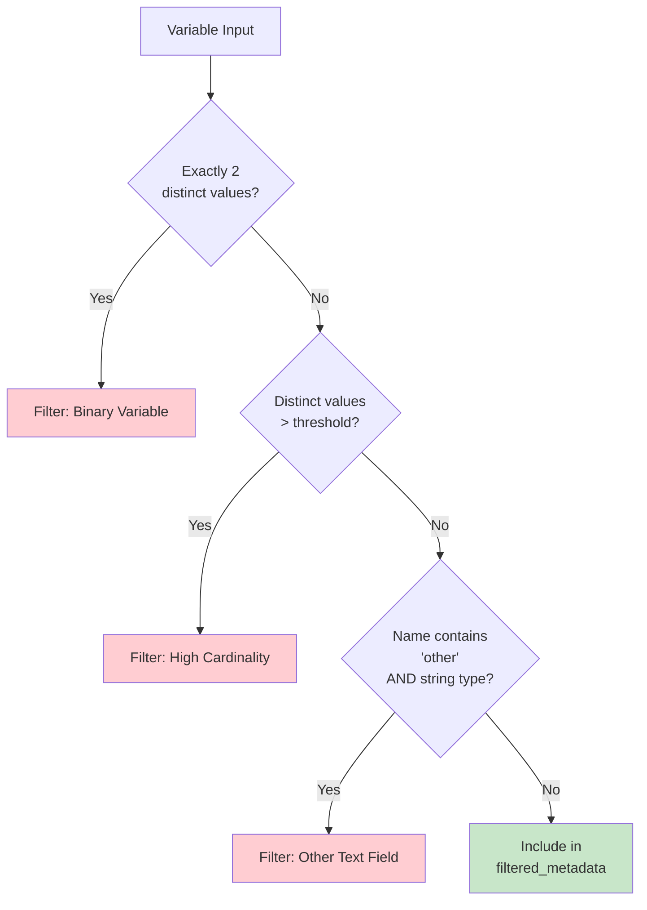
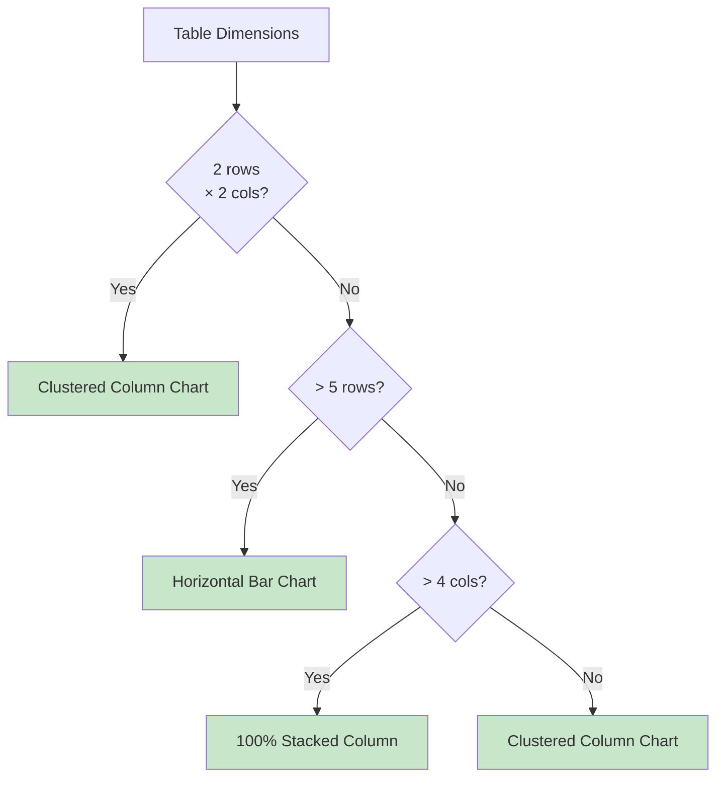

# Business Rules

This document defines all business logic rules, thresholds, and criteria used throughout the Survey Analysis & Visualization Workflow.

---

## Table of Contents

1. [Overview](#1-overview)
2. [Filtering Rules](#2-filtering-rules)
3. [Recoding Rules](#3-recoding-rules)
4. [Indicator Generation Rules](#4-indicator-generation-rules)
5. [Table Generation Rules](#5-table-generation-rules)
6. [Statistical Analysis Rules](#6-statistical-analysis-rules)
7. [Validation Rules](#7-validation-rules)
8. [Output Formatting Rules](#8-output-formatting-rules)

---

## 1. Overview

### 1.1 Rule Categories

| Category | Purpose | Applied At |
|----------|---------|------------|
| **Filtering** | Exclude variables from AI processing | Step 3 |
| **Recoding** | Transform raw variables into meaningful groups | Steps 4-8 |
| **Indicators** | Group variables into semantic concepts | Steps 9-11 |
| **Tables** | Define cross-tabulation structures | Steps 12-16 |
| **Statistics** | Determine significance and effect size | Steps 17-20 |
| **Validation** | Ensure AI-generated artifacts are valid | Steps 5, 10, 13 |
| **Output** | Format presentations and dashboards | Steps 21-22 |

### 1.2 Configuration Parameters

All configurable thresholds are defined in `DEFAULT_CONFIG`:

| Parameter | Default | Section |
|-----------|---------|---------|
| `cardinality_threshold` | 30 | Filtering |
| `filter_binary` | True | Filtering |
| `filter_other_text` | True | Filtering |
| `max_self_correction_iterations` | 3 | Validation |
| `significance_level` | 0.05 | Statistics |
| `min_cramers_v` | 0.1 | Statistics |
| `min_cell_count` | 10 | Statistics |

---

## 2. Filtering Rules

**Applied at**: Step 3 (Preliminary Filtering)

**Purpose**: Reduce AI context by excluding variables that don't require recoding.

### 2.1 Filter Criteria

| Rule | Condition | Reason |
|------|-----------|--------|
| **Binary Variables** | Exactly 2 distinct values | No room for meaningful recoding |
| **High Cardinality** | Distinct values > threshold (default: 30) | Typically IDs, open-ended text, or unique identifiers |
| **Other Text Fields** | Name contains "other" AND type is string/character | Open-ended feedback fields |

### 2.2 Filter Logic Flow



### 2.3 Filtered Out Variable Schema

Each filtered variable is recorded with:

```python
{
    "name": str,              # Variable name
    "reason": str,            # Explanation of why filtered
    "rule": str,              # "binary" | "high_cardinality" | "other_text"
    "distinct_count": int,    # Number of distinct values (for cardinality)
    "type": str               # Variable type (for other_text)
}
```

### 2.4 Examples

| Variable | Type | Distinct Values | Filtered? | Reason |
|----------|------|-----------------|-----------|--------|
| `gender` | numeric | 2 | Yes | Binary variable |
| `age` | numeric | 75 | Yes | High cardinality (> 30) |
| `q5_other_specify` | string | N/A | Yes | Other text field |
| `q1_satisfaction` | numeric | 5 | No | Passes all filters |
| `region` | numeric | 4 | No | Passes all filters |

---

## 3. Recoding Rules

**Applied at**: Steps 4-8 (New Dataset Generation)

**Purpose**: Transform raw variables into meaningful groupings for analysis.

### 3.1 Recoding Principles

The LLM is instructed to follow these principles when generating recoding rules:

| Principle | Description | Example |
|-----------|-------------|---------|
| **Range Grouping** | Group continuous variables into meaningful ranges | Age (18-99) → Age Groups (18-24, 25-34, ...) |
| **Category Consolidation** | Recode detailed categories into broader groups | Region (10 regions) → Region Group (North, South, West) |
| **Derived Variables** | Create new variables when semantically meaningful | Satisfaction ratings → Top 2 Box |
| **Top/Bottom Box** | Apply Top 2 Box / Top 3 Box for satisfaction scales | 10-point scale → Top 2 Box (9-10) |

### 3.2 Rule Types

| Type | Description | Use Case |
|------|-------------|----------|
| `range` | Recode numeric ranges to target values | Age grouping, income brackets |
| `value_mapping` | Map specific source values to target values | Category consolidation, top/bottom box |
| `formula` | Apply formula to create derived variable | Calculated indices, scores |

### 3.3 Recoding Rules Schema

```json
{
    "recoding_rules": [
        {
            "source_variable": "string",
            "target_variable": "string",
            "rule_type": "range" | "value_mapping" | "formula",
            "transformations": [
                {
                    "source": [int | string],
                    "target": int | string,
                    "label": "string"
                }
            ],
            "description": "string"
        }
    ]
}
```

### 3.4 Recoding Examples

#### Example 1: Age Grouping (Range)

```json
{
    "source_variable": "age",
    "target_variable": "age_group",
    "rule_type": "range",
    "transformations": [
        {"source": [18, 24], "target": 1, "label": "18-24"},
        {"source": [25, 34], "target": 2, "label": "25-34"},
        {"source": [35, 44], "target": 3, "label": "35-44"},
        {"source": [45, 54], "target": 4, "label": "45-54"},
        {"source": [55, 99], "target": 5, "label": "55+"}
    ]
}
```

#### Example 2: Top 2 Box (Value Mapping)

```json
{
    "source_variable": "q5_satisfaction",
    "target_variable": "q5_satisfaction_top2box",
    "rule_type": "value_mapping",
    "transformations": [
        {"source": [1, 8], "target": 0, "label": "Others"},
        {"source": [9, 10], "target": 1, "label": "Top 2 Box"}
    ]
}
```

#### Example 3: Region Grouping (Value Mapping)

```json
{
    "source_variable": "region",
    "target_variable": "region_group",
    "rule_type": "value_mapping",
    "transformations": [
        {"source": [1], "target": 1, "label": "North"},
        {"source": [2], "target": 1, "label": "North"},
        {"source": [3], "target": 2, "label": "South"},
        {"source": [4], "target": 2, "label": "South"},
        {"source": [5], "target": 3, "label": "West"}
    ]
}
```

### 3.5 PSPP Recoding Syntax

Generated PSPP syntax follows this pattern:

```spss
* Header
GET FILE='/path/to/input.sav'.
EXECUTE.

* Recoding command
RECODE {source_variable} ({transformations}) INTO {target_variable}.
VARIABLE LABELS {target_variable} '{label}'.
VALUE LABELS {target_variable} {value_labels}.
EXECUTE.

* Save output
SAVE OUTFILE='/path/to/new_data.sav'.
```

---

## 4. Indicator Generation Rules

**Applied at**: Steps 9-11 (Indicator Generation)

**Purpose**: Group semantically related variables into indicators for analysis.

### 4.1 Indicator Principles

| Principle | Description |
|-----------|-------------|
| **Semantic Cohesion** | Group variables measuring the same underlying concept |
| **Multi-Item Scales** | Create indicators for multi-item scales (e.g., satisfaction scales) |
| **Demographic Separation** | Group demographic variables separately from attitudinal variables |
| **Size Limits** | Limit to 3-7 variables per indicator for interpretability |

### 4.2 Indicator Schema

```json
{
    "indicators": [
        {
            "name": "string",
            "variables": ["string", ...],
            "description": "string",
            "theme": "string"
        }
    ]
}
```

| Field | Description | Constraints |
|-------|-------------|-------------|
| `name` | Indicator display name | Unique, descriptive |
| `variables` | Underlying variable names | 2-7 variables, all must exist in metadata |
| `description` | Human-readable description | Concise explanation |
| `theme` | Semantic theme | e.g., "satisfaction", "demographics", "usage" |

### 4.3 Indicator Examples

```json
{
    "indicators": [
        {
            "name": "Customer Satisfaction",
            "variables": ["sat_q1", "sat_q2", "sat_q3", "sat_q4"],
            "description": "Overall customer satisfaction metrics",
            "theme": "satisfaction"
        },
        {
            "name": "Demographics",
            "variables": ["age", "gender", "income", "education"],
            "description": "Respondent demographic characteristics",
            "theme": "demographics"
        },
        {
            "name": "Product Usage",
            "variables": ["usage_frequency", "usage_duration", "feature_usage"],
            "description": "How customers use the product",
            "theme": "usage"
        }
    ]
}
```

---

## 5. Table Generation Rules

**Applied at**: Steps 12-16 (Cross-Table Generation)

**Purpose**: Define cross-tabulation tables for statistical analysis.

### 5.1 Table Principles

| Principle | Description |
|-----------|-------------|
| **Demographic × Outcome** | Create tables comparing demographics against satisfaction/outcome indicators |
| **Categorical Only** | Use categorical variables in rows and columns (no continuous variables) |
| **Include Percentages** | Include count and column percentages for interpretation |
| **Meaningful Relationships** | Limit to tables with meaningful analytical relationships |

### 5.2 Table Schema

```json
{
    "tables": [
        {
            "name": "string",
            "rows": "string",
            "columns": "string",
            "weight": "string" | null,
            "statistics": ["string", ...]
        }
    ]
}
```

| Field | Description | Valid Values |
|-------|-------------|--------------|
| `name` | Table display name | Descriptive title |
| `rows` | Row variable name | Categorical variable in metadata |
| `columns` | Column variable name | Categorical variable in metadata |
| `weight` | Weighting variable | Variable name or null |
| `statistics` | Requested statistics | `count`, `row_percent`, `column_percent`, `chi_square` |

### 5.3 Table Statistics

| Statistic | Description | Use When |
|-----------|-------------|----------|
| `count` | Cell counts | Always included |
| `row_percent` | Percentages within each row | Comparing row distributions |
| `column_percent` | Percentages within each column | Comparing column distributions |
| `chi_square` | Chi-square test results | Testing independence |

### 5.4 Table Examples

#### Example 1: Simple Demographic × Satisfaction

```json
{
    "name": "Gender by Satisfaction",
    "rows": "gender",
    "columns": "sat_q1",
    "weight": null,
    "statistics": ["count", "column_percent", "chi_square"]
}
```

#### Example 2: Weighted Table

```json
{
    "name": "Age Group by Top 2 Box",
    "rows": "age_group",
    "columns": "sat_top2box",
    "weight": "weight_var",
    "statistics": ["count", "column_percent"]
}
```

### 5.5 PSPP CTABLES Syntax

```spss
CTABLES
  /VLABELS VARIABLES={rows_var} {cols_var} DISPLAY=DEFAULT
  /TABLE {rows_var} BY {cols_var}
  /STATISTICS
    count ('Count')
    columnpct ('Column %')
    chisq ('Chi-Square')
  /CRITERIA CILEVEL=95.
```

---

## 6. Statistical Analysis Rules

**Applied at**: Steps 17-20 (Statistical Analysis & Filtering)

**Purpose**: Compute statistical tests and filter tables by significance.

### 6.1 Statistical Tests

| Test | Purpose | Output |
|------|---------|--------|
| **Chi-Square** | Test independence between categorical variables | χ² statistic, p-value, degrees of freedom |
| **Cramer's V** | Measure effect size (strength of association) | V value (0-1), interpretation |

### 6.2 Significance Thresholds

| Parameter | Default | Description |
|-----------|---------|-------------|
| `significance_level` | 0.05 | P-value threshold for statistical significance |
| `min_cramers_v` | 0.1 | Minimum Cramer's V effect size |
| `min_cell_count` | 10 | Minimum expected cell count for chi-square |

### 6.3 Cramer's V Interpretation

| Cramer's V Range | Interpretation | Description |
|------------------|----------------|-------------|
| 0.00 - 0.10 | Negligible | No meaningful association |
| 0.10 - 0.30 | Small | Weak association |
| 0.30 - 0.50 | Medium | Moderate association |
| 0.50 - 1.00 | Large | Strong association |

### 6.4 Statistical Summary Schema

```json
[
    {
        "table_name": "string",
        "chi_square": float,
        "p_value": float,
        "degrees_of_freedom": int,
        "cramers_v": float,
        "interpretation": "negligible" | "small" | "medium" | "large",
        "sample_size": int,
        "is_significant": boolean
    }
]
```

### 6.5 Filter List Criteria

A table is **included** in `significant_tables` if:

| Criterion | Pass Condition |
|-----------|---------------|
| **Statistical Significance** | `p_value < significance_level` (default: 0.05) |
| **Effect Size** | `cramers_v >= min_cramers_v` (default: 0.1) |
| **Sample Size** | All expected cell counts >= `min_cell_count` (default: 10) |

### 6.6 Filter Schema

```json
[
    {
        "table_name": "string",
        "passes_cramers_v": boolean,
        "passes_sample_size": boolean,
        "passes_significance": boolean,
        "include": boolean,
        "reason": "string"
    }
]
```

---

## 7. Validation Rules

**Applied at**: Steps 5, 10, 13 (Validation nodes in three-node pattern)

**Purpose**: Ensure AI-generated artifacts are syntactically valid and referentially correct.

### 7.1 Recoding Rules Validation

| Check | Error Condition |
|-------|-----------------|
| **Source variable exists** | Variable not found in metadata |
| **Target variable unique** | Duplicate target variable name across rules |
| **Range validity** | Range has start > end |
| **Target uniqueness** | Duplicate target values within a rule |
| **Source non-overlap** | Source ranges overlap within a rule |
| **Transformation completeness** | Empty source values |

### 7.2 Indicators Validation

| Check | Error Condition |
|-------|-----------------|
| **Structure** | Missing required fields (name, variables, description) |
| **Variables exist** | Referenced variable not found in metadata |
| **Name uniqueness** | Duplicate indicator name |
| **Minimum size** | Fewer than 2 variables in indicator |

### 7.3 Table Specifications Validation

| Check | Error Condition |
|-------|-----------------|
| **Structure** | Missing required fields (name, rows, columns, statistics) |
| **References** | Row/column variable not found in metadata |
| **Categorical only** | Row/column variable is not categorical |
| **Statistics** | Unknown statistic type |

### 7.4 ValidationResult Schema

```python
{
    "is_valid": boolean,
    "errors": [string, ...],
    "warnings": [string, ...],
    "checks_performed": [string, ...]
}
```

### 7.5 Iteration Rules

| Rule | Default | Description |
|------|---------|-------------|
| `max_self_correction_iterations` | 3 | Maximum validation retry attempts |
| Auto-approve | False | If exceeded max iterations, require human review |

---

## 8. Output Formatting Rules

**Applied at**: Steps 21-22 (Presentation)

**Purpose**: Format outputs for human consumption.

### 8.1 PowerPoint Presentation Rules

| Aspect | Rule |
|--------|------|
| **Content** | Include only significant tables |
| **Chart Type Selection** | Based on table dimensions: 2x2 → bar, >5 rows → horizontal bar, >4 cols → stacked |
| **Color Scheme** | Professional market research palette |
| **Statistics Display** | Show χ², p-value, Cramer's V below each chart |
| **Editability** | Charts must be natively editable in PowerPoint |

### 8.2 HTML Dashboard Rules

| Aspect | Rule |
|--------|------|
| **Content** | Include all tables (significant and non-significant) |
| **Navigation** | Sidebar with links to each table |
| **Significance Highlighting** | Significant tables highlighted with different background |
| **Statistics** | Full statistical summary for each table |
| **Charts** | Interactive charts using Chart.js |

### 8.3 Chart Type Selection Logic



---

## Related Documents

| Document | Content |
|----------|---------|
| **[Data Schema](./data-schema.md)** | All data structures and file formats |
| **[State Management](./state-management.md)** | State evolution and lifecycle |
| **[Data Flow](./data-flow.md)** | Workflow design and step specifications |
| **[Configuration](./system-configuration.md)** | Configuration options and usage |
