# Data Flow

This document describes the workflow design, steps, and state management for the Survey Analysis & Visualization Workflow.

---

## Table of Contents

1. [Overview](#1-overview)
2. [Data Flow](#2-data-flow)
3. [Step Specifications](#3-step-specifications)
4. [Key Terminology](#4-key-terminology)

---

## 1. Overview

### 1.1 Purpose

Design and implement an automated workflow for market research survey data analysis and visualization using LangGraph. The system processes PSPP survey data, applies LLM-orchestrated transformations, generates indicators, performs statistical analysis, and produces outputs in PowerPoint and HTML formats.

### 1.2 Scope

| Aspect | Description |
|--------|-------------|
| **Input** | PSPP (.sav) survey data files |
| **Processing** | LLM-orchestrated recoding, transformation, and indicator generation |
| **Output** | PowerPoint presentations, HTML dashboards with visualizations |
| **Target** | Market research industry professionals |

### 1.3 Key Objectives

| Objective | Description |
|-----------|-------------|
| **Automation** | Minimize manual intervention in survey data processing |
| **Intelligence** | Leverage LLMs to generate meaningful recoding and grouping rules |
| **Flexibility** | Handle various survey structures and question types |
| **Accuracy** | Maintain statistical rigor with significance testing |
| **Presentation** | Deliver insights through multiple formats (PPT, HTML) |

---

## 2. Data Flow

The workflow consists of **22 steps** organized into **8 phases** across **3 stages**.

### 2.1 Workflow Diagram

**Legend:**

| Shape | Meaning |
|-------|---------|
| `Rectangle` | **Processing Node** (Action/Step) |
| `Cylinder` | **Data Artifact** (Output/File) |

| Color | Meaning | Examples |
|-------|---------|----------|
| 🔵 **Blue** | AI-Orchestrated Processing (LLM generates artifact) | Steps 4, 9, 12 |
| 🟢 **Green** | Deterministic Processing (Python, PSPP, scipy) | Steps 1-3, 7-8, 15-22 |
| 🟠 **Orange** | Validation (Python checks syntax/references) | Steps 5, 10, 13 |
| 🟣 **Purple** | Review (Human validates semantic quality) | Steps 6, 11, 14 |
| 🟡 **Yellow** | Data Artifacts (Files and outputs) | `.sav`, `.csv`, `.json`, `.pptx`, `.html` |

**Line Styles:**
- `-->` Solid line: Forward flow to next step
- `==>` Thick line: Major data flow between stages
- `-.->` Dotted line: Feedback loop (validation/review triggering regeneration)

### 2.2 Phase Descriptions

| Phase | Description | Input | Output |
|-------|-------------|-------|--------|
| **1** | Extraction & Preparation | .sav file | Raw data, filtered metadata |
| **2** | New Dataset Generation | Filtered metadata, original .sav file | new_data.sav (complete dataset) + new_metadata (all variables via pyreadstat) |
| **3** | Indicator Generation | new_metadata from Phase 2 | Indicator definitions |
| **4** | Cross-Table Generation | new_metadata from Phase 2 | Cross-table CSV + JSON |
| **5** | Statistical Analysis | Cross-table CSV + JSON | Statistical summary (Chi-square, Cramer's V) |
| **6** | Significant Tables Selection | Statistical summary + cross-table data | Significant tables only |
| **7** | Executive Summary Presentation | Significant tables | PowerPoint presentation |
| **8** | Full Report Dashboard | Cross-table data (all tables) | HTML dashboard |

### 2.3 Three-Node Pattern

The **Generate → Validate → Review** pattern is used for LLM-orchestrated steps:

| Steps | Process | Technologies |
|-------|---------|--------------|
| **4-6** | Recoding Rules | LLM → Python → Human |
| **9-11** | Indicators | LLM → Python → Human |
| **12-14** | Table Specifications | LLM → Python → Human |

**Pattern Flow:**

```mermaid
flowchart LR
    GENERATE["Generate 🤖<br/>(LLM)"] --> VALIDATE["Validate ✓<br/>(Python)"]
    VALIDATE -->|Valid| REVIEW["Review 👤<br/>(Human)"]
    VALIDATE -->|Invalid| GENERATE
    REVIEW -->|Approve| NEXT["Next Step"]
    REVIEW -->|Reject| GENERATE
```

| Node | Responsibility |
|------|----------------|
| **Generate** | LLM creates artifact with prompts for initial/retry/feedback |
| **Validate** | Python checks: syntax, references, constraints |
| **Review** | Human validates semantic quality via LangGraph interrupt |

### 2.4 State Management

The workflow maintains a single evolving state object (`WorkflowState`) organized into sub-states:

| Sub-State | Steps | Key Fields |
|-----------|-------|------------|
| `InputState` | 0 | `spss_file_path`, `config` |
| `ExtractionState` | 1-3 | `raw_data`, `filtered_metadata` |
| `RecodingState` | 4-8 | `recoding_rules`, `new_metadata` |
| `IndicatorState` | 9-11 | `indicators`, `indicators_approved` |
| `CrossTableState` | 12-16 | `table_specifications`, `cross_table_csv_path` |
| `StatisticalAnalysisState` | 17-18 | `statistical_summary` |
| `FilteringState` | 19-20 | `significant_tables` |
| `PresentationState` | 21-22 | `powerpoint_path`, `html_dashboard_path` |

**Key State Evolution:**

| Step | Key State Change |
|------|------------------|
| **Step 8** | `new_metadata` becomes authoritative (all variables) |
| **Step 18** | `statistical_summary` available for filtering |
| **Step 20** | `significant_tables` ready for PowerPoint |

---

## 3. Step Specifications

### Stage 1: Data Preparation (Steps 1-8)

| Step | Node | Purpose | Type |
|------|------|---------|------|
| 1 | `extract_spss_node` | Extract data/metadata from .sav | Deterministic |
| 2 | `transform_metadata_node` | Convert to variable-centered format | Deterministic |
| 3 | `filter_metadata_node` | Filter variables not needing recoding | Deterministic |
| 4 | `generate_recoding_rules_node` | LLM generates recoding rules | AI |
| 5 | `validate_recoding_rules_node` | Validate rules (syntax, references) | Validation |
| 6 | `review_recoding_rules_node` | Human review of recoding rules | Review |
| 7 | `generate_pspp_recoding_syntax_node` | Convert rules to PSPP syntax | Deterministic |
| 8 | `execute_pspp_recoding_node` | Execute PSPP, create new_data.sav | Deterministic |

### Stage 2: Analysis (Steps 9-20)

| Step | Node | Purpose | Type |
|------|------|---------|------|
| 9 | `generate_indicators_node` | LLM groups variables into indicators | AI |
| 10 | `validate_indicators_node` | Validate indicator structure | Validation |
| 11 | `review_indicators_node` | Human review of indicators | Review |
| 12 | `generate_table_specifications_node` | LLM defines cross-table structures | AI |
| 13 | `validate_table_specifications_node` | Validate table specs | Validation |
| 14 | `review_table_specifications_node` | Human review of table specs | Review |
| 15 | `generate_pspp_table_syntax_node` | Generate PSPP CTABLES syntax | Deterministic |
| 16 | `execute_pspp_tables_node` | Execute PSPP, generate tables | Deterministic |
| 17 | `generate_python_statistics_script_node` | Generate Chi-square script | Deterministic |
| 18 | `execute_python_statistics_script_node` | Execute statistics script | Deterministic |
| 19 | `generate_filter_list_node` | Generate significance filter criteria | Deterministic |
| 20 | `apply_filter_to_tables_node` | Filter to significant tables only | Deterministic |

### Stage 3: Reporting (Steps 21-22)

| Step | Node | Purpose | Type |
|------|------|---------|------|
| 21 | `generate_powerpoint_node` | Create PowerPoint from significant tables | Deterministic |
| 22 | `generate_html_dashboard_node` | Create HTML dashboard from all tables | Deterministic |

> **For detailed implementation**, see [implementation-specifications.md](./implementation-specifications.md)

---

## 4. Key Terminology

| Term | Definition |
|------|------------|
| **LLM-orchestrated step** | Workflow step where LLM generates artifact |
| **Deterministic processing** | Procedural code with predictable outputs |
| **Three-node pattern** | Generate (LLM) → Validate (Python) → Review (Human) |
| **new_metadata** | Complete metadata from new_data.sav (all variables) |
| **LangGraph interrupt** | Mechanism to pause workflow for human input |
| **State evolution** | Incremental population of state fields |
| **Feedback loop** | Validation/review triggers regeneration |

---

## Related Documents

| Document | Content |
|----------|---------|
| **[implementation-specifications.md](./implementation-specifications.md)** | Detailed implementation with code examples |
| **[project-structure.md](./project-structure.md)** | Complete directory structure and file locations |
| **[code-organization.md](./code-organization.md)** | Naming conventions and design principles |
| **[system-architecture.md](./system-architecture.md)** | System components, deployment, and troubleshooting |
| **[technology-stack.md](./technology-stack.md)** | Technologies and versions |
| **[configuration.md](./configuration.md)** | Configuration options and usage examples |
| **[product-features-and-usage.md](./product-features-and-usage.md)** | Product introduction for end users |
