# Data Flow

This document describes the simplified workflow design for the Survey Analysis & Visualization system using a **Python library + Claude Code Skills** architecture.

---

## Table of Contents

1. [Overview](#1-overview)
2. [Architecture](#2-architecture)
3. [Data Flow](#3-data-flow)
4. [Table Specification](#4-table-specification)
5. [Workflow Steps](#5-workflow-steps)
6. [Key Terminology](#6-key-terminology)

---

## 1. Overview

### 1.1 Purpose

Design and implement an automated workflow for market research survey data analysis and visualization using a **Python library** orchestrated by **Claude Code Skills**. The system processes SPSS (.sav) survey data, applies AI-orchestrated transformations, generates indicators, performs statistical analysis, and produces outputs in PowerPoint and HTML formats.

### 1.2 Scope

| Aspect | Description |
|--------|-------------|
| **Input** | SPSS (.sav) survey data files |
| **Processing** | AI-orchestrated recoding, transformation, and indicator generation |
| **Output** | PowerPoint presentations, HTML dashboards with visualizations |
| **Target** | Market research industry professionals |

### 1.3 Key Objectives

| Objective | Description |
|-----------|-------------|
| **Simplicity** | Single consolidated artifact for all AI-generated specifications |
| **Modularity** | Pure Python library separate from AI orchestration |
| **Flexibility** | Handle various survey structures and question types |
| **Accuracy** | Maintain statistical rigor with significance testing |
| **Presentation** | Deliver insights through multiple formats (PPT, HTML) |

---

## 2. Architecture

### 2.1 Component Structure

```
┌─────────────────────────────────────────────────────────────────────────┐
│                        Claude Code Skills                          │
│  (AI Orchestration & Coordination)                            │
└────────────────────────────┬────────────────────────────────────────────┘
                         │
                         ▼
┌─────────────────────────────────────────────────────────────────────────┐
│                    survey_analyzer Library                        │
│  (Pure Python: Data Processing & Computation)                    │
├─────────────────────────────────────────────────────────────────────────┤
│ indicators/         │ Indicator generation (Stage 3)                    │
│   ├── generator.py    │   - Batch processing with checkpointing        │
│   ├── batch_processor.py │   - No is_row/is_column fields (added later)   │
│   ├── system_prompt.md  │   - Few-shot examples for LLM                 │
│   ├── user_prompt.md    │   - Prompts for indicator generation         │
│   └── examples.jsonc    │   - Example indicators for reference          │
│                                                                              │
│ tablespec/           │ Table specification (Stage 4) - LLM classification │
│   ├── tablespec.py     │   - Classifies indicators (is_row/is_column)    │
│   ├── system_prompt.md  │   - Prompts for classification               │
│   └── user_prompt.md    │   - Builds table_specification.jsonc         │
│                                                                              │
│ io/                 │ SPSS file I/O and metadata handling               │
│ analysis/           │ Transformation engine and crosstab generation      │
│ filtering/          │ Significance filtering                           │
│ reporting/          │ PowerPoint and HTML generation                    │
└─────────────────────────────────────────────────────────────────────────┘
```

### 2.2 Skill Responsibilities

| Skill | Stage | Purpose | Type |
|--------|-------|-----------|------|
| **analyzer-data-prep** | 1 | Load .sav, extract/filter metadata | Deterministic |
| **analyzer-question-extraction** | 2 | Extract question codes, group variables | Deterministic |
| **analyzer-indicator-generation** | 3 | Generate indicators (batch, AI-orchestrated) | AI |
| **analyzer-tablespec** | 4 | Classify indicators + build table spec (AI) | AI |
| **analyzer-crosstabs** | 5 | Recoding, crosstabs with statistics | Deterministic |
| **analyzer-statistics** | 6 | Statistical analysis, filtering | Deterministic |
| **analyzer-reports** | 7 | PowerPoint, HTML dashboard | Deterministic |
| **analyzer-coordinator** | All | Orchestrate complete pipeline | Coordinator |

---

## 3. Data Flow

The workflow consists of **7 stages** with clear separation of concerns:

### 3.1 Workflow Diagram

```mermaid
flowchart TD
    %% Define styles
    classDef processingGreen fill:#e8f5e9,stroke:#2e7d32,stroke-width:2px,color:#000
    classDef processingBlue fill:#e3f2fd,stroke:#1976d2,stroke-width:2px,color:#000
    classDef processingOrange fill:#fff3e0,stroke:#f57c00,stroke-width:2px,color:#000
    classDef processingPurple fill:#f3e5f5,stroke:#7b1fa2,stroke-width:2px,color:#000
    classDef artifactStyle fill:#fff8e1,stroke:#f57c00,stroke-width:2px,color:#000
    classDef stageLabelStyle fill:#f5f5f5,stroke:#9e9e9e,stroke-width:2px,stroke-dasharray:5 5,color:#424242

    %% STAGE 1: Data Preparation
    subgraph STAGE1[" "]
        direction TB
        stage1_label["**STAGE 1: Data Preparation**"]:::stageLabelStyle

        S1["Step 1<br/>Load .sav File"]:::processingGreen
        S2["Step 2<br/>Extract Metadata"]:::processingGreen
        S3["Step 3<br/>Transform & Filter Metadata"]:::processingGreen
        metadata[("filtered_metadata")]:::artifactStyle
    end

    %% STAGE 2: Question Extraction
    subgraph STAGE2[" "]
        direction TB
        stage2_label["**STAGE 2: Question Extraction**"]:::stageLabelStyle

        S4["Step 4<br/>Extract Question Codes<br/>& Group Variables"]:::processingGreen
        questions[("questions.json")]:::artifactStyle
    end

    %% STAGE 3: Indicator Generation
    subgraph STAGE3[" "]
        direction TB
        stage3_label["**STAGE 3: Indicator Generation**"]:::stageLabelStyle

        S5["Step 5<br/>Generate Indicators<br/>(Question by Question - AI)"]:::processingBlue
        indicators[("indicators.json")]:::artifactStyle
    end

    %% STAGE 4: Table Specification (Combined)
    subgraph STAGE4[" "]
        direction TB
        stage4_label["**STAGE 4: Table Specification**"]:::stageLabelStyle

        S6["Step 6<br/>LLM Classify Indicators<br/>(is_row/is_column)"]:::processingBlue
        S7["Step 7<br/>Build Specification<br/>(row_indicators/column_indicators)"]:::processingGreen
        tableSpec[("table_specification.jsonc")]:::artifactStyle
    end

    %% STAGE 5: Cross-Table Generation
    subgraph STAGE5[" "]
        direction TB
        stage5_label["**STAGE 5: Cross-Table Generation**"]:::stageLabelStyle

        S8["Step 8<br/>Apply Transformations<br/>(Recoding, Computing)"]:::processingGreen
        S9["Step 9<br/>Generate Cross-Tables<br/>& Statistics"]:::processingGreen
        crosstabs[("cross_tables.json")]:::artifactStyle
    end

    %% STAGE 6: Statistical Analysis
    subgraph STAGE6[" "]
        direction TB
        stage6_label["**STAGE 6: Statistical Analysis**"]:::stageLabelStyle

        S10["Step 10<br/>Statistical Analysis"]:::processingGreen
        S11["Step 11<br/>Filter Significant Tables"]:::processingGreen
        results[("filtered_results.json")]:::artifactStyle
    end

    %% STAGE 7: Reporting
    subgraph STAGE7[" "]
        direction TB
        stage7_label["**STAGE 7: Reporting**"]:::stageLabelStyle

        S12["Step 12<br/>Generate PowerPoint"]:::processingGreen
        S13["Step 13<br/>Generate HTML Dashboard"]:::processingGreen
        outputs[("presentation.pptx<br/>dashboard.html")]:::artifactStyle
    end

    %% Data flow edges
    S1 --> S2 --> S3 --> metadata
    metadata ==> S4 --> questions
    questions ==> S5 --> indicators
    indicators ==> S6 --> S7 --> tableSpec

    tableSpec ==> S8 --> S9 --> crosstabs

    crosstabs ==> S10 --> S11 --> results

    results ==> S12
    results ==> S13 --> outputs
```



**Legend:**

| Shape | Meaning |
|-------|---------|
| `Rectangle` | **Processing Node** (Action/Step) |
| `Cylinder` | **Data Artifact** (Output/File) |

| Color | Meaning | Examples |
|-------|---------|----------|
| 🔵 **Blue** | AI-Orchestrated Processing (LLM generates artifact) | Steps 5, 6 |
| 🟢 **Green** | Deterministic Processing (Python library, pandas, scipy) | All other steps |
| 🟡 **Yellow** | Data Artifacts (Files and outputs) | `.sav`, `.csv`, `.json`, `.pptx`, `.html` |

**Line Styles:**
- `-->` Solid line: Forward flow to next step
- `==>` Thick line: Major data flow between stages

### 3.2 Stage Descriptions

| Stage | Steps | Description | Input | Output |
|-------|--------|-------------|-------|--------|
| **1** | 1-3 | Load data, extract/transform/filter metadata | .sav file | `filtered_metadata.json` |
| **2** | 4 | Extract question codes, group variables by question | `filtered_metadata.json` | `questions.json` |
| **3** | 5 | Generate indicators (batch, AI-orchestrated) | `questions.json` + `filtered_metadata.json` | `indicators.json` |
| **4** | 6-7 | LLM classify + build table specification | `indicators.json` | `table_specification.jsonc` |
| **5** | 8-9 | Apply transformations, generate cross-tables with statistics | `table_specification.jsonc` | `cross_tables.json` |
| **6** | 10-11 | Statistical analysis and significance filtering | `cross_tables.json` | `filtered_results.json` |
| **7** | 12-13 | Generate PowerPoint and HTML dashboard | `filtered_results.json` | `presentation.pptx`, `dashboard.html` |

---

## 4. Table Specification

The **table_specification.jsonc** is the final artifact for cross-tabulation analysis, generated by Stage 4.

### 4.1 Structure

```jsonc
{
  "metadata": {
    "spec_id": "tablespec_proj_survey_20260225_200000",
    "project_id": "proj_survey",
    "dataset_id": "ds_survey_data",
    "description": "Table specification for cross-tabulation analysis",
    "generated_at": "2026-02-25T20:00:00",
    "source_file": "survey_data.sav",
    "case_count": 13064,
    "indicator_counts": {
      "total": 92,
      "row": 85,
      "column": 7,
      "both": 0
    },
    "row_indicator_codes": ["Q10_ENGINE", "Q2A_USAGE", ...],
    "column_indicator_codes": ["GENDER", "AGE", "CITY_TIER", ...]
  },
  "filter_clause": {
    "exclude_incomplete": true
  },
  "weight_indicator": null,
  "row_indicators": [
    {
      "indicator_code": "Q2A_USAGE",
      "indicator_label": "Q2A - 请问您要购买的新车通常将如何使用？",
      "question_code": "Q2A",
      "question_type": "Multiple Choice",
      "tabulation_type": "categorical",
      "tabulation_metric": "column_percent",
      "base_variables": {
        "Q2A_1_bin": "上/下班用",
        "Q2A_2_bin": "和家庭成员/朋友/同事一起出外娱乐聚餐"
      },
      "base_variables_transformations": null,
      "base_variables_value_labels": {
        "1": "是",
        "0": "否"
      },
      "is_row": true,
      "is_column": false
    }
  ],
  "column_indicators": [
    {
      "indicator_code": "GENDER",
      "indicator_label": "S0 - 性别",
      "question_code": "S0",
      "question_type": "Single Choice",
      "tabulation_type": "categorical",
      "tabulation_metric": "column_percent",
      "base_variables": {
        "S0_cat": "性别"
      },
      "base_variables_transformations": null,
      "base_variables_value_labels": {
        "1": "男",
        "2": "女"
      },
      "is_row": false,
      "is_column": true
    }
  ]
}
```

### 4.2 Field Descriptions

| Field | Description | Source |
|-------|-------------|--------|
| `metadata` | Nested object containing project identification | Generated |
| `metadata.spec_id` | Unique specification identifier | Generated |
| `metadata.project_id` | Project identifier | Configurable |
| `metadata.dataset_id` | Dataset identifier | Configurable |
| `metadata.description` | Human-readable description | Generated |
| `metadata.generated_at` | ISO timestamp of generation | Generated |
| `metadata.source_file` | Original SPSS filename | From Stage 1 |
| `metadata.case_count` | Number of cases in dataset | From Stage 1 |
| `filter_clause` | Data filtering rules (e.g., `exclude_incomplete`) | Default |
| `weight_indicator` | Weight variable name or `null` | Optional |
| `indicator_code` | Internal variable identifier | Generated |
| `indicator_label` | Full Chinese question text | filtered_metadata.json |
| `question_code` | SPSS variable prefix (Q1, S1, D1) | extracted |
| `question_type` | Single Choice, Multiple Choice, Matrix, Rating Scale, etc. | LLM classified |
| `tabulation_type` | `categorical` or `scalar` | LLM classified |
| `tabulation_metric` | `column_percent` or `descriptive_statistics` | LLM classified |
| `base_variables` | Dictionary of variable names to labels | Generated from metadata |
| `base_variables_transformations` | SPSS transformation syntax or `null` | Optional |
| `base_variables_value_labels` | Value labels mapping (`{"1": "Yes", "0": "No"}`) | filtered_metadata.json |
| `is_row` | Boolean: true if used as row variable | LLM classified |
| `is_column` | Boolean: true if used as column variable | LLM classified |

---

## 5. Workflow Steps

### Stage 1: Data Preparation (Steps 1-3)

| Step | Skill | Module | Purpose | Type |
|------|--------|---------|------|----------|
| 1 | `analyzer-data-prep` | `survey_analyzer.io.SPSSReader` | Load .sav file | Deterministic |
| 2 | `analyzer-data-prep` | `survey_analyzer.io.MetadataTransformer` | Extract & transform metadata | Deterministic |
| 3 | `analyzer-data-prep` | `survey_analyzer.io.MetadataTransformer` | Filter variables | Deterministic |

**Skill:** `analyzer-data-prep` handles all Stage 1 operations.

**Output:** `filtered_metadata.json`

---

### Stage 2: Question Extraction (Step 4)

| Step | Skill | Module | Purpose | Type |
|------|--------|---------|------|----------|
| 4 | `analyzer-question-extraction` | Direct programming | Extract question codes, group variables | Deterministic |

**Skill:** `analyzer-question-extraction` handles question code extraction and grouping.

**Input:** `filtered_metadata.json`

**Output:** `questions.json`

**Why This Step?**
- Enables **batch processing** instead of single large API call
- Groups variables by question code for organized processing
- Provides checkpointing capability for indicator generation

---

### Stage 3: Indicator Generation (Step 5)

| Step | Skill | Module | Purpose | Type |
|------|--------|---------|------|----------|
| 5 | `analyzer-indicator-generation` | `indicators.generator.IndicatorGenerator` | Generate indicators (batch, AI-orchestrated) | AI |

**Skill:** `analyzer-indicator-generation` handles indicator generation.

**Inputs:**
- `questions.json` (from Stage 2)
- `filtered_metadata.json` (from Stage 1)

**Output:** `indicators.json` (WITHOUT `is_row`/`is_column` fields)

**Batch Processing Approach:**
```
For each question in questions.json:
    1. Generate indicator(s) for that question
    2. Append to indicators.json
    3. Save checkpoint after each question
```

**Key Points:**
- **No is_row/is_column fields** added at this stage
- Those fields are added in Stage 4 by the LLM classifier
- Enables clean separation of concerns

---

### Stage 4: Table Specification (Steps 6-7) - COMBINED

| Step | Skill | Module | Purpose | Type |
|------|--------|---------|------|----------|
| 6 | `analyzer-tablespec` | `tablespec.tablespec.TableSpec` | LLM classify indicators (is_row/is_column) | AI |
| 7 | `analyzer-tablespec` | `tablespec.tablespec.TableSpec` | Build table specification | Deterministic |

**Skill:** `analyzer-tablespec` handles both classification and building.

**Input:** `indicators.json` (from Stage 3)

**Output:** `table_specification.jsonc`

**Combined Process:**
```
1. LLM Classify (Step 6)
   - Create concise version of indicators (saves tokens)
   - LLM determines is_row/is_column for each indicator
   - Add classification fields to indicators

2. Build Specification (Step 7)
   - Separate into row_indicators and column_indicators
   - Add metadata
   - Write table_specification.jsonc
```

**Why Combined?**
- No intermediate `indicators_classified.json` file needed
- Simpler workflow (one skill call instead of two)
- Classification and building are one logical unit

---

### Stage 5: Cross-Table Generation (Steps 8-9)

| Step | Skill | Module | Purpose | Type |
|------|--------|---------|------|----------|
| 8 | `analyzer-crosstabs` | `survey_analyzer.analysis.transformation.TransformationEngine` | Apply recoding and transformations | Deterministic |
| 9 | `analyzer-crosstabs` | `survey_analyzer.analysis.crosstab.CrossTabGenerator` | Generate cross-tables with statistics | Deterministic |

**Skill:** `analyzer-crosstabs` handles all Stage 5 operations.

**Input:** `table_specification.jsonc`

**Outputs:** `cross_tables.json`

---

### Stage 6: Statistical Analysis (Steps 10-11)

| Step | Skill | Module | Purpose | Type |
|------|--------|---------|------|----------|
| 10 | `analyzer-statistics` | `survey_analyzer.analysis.statistics` | Calculate statistics (chi-square, Cramer's V) | Deterministic |
| 11 | `analyzer-statistics` | `survey_analyzer.filtering.significance` | Filter significant tables by p-value | Deterministic |

**Skill:** `analyzer-statistics` handles all Stage 6 operations.

**Outputs:** `filtered_results.json`

---

### Stage 7: Reporting (Steps 12-13)

| Step | Skill | Module | Purpose | Type |
|------|--------|---------|------|----------|
| 12 | `analyzer-reports` | `survey_analyzer.reporting.powerpoint` | Create .pptx | Deterministic |
| 13 | `analyzer-reports` | `survey_analyzer.reporting.dashboard` | Create .html | Deterministic |

**Skill:** `analyzer-reports` handles all Stage 7 operations.

**Outputs:** `presentation.pptx`, `dashboard.html`

---

## 6. Key Terminology

| Term | Definition |
|------|------------|
| **Questions JSON** | Artifact grouping variables by question_code for batch processing (`questions.json`) |
| **Indicators JSON** | Artifact with generated indicators WITHOUT `is_row`/`is_column` fields (`indicators.json`) |
| **Table Specification (JSONC)** | Final artifact with classified `row_indicators` and `column_indicators` arrays (`table_specification.jsonc`) |
| **question_code** | SPSS variable prefix (Q1, Q2, S1, S2) - extracted from variable names |
| **question_label** | Full question text from `filtered_metadata.json` |
| **is_row** | Boolean field marking indicator as row variable (dependent variable in crosstab) |
| **is_column** | Boolean field marking indicator as column variable (independent/breakout variable in crosstab) |
| **question_type** | Single Choice, Multiple Choice, Matrix, Rating Scale, etc. (LLM classified) |
| **tabulation_type** | `categorical` or `scalar` (LLM classified) |
| **tabulation_metric** | `column_percent` or `descriptive_statistics` |
| **AI-orchestrated step** | Workflow step where Skill uses LLM to generate content (Stages 3, 4) |
| **Deterministic processing** | Pure Python functions with predictable outputs (Stages 1, 2, 5, 6, 7) |
| **Batch processing** | Processing indicators question-by-question instead of single large API call |
| **Checkpointing** | Saving progress after each question for resume capability |
| **Skill orchestration** | Claude Code Skills coordinating library module execution |

---

## Related Documents

| Document | Content |
|----------|---------|
| **[project-structure.md](./project-structure.md)** | Complete directory structure and file locations |
| **[system-architecture.md](./system-architecture.md)** | System components, deployment, and troubleshooting |
| **[technology-stack.md](./technology-stack.md)** | Technologies and versions |
| **[System Configuration](./system-configuration.md)** | Configuration options and usage examples |
| **[features-and-usage.md](./features-and-usage.md)** | Product introduction for end users |
| **[web-interface.md](./web-interface.md)** | Agent Chat UI setup and usage |
