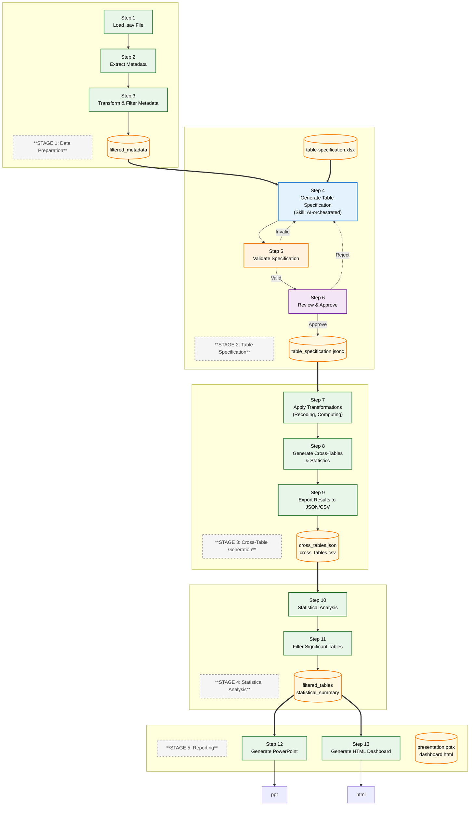

# Data Flow

This document describes the simplified workflow design for the Survey Analysis & Visualization system using a **Python library + Claude Code Skills** architecture.

---

## Table of Contents

1. [Overview](#1-overview)
2. [Architecture](#2-architecture)
3. [Data Flow](#3-data-flow)
4. [Table Specification](#4-table-specification)
5. [Workflow Steps](#5-workflow-steps)
6. [Key Terminology](#6-key-terminology)

---

## 1. Overview

### 1.1 Purpose

Design and implement an automated workflow for market research survey data analysis and visualization using a **Python library** orchestrated by **Claude Code Skills**. The system processes SPSS (.sav) survey data, applies AI-orchestrated transformations, generates indicators, performs statistical analysis, and produces outputs in PowerPoint and HTML formats.

### 1.2 Scope

| Aspect | Description |
|--------|-------------|
| **Input** | SPSS (.sav) survey data files |
| **Processing** | AI-orchestrated recoding, transformation, and indicator generation |
| **Output** | PowerPoint presentations, HTML dashboards with visualizations |
| **Target** | Market research industry professionals |

### 1.3 Key Objectives

| Objective | Description |
|-----------|-------------|
| **Simplicity** | Single consolidated artifact for all AI-generated specifications |
| **Modularity** | Pure Python library separate from AI orchestration |
| **Flexibility** | Handle various survey structures and question types |
| **Accuracy** | Maintain statistical rigor with significance testing |
| **Presentation** | Deliver insights through multiple formats (PPT, HTML) |

---

## 2. Architecture

### 2.1 Component Structure

```
┌─────────────────────────────────────────────────────────────────────────┐
│                        Claude Code Skills                          │
│  (AI Orchestration & Coordination)                            │
└────────────────────────────┬────────────────────────────────────────────┘
                         │
                         ▼
┌─────────────────────────────────────────────────────────────────────────┐
│                    survey_analyzer Library                        │
│  (Pure Python: Data Processing & Computation)                    │
├─────────────────────────────────────────────────────────────────────────┤
│ specification/  │ Schema & validator for table_specification.json      │
│ io/             │ SPSS file I/O (pyreadstat) and metadata handling      │
│ analysis/       │ Transformation engine, crosstabs, and indicators      │
│ filtering/      │ Significance filtering                                  │
│ reporting/      │ PowerPoint and HTML generation                       │
└─────────────────────────────────────────────────────────────────────────┘
```

### 2.2 Skill Responsibilities

| Skill | Stage | Purpose | Type |
|--------|---------|-----------|------|
| **stage1-data-prep** | 1 | Load .sav, extract/filter metadata | Deterministic |
| **stage2-spec-gen** | 2 | Generate/validate table specification (AI-orchestrated) | AI |
| **stage3-crosstabs** | 3 | Recoding, indicators, cross-tables | Deterministic |
| **stage4-statistics** | 4 | Statistical analysis, filtering | Deterministic |
| **stage5-reports** | 5 | PowerPoint, HTML dashboard | Deterministic |
| **survey-coordinator** | All | Orchestrate complete 5-stage pipeline | Coordinator |

---

## 3. Data Flow

The workflow consists of **13 steps** organized into **5 stages**:

### 3.1 Workflow Diagram



**Legend:**

| Shape | Meaning |
|-------|---------|
| `Rectangle` | **Processing Node** (Action/Step) |
| `Cylinder` | **Data Artifact** (Output/File) |

| Color | Meaning | Examples |
|-------|---------|----------|
| 🔵 **Blue** | AI-Orchestrated Processing (Skill generates artifact) | Step 4 |
| 🟢 **Green** | Deterministic Processing (Python library, pandas, scipy) | Steps 1-3, 7-13 |
| 🟠 **Orange** | Validation (Python checks syntax/references) | Step 5 |
| 🟣 **Purple** | Review (Human validates semantic quality) | Step 6 |
| 🟡 **Yellow** | Data Artifacts (Files and outputs) | `.sav`, `.csv`, `.json`, `.pptx`, `.html` |

**Line Styles:**
- `-->` Solid line: Forward flow to next step
- `==>` Thick line: Major data flow between stages
- `-.->` Dotted line: Feedback loop (validation/review triggering regeneration)

### 3.2 Stage Descriptions

| Stage | Steps | Description | Input | Output |
|-------|--------|-------------|-------|--------|
| **1** | 1-3 | Load data, extract/transform/filter metadata | .sav file | `filtered_metadata.json` |
| **2** | 4-6 | Generate, validate, review table specification (AI-orchestrated) | `filtered_metadata.json` + `table-specification.xlsx` | `table_specification.jsonc` |
| **3** | 7-9 | Apply transformations, generate cross-tables with statistics | `table_specification.jsonc` | `cross_tables.json`, `cross_tables.csv` |
| **4** | 10-11 | Statistical analysis and significance filtering | `cross_tables.json` | `filtered_tables.json`, `statistical_summary.json` |
| **5** | 12-13 | Generate PowerPoint and HTML dashboard | Filtered results | `presentation.pptx`, `dashboard.html` |

---

## 4. Table Specification

The **table_specification.jsonc** is a consolidated artifact generated from `filtered_metadata.json` and user-edited `table-specification.xlsx`.

### 4.1 Structure

```jsonc
{
  "spec_id": "crosstab_2024_consumer_survey_001",
  "project_id": "proj_2024_china_consumer_insights",
  "dataset_id": "ds_q1_2024_national_survey",
  "description": "Cross-tabulation analysis for market research survey",

  "filter_clause": {
    "age_min": 18,
    "age_max": 65,
    "exclude_incomplete": true
  },

  "weight_indicator": "weight1",

  "row_indicators": [
    {
      "indicator_code": "Q1_GENDER_RAW",
      "question_code": "Q1",
      "question_description": "Gender",
      "question_label": "请问您的性别是？(单选)",
      "question_type": "Single Choice",
      "source_variables": ["Q1_GENDER"],
      "transformation_rules": null,
      "statistic_type": "categorical"
    }
  ],

  "column_indicators": [
    {
      "indicator_code": "GENDER",
      "question_code": "Q1",
      "question_description": "Gender",
      "question_label": "性别",
      "question_type": "Single Choice",
      "source_variables": ["GENDER"],
      "explicit": ["1", "2"],
      "transformation_rules": null,
      "statistic_type": "categorical"
    }
  ]
}
```

### 4.2 Field Descriptions

| Field | Description | Source |
|-------|-------------|--------|
| `spec_id`, `project_id`, `dataset_id` | Project identification | Excel Metadata sheet |
| `filter_clause` | Data filtering rules | Excel Metadata sheet |
| `weight_indicator` | Weight variable name | Excel Weight Indicator sheet |
| `indicator_code` | Internal variable identifier | Generated |
| `question_code` | SPSS variable prefix (Q1, S1, D1) | Excel Question Code column |
| `question_description` | Concise English label | Excel Question Description column |
| `question_label` | Full Chinese question text | filtered_metadata.json |
| `question_type` | Single Choice, Multiple Choice, Matrix, etc. | Excel Question Type dropdown |
| `source_variables` | Real SPSS variable names | Mapped from question_code + metadata |
| `transformation_rules` | SPSS-compatible recoding syntax (parsed by Python) | Excel Transformation Rules column |
| `statistic_type` | categorical or scalar | Excel Statistic Type column |

### 4.3 Transformation Rules Format

The `transformation_rules` field uses **SPSS-compatible syntax** (parsed and applied by pure Python):

| Format | Example | Description |
|--------|---------|-------------|
| Single value | `(3=2)` | Recode value 3 to 2 |
| Range | `(1 THRU 3=99)` | Recode values 1-3 to 99 |
| Compute | `COMPUTE var = a + b` | Calculate new variable |
| Null | `null` | No transformation |

**Example:**
```jsonc
"transformation_rules": "(1 THRU 2=1) (3=2) (4 THRU 5=3)"
```

Applied by `TransformationEngine` using pandas:
```python
# Parsed and applied as: series.map({1: 1, 2: 1, 3: 2, 4: 3, 5: 3})
```

---

## 5. Workflow Steps

### Stage 1: Data Preparation (Steps 1-3)

| Step | Skill | Module | Purpose | Type |
|------|--------|---------|------|
| 1 | `stage1-data-prep` | `survey_analyzer.io.SPSSReader` | Load .sav file | Deterministic |
| 2 | `stage1-data-prep` | `survey_analyzer.io.MetadataTransformer` | Extract & transform metadata | Deterministic |
| 3 | `stage1-data-prep` | `survey_analyzer.io.MetadataTransformer` | Filter variables | Deterministic |

**Skill:** `stage1-data-prep` handles all Stage 1 operations.

**Output:** `filtered_metadata.json`

### Stage 2: Table Specification (Steps 4-6)

| Step | Skill | Purpose | Type |
|------|--------|---------|------|
| 4 | `stage2-spec-gen` | Generate table_specification.jsonc (AI-orchestrated) | AI |
| 5 | `stage2-spec-gen` | Validate specification | Validation |
| 6 | Human review via skill interaction | Approve/reject specification | Review |

**Skill:** `stage2-spec-gen` handles all Stage 2 operations.

**Inputs:**
- `filtered_metadata.json` (from Stage 1)
- `table-specification.xlsx` (user-edited Excel file)

**Output:** `table_specification.jsonc`

**Why AI Agent?**
- Requires intelligent interpretation of user selections from Excel
- Mapping question codes (Q1, S1) to real variable names from metadata
- Understanding transformation rule descriptions and validating semantic correctness
- Generating consolidated table_specification.jsonc from multiple sources

**Feedback Loop:** If validation fails or review rejects, regenerate from Step 4.

### Stage 3: Cross-Table Generation (Steps 7-9)

| Step | Skill | Module | Purpose | Type |
|------|--------|---------|------|
| 7 | `stage3-crosstabs` | `survey_analyzer.analysis.transformation.TransformationEngine` | Apply recoding and transformations | Deterministic |
| 8 | `stage3-crosstabs` | `survey_analyzer.analysis.crosstab.CrossTabGenerator` | Generate cross-tables with statistics | Deterministic |
| 9 | `stage3-crosstabs` | Exporter module | Export cross-tables to JSON/CSV | Deterministic |

**Skill:** `stage3-crosstabs` handles all Stage 3 operations.

**Input:** `table_specification.jsonc`

**Outputs:** `cross_tables.json`, `cross_tables.csv`

**Why Direct Programming?**
- Deterministic transformation and crosstab generation using pandas
- Chi-square test and Cramer's V calculation using scipy
- No AI interpretation needed

### Stage 4: Statistical Analysis (Steps 10-11)

| Step | Skill | Module | Purpose | Type |
|------|--------|---------|------|
| 10 | `stage4-statistics` | `survey_analyzer.analysis.statistics` | Calculate statistics (chi-square, Cramer's V) | Deterministic |
| 11 | `stage4-statistics` | `survey_analyzer.filtering.significance` | Filter significant tables by p-value | Deterministic |

**Skill:** `stage4-statistics` handles all Stage 4 operations.

**Outputs:** `statistical_summary.json`, `filtered_tables.json`

### Stage 5: Reporting (Steps 12-13)

| Step | Skill | Module | Purpose | Type |
|------|--------|---------|------|
| 12 | `stage5-reports` | `survey_analyzer.reporting.powerpoint` | Create .pptx | Deterministic |
| 13 | `stage5-reports` | `survey_analyzer.reporting.dashboard` | Create .html | Deterministic |

**Skill:** `stage5-reports` handles all Stage 5 operations.

**Outputs:** `presentation.pptx`, `dashboard.html`

---

## 6. Key Terminology

| Term | Definition |
|------|------------|
| **Table Specification (JSONC)** | Consolidated JSONC artifact containing row/column indicators with transformation rules |
| **Excel Specification** | User-friendly `table-specification.xlsx` for editing indicators, metadata, and settings |
| **question_code** | SPSS variable prefix (Q1, Q2, S1, S2, D1, D2) from Excel |
| **question_label** | Full Chinese question text from `filtered_metadata.json` |
| **question_description** | Concise English label from Excel |
| **question_type** | Single Choice, Multiple Choice, Matrix, Numeric Input, Rating Scale (dropdown in Excel) |
| **transformation_rules** | SPSS-compatible recoding syntax (parsed by Python) |
| **statistic_type** | `categorical` (column percent) or `scalar` (mean, median, min, max) |
| **AI-orchestrated step** | Workflow step where Skill uses AI to generate content (Stage 2) |
| **Deterministic processing** | Pure Python functions with predictable outputs (Stages 1, 3, 4, 5) |
| **Skill orchestration** | Claude Code Skills coordinating library module execution |
| **Specification validation** | Checking JSONC structure, variable references, and business logic |

---

## Related Documents

| Document | Content |
|----------|---------|
| **[project-structure.md](./project-structure.md)** | Complete directory structure and file locations |
| **[system-architecture.md](./system-architecture.md)** | System components, deployment, and troubleshooting |
| **[technology-stack.md](./technology-stack.md)** | Technologies and versions |
| **[System Configuration](./system-configuration.md)** | Configuration options and usage examples |
| **[features-and-usage.md](./features-and-usage.md)** | Product introduction for end users |
| **[web-interface.md](./web-interface.md)** | Agent Chat UI setup and usage |
