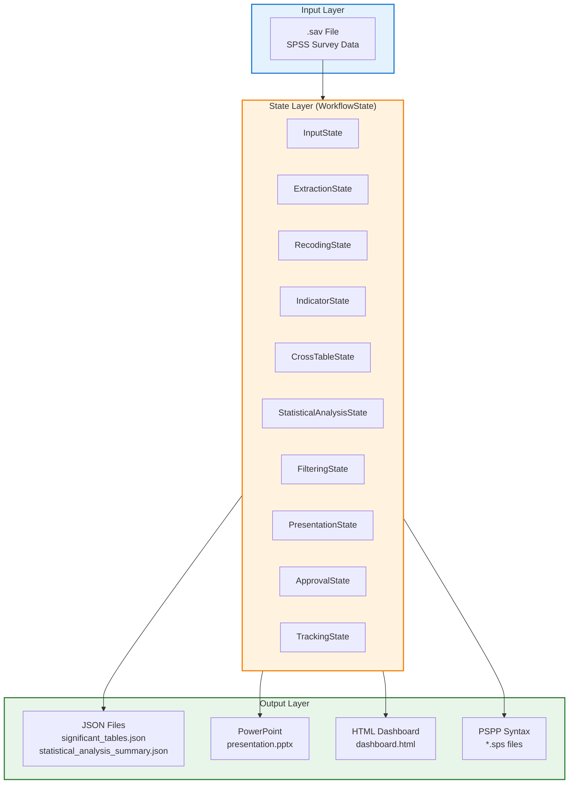
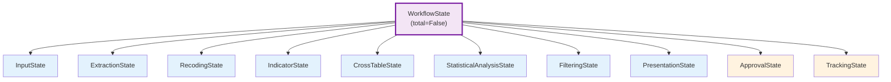

# Data Schema

This document describes all data structures, file formats, and schemas used in the Survey Analysis & Visualization Workflow.

---

## Table of Contents

1. [Overview](#1-overview)
2. [State Schema](#2-state-schema)
3. [File Format Schemas](#3-file-format-schemas)
4. [Data Transformation Flow](#4-data-transformation-flow)
5. [Validation Schemas](#5-validation-schemas)
6. [Configuration Schema](#6-configuration-schema)

---

## 1. Overview

### 1.1 Data Architecture



### 1.2 Schema Categories

| Category | Description | Examples |
|----------|-------------|----------|
| **State Schema** | TypedDict definitions for workflow state | `WorkflowState`, sub-states |
| **File Input** | External input data formats | `.sav` (SPSS) files |
| **File Output** | Generated output file schemas | `.json`, `.csv`, `.pptx`, `.html` |
| **Validation** | Data validation result structures | `ValidationResult`, feedback schemas |
| **Configuration** | Runtime configuration parameters | `DEFAULT_CONFIG` |

---

## 2. State Schema

The workflow uses a single evolving `WorkflowState` TypedDict that combines multiple function-specific sub-states.

### 2.1 State Hierarchy



### 2.2 InputState

```python
class InputState(TypedDict):
    """Initial input configuration - populated at workflow start"""
    spss_file_path: str           # Path to input .sav file
    config: Dict[str, Any]        # Configuration parameters
```

| Field | Type | Description |
|-------|------|-------------|
| `spss_file_path` | `str` | Absolute path to SPSS survey data file |
| `config` | `Dict[str, Any]` | Runtime configuration (see [Configuration Schema](#6-configuration-schema)) |

### 2.3 ExtractionState

```python
class ExtractionState(TypedDict):
    """Data extraction and preparation - Steps 1-3"""
    raw_data: Optional[object]                    # pandas DataFrame from .sav file
    original_metadata: Optional[Dict[str, Any]]   # Raw metadata from pyreadstat
    variable_centered_metadata: Optional[List[Dict[str, Any]]]  # Metadata grouped by variable
    filtered_metadata: Optional[List[Dict[str, Any]]]          # Metadata after filtering
    filtered_out_variables: Optional[List[Dict[str, Any]]]     # Variables removed + reasons
```

| Field | Type | Populated | Description |
|-------|------|-----------|-------------|
| `raw_data` | `DataFrame` | Step 1 | Survey response data |
| `original_metadata` | `Dict` | Step 1 | Raw SPSS variable metadata |
| `variable_centered_metadata` | `List[Dict]` | Step 2 | Metadata restructured by variable |
| `filtered_metadata` | `List[Dict]` | Step 3 | Variables requiring recoding |
| `filtered_out_variables` | `List[Dict]` | Step 3 | Excluded variables with reasons |

#### Variable Metadata Dictionary

```python
{
    "name": str,              # Variable name (e.g., "q1_satisfaction")
    "label": str,             # Variable label/description
    "variable_type": str,     # "numeric" | "string" | "date"
    "min_value": Optional[int],     # Minimum value (numeric variables)
    "max_value": Optional[int],     # Maximum value (numeric variables)
    "value_labels": Optional[Dict[int, str]]  # Category labels (e.g., {1: "Strongly Disagree"})
}
```

### 2.4 RecodingState

```python
class RecodingState(TypedDict):
    """New dataset generation through LLM-orchestrated recoding - Steps 4-8"""

    # Three-node pattern fields (Steps 4-6)
    recoding_rules: Optional[Dict[str, Any]]
    recoding_rules_json_path: Optional[str]
    recoding_iteration: int
    recoding_validation: Optional[Dict[str, Any]]
    recoding_feedback: Optional[Dict[str, Any]]
    recoding_feedback_source: Optional[Literal["validation", "human"]]
    recoding_approved: bool

    # PSPP execution fields (Steps 7-8)
    pspp_recoding_syntax: Optional[str]
    pspp_recoding_syntax_path: Optional[str]
    new_data_path: Optional[str]
    new_metadata: Optional[Dict[str, Any]]
```

| Field | Type | Populated | Description |
|-------|------|-----------|-------------|
| `recoding_rules` | `Dict` | Step 4 | AI-generated recoding rules |
| `recoding_rules_json_path` | `str` | Step 4 | Saved recoding rules file |
| `recoding_iteration` | `int` | Step 4+ | Current iteration count |
| `recoding_validation` | `Dict` | Step 5 | Automated validation results |
| `recoding_feedback` | `Dict` | Step 5/6 | Feedback from validation or human |
| `recoding_feedback_source` | `str` | Step 5/6 | `"validation"` or `"human"` |
| `recoding_approved` | `bool` | Step 6 | Human approval status |
| `pspp_recoding_syntax` | `str` | Step 7 | Generated PSPP syntax |
| `pspp_recoding_syntax_path` | `str` | Step 7 | Saved syntax file |
| `new_data_path` | `str` | Step 8 | Path to new dataset .sav file |
| `new_metadata` | `Dict` | Step 8 | Complete metadata from new_data.sav |

### 2.5 IndicatorState

```python
class IndicatorState(TypedDict):
    """Indicator generation and semantic grouping - Steps 9-11"""

    indicators: Optional[Dict[str, Any]]
    indicators_json_path: Optional[str]
    indicators_iteration: int
    indicators_validation: Optional[Dict[str, Any]]
    indicators_feedback: Optional[Dict[str, Any]]
    indicators_feedback_source: Optional[Literal["validation", "human"]]
    indicators_approved: bool
    indicator_metadata: Optional[List[Dict]]
```

| Field | Type | Populated | Description |
|-------|------|-----------|-------------|
| `indicators` | `Dict` | Step 9 | Generated indicator definitions |
| `indicators_json_path` | `str` | Step 9 | Saved indicators file |
| `indicators_iteration` | `int` | Step 9+ | Current iteration count |
| `indicators_validation` | `Dict` | Step 10 | Validation results |
| `indicators_feedback` | `Dict` | Step 10/11 | Feedback from validation or human |
| `indicators_feedback_source` | `str` | Step 10/11 | `"validation"` or `"human"` |
| `indicators_approved` | `bool` | Step 11 | Human approval status |
| `indicator_metadata` | `List[Dict]` | Step 9 | Metadata for indicator generation |

### 2.6 CrossTableState

```python
class CrossTableState(TypedDict):
    """Cross-table specification and generation - Steps 12-16"""

    table_specifications: Optional[Dict[str, Any]]
    table_specs_json_path: Optional[str]
    table_specs_iteration: int
    table_specs_validation: Optional[Dict[str, Any]]
    table_specs_feedback: Optional[Dict[str, Any]]
    table_specs_feedback_source: Optional[Literal["validation", "human"]]
    table_specs_approved: bool

    pspp_table_syntax: Optional[str]
    pspp_table_syntax_path: Optional[str]
    cross_table_sav_path: Optional[str]
    weighting_variable: Optional[str]
```

| Field | Type | Populated | Description |
|-------|------|-----------|-------------|
| `table_specifications` | `Dict` | Step 12 | Table structure definitions |
| `table_specs_json_path` | `str` | Step 12 | Saved table specs |
| `table_specs_iteration` | `int` | Step 12+ | Current iteration count |
| `table_specs_validation` | `Dict` | Step 13 | Validation results |
| `table_specs_feedback` | `Dict` | Step 13/14 | Feedback from validation or human |
| `table_specs_feedback_source` | `str` | Step 13/14 | `"validation"` or `"human"` |
| `table_specs_approved` | `bool` | Step 14 | Human approval status |
| `pspp_table_syntax` | `str` | Step 15 | Generated cross-table syntax |
| `pspp_table_syntax_path` | `str` | Step 15 | Saved syntax file |
| `cross_table_sav_path` | `str` | Step 16 | Path to cross-table .sav file |
| `weighting_variable` | `str` | Config | Weighting variable for cross-tables |

### 2.7 StatisticalAnalysisState

```python
class StatisticalAnalysisState(TypedDict):
    """Python script generation and Chi-square statistics computation - Steps 17-18"""

    python_stats_script: Optional[str]
    python_stats_script_path: Optional[str]
    all_small_tables: Optional[List[Dict[str, Any]]]
    statistical_summary_path: Optional[str]
    statistical_summary: Optional[List[Dict[str, Any]]]
```

| Field | Type | Populated | Description |
|-------|------|-----------|-------------|
| `python_stats_script` | `str` | Step 17 | Generated Python script |
| `python_stats_script_path` | `str` | Step 17 | Saved script file |
| `all_small_tables` | `List[Dict]` | Step 18 | All tables with chi-square stats |
| `statistical_summary_path` | `str` | Step 18 | Path to summary JSON file |
| `statistical_summary` | `List[Dict]` | Step 18 | Statistical test results |

### 2.8 FilteringState

```python
class FilteringState(TypedDict):
    """Filter list generation and significant tables selection - Steps 19-20"""

    filter_list: Optional[List[Dict[str, Any]]]
    filter_list_json_path: Optional[str]
    significant_tables: Optional[List[Dict[str, Any]]]
    significant_tables_json_path: Optional[str]
```

| Field | Type | Populated | Description |
|-------|------|-----------|-------------|
| `filter_list` | `List[Dict]` | Step 19 | Pass/fail status for all tables |
| `filter_list_json_path` | `str` | Step 19 | Saved filter list |
| `significant_tables` | `List[Dict]` | Step 20 | Tables filtered by significance |
| `significant_tables_json_path` | `str` | Step 20 | Saved filtered tables |

### 2.9 PresentationState

```python
class PresentationState(TypedDict):
    """Final output generation - Steps 21-22"""

    powerpoint_path: Optional[str]
    html_dashboard_path: Optional[str]
    charts_generated: Optional[List[Dict[str, Any]]]
```

| Field | Type | Populated | Description |
|-------|------|-----------|-------------|
| `powerpoint_path` | `str` | Step 21 | Generated PowerPoint file |
| `html_dashboard_path` | `str` | Step 22 | Generated HTML dashboard |
| `charts_generated` | `List[Dict]` | Step 21/22 | Chart metadata |

### 2.10 ApprovalState

```python
class ApprovalState(TypedDict):
    """Human-in-the-loop approval tracking (crosses all steps)"""

    approval_comments: List[Dict[str, Any]]
    pending_approval_step: Optional[str]
```

| Field | Type | Description |
|-------|------|-------------|
| `approval_comments` | `List[Dict]` | Human feedback history |
| `pending_approval_step` | `str` | Current step awaiting review |

#### Approval Comment Schema

```python
{
    "step": str,              # "recoding" | "indicators" | "table_specs"
    "decision": str,          # "approved" | "rejected" | "modified"
    "comments": str,          # Human comments
    "timestamp": str          # ISO timestamp
}
```

### 2.11 TrackingState

```python
class TrackingState(TypedDict):
    """Execution tracking (crosses all steps)"""

    execution_log: List[Dict[str, Any]]
    errors: List[str]
    warnings: List[str]
```

| Field | Type | Description |
|-------|------|-------------|
| `execution_log` | `List[Dict]` | Step-by-step execution log |
| `errors` | `List[str]` | Error messages |
| `warnings` | `List[str]` | Warning messages |

#### Execution Log Entry Schema

```python
{
    "step": str,              # Step name
    "status": str,            # "pending" | "completed" | "failed" | "skipped"
    "reason": Optional[str],  # Reason for status
    "error": Optional[str],   # Error message
    "output_path": Optional[str],  # File path
    "timestamp": str          # ISO timestamp
}
```

---

## 3. File Format Schemas

### 3.1 Input File: SPSS (.sav)

The `.sav` file format is the standard SPSS/PASW statistics data file format.

| Component | Description |
|-----------|-------------|
| **Library** | `pyreadstat` |
| **Content** | Survey response data + variable metadata |
| **Extraction** | `pyreadstat.read_sav()` |

#### Extracted Metadata Structure

```python
{
    "number_columns": int,
    "number_rows": int,
    "column_labels": Dict[str, str],        # variable_name -> label
    "column_value_labels": Dict[str, Dict], # variable_name -> {value: label}
    "variable_types": Dict[str, str]        # variable_name -> type
}
```

### 3.2 Output Files: JSON Schemas

#### 3.2.1 Recoding Rules (`recoding_rules.json`)

```json
{
    "recoding_rules": [
        {
            "id": "string",
            "source_variable": "string",
            "target_variable": "string",
            "rule_type": "mapping" | "range" | "formula",
            "transformations": [
                {
                    "source": [int | string],
                    "target": int | string,
                    "label": "string"
                }
            ],
            "description": "string"
        }
    ]
}
```

| Field | Type | Description |
|-------|------|-------------|
| `source_variable` | `str` | Original variable name (must exist in metadata) |
| `target_variable` | `str` | New variable name (must be unique) |
| `rule_type` | `str` | Type of recoding rule |
| `transformations` | `List` | Array of transformation mappings |
| `description` | `str` | Human-readable description |

#### 3.2.2 Indicators (`indicators.json`)

```json
{
    "indicators": [
        {
            "id": "string",
            "description": "string",
            "metric": "average" | "percentage" | "distribution",
            "underlying_variables": ["string", ...],
            "theme": "string"
        }
    ]
}
```

| Field | Type | Description |
|-------|------|-------------|
| `id` | `str` | Unique identifier |
| `description` | `str` | Human-readable description |
| `metric` | `str` | Type of metric |
| `underlying_variables` | `List[str]` | Variable names in this indicator |
| `theme` | `str` | Semantic theme (e.g., "satisfaction", "demographics") |

#### 3.2.3 Table Specifications (`table_specifications.json`)

```json
{
    "tables": [
        {
            "id": "string",
            "description": "string",
            "row_indicators": ["string", ...],
            "column_indicators": ["string", ...],
            "sort_rows": "none" | "asc" | "desc",
            "sort_columns": "none" | "asc" | "desc",
            "min_count": 10,
            "cramers_v_threshold": 0.1
        }
    ],
    "weighting_variable": "string" | null
}
```

| Field | Type | Description |
|-------|------|-------------|
| `row_indicators` | `List[str]` | Variables for table rows |
| `column_indicators` | `List[str]` | Variables for table columns |
| `sort_rows` | `str` | Row sorting order |
| `sort_columns` | `str` | Column sorting order |
| `min_count` | `int` | Minimum cell count threshold |
| `cramers_v_threshold` | `float` | Minimum Cramer's V effect size |
| `weighting_variable` | `str` | Variable to weight by |

#### 3.2.4 Significant Tables (`significant_tables.json`)

```json
{
    "tables": [
        {
            "name": "string",
            "rows": "string",
            "columns": "string",
            "data": {
                "row_labels": ["string", ...],
                "column_labels": ["string", ...],
                "counts": [
                    [int, int, ...],
                    [int, int, ...]
                ],
                "row_percentages": [
                    [float, float, ...],
                    [float, float, ...]
                ],
                "column_percentages": [
                    [float, float, ...],
                    [float, float, ...]
                ]
            },
            "statistics": {
                "chi_square": float,
                "p_value": float,
                "degrees_of_freedom": int,
                "cramers_v": float,
                "interpretation": "negligible" | "small" | "medium" | "large"
            },
            "sample_size": int
        }
    ]
}
```

| Field | Type | Description |
|-------|------|-------------|
| `row_labels` | `List[str]` | Category labels for rows |
| `column_labels` | `List[str]` | Category labels for columns |
| `counts` | `List[List[int]]` | 2D array of cell counts |
| `row_percentages` | `List[List[float]]` | Row percentages |
| `column_percentages` | `List[List[float]]` | Column percentages |
| `statistics` | `Dict` | Chi-square test results |
| `sample_size` | `int` | Total sample size |

#### 3.2.5 Statistical Analysis Summary (`statistical_analysis_summary.json`)

```json
[
    {
        "table_name": "string",
        "chi_square": float,
        "p_value": float,
        "degrees_of_freedom": int,
        "cramers_v": float,
        "interpretation": "negligible" | "small" | "medium" | "large",
        "sample_size": int,
        "is_significant": boolean
    }
]
```

| Field | Type | Description |
|-------|------|-------------|
| `table_name` | `str` | Table identifier |
| `chi_square` | `float` | Chi-square statistic |
| `p_value` | `float` | P-value for significance test |
| `degrees_of_freedom` | `int` | Degrees of freedom |
| `cramers_v` | `float` | Effect size (0-1) |
| `interpretation` | `str` | Effect size category |
| `sample_size` | `int` | Total sample size |
| `is_significant` | `bool` | Meets significance threshold |

#### 3.2.6 Filter List (`filter_list.json`)

```json
[
    {
        "table_name": "string",
        "passes_cramers_v": boolean,
        "passes_sample_size": boolean,
        "passes_significance": boolean,
        "include": boolean,
        "reason": "string"
    }
]
```

### 3.3 Output Files: Other Formats

| File | Format | Description |
|------|--------|-------------|
| `presentation.pptx` | PowerPoint | Executive summary with significant tables |
| `dashboard.html` | HTML | Full report with all tables and charts |
| `*.sps` | PSPP Syntax | Generated PSPP command files |

---

## 4. Data Transformation Flow

### 4.1 State Evolution Timeline

```mermaid
graph TD
    STEP0["Step 0<br/>InputState<br/>spss_file_path<br/>config"]
    STEP1["Step 1<br/>ExtractionState<br/>raw_data<br/>original_metadata"]
    STEP2["Step 2<br/>variable_centered_metadata"]
    STEP3["Step 3<br/>filtered_metadata<br/>filtered_out_variables"]
    STEP4["Step 4<br/>RecodingState<br/>recoding_rules"]
    STEP5["Step 5<br/>recoding_validation"]
    STEP6["Step 6<br/>recoding_approved"]
    STEP7["Step 7<br/>pspp_recoding_syntax"]
    STEP8["Step 8<br/>new_data_path<br/>new_metadata"]
    STEP9["Step 9<br/>IndicatorState<br/>indicators"]
    STEP10["Step 10<br/>indicators_validation"]
    STEP11["Step 11<br/>indicators_approved"]
    STEP12["Step 12<br/>CrossTableState<br/>table_specifications"]
    STEP13["Step 13<br/>table_specs_validation"]
    STEP14["Step 14<br/>table_specs_approved"]
    STEP15["Step 15<br/>pspp_table_syntax"]
    STEP16["Step 16<br/>cross_table_sav_path"]
    STEP17["Step 17<br/>StatisticalAnalysisState<br/>python_stats_script"]
    STEP18["Step 18<br/>statistical_summary"]
    STEP19["Step 19<br/>FilteringState<br/>filter_list"]
    STEP20["Step 20<br/>significant_tables"]
    STEP21["Step 21<br/>PresentationState<br/>powerpoint_path"]
    STEP22["Step 22<br/>html_dashboard_path"]

    STEP0 --> STEP1 --> STEP2 --> STEP3
    STEP3 --> STEP4 --> STEP5 --> STEP6
    STEP6 --> STEP7 --> STEP8
    STEP8 --> STEP9 --> STEP10 --> STEP11
    STEP11 --> STEP12 --> STEP13 --> STEP14
    STEP14 --> STEP15 --> STEP16
    STEP16 --> STEP17 --> STEP18
    STEP18 --> STEP19 --> STEP20
    STEP20 --> STEP21
    STEP16 --> STEP22

    style STEP0 fill:#e3f2fd
    style STEP1 fill:#e8f5e9
    style STEP4 fill:#fff9c4
    style STEP9 fill:#fff9c4
    style STEP12 fill:#fff9c4
    style STEP17 fill:#e8f5e9
    style STEP19 fill:#e8f5e9
    style STEP21 fill:#c8e6c9
    style STEP22 fill:#c8e6c9
```



### 4.2 Data Flow Summary

| Stage | Input | Key Transformation | Output |
|-------|-------|-------------------|--------|
| **1** | `.sav` file | Extract data and metadata | `raw_data`, `original_metadata` |
| **2** | Original metadata | Group by variable | `variable_centered_metadata` |
| **3** | Variable metadata | Filter out不需要的变量 | `filtered_metadata` |
| **4** | Filtered metadata | LLM generates recoding rules | `recoding_rules` |
| **7** | Recoding rules | Convert to PSPP syntax | `pspp_recoding_syntax` |
| **8** | Original data + PSPP | Execute recoding | `new_data.sav`, `new_metadata` |
| **9** | New metadata | LLM groups variables | `indicators` |
| **12** | New metadata + indicators | LLM defines tables | `table_specifications` |
| **15** | Table specs | Convert to PSPP syntax | `pspp_table_syntax` |
| **16** | New data + PSPP | Execute CTABLES | `cross_table.sav` |
| **18** | Cross-table data | Chi-square analysis | `statistical_summary` |
| **20** | All tables + stats | Filter by significance | `significant_tables` |
| **21** | Significant tables | Generate PowerPoint | `presentation.pptx` |
| **22** | All tables | Generate HTML dashboard | `dashboard.html` |

---

## 5. Validation Schemas

### 5.1 ValidationResult

```python
@dataclass
class ValidationResult:
    """Standard validation result structure"""
    is_valid: bool
    errors: List[str]
    warnings: List[str]
    checks_performed: List[str]
```

| Field | Type | Description |
|-------|------|-------------|
| `is_valid` | `bool` | Overall validation status |
| `errors` | `List[str]` | Critical errors that must be fixed |
| `warnings` | `List[str]` | Non-critical issues |
| `checks_performed` | `List[str]` | List of validation checks run |

### 5.2 Feedback Schema

```python
{
    "iteration": int,
    "source": "validation" | "human",
    "is_valid": bool,
    "errors": [str, ...],
    "warnings": [str, ...],
    "issues": [str, ...],      # Human-identified issues
    "suggestions": [str, ...]  # Human suggestions
}
```

### 5.3 Validation Checks

#### Recoding Rules Validation

| Check | Description | Error Condition |
|-------|-------------|-----------------|
| **Source variable exists** | Verify source variable in metadata | Variable not found |
| **Target variable unique** | Ensure no duplicate targets | Duplicate name |
| **Valid range** | Range rules have start ≤ end | Invalid range |
| **Non-overlapping** | Source ranges don't overlap | Overlapping ranges |
| **JSON syntax** | Valid JSON structure | Parse error |

#### Indicators Validation

| Check | Description | Error Condition |
|-------|-------------|-----------------|
| **Variables exist** | All variables in metadata | Variable not found |
| **Min variables** | At least 2 per indicator | Too few variables |
| **Unique names** | No duplicate indicator names | Duplicate name |

#### Table Specifications Validation

| Check | Description | Error Condition |
|-------|-------------|-----------------|
| **Variables exist** | Row/column vars in metadata | Variable not found |
| **Categorical only** | Variables are categorical | Continuous variable |
| **Valid statistics** | Statistics match table type | Invalid stat |

---

## 6. Configuration Schema

### 6.1 DEFAULT_CONFIG

```python
DEFAULT_CONFIG = {
    # LLM Configuration
    "model": "gpt-4",
    "temperature": 0.7,
    "max_tokens": 2000,

    # Three-Node Pattern
    "max_self_correction_iterations": 3,
    "enable_human_review": True,

    # Step 3: Filtering
    "cardinality_threshold": 30,
    "filter_binary": True,
    "filter_other_text": True,

    # PSPP
    "pspp_path": "/usr/bin/pspp",
    "pspp_output_path": "output/pspp_logs.txt",

    # File Paths
    "output_dir": "output",
    "temp_dir": "temp",

    # Statistical Analysis
    "significance_level": 0.05,
    "min_cramers_v": 0.1,
    "min_cell_count": 10,

    # Presentation
    "powerpoint_template": None,
    "html_theme": "default"
}
```

### 6.2 Configuration Sections

| Category | Option | Type | Default | Description |
|----------|--------|------|---------|-------------|
| **LLM** | `model` | `str` | `"gpt-4"` | OpenAI model |
| **LLM** | `temperature` | `float` | `0.7` | LLM temperature |
| **LLM** | `max_tokens` | `int` | `2000` | Max response tokens |
| **Pattern** | `max_self_correction_iterations` | `int` | `3` | Max retry iterations |
| **Pattern** | `enable_human_review` | `bool` | `True` | Enable human review |
| **Filter** | `cardinality_threshold` | `int` | `30` | Max distinct values |
| **Filter** | `filter_binary` | `bool` | `True` | Filter binary vars |
| **Filter** | `filter_other_text` | `bool` | `True` | Filter text fields |
| **PSPP** | `pspp_path` | `str` | `"/usr/bin/pspp"` | PSPP executable |
| **PSPP** | `pspp_output_path` | `str` | `"output/pspp_logs.txt"` | Log file |
| **Paths** | `output_dir` | `str` | `"output"` | Output directory |
| **Paths** | `temp_dir` | `str` | `"temp"` | Temp directory |
| **Stats** | `significance_level` | `float` | `0.05` | P-value threshold |
| **Stats** | `min_cramers_v` | `float` | `0.1` | Min effect size |
| **Stats** | `min_cell_count` | `int` | `10` | Min expected count |
| **Output** | `powerpoint_template` | `str` | `None` | Custom template |
| **Output** | `html_theme` | `str` | `"default"` | HTML theme |

---

## Related Documents

| Document | Content |
|----------|---------|
| **[Data Flow](./data-flow.md)** | Workflow design and step specifications |
| **[System Architecture](./system-architecture.md)** | System components, deployment, and troubleshooting |
| **[Configuration](./configuration.md)** | Configuration options and usage examples |
| **[Implementation Specifications](./implementation-specifications.md)** | Technical implementation details |
| **[Project Structure](./project-structure.md)** | Directory structure and file locations |
| **[Web Interface](./web-interface.md)** | Agent Chat UI setup and usage |
| **[User Guide](./features-and-usage.md)** | Product introduction for end users |
