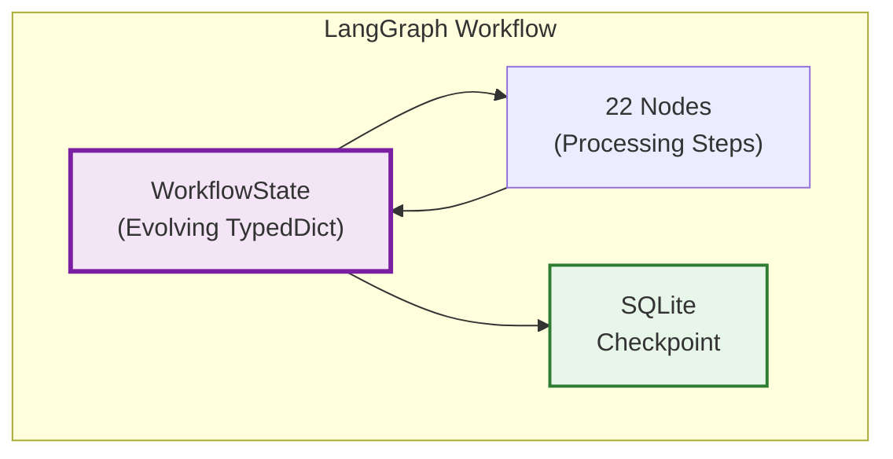
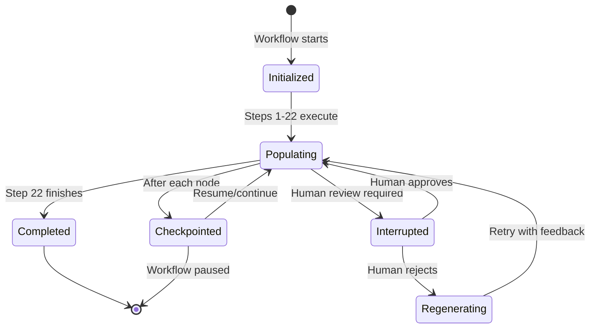
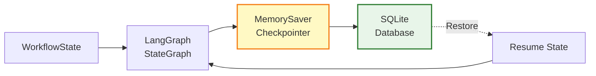
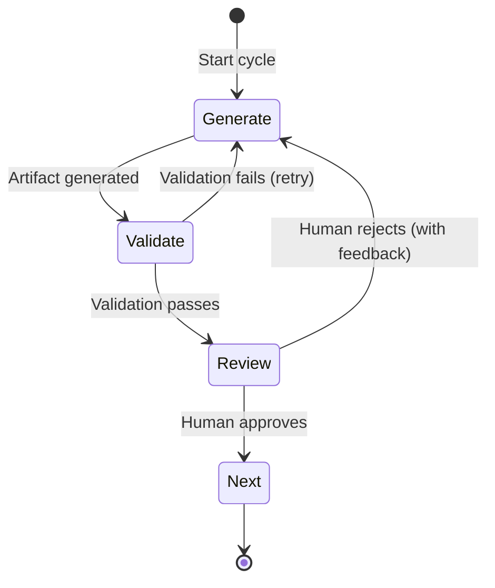

# State Management

This document describes the state evolution, lifecycle, and persistence mechanisms for the Survey Analysis & Visualization Workflow.

---

## Table of Contents

1. [Overview](#1-overview)
2. [State Structure](#2-state-structure)
3. [State Evolution](#3-state-evolution)
4. [State Lifecycle](#4-state-lifecycle)
5. [Checkpoint Persistence](#5-checkpoint-persistence)
6. [State Initialization](#6-state-initialization)
7. [Three-Node Pattern State Flow](#7-three-node-pattern-state-flow)

---

## 1. Overview

### 1.1 State Architecture

The workflow uses LangGraph's state management with a single evolving `WorkflowState` object that accumulates data across 22 steps.



### 1.2 State Properties

| Property | Description |
|----------|-------------|
| **Type** | `TypedDict` with `total=False` (all fields optional) |
| **Inheritance** | Multiple inheritance from 10 sub-states |
| **Evolution** | Incrementally populated as workflow progresses |
| **Persistence** | SQLite checkpointing for resumable execution |

---

## 2. State Structure

### 2.1 State Hierarchy

```mermaid
graph TD
    WORKFLOW["WorkflowState<br/>total=False"]

    WORKFLOW --> INPUT["InputState"]
    WORKFLOW --> EXTRACTION["ExtractionState"]
    WORKFLOW --> RECODING["RecodingState"]
    WORKFLOW --> INDICATOR["IndicatorState"]
    WORKFLOW --> CROSSTABLE["CrossTableState"]
    WORKFLOW --> STATS["StatisticalAnalysisState"]
    WORKFLOW --> FILTERING["FilteringState"]
    WORKFLOW --> PRESENTATION["PresentationState"]
    WORKFLOW --> APPROVAL["ApprovalState"]
    WORKFLOW --> TRACKING["TrackingState"]

    style WORKFLOW fill:#f3e5f5,stroke:#7b1fa2,stroke-width:3px
    style INPUT fill:#e3f2fd,stroke:#1976d2,stroke-width:2px
    style EXTRACTION fill:#e3f2fd,stroke:#1976d2,stroke-width:2px
    style RECODING fill:#e3f2fd,stroke:#1976d2,stroke-width:2px
    style INDICATOR fill:#e3f2fd,stroke:#1976d2,stroke-width:2px
    style CROSSTABLE fill:#e3f2fd,stroke:#1976d2,stroke-width:2px
    style STATS fill:#e3f2fd,stroke:#1976d2,stroke-width:2px
    style FILTERING fill:#e3f2fd,stroke:#1976d2,stroke-width:2px
    style PRESENTATION fill:#e3f2fd,stroke:#1976d2,stroke-width:2px
    style APPROVAL fill:#fff3e0,stroke:#f57c00,stroke-width:2px
    style TRACKING fill:#fff3e0,stroke:#f57c00,stroke-width:2px
```



### 2.2 Sub-State Summary

| Sub-State | Steps | Field Count | Purpose |
|-----------|-------|-------------|---------|
| `InputState` | 0 | 2 | Initial input configuration |
| `ExtractionState` | 1-3 | 5 | Data extraction and filtering |
| `RecodingState` | 4-8 | 10 | New dataset generation |
| `IndicatorState` | 9-11 | 8 | Indicator generation |
| `CrossTableState` | 12-16 | 10 | Cross-table generation |
| `StatisticalAnalysisState` | 17-18 | 5 | Statistical tests |
| `FilteringState` | 19-20 | 4 | Significant table selection |
| `PresentationState` | 21-22 | 3 | Output generation |
| `ApprovalState` | Cross-step | 2 | Human-in-the-loop tracking |
| `TrackingState` | Cross-step | 3 | Execution logging |

### 2.3 Field Types by Category

| Category | Fields | Data Type |
|----------|--------|-----------|
| **Input paths** | `spss_file_path`, `*_path` | `str` |
| **Configuration** | `config`, `max_*` | `Dict[str, Any]`, `int` |
| **Metadata** | `*_metadata` | `Dict` or `List[Dict]` |
| **AI artifacts** | `recoding_rules`, `indicators`, `table_specifications` | `Dict` |
| **Validation** | `*_validation`, `*_approved` | `Dict`, `bool` |
| **Feedback** | `*_feedback`, `*_feedback_source` | `Dict`, `str` |
| **Iterations** | `*_iteration` | `int` |
| **Outputs** | `powerpoint_path`, `html_dashboard_path` | `str` |
| **Execution** | `execution_log`, `errors`, `warnings` | `List[Dict]`, `List[str]` |

---

## 3. State Evolution

### 3.1 Evolution Timeline

```mermaid
graph TD
    STEP0["Step 0<br/>InputState"]
    STEP1["Step 1<br/>raw_data<br/>original_metadata"]
    STEP2["Step 2<br/>variable_centered_metadata"]
    STEP3["Step 3<br/>filtered_metadata<br/>filtered_out_variables"]
    STEP4["Step 4<br/>recoding_rules<br/>recoding_iteration"]
    STEP5["Step 5<br/>recoding_validation"]
    STEP6["Step 6<br/>recoding_approved"]
    STEP7["Step 7<br/>pspp_recoding_syntax<br/>pspp_recoding_syntax_path"]
    STEP8["Step 8<br/>new_data_path<br/>new_metadata"]
    STEP9["Step 9<br/>indicators<br/>indicators_iteration"]
    STEP10["Step 10<br/>indicators_validation"]
    STEP11["Step 11<br/>indicators_approved"]
    STEP12["Step 12<br/>table_specifications<br/>table_specs_iteration"]
    STEP13["Step 13<br/>table_specs_validation"]
    STEP14["Step 14<br/>table_specs_approved"]
    STEP15["Step 15<br/>pspp_table_syntax<br/>pspp_table_syntax_path"]
    STEP16["Step 16<br/>cross_table_sav_path"]
    STEP17["Step 17<br/>python_stats_script<br/>python_stats_script_path"]
    STEP18["Step 18<br/>statistical_summary<br/>statistical_summary_path"]
    STEP19["Step 19<br/>filter_list<br/>filter_list_json_path"]
    STEP20["Step 20<br/>significant_tables<br/>significant_tables_json_path"]
    STEP21["Step 21<br/>powerpoint_path"]
    STEP22["Step 22<br/>html_dashboard_path<br/>charts_generated"]

    STEP0 --> STEP1 --> STEP2 --> STEP3
    STEP3 --> STEP4 --> STEP5 --> STEP6
    STEP6 --> STEP7 --> STEP8
    STEP8 --> STEP9 --> STEP10 --> STEP11
    STEP11 --> STEP12 --> STEP13 --> STEP14
    STEP14 --> STEP15 --> STEP16
    STEP16 --> STEP17 --> STEP18
    STEP18 --> STEP19 --> STEP20
    STEP20 --> STEP21
    STEP16 --> STEP22

    style STEP0 fill:#e3f2fd
    style STEP1 fill:#e8f5e9
    style STEP2 fill:#e8f5e9
    style STEP3 fill:#e8f5e9
    style STEP4 fill:#fff9c4
    style STEP5 fill:#ffe0b2
    style STEP6 fill:#e1bee7
    style STEP7 fill:#e8f5e9
    style STEP8 fill:#e8f5e9
    style STEP9 fill:#fff9c4
    style STEP10 fill:#ffe0b2
    style STEP11 fill:#e1bee7
    style STEP12 fill:#fff9c4
    style STEP13 fill:#ffe0b2
    style STEP14 fill:#e1bee7
    style STEP15 fill:#e8f5e9
    style STEP16 fill:#e8f5e9
    style STEP17 fill:#e8f5e9
    style STEP18 fill:#e8f5e9
    style STEP19 fill:#e8f5e9
    style STEP20 fill:#e8f5e9
    style STEP21 fill:#c8e6c9
    style STEP22 fill:#c8e6c9
```



### 3.2 Evolution Table

| Step | Sub-State | Key Fields Added | Optional Fields Still None |
|------|-----------|------------------|----------------------------|
| 0 | `InputState` | `spss_file_path`, `config` | All other fields |
| 1 | `ExtractionState` | `raw_data`, `original_metadata` | `variable_centered_metadata`, `filtered_metadata` |
| 2 | `ExtractionState` | `variable_centered_metadata` | `filtered_metadata` |
| 3 | `ExtractionState` | `filtered_metadata`, `filtered_out_variables` | All extraction fields complete |
| 4 | `RecodingState` | `recoding_rules`, `recoding_iteration` | Validation/feedback fields |
| 5 | `RecodingState` | `recoding_validation` | `recoding_feedback`, `recoding_approved` |
| 6 | `RecodingState` | `recoding_approved` | May have `recoding_feedback` |
| 7 | `RecodingState` | `pspp_recoding_syntax`, `pspp_recoding_syntax_path` | `new_data_path` |
| 8 | `RecodingState` | `new_data_path`, `new_metadata` | All recoding fields complete |
| 9 | `IndicatorState` | `indicators`, `indicators_iteration` | Validation/feedback fields |
| 10 | `IndicatorState` | `indicators_validation` | `indicators_feedback`, `indicators_approved` |
| 11 | `IndicatorState` | `indicators_approved` | All indicator fields complete |
| 12 | `CrossTableState` | `table_specifications`, `table_specs_iteration` | Validation/feedback fields |
| 13 | `CrossTableState` | `table_specs_validation` | `table_specs_feedback`, `table_specs_approved` |
| 14 | `CrossTableState` | `table_specs_approved` | May have `table_specs_feedback` |
| 15 | `CrossTableState` | `pspp_table_syntax`, `pspp_table_syntax_path` | `cross_table_sav_path` |
| 16 | `CrossTableState` | `cross_table_sav_path` | All cross-table fields complete |
| 17 | `StatisticalAnalysisState` | `python_stats_script`, `python_stats_script_path` | `statistical_summary` |
| 18 | `StatisticalAnalysisState` | `statistical_summary`, `statistical_summary_path` | All statistics fields complete |
| 19 | `FilteringState` | `filter_list`, `filter_list_json_path` | `significant_tables` |
| 20 | `FilteringState` | `significant_tables`, `significant_tables_json_path` | All filtering fields complete |
| 21 | `PresentationState` | `powerpoint_path` | `html_dashboard_path` |
| 22 | `PresentationState` | `html_dashboard_path`, `charts_generated` | All fields complete |

### 3.3 Key Transition Points

| Transition | Significance |
|------------|--------------|
| **Step 3 → Step 4** | Transition from deterministic extraction to AI-orchestrated recoding |
| **Step 8** | `new_metadata` becomes authoritative source (all variables) |
| **Step 16** | All data tables generated, ready for statistical analysis |
| **Step 18** | Statistical summary available for filtering |
| **Step 20** | `significant_tables` ready for PowerPoint generation |

---

## 4. State Lifecycle

### 4.1 Lifecycle Stages



### 4.2 Lifecycle States

| State | Description | Trigger |
|-------|-------------|---------|
| **Initialized** | State created with input fields | Workflow start |
| **Populating** | Fields being added by nodes | Node execution |
| **Checkpointed** | State saved to SQLite | After each node |
| **Interrupted** | Awaiting human review | Review node entered |
| **Regenerating** | AI re-generating artifact | Human rejected |
| **Completed** | All fields populated | Step 22 complete |

### 4.3 State Invariants

| Invariant | Description |
|-----------|-------------|
| **Immutability** | Nodes return new state, never modify in-place |
| **Accumulation** | Fields once populated remain (unless explicitly reset) |
| **Optional Until Set** | All fields optional until their step completes |
| **Type Consistency** | Field types never change across workflow |
| **Cross-Step Fields** | `execution_log`, `errors`, `warnings` updated throughout |

---

## 5. Checkpoint Persistence

### 5.1 Checkpoint Architecture



### 5.2 Checkpoint Points

Checkpoints are saved:

| Point | When | Purpose |
|-------|------|---------|
| **After each node** | Node completes successfully | Resume from any step |
| **Before review nodes** | Human review imminent | Resume after human input |
| **After review** | Human decision recorded | Continue with decision |
| **On error** | Node fails | Debug and retry |

### 5.3 Checkpoint Schema

The SQLite checkpoint stores:

| Field | Type | Description |
|-------|------|-------------|
| `thread_id` | str | Unique workflow identifier |
| `checkpoint_id` | str | Checkpoint sequence identifier |
| `state` | bytes | Serialized WorkflowState |
| `timestamp` | datetime | When checkpoint was created |
| `step` | str | Last completed step |

### 5.4 Resuming from Checkpoint

```python
# Resume from checkpoint
graph = compile_graph_with_checkpointer(checkpointer)

# Load existing state
config = {"configurable": {"thread_id": "existing_thread_id"}}
state = graph.get_state(config)

# Continue execution
result = graph.invoke(None, config)
```

---

## 6. State Initialization

### 6.1 Initial State Template

```python
def create_initial_state(spss_file_path: str, config: Dict[str, Any]) -> WorkflowState:
    """
    Create initial workflow state with populated input fields.

    Args:
        spss_file_path: Path to input .sav file
        config: Configuration parameters

    Returns:
        Initialized WorkflowState with only InputState fields populated
    """
    return {
        # InputState - Populated
        "spss_file_path": spss_file_path,
        "config": config,

        # ExtractionState - All None
        "raw_data": None,
        "original_metadata": None,
        "variable_centered_metadata": None,
        "filtered_metadata": None,
        "filtered_out_variables": None,

        # RecodingState - All None
        "recoding_rules": None,
        "recoding_rules_json_path": None,
        "recoding_iteration": 1,  # Start at 1
        "recoding_validation": None,
        "recoding_feedback": None,
        "recoding_feedback_source": None,
        "recoding_approved": False,
        "pspp_recoding_syntax": None,
        "pspp_recoding_syntax_path": None,
        "new_data_path": None,
        "new_metadata": None,

        # IndicatorState - All None
        "indicators": None,
        "indicators_json_path": None,
        "indicators_iteration": 1,
        "indicators_validation": None,
        "indicators_feedback": None,
        "indicators_feedback_source": None,
        "indicators_approved": False,
        "indicator_metadata": None,

        # CrossTableState - All None
        "table_specifications": None,
        "table_specs_json_path": None,
        "table_specs_iteration": 1,
        "table_specs_validation": None,
        "table_specs_feedback": None,
        "table_specs_feedback_source": None,
        "table_specs_approved": False,
        "pspp_table_syntax": None,
        "pspp_table_syntax_path": None,
        "cross_table_sav_path": None,
        "weighting_variable": None,

        # StatisticalAnalysisState - All None
        "python_stats_script": None,
        "python_stats_script_path": None,
        "all_small_tables": None,
        "statistical_summary_path": None,
        "statistical_summary": None,

        # FilteringState - All None
        "filter_list": None,
        "filter_list_json_path": None,
        "significant_tables": None,
        "significant_tables_json_path": None,

        # PresentationState - All None
        "powerpoint_path": None,
        "html_dashboard_path": None,
        "charts_generated": None,

        # ApprovalState - Initialized empty
        "approval_comments": [],
        "pending_approval_step": None,

        # TrackingState - Initialized empty
        "execution_log": [],
        "errors": [],
        "warnings": []
    }
```

### 6.2 Default Values

| Field | Default | Rationale |
|-------|---------|-----------|
| `*_iteration` | `1` | First iteration |
| `*_approved` | `False` | Requires approval |
| `approval_comments` | `[]` | Empty list |
| `execution_log` | `[]` | Empty list |
| `errors` | `[]` | Empty list |
| `warnings` | `[]` | Empty list |
| All others | `None` | Not yet populated |

---

## 7. Three-Node Pattern State Flow

### 7.1 Pattern State Machine



### 7.2 Recoding State Flow

| Node | State Changes |
|------|---------------|
| **Generate (Step 4)** | `recoding_rules`, `recoding_iteration++`, `recoding_rules_json_path` |
| **Validate (Step 5)** | `recoding_validation` |
| **Review (Step 6)** | `recoding_approved`, possibly `recoding_feedback` |

### 7.3 Indicator State Flow

| Node | State Changes |
|------|---------------|
| **Generate (Step 9)** | `indicators`, `indicators_iteration++`, `indicators_json_path` |
| **Validate (Step 10)** | `indicators_validation` |
| **Review (Step 11)** | `indicators_approved`, possibly `indicators_feedback` |

### 7.4 Table Specifications State Flow

| Node | State Changes |
|------|---------------|
| **Generate (Step 12)** | `table_specifications`, `table_specs_iteration++`, `table_specs_json_path` |
| **Validate (Step 13)** | `table_specs_validation` |
| **Review (Step 14)** | `table_specs_approved`, possibly `table_specs_feedback` |

### 7.5 Feedback Loop State Changes

When validation fails or human rejects:

| Field | Set To | Purpose |
|-------|--------|---------|
| `*_feedback` | Validation result or human feedback | Contains errors/issues |
| `*_feedback_source` | `"validation"` or `"human"` | Indicates who provided feedback |
| `*_iteration` | Incremented | Tracks retry attempt |

On retry:

| Field | Action |
|-------|--------|
| `*_iteration` | Increment |
| `*_feedback` | Updated with new feedback |
| `*_validation` | Re-computed |
| `*_approved` | Reset to `False` |

---

## Related Documents

| Document | Content |
|----------|---------|
| **[Data Schema](./data-schema.md)** | Complete TypedDict definitions and field details |
| **[Business Rules](./business-rules.md)** | Filtering criteria and validation rules |
| **[Data Flow](./data-flow.md)** | Workflow design and step specifications |
| **[System Architecture](./system-architecture.md)** | Checkpoint and persistence mechanisms |
