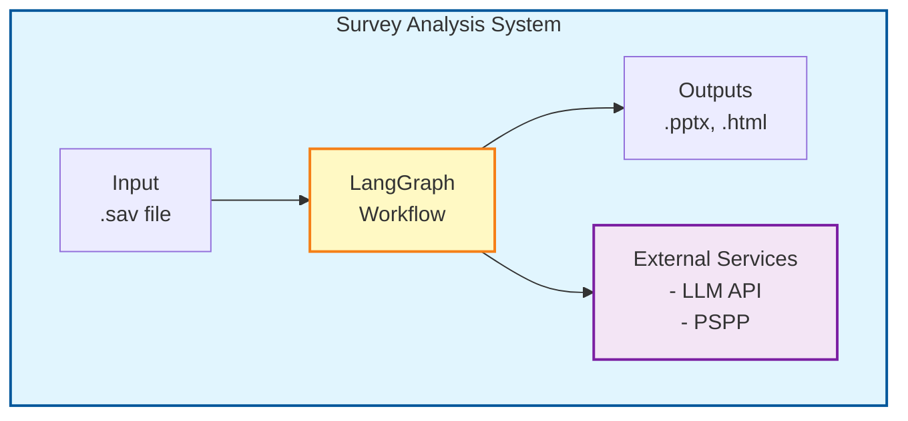
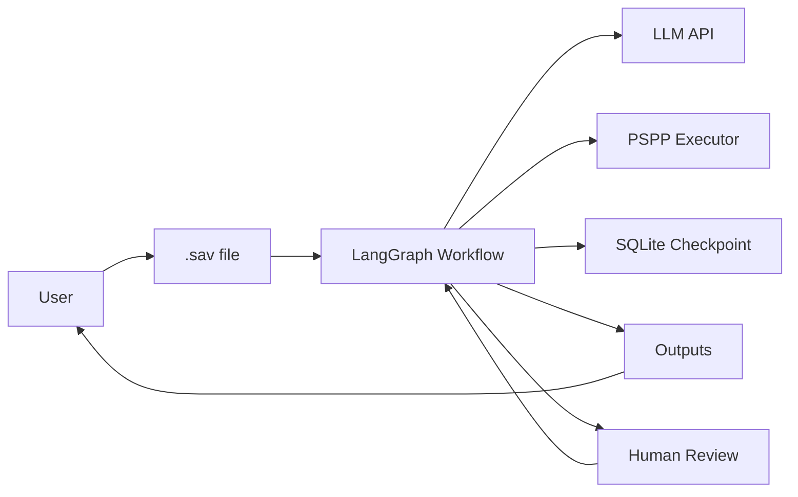

# System Architecture

This document describes the system architecture and components for the Survey Analysis & Visualization Workflow.

> **For deployment, installation, and environment configuration**, see [Deployment](./deployment.md).

---

## Table of Contents

1. [System Overview](#1-system-overview)
2. [Component Architecture](#2-component-architecture)
3. [Module Organization](#3-module-organization)
4. [Error Handling & Recovery](#4-error-handling--recovery)

---

## 1. System Overview

The system is a LangGraph-based workflow application that automates survey data analysis for market research professionals.

### 1.1 Architecture Type

| Aspect | Description |
|--------|-------------|
| **Pattern** | State-based workflow with human-in-the-loop |
| **Execution Model** | Sequential with conditional branching |
| **State Management** | TypedDict-based evolving state |
| **Persistence** | SQLite checkpointing for resumable execution |

### 1.2 System Boundaries



---

## 2. Component Architecture

### 2.1 Core Components

| Component | Responsibility | Technology |
|-----------|----------------|------------|
| **Workflow Engine** | Orchestrates 22-step workflow, manages state | LangGraph |
| **Node Executors** | Implements individual workflow steps | Python |
| **Validation Layer** | Validates LLM-generated artifacts | Python |
| **State Manager** | Maintains evolving workflow state | TypedDict |
| **Checkpoint Service** | Persists state for resumable execution | SQLite |
| **LLM Client** | Communicates with OpenAI API | langchain-openai |
| **PSPP Executor** | Runs statistical operations | subprocess + PSPP |

### 2.2 Component Interaction



---

## 3. Module Organization

### 3.1 Module Responsibilities

| Module | Responsibility |
|--------|---------------|
| **state.py** | Defines all TypedDict state classes and combined WorkflowState |
| **graph.py** | Constructs StateGraph, adds nodes/edges, compiles with checkpointer |
| **edges.py** | Conditional routing functions for three-node pattern feedback loops |
| **nodes/** | Implements all 22 workflow steps organized by phase |
| **utils/** | PSPP wrapper, file I/O, statistical computation helpers |
| **validation/** | Validation logic for recoding rules, indicators, table specs |
| **llm/** | Prompt templates and LLM client initialization |

> **For complete directory structure and file organization**, see [Project Structure](./project-structure.md).

---

## 4. Error Handling & Recovery

### 5.1 Error Categories

| Category | Examples | Handling Strategy |
|----------|----------|-------------------|
| **LLM Errors** | Rate limits, API failures | Retry with exponential backoff |
| **Validation Errors** | Invalid references, syntax errors | Automatic retry up to max_iterations, then continue with warning |
| **PSPP Errors** | Syntax errors, file not found | Parse PSPP output logs, provide specific error messages |
| **File I/O Errors** | Missing files, permission errors | Validate paths before execution, fail gracefully |
| **Statistical Errors** | Insufficient sample size | Warn and continue, mark table as invalid |

### 5.2 Logging Strategy

| Log Level | Usage | Storage |
|-----------|-------|---------|
| **INFO** | Step start, completion, key outputs | `output/logs/` |
| **WARNING** | Validation failures, skipped items | `output/logs/` + state |
| **ERROR** | Exceptions, failures | `output/logs/` + state |
| **DEBUG** | Detailed execution trace | `output/logs/debug/` |

### 5.3 Recovery Mechanisms

| Mechanism | Purpose |
|-----------|---------|
| **SQLite Checkpointing** | Resume after human interrupt or crash |
| **Automatic Retry** | Validation errors trigger LLM regeneration |
| **Graceful Degradation** | Continue with warnings on non-critical failures |
| **State Snapshots** | Save state before each three-node pattern |

---

## 5. Troubleshooting

### 6.1 Common Issues

| Issue | Cause | Solution |
|-------|-------|----------|
| **PSPP not found** | PSPP not installed or wrong path | Install PSPP or set `PSPP_PATH` |
| **API key error** | Missing/invalid OpenAI key | Check `.env` file |
| **Memory error** | Large survey file | Increase available RAM |
| **Validation loop** | LLM generates invalid output | Increase `max_self_correction_iterations` |
| **Permission denied** | Cannot write to output directory | Check directory permissions |

### 6.2 Error Messages

| Error | Meaning | Action |
|-------|---------|--------|
| `Variable not found in metadata` | LLM referenced non-existent variable | Review will catch this; approve with feedback |
| `PSPP syntax error` | Generated PSPP code is invalid | Check `output/pspp_logs.txt` |
| `Insufficient sample size` | Cell count too small for chi-square | Table marked as invalid; continues |
| `Max iterations exceeded` | Validation keeps failing | Review manually; provide guidance |

### 6.3 Getting Help

1. **Check logs**: `output/logs/` for detailed error messages
2. **Review PSPP output**: `output/pspp_logs.txt` for PSPP errors
3. **Verify input**: Ensure .sav file is valid SPSS format
4. **Check configuration**: Verify all required config values are set

### 6.4 Debug Mode

```bash
# Enable debug logging
export LOG_LEVEL=DEBUG
python -m agent.graph --input survey.sav
```

---

## Related Documents

- **[Deployment](./deployment.md)** - Installation, environment configuration, and operations
- **[Web Interface](./web-interface.md)** - Agent Chat UI setup and usage
- **[Project Structure](./project-structure.md)** - Complete directory structure and file locations
- **[Data Flow](./data-flow.md)** - Workflow design and step specifications
- **[Technology Stack](./technology-stack.md)** - Technologies and versions
- **[Configuration](./configuration.md)** - Configuration options and usage examples
- **[Product Features and Usage](./user-guide.md)** - Product introduction for end users
- **[Implementation Specifications](./implementation-specifications.md)** - Technical implementation details
