# Survey Data Analysis & Visualization Workflow Design

# Table of Contents

1. [Overview](#1-overview)
2. [Workflow Architecture](#2-workflow-architecture)
   - 2.1 [High-Level Pipeline](#21-high-level-pipeline)
   - 2.2 [Phase Descriptions](#22-phase-descriptions)
   - 2.3 [Key Architectural Patterns](#23-key-architectural-patterns)
     - 2.3.1 [Three-Node Pattern](#231-three-node-pattern)
     - 2.3.2 [State Management](#232-state-management)
   - 2.4 [Data Flow Diagram](#24-data-flow-diagram)
3. [Step Specifications](#3-step-specifications)
4. [Configuration](#4-configuration)
5. [Technology Stack](#5-technology-stack)
6. [Project Structure](#6-project-structure)
7. [Execution Example](#7-execution-example)
8. [Error Handling & Recovery](#8-error-handling--recovery)
9. [Future Enhancements](#9-future-enhancements)
10. [Human-in-the-Loop Implementation](#10-human-in-the-loop-implementation)
11. [Appendix](#11-appendix)

---

## 1. Overview

### 1.1 Purpose

Design and implement an automated workflow for market research survey data analysis and visualization using LangGraph. The system processes PSPP survey data, applies LLM-orchestrated transformations, generates indicators, performs statistical analysis, and produces outputs in PowerPoint and HTML formats.

### 1.2 Scope

- **Input**: PSPP (.sav) survey data files
- **Processing**: LLM-orchestrated recoding, transformation, and indicator generation
- **Output**: PowerPoint presentations, HTML dashboards with visualizations
- **Target**: Market research industry professionals

### 1.3 Key Objectives

| Objective | Description |
|-----------|-------------|
| Automation | Minimize manual intervention in survey data processing |
| Intelligence | Leverage LLMs to generate meaningful recoding and grouping rules |
| Flexibility | Handle various survey structures and question types |
| Accuracy | Maintain statistical rigor with significance testing |
| Presentation | Deliver insights through multiple formats (PPT, HTML) |

---

## 2. Workflow Architecture

### 2.1 High-Level Pipeline

```mermaid
flowchart TD
    subgraph P1["**Phase 1: Extraction & Preparation**<br/>Ingest raw .sav data and prepare metadata"]
        S1["**Step 1**<br/>Extract .sav File<br/>(.sav file → raw data + metadata)"]
        S2["**Step 2**<br/>Transform Metadata<br/>(section-based → variable-centered)"]
        S3["**Step 3**<br/>Filter Metadata<br/>(remove variables not needing recoding)"]
        RAW["**Output**<br/>RAW DATA & FILTERED METADATA"]
        S1 --> S2
        S2 --> S3
        S3 -.-> RAW
    end

    subgraph P2["**Phase 2: New Dataset Generation**<br/>LLM generates, validates, and reviews recoding rules (3 separate steps)"]
        S4["**Step 4: Generate Recoding Rules** 🤖<br/>(LLM creates rules)"]
        S5["**Step 5: Validate Recoding Rules** ✓<br/>(Python checks rules)"]
        S6["**Step 6: Review Recoding Rules** 👤<br/>(Human approves/refines)"]
        S7["**Step 7**<br/>Generate PSPP Syntax<br/>(convert rules to PSPP)"]
        S8["**Step 8**<br/>Execute PSPP<br/>(apply transformations)"]
        NEW_DATA_SAV["**Output 1**<br/>NEW_DATA.SAV"]
        NEW_META["**Output 2**<br/>NEW_METADATA<br/>(all variables, via pyreadstat)"]

        S4 --> S5
        S5 -->|Valid| S6
        S5 -->|Invalid<br/>(under max retries)| S4
        S6 -->|Approve| S7
        S6 -->|Reject/Modify| S4
        S7 --> S8
        S8 -.-> NEW_DATA_SAV
        NEW_DATA_SAV ==>|pyreadstat| NEW_META
    end

    subgraph P3["**Phase 3: Indicator Generation**<br/>LLM generates, validates, and reviews indicators (3 separate steps)"]
        S9["**Step 9: Generate Indicators** 🤖<br/>(LLM groups variables)"]
        S10["**Step 10: Validate Indicators** ✓<br/>(Python checks structure)"]
        S11["**Step 11: Review Indicators** 👤<br/>(Human approves/refines)"]
        INDICATORS["**Output**<br/>INDICATORS (SEMANTIC GROUPS)"]

        S9 --> S10
        S10 -->|Valid| S11
        S10 -->|Invalid<br/>(under max retries)| S9
        S11 -->|Approve| S12
        S11 -->|Reject/Modify| S9
    end

    subgraph P4["**Phase 4: Cross-Table Generation**<br/>LLM generates, validates, and reviews table specs, then generates PSPP syntax"]
        S12["**Step 12: Generate Table Specs** 🤖<br/>(LLM defines tables)"]
        S13["**Step 13: Validate Table Specs** ✓<br/>(Python checks references)"]
        S14["**Step 14: Review Table Specs** 👤<br/>(Human approves/refines)"]
        S15["**Step 15**<br/>Generate PSPP Syntax<br/>(convert specs to PSPP)"]
        S16["**Step 16**<br/>Execute PSPP<br/>(generate CSV/JSON)"]
        CROSSTAB["**Output**<br/>CROSS TABLES (.csv + .json)"]

        S12 --> S13
        S13 -->|Valid| S14
        S13 -->|Invalid<br/>(under max retries)| S12
        S14 -->|Approve| S15
        S14 -->|Reject/Modify| S12
        S15 --> S16
        S16 -.-> CROSSTAB
    end

    subgraph P5["**Phase 5: Statistical Analysis**<br/>Compute Chi-square and effect sizes"]
        S17["**Step 17**<br/>Generate Python Stats Script<br/>(create script)"]
        S18["**Step 18**<br/>Execute Python Stats Script<br/>(run analysis)"]
        STATS["**Output**<br/>STATISTICAL SUMMARY<br/>(Chi-square, Cramer's V)"]

        S17 --> S18
        S18 -.-> STATS
    end

    subgraph P6["**Phase 6: Significant Tables Selection**<br/>Filter tables by statistical significance"]
        S19["**Step 19**<br/>Generate Filter List<br/>(create filter criteria)"]
        S20["**Step 20**<br/>Apply Filter to Tables<br/>(select significant)"]
        FILTERED["**Output**<br/>SIGNIFICANT TABLES<br/>(filtered results)"]

        S19 --> S20
        S20 -.-> FILTERED
    end

    subgraph P7["**Phase 7: Executive Summary**<br/>Generate PowerPoint presentation"]
        S21["**Step 21**<br/>Generate PowerPoint<br/>(create PPT)"]
        PPT["**Output**<br/>PRESENTATION (.pptx)"]

        S21 -.-> PPT
    end

    subgraph P8["**Phase 8: Full Report**<br/>Generate HTML dashboard"]
        S22["**Step 22**<br/>Generate HTML Dashboard<br/>(create HTML)"]
        HTML["**Output**<br/>DASHBOARD (.html)"]

        S22 -.-> HTML
    end

    %% Phase connections
    RAW ==> S4
    NEW_META ==> S9
    INDICATORS ==> S12
    CROSSTAB ==> S17
    STATS ==> S19
    FILTERED ==> S21
    CROSSTAB ==> S22

    %% Styling
    style P1 fill:#e3f2fd,stroke:#1976d2,stroke-width:2px
    style P2 fill:#f3e5f5,stroke:#7b1fa2,stroke-width:2px
    style P3 fill:#e3f2fd,stroke:#1976d2,stroke-width:2px
    style P4 fill:#f3e5f5,stroke:#7b1fa2,stroke-width:2px
    style P5 fill:#e8f5e9,stroke:#2e7d32,stroke-width:2px
    style P6 fill:#fff3e0,stroke:#f57c00,stroke-width:2px
    style P7 fill:#c8e6c9,stroke:#1b5e20,stroke-width:2px
    style P8 fill:#c8e6c9,stroke:#1b5e20,stroke-width:2px
```

### 2.2 Phase Descriptions

| Phase | Description | Input | Output |
|-------|-------------|-------|--------|
| **1** | Extraction & Preparation | .sav file | Raw data, filtered metadata |
| **2** | New Dataset Generation | Filtered metadata, original .sav file | new_data.sav (complete dataset) + new_metadata (all variables via pyreadstat) |
| **3** | Indicator Generation | new_metadata from Phase 2 | Indicator definitions |
| **4** | Cross-Table Generation | new_metadata from Phase 2 | Cross-table CSV + JSON |
| **5** | Statistical Analysis | Cross-table CSV + JSON | Statistical summary (Chi-square, Cramer's V) |
| **6** | Significant Tables Selection | Statistical summary + cross-table data | Significant tables only |
| **7** | Executive Summary Presentation | Significant tables | PowerPoint presentation |
| **8** | Full Report Dashboard | Cross-table data (all tables) | HTML dashboard |

### 2.3 Key Architectural Patterns

#### 2.3.1 Three-Node Pattern

**Overview**: The three-node pattern (Generate → Validate → Review) is implemented as **separate workflow steps** for three LLM-orchestrated processes:

- **Steps 4-6**: Recoding Rules - Generate (LLM), Validate (Python), Review (Human)
- **Steps 9-11**: Indicators - Generate (LLM), Validate (Python), Review (Human)
- **Steps 12-14**: Table Specifications - Generate (LLM), Validate (Python), Review (Human)

Each three-node group enables **automated validation** (Python) and iterative refinement before human review.

**Pattern Visualization**:

```mermaid
flowchart TD
    GENERATE["**Generate** 🤖<br/>(LLM creates artifact)"]
    VALIDATE["**Validate** ✓<br/>(Python checks objective criteria)"]
    REVIEW["**Review** 👤<br/>(Human validates semantic quality)"]

    GENERATE --> VALIDATE
    VALIDATE -->|Valid| REVIEW
    VALIDATE -->|Invalid + Under Max Retries| GENERATE
    REVIEW -->|Approve| END["**Next Step**"]
    REVIEW -->|Reject/Modify| GENERATE

    style GENERATE fill:#e3f2fd,stroke:#1976d2,stroke-width:3px
    style VALIDATE fill:#fff3e0,stroke:#f57c00,stroke-width:3px
    style REVIEW fill:#f3e5f5,stroke:#7b1fa2,stroke-width:3px
    style END fill:#c8e6c9,stroke:#388e3c,stroke-width:3px
```



**Component Responsibilities**:

| Node | Technology | Responsibility |
|------|------------|----------------|
| **Generate node** | LLM | Creates artifacts (recoding rules, indicators, table specs) with prompts for initial generation, validation retry, or human feedback |
| **Validate node** | Python code | Objective checks: syntax (JSON structure, required fields), references (variable names exist, types match), constraints (value ranges, logical consistency) |
| **Review node** | Human via LangGraph interrupt | Semantic validation: reviews artifact + validation report, approves/rejects/provides feedback |

**Feedback Loops**:

- **Validation feedback**: Objective errors trigger automatic retry up to `max_iterations` (typically 3). Example: "Variable 'age_group' not found in metadata"
- **Review feedback**: Semantic concerns trigger iteration with human guidance. Example: "Group satisfaction differently - use top-2-box instead of top-3-box"

**Iteration Tracking**:
```python
# Example for recoding rules:
{
    "recoding_rules": {...},              # Generated artifact
    "recoding_validation": {...},          # Validation results
    "recoding_feedback": {...},            # Feedback from validation OR human
    "recoding_iteration": 2,               # Current iteration count
    "recoding_feedback_source": "validation" | "human"  # Where feedback came from
}

# Same pattern applies to indicators and table_specs:
# - indicators: indicators, indicators_validation, indicators_feedback, indicators_iteration, indicators_feedback_source
# - table_specs: table_specifications, table_specs_validation, table_specs_feedback, table_specs_iteration, table_specs_feedback_source
```

**Benefits**:

- **Automated validation**: Python code validates LLM-generated output before human review, catching objective errors (syntax, references, constraints) and reducing review burden
- **Quality improvement**: Iteration on validation failures catches errors early
- **Reduced human load**: Only validated outputs reach human review (fewer trivial errors to manually catch)
- **Traceability**: Complete audit trail of iterations, feedback, and decisions
- **Clear separation**: Objective validation (Python) vs semantic validation (Human)

> **For detailed implementation examples, prompts, and validation specifications, see [Survey Analysis Detailed Specifications](./SURVEY_ANALYSIS_DETAILED_SPECIFICATIONS.md)**

#### 2.3.2 State Management

The workflow maintains a single state object (`WorkflowState`) that evolves through each node. State fields are organized into functionally-specific sub-states to reduce complexity.

**State Structure**:

```python
from typing import TypedDict, List, Dict, Any, Optional
from pandas import DataFrame

# Core state fields (simplified - see detailed specs for complete definitions)

class InputState(TypedDict):
    """Initial input configuration"""
    spss_file_path: str
    config: Dict[str, Any]

class ExtractionState(TypedDict):
    """Data extraction and preparation - Steps 1-3"""
    raw_data: DataFrame
    original_metadata: Dict[str, Any]
    variable_centered_metadata: List[Dict]
    filtered_metadata: List[Dict]
    filtered_out_variables: List[Dict]

class RecodingState(TypedDict):
    """New dataset generation through LLM-orchestrated recoding - Steps 4-8"""
    # Three-node pattern fields
    recoding_rules: Dict[str, Any]
    recoding_iteration: int
    recoding_validation: Dict[str, Any]
    recoding_feedback: Optional[Dict]
    recoding_feedback_source: Optional[str]
    recoding_approved: bool

    # PSPP execution fields
    pspp_recoding_syntax: str
    new_data_path: str
    new_metadata: Dict[str, Any]  # Complete metadata from new_data.sav

# Similar states for: IndicatorState, CrossTableState, StatisticalAnalysisState,
# FilteringState, PresentationState, ApprovalState, TrackingState

class WorkflowState(
    InputState,
    ExtractionState,
    RecodingState,
    # ... other sub-states
    total=False  # Fields are optional, populated when their step completes
):
    """Combined workflow state inheriting all functionally-specific sub-states"""
    pass
```

**Key Concepts**:

| Concept | Description |
|---------|-------------|
| **State fields** | Individual data items in the state object (e.g., `recoding_rules`, `new_metadata`) |
| **State inheritance** | `WorkflowState` inherits from all sub-state classes, combining their fields |
| **State evolution** | Fields are populated incrementally as steps complete (enabled by `total=False`) |
| **Task-scoped state views** | Within three-node patterns, relevant fields are grouped logically (e.g., recoding fields for Steps 4-6) |

**State Evolution by Step**:

| Step | Sub-State | Key Fields Added |
|------|-----------|------------------|
| 0 | `InputState` | `spss_file_path`, `config` |
| 1-3 | `ExtractionState` | `raw_data`, `variable_centered_metadata`, `filtered_metadata` |
| 4-8 | `RecodingState` | `recoding_rules`, `pspp_recoding_syntax`, `new_data_path`, `new_metadata` (complete metadata with all variables) |
| 9-11 | `IndicatorState` | `indicators`, `indicators_approved` |
| 12-14 | `CrossTableState` | `table_specifications`, `table_specs_approved` |
| 15-16 | `CrossTableState` | `pspp_table_syntax`, `cross_table_csv_path`, `cross_table_json_path` |
| 17-18 | `StatisticalAnalysisState` | `python_stats_script_path`, `statistical_summary`, `statistical_summary_path` |
| 19-20 | `FilteringState` | `filter_list`, `filter_list_json_path`, `significant_tables`, `significant_tables_json_path` |
| 21-22 | `PresentationState` | `powerpoint_path`, `html_dashboard_path`, `charts_generated` |

**Metadata Evolution**:

- **Steps 1-3**: Produce `variable_centered_metadata` (only variables needing recoding, filtered from original)
- **Step 8**: Produces `new_metadata` which contains ALL variables (original + recoded)
- **Steps 9-22**: Use `new_metadata` as the authoritative metadata source

This creates a clean architectural boundary: **Stage 1** (Steps 1-8) produces the analysis-ready dataset, **Stage 2** (Steps 9-22) consumes it.

> **For complete TypedDict definitions and detailed field descriptions, see [Survey Analysis Detailed Specifications](./SURVEY_ANALYSIS_DETAILED_SPECIFICATIONS.md#state-management)**

### 2.4 Data Flow Diagram

```mermaid
flowchart TD
    %% Define styles
    classDef inputFileStyle fill:#e1f5fe,stroke:#01579b,stroke-width:3px,color:#000
    classDef traditionalStyle fill:#e8f5e9,stroke:#2e7d32,stroke-width:2px,color:#000
    classDef aiStyle fill:#f3e5f5,stroke:#7b1fa2,stroke-width:3px,color:#000
    classDef dataFileStyle fill:#fff3e0,stroke:#ef6c00,stroke-width:2px,color:#000
    classDef outputStyle fill:#c8e6c9,stroke:#1b5e20,stroke-width:3px,color:#000
    classDef aiGenerateStyle fill:#e3f2fd,stroke:#1976d2,stroke-width:3px,color:#000
    classDef validationStyle fill:#fff3e0,stroke:#f57c00,stroke-width:2px,color:#000
    classDef reviewStyle fill:#f3e5f5,stroke:#7b1fa2,stroke-width:2px,color:#000
    classDef stageLabelStyle fill:#f5f5f5,stroke:#9e9e9e,stroke-width:2px,stroke-dasharray: 5 5,color:#424242

    %% STAGE 1: Data Preparation (Phases 1-2)
    subgraph STAGE1[" "]
        direction TB
        stage1_label["**STAGE 1: Data Preparation**<br/>Extract raw data and enrich with new variables"]:::stageLabelStyle

        %% Phase 1: Extraction & Preparation
        subgraph P1["Phase 1: Extraction & Preparation"]
            sav1(["📁 .sav File<br/>(Input)"]):::inputFileStyle
            rawData["raw_data<br/>(DataFrame)"]:::traditionalStyle
            origMeta["original_metadata"]:::traditionalStyle
            varMeta["variable_centered_metadata"]:::traditionalStyle
            filtMeta["filtered_metadata"]:::traditionalStyle
            filtOut["filtered_out_variables"]:::traditionalStyle
        end

        %% Phase 2: New Dataset Generation
        subgraph P2["Phase 2: New Dataset Generation"]
            recodingGen["recoding_rules<br/>(Generate) 🤖"]:::aiGenerateStyle
            recodingVal["recoding_rules<br/>(Validate) ✓"]:::validationStyle
            recodingRev["recoding_rules<br/>(Review) 👤"]:::reviewStyle
            recodingValidation["recoding_validation"]:::traditionalStyle
            psppRecodeSyntax["pspp_recoding_syntax<br/>(.sps)"]:::traditionalStyle
            sav2(["📁 new_data.sav"]):::dataFileStyle
            newMetadata["new_metadata<br/>(all variables)"]:::traditionalStyle
        end
    end

    %% STAGE 2: Analysis & Reporting (Phases 3-8)
    subgraph STAGE2[" "]
        direction TB
        stage2_label["**STAGE 2: Analysis & Reporting**<br/>Generate indicators, tables, statistics, and reports"]:::stageLabelStyle

        %% Phase 3: Indicator Generation
        subgraph P3["Phase 3: Indicator Generation"]
            indGen["indicators<br/>(Generate) 🤖"]:::aiGenerateStyle
            indVal["indicators<br/>(Validate) ✓"]:::validationStyle
            indRev["indicators<br/>(Review) 👤"]:::reviewStyle
        end

        %% Phase 4: Cross-Table Generation
        subgraph P4["Phase 4: Cross-Table Generation"]
            tabGen["table_specifications<br/>(Generate) 🤖"]:::aiGenerateStyle
            tabVal["table_specifications<br/>(Validate) ✓"]:::validationStyle
            tabRev["table_specifications<br/>(Review) 👤"]:::reviewStyle
            psppTableSyntax["pspp_table_syntax<br/>(.sps)"]:::traditionalStyle
            crossTableFiles(["📁 cross_table<br/>(.csv + .json)"]):::dataFileStyle
        end

        %% Phase 5: Statistical Analysis
        subgraph P5["Phase 5: Statistical Analysis"]
            pythonStatsScript["python_stats_script<br/>(.py)"]:::traditionalStyle
            allTables["all_small_tables<br/>(with Chi-Square)"]:::traditionalStyle
            statsSummary["statistical_analysis_summary<br/>(.json)"]:::traditionalStyle
        end

        %% Phase 6: Significant Tables Selection
        subgraph P6["Phase 6: Significant Tables Selection"]
            filterList["filter_list<br/>(.json)"]:::traditionalStyle
            sigTables["significant_tables<br/>(filtered)"]:::traditionalStyle
        end

        %% Phase 7: Executive Summary Presentation
        subgraph P7["Phase 7: Executive Summary Presentation"]
            ppt(["📊 .pptx<br/>(significant tables)"]):::outputStyle
        end

        %% Phase 8: Full Report Dashboard
        subgraph P8["Phase 8: Full Report Dashboard"]
            html(["🌐 .html<br/>(all tables)"]):::outputStyle
        end
    end

    %% Data flow edges - Stage 1 (Data Preparation)
    sav1 -->|Step 1| rawData
    sav1 -->|Step 1| origMeta
    origMeta -->|Step 2| varMeta
    varMeta -->|Step 3| filtMeta
    varMeta -->|Step 3| filtOut
    filtMeta -->|Step 4| recodingGen
    recodingGen -->|Step 5| recodingVal
    recodingVal -->|Valid| recodingRev
    recodingVal -.->|Invalid| recodingGen
    recodingRev -.->|Reject| recodingGen
    recodingVal -->|Validated| recodingValidation
    recodingRev -->|Step 7| psppRecodeSyntax
    sav1 ==>|Step 8<br/>input| sav2
    psppRecodeSyntax -.->|Step 8<br/>syntax| sav2
    sav2 ==>|pyreadstat<br/>extract| newMetadata

    %% Data flow edges - Stage 2 (Analysis & Reporting)
    newMetadata ==>|Phase 3<br/>Step 9| indGen
    indGen -->|Step 10| indVal
    indVal -->|Valid| indRev
    indVal -.->|Invalid| indGen
    indRev -.->|Reject| indGen
    indRev -->|Phase 4<br/>Step 12| tabGen
    tabGen -->|Step 13| tabVal
    tabVal -->|Valid| tabRev
    tabVal -.->|Invalid| tabGen
    tabRev -.->|Reject| tabGen
    tabRev -->|Step 15| psppTableSyntax
    sav2 ==>|Step 16<br/>input| crossTableFiles
    psppTableSyntax -.->|Step 16<br/>syntax| crossTableFiles
    crossTableFiles ==>|Step 17<br/>generate| pythonStatsScript
    pythonStatsScript ==>|Step 18<br/>execute| allTables
    crossTableFiles ==>|Step 18<br/>data| allTables
    allTables --> statsSummary
    statsSummary ==>|Step 19<br/>generate| filterList
    filterList ==>|Step 20<br/>apply| sigTables
    crossTableFiles ==>|Step 20<br/>data| sigTables
    sigTables -->|Phase 7<br/>Step 21| ppt
    crossTableFiles ==>|Phase 8<br/>Step 22| html
```



**Legend:**

| Style | Meaning | Examples |
|-------|---------|----------|
| 📦 **Stage Label** | High-level workflow stage grouping | Stage 1: Data Preparation, Stage 2: Analysis & Reporting |
| 🔵 **Input File** | Original input data file | `.sav` file |
| 🟢 **Deterministic Processing** | Procedural code (Python, PSPP, scipy) | `raw_data`, `new_metadata`, `pspp_recoding_syntax`, `all_small_tables`, `statistical_analysis_summary`, `filter_list`, `.pptx`, `.html` |
| 🔵 **LLM-Orchestrated Generation** | LLM generates artifact (can iterate on feedback) | `recoding_rules (Generate)`, `indicators (Generate)`, `table_specifications (Generate)` |
| 🟠 **Validation (Python)** | Objective validation checks (syntax, references, constraints) | `recoding_rules (Validate)`, `indicators (Validate)`, `table_specifications (Validate)` |
| 🟣 **Review (Human)** | Semantic quality review through LangGraph interrupt | `recoding_rules (Review)`, `indicators (Review)`, `table_specifications (Review)` |
| ⚪ **Data File (.sav + .csv + .json)** | Survey data files generated by PSPP/Python | `new_data.sav`, `new_metadata` (all variables), `cross_table.csv` + `.json` |
| 🟢 **Python Script** | Generated Python scripts for statistical analysis | `python_stats_script.py` |
| ⚡ **Feedback Loop** | Iteration edges (dotted lines) | Validation or Review feedback triggering regeneration |

**Line Styles:**

| Style | Meaning |
|-------|---------|
| `-->` Solid line | Forward flow to next step |
| `==>` Thick line | Major data flow between phases/stages |
| `-.->` Dotted line | Feedback loop or secondary data flow |

**Key Observations:**

1. **Two-Stage Architecture**: The workflow is organized into two distinct stages:
   - **Stage 1 (Data Preparation)**: Phases 1-2 transform raw .sav data into an analysis-ready dataset (`new_data.sav`) with complete metadata (`new_metadata`)
   - **Stage 2 (Analysis & Reporting)**: Phases 3-8 consume the analysis-ready dataset to generate indicators, tables, statistics, and reports

2. **LLM-Orchestrated Steps with Separate Validation/Review Steps**: Steps 4-6 (Recoding Rules), 9-11 (Indicators), and 12-14 (Table Specifications) use the three-node pattern as separate workflow steps

3. **Deterministic Processing** (13 steps): All other steps use procedural Python/PSPP processing

4. **Hybrid Approach**: The workflow combines LLMs for semantic understanding with procedural code for statistical rigor

5. **Step 17 generates Python script**: Creates `python_stats_script.py` from cross-table specifications; Step 18 executes it with `cross_table.csv` and `cross_table.json` to compute Chi-square statistics

6. **Dashed lines** (`.-.->`): Indicate syntax/control flow (not direct data dependency)

7. **Phase 2 produces the analysis-ready boundary**: `new_data.sav` (generated by PSPP) contains original variables plus newly created variables. `new_metadata` is extracted from this file via pyreadstat and contains descriptions for ALL variables. These two outputs eliminate Phase 1 dependencies for all subsequent phases.

8. **Phase 6 creates an audit trail**: Step 19 generates filter criteria from statistical summary, then Step 20 applies it to data - this allows inspection of the filter list before applying it and makes debugging easier

9. **Clean Dependency Chain**: Stage 2 depends only on Stage 1 outputs (`new_data.sav` + `new_metadata`), not on intermediate Phase 1 artifacts like `variable_centered_metadata`

---

## 3. Step Specifications

This section provides concise specifications for each workflow step. For complete implementation details including full code examples, prompt templates, and validation logic, refer to [Survey Analysis Detailed Specifications](./SURVEY_ANALYSIS_DETAILED_SPECIFICATIONS.md).

### Step 1: Extract .sav File

**Node**: `extract_spss_node`

**Purpose**: Extract raw survey data and metadata from input .sav file using pyreadstat.

**Input**:
- `spss_file_path`: Path to input .sav file

**Output**:
- `raw_data`: Pandas DataFrame with survey responses
- `original_metadata`: Metadata dictionary (variable labels, value labels, types)

**Logic**:
1. Open .sav file using `pyreadstat.read_sav()`
2. Extract DataFrame and metadata
3. Store in state
4. Log completion

### Step 2: Transform Metadata

**Node**: `transform_metadata_node`

**Purpose**: Convert section-based metadata structure to variable-centered format.

**Input**:
- `original_metadata`: Section-based metadata from pyreadstat

**Output**:
- `variable_centered_metadata`: List of variable dictionaries with labels, types, values

**Logic**:
1. Parse `variable_labels` and `value_labels` from original metadata
2. Create list of variable objects with structure:
   ```python
   {
       "name": "q1",
       "label": "What is your age?",
       "type": "numeric",
       "values": [{"value": 1, "label": "18-24"}, ...]
   }
   ```
3. Store in state

### Step 3: Preliminary Filtering

**Node**: `filter_metadata_node`

**Purpose**: Filter out variables that don't need recoding to reduce AI context.

**Input**:
- `variable_centered_metadata`: All variables from transformed metadata
- `config` containing:
  - `cardinality_threshold`: Max distinct values (default: 30)
  - `filter_binary`: Whether to filter binary variables (default: true)
  - `filter_other_text`: Whether to filter "other" text fields (default: true)

**Filtering Rules**:

| Rule | Condition | Reason |
|------|-----------|--------|
| Binary variables | Exactly 2 distinct values | No room for recoding |
| High cardinality | Distinct values > threshold | Typically IDs, open-ended |
| Other text fields | Name contains "other" AND type is character | Open-ended feedback |

**Output**:
- `filtered_metadata`: Variables needing recoding
- `filtered_out_variables`: Excluded variables with reasons

**Logic**:

1. Apply filtering rules to identify variables not needing recoding (see table above)
2. Separate variables into filtered and filtered_out lists based on rules
3. Record reasons for each excluded variable
4. Store both lists in state

### Step 4: Generate Recoding Rules (LLM)

**Node**: `generate_recoding_rules_node`

**Purpose**: LLM generates recoding rules for transforming and grouping survey variables. First step of three-node pattern.

**Input**:
- `filtered_metadata`: Variables needing recoding
- `recoding_feedback`: Feedback from previous iteration (if retrying)
- `recoding_iteration`: Current iteration number

**Output**:
- `recoding_rules`: AI-generated recoding rules (JSON structure)
- `recoding_iteration`: Incremented iteration count

**Logic**:
1. Determine prompt type based on feedback source:
   - Initial generation: Use base prompt with filtered metadata
   - Validation retry: Include validation errors
   - Human feedback: Include human review comments
2. Invoke LLM with appropriate prompt
3. Parse response into structured recoding rules
4. Update state with rules and incremented iteration

> **For detailed prompt templates and recoding rule structure, see [Survey Analysis Detailed Specifications](./SURVEY_ANALYSIS_DETAILED_SPECIFICATIONS.md#step-4-generate-recoding-rules)**

### Step 5: Validate Recoding Rules (Python)

**Node**: `validate_recoding_rules_node`

**Purpose**: Python code validates AI-generated recoding rules using objective checks. Second step of three-node pattern.

**Input**:
- `recoding_rules`: Generated recoding rules
- `filtered_metadata`: Original metadata for reference validation

**Output**:
- `recoding_validation`: Validation results (valid/invalid, errors list)

**Logic**:
1. **Syntax validation**: Check JSON structure, required fields
2. **Reference validation**: Verify all variable names exist in filtered_metadata
3. **Type validation**: Ensure recoded variable types match source
4. **Constraint validation**: Check value ranges, logical consistency
5. Build validation report with errors/warnings
6. Update state with validation results

> **For detailed validation specifications and error examples, see [Survey Analysis Detailed Specifications](./SURVEY_ANALYSIS_DETAILED_SPECIFICATIONS.md#step-5-validate-recoding-rules)**

### Step 6: Review Recoding Rules (Human)

**Node**: `review_recoding_rules_node`

**Purpose**: Human reviewer validates semantic quality of recoding rules. Third step of three-node pattern.

**Input**:
- `recoding_rules`: Generated recoding rules
- `recoding_validation`: Automated validation results
- `filtered_metadata`: Original metadata for context

**Output**:
- `recoding_approved`: Boolean approval status
- `recoding_feedback`: Human feedback (if rejected/modified)

**Logic**:
1. Format review document showing:
   - Proposed recoding rules
   - Validation results (errors, warnings)
   - Variable context from metadata
2. Trigger LangGraph interrupt mechanism
3. Wait for human decision:
   - **Approve**: Set `recoding_approved = True`, clear feedback
   - **Reject/Modify**: Set `recoding_approved = False`, capture feedback
4. Update state

### Step 7: Generate PSPP Recoding Syntax

**Node**: `generate_pspp_recoding_syntax_node`

**Purpose**: Convert validated recoding rules to PSPP syntax file.

**Input**:
- `recoding_rules`: Validated recoding rules
- `spss_file_path`: Original .sav file path

**Output**:
- `pspp_recoding_syntax`: PSPP recoding commands
- `pspp_recoding_syntax_path`: Path to saved .sps file

**Logic**:
1. Parse recoding rules JSON
2. Generate PSPP RECODE commands for each variable
3. Add variable labels and value labels
4. Write to .sps file
5. Store syntax and file path in state

> **For PSPP syntax examples and conversion logic, see [Survey Analysis Detailed Specifications](./SURVEY_ANALYSIS_DETAILED_SPECIFICATIONS.md#step-7-generate-pspp-recoding-syntax)**

### Step 8: Execute PSPP Recoding

**Node**: `execute_pspp_recoding_node`

**Purpose**: Execute PSPP to apply recoding and generate new dataset with original + recoded variables.

**Input**:
- `spss_file_path`: Original .sav file path
- `pspp_recoding_syntax_path`: Path to PSPP syntax file

**Output**:
- `new_data_path`: Path to new_data.sav
- `new_metadata`: Complete metadata extracted from new_data.sav

**Logic**:
1. Construct PSPP command:
   ```bash
   pspp -o output.txt -c "GET FILE='{spss_file_path}'."
   pspp -o output.txt -c "INSERT FILE='{pspp_recoding_syntax_path}'."
   pspp -o output.txt -c "SAVE OUTFILE='{new_data_path}'."
   ```
2. Execute PSPP via subprocess
3. Extract metadata from new_data.sav using pyreadstat
4. Store new_data_path and new_metadata in state

**Key Output**: The `new_metadata` field contains **all variables** (original + recoded) and becomes the authoritative metadata source for all subsequent phases.

### Step 9: Generate Indicators (LLM)

**Node**: `generate_indicators_node`

**Purpose**: LLM groups variables into semantic indicators. First step of three-node pattern for indicators.

**Input**:
- `new_metadata`: Complete metadata from new_data.sav
- `indicators_feedback`: Feedback from previous iteration
- `indicators_iteration`: Current iteration count

**Output**:
- `indicators`: Generated indicator definitions
- `indicators_iteration`: Incremented iteration count

**Logic**:
1. Build prompt based on iteration and feedback source
2. Invoke LLM with metadata and grouping instructions
3. Parse response into indicator structure:
   ```python
   [
       {
           "name": "Satisfaction",
           "variables": ["sat1", "sat2", "sat3"],
           "description": "Overall satisfaction metrics"
       },
       ...
   ]
   ```
4. Update state

### Step 10: Validate Indicators (Python)

**Node**: `validate_indicators_node`

**Purpose**: Python validates indicator structure and references. Second step of three-node pattern.

**Input**:
- `indicators`: Generated indicator definitions
- `new_metadata`: Complete metadata for reference validation

**Output**:
- `indicators_validation`: Validation results (valid/invalid, errors)

**Logic**:
1. **Structure validation**: Check required fields (name, variables, description)
2. **Reference validation**: Verify all indicator variables exist in new_metadata
3. **Uniqueness validation**: Ensure indicator names are unique
4. **Non-empty validation**: Ensure each indicator has at least 2 variables
5. Build validation report
6. Update state

### Step 11: Review Indicators (Human)

**Node**: `review_indicators_node`

**Purpose**: Human validates semantic quality of indicator groupings. Third step of three-node pattern.

**Input**:
- `indicators`: Generated indicators
- `indicators_validation`: Automated validation results

**Output**:
- `indicators_approved`: Boolean approval status
- `indicators_feedback`: Human feedback (if rejected)

**Logic**:
1. Format review document with indicators, validation results, variable context
2. Trigger LangGraph interrupt
3. Await human decision:
   - **Approve**: Set `indicators_approved = True`
   - **Reject/Modify**: Set `indicators_approved = False`, capture feedback
4. Update state

### Step 12: Generate Table Specifications (LLM)

**Node**: `generate_table_specifications_node`

**Purpose**: LLM defines cross-tabulation table structures. First step of three-node pattern for tables.

**Input**:
- `new_metadata`: Complete metadata
- `table_specs_feedback`: Feedback from previous iteration
- `table_specs_iteration`: Current iteration count

**Output**:
- `table_specifications`: Generated table definitions
- `table_specs_iteration`: Incremented count

**Logic**:
1. Build prompt with metadata, indicators, and table requirements
2. Invoke LLM to generate table specs
3. Parse response into table structure:
   ```python
   [
       {
           "name": "Gender by Age",
           "rows": "gender",
           "columns": "age_group",
           "weight": None,
           "statistics": ["count", "column_percent"]
       },
       ...
   ]
   ```
4. Update state

### Step 13: Validate Table Specifications (Python)

**Node**: `validate_table_specifications_node`

**Purpose**: Python validates table structure and variable references. Second step of three-node pattern.

**Input**:
- `table_specifications`: Generated table definitions
- `new_metadata`: Complete metadata for reference validation

**Output**:
- `table_specs_validation`: Validation results

**Logic**:
1. **Structure validation**: Check required fields (name, rows, columns, statistics)
2. **Reference validation**: Verify row/column variables exist in metadata
3. **Statistics validation**: Ensure requested statistics are valid
4. **Type validation**: Verify row/column variables are categorical
5. Build validation report
6. Update state

### Step 14: Review Table Specifications (Human)

**Node**: `review_table_specifications_node`

**Purpose**: Human validates semantic quality of table definitions. Third step of three-node pattern.

**Input**:
- `table_specifications`: Generated table specs
- `table_specs_validation`: Validation results

**Output**:
- `table_specs_approved`: Boolean approval
- `table_specs_feedback`: Human feedback (if rejected)

**Logic**:
1. Format review document
2. Trigger LangGraph interrupt
3. Await human decision
4. Update state

### Step 15: Generate PSPP Table Syntax

**Node**: `generate_pspp_table_syntax_node`

**Purpose**: Convert validated table specifications to PSPP CTABLES syntax.

**Input**:
- `table_specifications`: Validated table definitions
- `new_data_path`: Path to new_data.sav

**Output**:
- `pspp_table_syntax`: PSPP CTABLES commands
- `pspp_table_syntax_path`: Path to .sps file

**Logic**:
1. Parse table specifications
2. Generate PSPP CTABLES syntax for each table
3. Handle nested variables, weighting, statistics
4. Write to .sps file
5. Store in state

> **For PSPP CTABLES syntax examples, see [Survey Analysis Detailed Specifications](./SURVEY_ANALYSIS_DETAILED_SPECIFICATIONS.md#step-15-generate-pspp-table-syntax)**

### Step 16: Execute PSPP Tables

**Node**: `execute_pspp_tables_node`

**Purpose**: Execute PSPP to generate cross-tabulation CSV and JSON files.

**Input**:
- `new_data_path`: Path to analysis-ready dataset
- `pspp_table_syntax_path`: Path to PSPP syntax file

**Output**:
- `cross_table_csv_path`: Path to CSV export
- `cross_table_json_path`: Path to JSON export

**Logic**:
1. Construct PSPP command with CTABLES and EXPORT commands
2. Execute via subprocess
3. Verify output files created
4. Store file paths in state

### Step 17: Generate Python Statistics Script

**Node**: `generate_python_statistics_script_node`

**Purpose**: Generate Python script to compute Chi-square tests and Cramer's V for all tables.

**Input**:
- `table_specifications`: Table definitions
- `cross_table_json_path`: Path to cross-table JSON

**Output**:
- `python_stats_script`: Generated Python script
- `python_stats_script_path`: Path to .py file

**Logic**:
1. Parse table specifications to identify contingency tables
2. Generate Python script that:
   - Loads cross-table data from JSON
   - Iterates through each table
   - Computes Chi-square test using `scipy.stats.chi2_contingency`
   - Computes Cramer's V effect size
   - Exports results to statistical_analysis_summary.json
3. Write script to file
4. Store in state

> **For complete statistics script implementation, see [Survey Analysis Detailed Specifications](./SURVEY_ANALYSIS_DETAILED_SPECIFICATIONS.md#step-17-generate-python-statistics-script)**

### Step 18: Execute Python Statistics Script

**Node**: `execute_python_statistics_script_node`

**Purpose**: Execute generated Python script to compute statistical tests.

**Input**:
- `python_stats_script_path`: Path to Python script
- `cross_table_csv_path`: Cross-table data
- `cross_table_json_path`: Table metadata

**Output**:
- `statistical_summary_path`: Path to JSON output (loaded into `statistical_summary` field)

**Logic**:
1. Execute Python script via subprocess:
   ```bash
   python python_stats_script.py
   ```
2. Load generated statistical_analysis_summary.json
3. Store in state

**Output structure**:
```python
[
    {
        "table_name": "Gender by Age",
        "chi_square": 15.23,
        "p_value": 0.002,
        "degrees_of_freedom": 4,
        "cramers_v": 0.18,
        "interpretation": "small effect"
    },
    ...
]
```

### Step 19: Generate Filter List

**Node**: `generate_filter_list_node`

**Purpose**: Generate filter criteria to identify statistically significant tables.

**Input**:
- `statistical_summary`: Statistical test results

**Output**:
- `filter_list`: Pass/fail criteria for each table
- `filter_list_json_path`: Path to saved filter list

**Logic**:
1. Parse statistical summary
2. Apply significance criteria:
   - p-value < 0.05 (statistically significant)
   - Cramer's V ≥ 0.1 (minimum effect size)
   - Cell count ≥ 10 (reliable sample size)
3. Generate filter list:
   ```python
   [
       {
           "table_name": "Gender by Age",
           "pass": True,
           "criteria": {"p_value": 0.002, "cramers_v": 0.18, "min_count": 25}
       },
       ...
   ]
   ```
4. Save to JSON
5. Store in state

### Step 20: Apply Filter to Tables

**Node**: `apply_filter_to_tables_node`

**Purpose**: Filter cross-table data to retain only statistically significant tables.

**Input**:
- `filter_list`: Pass/fail criteria
- `cross_table_csv_path`: All tables data
- `cross_table_json_path`: All tables metadata

**Output**:
- `significant_tables`: Filtered table data
- `significant_tables_json_path`: Path to saved filtered tables

**Logic**:
1. Load filter list and cross-table data
2. Filter tables where `pass = True`
3. Retain both CSV data and JSON metadata for passing tables
4. Save filtered results
5. Store in state

### Step 21: Generate PowerPoint

**Node**: `generate_powerpoint_node`

**Purpose**: Create PowerPoint presentation with charts from significant tables.

**Input**:
- `significant_tables_json_path`: Filtered table data
- `statistical_summary_path`: Path to statistical test results JSON

**Output**:
- `powerpoint_path`: Path to generated .pptx file
- `charts_generated`: List of chart metadata

**Logic**:
1. Load significant tables
2. Initialize PowerPoint presentation
3. For each table:
   - Create slide with title
   - Generate chart (bar chart for categorical data)
   - Add table with counts and percentages
   - Add statistical summary (Chi-square, p-value, Cramer's V)
4. Add title slide with analysis summary
5. Save presentation

> **For PowerPoint generation implementation, see [Survey Analysis Detailed Specifications](./SURVEY_ANALYSIS_DETAILED_SPECIFICATIONS.md#step-21-generate-powerpoint)**

### Step 22: Generate HTML Dashboard

**Node**: `generate_html_dashboard_node`

**Purpose**: Create interactive HTML dashboard with all tables (not just significant).

**Input**:
- `cross_table_csv_path`: All cross-table data
- `cross_table_json_path`: All table metadata
- `statistical_summary_path`: Path to statistical results JSON

**Output**:
- `html_dashboard_path`: Path to generated .html file
- `charts_generated`: List of chart metadata

**Logic**:
1. Load all cross-table data, metadata, and statistical summary
2. Generate HTML with:
   - Navigation sidebar with table list
   - Interactive tables with sorting/filtering
   - Charts using JavaScript visualization library (e.g., Chart.js)
   - Statistical annotations for each table
3. Embed CSS for styling
4. Save HTML file

> **For HTML dashboard implementation details, see [Survey Analysis Detailed Specifications](./SURVEY_ANALYSIS_DETAILED_SPECIFICATIONS.md#step-22-generate-html-dashboard)**

---

## 4. Configuration

### 4.1 Default Configuration

```python
DEFAULT_CONFIG = {
    # LLM Configuration
    "model": "gpt-4",
    "temperature": 0.7,
    "max_tokens": 2000,

    # Three-Node Pattern Configuration
    "max_self_correction_iterations": 3,
    "enable_human_review": True,

    # Step 3: Preliminary Filtering Configuration
    "cardinality_threshold": 30,     # Max distinct values before filtering as high-cardinality (default: 30)
    "filter_binary": True,            # Filter out binary variables - exactly 2 distinct values (default: true)
    "filter_other_text": True,        # Filter out "other" text fields - open-ended feedback (default: true)

    # PSPP Configuration
    "pspp_path": "/usr/bin/pspp",
    "pspp_output_path": "output/pspp_logs.txt",

    # File Paths
    "output_dir": "output",
    "temp_dir": "temp",

    # Statistical Analysis
    "significance_level": 0.05,
    "min_cramers_v": 0.1,
    "min_cell_count": 10,

    # Presentation
    "powerpoint_template": None,
    "html_theme": "default"
}
```

---

## 5. Technology Stack

| Component | Technology | Purpose |
|-----------|------------|---------|
| **Workflow Orchestration** | LangGraph | State graph management, conditional routing, interrupts |
| **LLM** | OpenAI GPT-4 | Artifact generation (recoding rules, indicators, tables) |
| **Statistical Software** | PSPP | Data recoding, cross-tabulation (free SPSS alternative) |
| **Data Processing** | Python, pandas, pyreadstat | .sav file I/O, data manipulation |
| **Statistical Tests** | scipy.stats | Chi-square tests |
| **Presentation Generation** | python-pptx | PowerPoint creation |
| **Dashboard** | HTML, JavaScript, Chart.js | Interactive web dashboard |
| **Validation** | Python, jsonschema | Artifact validation |

### 5.1 PSPP Reference

PSPP is a free, open-source alternative to SPSS. Key features:
- Compatible syntax for data manipulation and analysis
- Cross-tabulation with CTABLES command
- Significance testing (Chi-square, t-tests)
- File format compatibility with SPSS (.sav files)

**Documentation**: https://www.gnu.org/software/pspp/manual/

---

## 6. Project Structure

```
survey-analysis-workflow/
├── agent/
│   ├── __init__.py
│   ├── nodes.py              # LangGraph node implementations
│   ├── edges.py              # Conditional edge routing
│   ├── graph.py              # LangGraph StateGraph definition
│   ├── state.py              # WorkflowState TypedDict definitions
│   ├── validation.py         # Validation functions
│   ├── prompts.py            # LLM prompt templates
│   └── config.py             # Configuration management
│
├── data/
│   └── input/                # Input .sav files
│
├── output/
│   ├── pspp/                 # Generated PSPP syntax files
│   ├── data/                 # Generated datasets (new_data.sav)
│   ├── tables/               # Cross-table CSV/JSON exports
│   ├── stats/                # Statistical analysis results
│   ├── reports/              # PowerPoint and HTML outputs
│   └── logs/                 # Execution logs
│
├── temp/                     # Temporary files
├── tests/
│   ├── test_nodes.py
│   ├── test_validation.py
│   └── test_integration.py
├── docs/
│   ├── SURVEY_ANALYSIS_WORKFLOW_DESIGN.md
│   └── SURVEY_ANALYSIS_DETAILED_SPECIFICATIONS.md
├── pyproject.toml
├── README.md
└── .env                      # API keys, paths
```

### 6.1 LangGraph Configuration (`langgraph.json`)

```json
{
  "graphs": {
    "survey_analysis": {
      "nodes": {
        "extract_spss": "agent.nodes:extract_spss_node",
        "transform_metadata": "agent.nodes:transform_metadata_node",
        "filter_metadata": "agent.nodes:filter_metadata_node",
        "generate_recoding_rules": "agent.nodes:generate_recoding_rules_node",
        "validate_recoding_rules": "agent.nodes:validate_recoding_rules_node",
        "review_recoding_rules": "agent.nodes:review_recoding_rules_node",
        "generate_pspp_recoding_syntax": "agent.nodes:generate_pspp_recoding_syntax_node",
        "execute_pspp_recoding": "agent.nodes:execute_pspp_recoding_node",
        "generate_indicators": "agent.nodes:generate_indicators_node",
        "validate_indicators": "agent.nodes:validate_indicators_node",
        "review_indicators": "agent.nodes:review_indicators_node",
        "generate_table_specifications": "agent.nodes:generate_table_specifications_node",
        "validate_table_specifications": "agent.nodes:validate_table_specifications_node",
        "review_table_specifications": "agent.nodes:review_table_specifications_node",
        "generate_pspp_table_syntax": "agent.nodes:generate_pspp_table_syntax_node",
        "execute_pspp_tables": "agent.nodes:execute_pspp_tables_node",
        "generate_python_statistics_script": "agent.nodes:generate_python_statistics_script_node",
        "execute_python_statistics_script": "agent.nodes:execute_python_statistics_script_node",
        "generate_filter_list": "agent.nodes:generate_filter_list_node",
        "apply_filter_to_tables": "agent.nodes:apply_filter_to_tables_node",
        "generate_powerpoint": "agent.nodes:generate_powerpoint_node",
        "generate_html_dashboard": "agent.nodes:generate_html_dashboard_node"
      },
      "edges": {
        "extract_spss": "transform_metadata",
        "transform_metadata": "filter_metadata",
        "filter_metadata": "generate_recoding_rules"
      },
      "conditional_edges": {
        "validate_recoding_rules": "agent.edges:should_retry_recoding",
        "review_recoding_rules": "agent.edges:should_approve_recoding",
        "validate_indicators": "agent.edges:should_retry_indicators",
        "review_indicators": "agent.edges:should_approve_indicators",
        "validate_table_specifications": "agent.edges:should_retry_table_specs",
        "review_table_specifications": "agent.edges:should_approve_table_specs"
      }
    }
  }
}
```

---

## 7. Execution Example

### 7.1 Basic Usage

```python
from langgraph.checkpoint import MemorySaver
from agent.graph import create_survey_analysis_graph

# Create workflow graph
graph = create_survey_analysis_graph()

# Initialize state
initial_state = {
    "spss_file_path": "data/input/survey_data.sav",
    "config": DEFAULT_CONFIG
}

# Execute workflow
result = graph.invoke(initial_state)

print(f"PowerPoint generated: {result['powerpoint_path']}")
print(f"HTML dashboard generated: {result['html_dashboard_path']}")
```

### 7.2 With Checkpointing

```python
from langgraph.checkpoint.sqlite import SqliteSaver

# Create checkpoint saver for resumable execution
checkpointer = SqliteSaver.from_conn_string("checkpoints.db")

# Compile graph with checkpointer
app = graph.compile(checkpointer=checkpointer)

# Execute with thread ID for checkpointing
config = {"configurable": {"thread_id": "survey_analysis_001"}}
result = app.invoke(initial_state, config=config)

# Resume after human review
# (Modify state after interrupt, then re-invoke)
result = app.invoke(None, config=config)
```

---

## 8. Error Handling & Recovery

### 8.1 Error Categories

| Category | Examples | Handling Strategy |
|----------|----------|-------------------|
| **LLM Errors** | Rate limits, API failures | Retry with exponential backoff |
| **Validation Errors** | Invalid references, syntax errors | Automatic retry up to max_iterations, then continue with warning |
| **PSPP Errors** | Syntax errors, file not found | Parse PSPP output logs, provide specific error messages |
| **File I/O Errors** | Missing files, permission errors | Validate paths before execution, fail gracefully |
| **Statistical Errors** | Insufficient sample size | Warn and continue, mark table as invalid |

### 8.2 Logging

All steps log to `state["execution_log"]`:
- **Info**: Step start, completion, key outputs
- **Warning**: Validation failures, skipped items
- **Error**: Exceptions, failures with stack traces

Errors and warnings also stored in `state["errors"]` and `state["warnings"]` lists.

Logs stored in `output/logs/` with timestamps.

---

## 9. Future Enhancements

- **Advanced Statistical Models**: Regression, factor analysis
- **Custom Themes**: Branded PowerPoint templates, HTML dashboard themes
- **Batch Processing**: Process multiple survey files in parallel
- **Real-time Preview**: Web UI for monitoring workflow progress
- **Export Options**: Additional formats (PDF reports, Excel workbooks)
- **Validation Rules Engine**: Configurable validation rules via JSON/YAML
- **Multi-language Support**: Non-English survey support

---

## 10. Human-in-the-Loop Implementation

### 10.1 Approval Flow

Human review is implemented via LangGraph's interrupt mechanism at Steps 6, 11, and 14:

```python
def review_recoding_rules_node(state: WorkflowState) -> WorkflowState:
    # Prepare review document
    review_doc = format_review_document(
        artifact=state["recoding_rules"],
        validation=state["recoding_validation"],
        metadata=state["filtered_metadata"]
    )

    # Save review document for human inspection
    save_review_document(review_doc, "output/reviews/recoding_rules_review.md")

    # Trigger interrupt - workflow pauses here
    interrupt({
        "type": "human_review_required",
        "step": "review_recoding_rules",
        "review_document_path": "output/reviews/recoding_rules_review.md"
    })

    # After human resumes, check decision
    return state
```

**Human Review Process**:
1. Workflow pauses at review node
2. Review document generated with artifact, validation results, context
3. Human inspects document (markdown format with tables, code blocks)
4. Human resumes workflow with approval or feedback:
   ```python
   # Approve
   state["recoding_approved"] = True
   state["recoding_feedback"] = None

   # Reject with feedback
   state["recoding_approved"] = False
   state["recoding_feedback"] = {
       "issues": ["Grouping doesn't make sense"],
       "suggestions": ["Group by satisfaction instead"]
   }
   ```

### 10.2 Configuration

Human-in-the-loop can be disabled via config:
```python
config = {
    "enable_human_review": False,  # Auto-approve all validated artifacts
    "max_self_correction_iterations": 3
}
```

---

## 11. Appendix

### 11.1 Document References

This document provides the concise workflow architecture and step specifications. For complete implementation details, refer to:

- **[Survey Analysis Detailed Specifications](./SURVEY_ANALYSIS_DETAILED_SPECIFICATIONS.md)**
  - Complete TypedDict state definitions
  - Full code implementations for all 22 steps
  - LLM prompt templates (initial, validation retry, human feedback variants)
  - Detailed validation specifications and error examples
  - PSPP syntax examples for recoding and tables
  - Statistical analysis implementation
  - PowerPoint and HTML generation code
  - Error handling specifics

### 11.2 PSPP vs SPSS Compatibility

| Feature | PSPP | SPSS |
|---------|------|------|
| Basic statistics | ✓ | ✓ |
| Data recoding | ✓ | ✓ |
| Cross-tabulation | ✓ | ✓ |
| Significance tests | ✓ | ✓ |
| Custom Tables | Partial | Full |
| Advanced modeling | Limited | Full |
| Cost | Free | Paid |
| License | GPL | Proprietary |

### 11.3 Key Terminology

| Term | Definition |
|------|------------|
| **LLM-orchestrated step** | Workflow step where LLM generates artifact (can iterate on feedback) |
| **Deterministic processing** | Procedural code execution with predictable outputs |
| **Three-node pattern** | Generate (LLM) → Validate (Python) → Review (Human) architectural pattern |
| **new_metadata** | Complete metadata extracted from new_data.sav (all variables) |
| **LangGraph interrupt** | Mechanism to pause workflow for human input |
| **State evolution** | Incremental population of state fields as steps complete |
| **Task-scoped state view** | Logical grouping of state fields for specific workflow phases |
| **Feedback loop** | Iteration mechanism where validation/review triggers regeneration |
